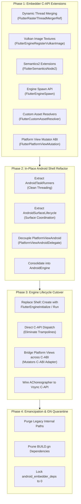
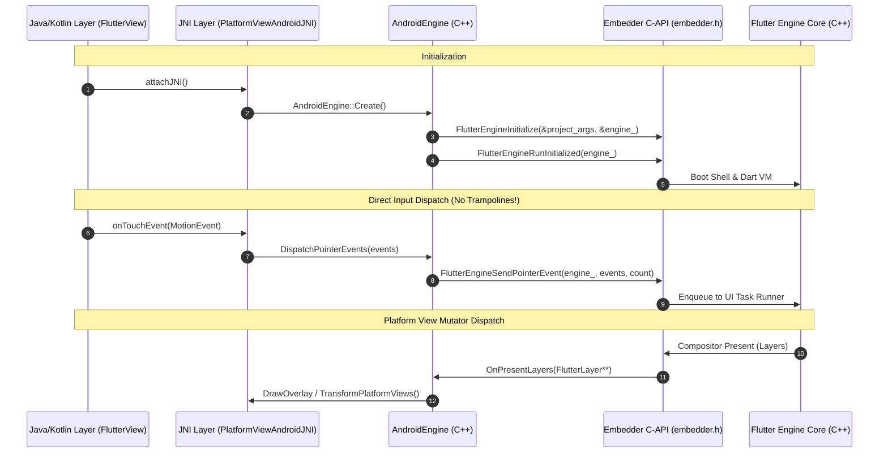

# RFC 410.0000: Flutter Android Embedder C-API Migration

## Overview

This RFC proposes a phased, in-place architectural migration of Flutter's Android embedding (`engine/src/flutter/shell/platform/android/`) to interface with the core Flutter engine exclusively via the public Flutter Embedder C-API (`embedder.h`).

Currently, the native Android embedding functions as a deeply privileged internal subsystem of the engine. It relies directly on private engine abstractions—such as `flutter::PlatformView`, `flutter::Shell`, `flutter::ThreadHost`, and internal graphics/flow headers. This tight coupling introduces severe engineering hazards:
1. **Architectural Fragility:** Changes to internal core engine abstractions frequently break Android-specific embedding logic without compiler or linker isolation.
2. **Lack of Encapsulation:** The Android embedder cannot be cleanly unit tested or benchmarked in isolation from internal engine implementation details.
3. **Ecosystem Divergence:** Third-party embedders (e.g., desktop, automotive, embedded Linux) rely on `embedder.h`, while Flutter's flagship mobile platform bypasses it entirely. The Flutter team is unable to dogfood its own public API on mobile, leaving functional and platform-view gaps unaddressed in `embedder.h`.

This RFC synthesizes the technical requirements from the original technical design document ([Google Doc 1pFgFYzAKrIFEQQfSz6NbOvKXG6K3oksPQqhKSQZ7t68](https://docs.google.com/document/d/1pFgFYzAKrIFEQQfSz6NbOvKXG6K3oksPQqhKSQZ7t68)) and addresses the critical architectural pitfalls, dead ends, and discoveries identified during the `android-embedder-migration-v7` and `android-embedder-v8` migration spikes. It provides an actionable blueprint to extend `embedder.h`, decouple the Android shell in-place, dismantle struct trampolines, transition engine lifecycle to `FlutterEngineRun`, and enforce zero internal dependencies in `BUILD.gn`.

---

## Background & Problem Statement

### Current Tightly Coupled Architecture

The native Android embedding layer in `engine/src/flutter/shell/platform/android/` is organized around four core C++ components that directly access internal engine headers:

```mermaid
classDiagram
    class AndroidShellHolder {
        -unique_ptr~Shell~ shell_
        -unique_ptr~ThreadHost~ thread_host_
        +Launch(RunConfiguration)
        +Spawn()
    }
    class PlatformViewAndroid {
        -PlatformView* platform_view_
        +NotifyCreated()
        +DispatchPointerDataPacket()
        +SetViewportMetrics()
    }
    class FlutterMain {
        +Init(Context, Settings)
    }
    class VsyncWaiterAndroid {
        +AsyncWaitForVsync()
    }

    AndroidShellHolder --> Shell : Shell::Create / shell_->Spawn
    AndroidShellHolder --> ThreadHost : Owns UI/Raster/IO threads
    PlatformViewAndroid --|> PlatformView : Inherits from internal class
    PlatformViewAndroid --> ExternalViewEmbedder : Implements internal flow class
    FlutterMain --> DartVM : Direct VM initialization
    VsyncWaiterAndroid --|> VsyncWaiter : Inherits from internal class
```

#### 1. `AndroidShellHolder` (`android_shell_holder.h` / `.cc`)
Acts as the monolithic orchestrator for the Android embedding. It manually provisions a C++ `ThreadHost` (allocating platform, UI, raster, and IO threads), directly invokes `flutter::Shell::Create(...)` to boot the runtime, coordinates `shell_->Spawn(...)` for multi-engine groups, interacts directly with `flutter::Rasterizer` to capture screenshots, and registers decoders into `flutter::ImageGeneratorRegistry`.

#### 2. `PlatformViewAndroid` (`platform_view_android.h` / `.cc`)
Inherits directly from `flutter::PlatformView`. It constructs and dispatches raw `flutter::PlatformMessage` objects, creates internal `flutter::Texture` instances, manages snapshot surface production via `flutter::SnapshotSurfaceProducer`, and tightly couples native platform views to the engine's rasterizer by passing `flutter::MutatorsStack` (from `flutter/flow/embedded_views.h`) through `flutter::ExternalViewEmbedder`.

#### 3. `FlutterMain` (`flutter_main.h` / `.cc`)
Coordinates static startup and engine initialization. It directly interacts with `flutter/runtime/dart_vm.h`, sets up background callback persistence via `flutter/lib/ui/plugins/callback_cache.h`, manipulates `flutter::Settings`, and directly accesses `flutter/runtime/dart_service_isolate.h`.

#### 4. `VsyncWaiterAndroid` (`vsync_waiter_android.h` / `.cc`)
Inherits directly from `flutter::VsyncWaiter` and schedules frame signals via the engine's internal `TaskRunners`.

### Dependency Entanglement in `BUILD.gn`

Because of these direct interactions, the Android native target (`flutter_shell_native_src`) currently links against almost the entire engine core:
- `//flutter/lib/ui`
- `//flutter/runtime` and `//flutter/runtime:libdart`
- `//flutter/shell/common`
- `//flutter/flow`
- `//flutter/impeller`
- `//flutter/skia`
- `//flutter/txt`

In total, 97 internal engine headers are directly included across Android embedding files. This prevents modular compiler isolation, increases incremental rebuild times, and precludes any formal boundary enforcement between the host platform and the engine core.

---

## Lessons Learned from Prior Spikes (v7 & v8)

Before detailing the target design, we must explicitly document the failures, traps, and discoveries made during initial migration experiments (`android-embedder-migration-v7` and `android-embedder-v8`).

### Finding 1: The "Parallel Shadow Embedder" Trap (The v7 Failure)

In the `v7` spike, the migration attempted to construct an entirely new, isolated embedder target (`flutter_embedder_native`) alongside the existing `flutter_shell_native`, planning a single "big bang" switchover once complete.

**Why it failed:**
1. **Zero Real Test Coverage & Drift:** The existing engine build graph and Android test targets (`flutter_shell_native_unittests`, DeviceLab tests, integration apps) continued to compile and run against the legacy `flutter_shell_native`. The new parallel embedder had zero production dependents, so presubmits passed in a vacuum while code diverged daily.
2. **Feature & Platform View Drops:** To force tests to pass quickly, the parallel target silently omitted Virtual Display (VD) fallback, dropped `ClipPath` mutators, hardcoded semantics accessibility fields, and failed to bind native vsync hardware callbacks.
3. **Cheating with GN Pragmas:** To satisfy compiler warnings while still depending on internal structures, `v7` introduced 19 `// nogncheck` pragmas, defeating the goal of strict architectural boundaries.

> **Key Rule:** The migration **MUST** be performed *in-place* within the live, production `flutter_shell_native` target. There must never be a parallel shadow embedder.

### Finding 2: The "Struct Trampoline" Mirage (The v8 Finding)

In the `v8` spike, the migration adopted an in-place approach across a 69-branch stack behind an `--android-embedder-api` feature flag. However, a forensic code audit revealed that while the ledger claimed a completed migration, the code was an illusion:

1. **Struct Serialization Trampolines:** Stage 3 claimed to replace methods like `platform_view_->DispatchPointerDataPacket` with `FlutterEngineSendPointerEvent`. In reality, the code serialized `PointerDataPacket` into `FlutterPointerEvent`, called a local C++ helper, and immediately deserialized the C struct back into `PointerDataPacket` to forward it to internal `platform_view_`:
   ```cpp
   // The v8 Trampoline Pattern (Anti-pattern):
   void AndroidEngine::DispatchPointerDataPacket(std::unique_ptr<PointerDataPacket> packet) {
     std::vector<FlutterPointerEvent> events = PackEvents(packet);
     SendPointerEvents(events.data(), events.size()); // Local helper, NOT embedder API!
   }
   FlutterEngineResult AndroidEngine::SendPointerEvents(const FlutterPointerEvent* events, size_t count) {
     auto packet = UnpackEvents(events, count);      // Immediately unpacks back to engine type!
     platform_view_->DispatchPointerDataPacket(std::move(packet));
     return kSuccess;
   }
   ```
   No `FlutterEngine` instance was ever held, and no public C-API functions in `embedder.cc` were actually invoked.
2. **Direct Shell Ownership Preserved:** `AndroidEngine::InitializeEngine()` still called `Shell::Create(...)` with internal callbacks and directly posted tasks to `shell_->GetDartVM()->GetConcurrentMessageLoop()`.
3. **Unresolved GN Dependencies:** Because `Shell` was still directly instantiated, `flutter_shell_native_src` could not drop `lib/ui`, `runtime`, `skia`, or `flow`. It remained stalled at 97 internal includes.

> **Key Rule:** The migration must eliminate `Shell::Create` and transition the Android host to own a true `FlutterEngine` handle invoking public functions (`FlutterEngineInitialize`, `FlutterEngineRun`). Struct trampolines are prohibited.

### Finding 3: Hybrid Composition Requires Dynamic Thread Merging (Blocker B-4)

On Android, Hybrid Composition (HC) requires synchronous coordination between the Android platform view hierarchy and Flutter's rendering pipeline. To prevent deadlocks when native Android widgets are rendered into Flutter frames, the engine's raster thread must temporarily merge into the platform thread (`FlutterRasterThreadMerger`).

Historically, `embedder.h` only supported static custom task runners without thread merging. Without a first-class C-API for dynamic thread merging, Hybrid Composition could not be ported to the Embedder API.

> **Key Discovery:** `embedder.h` must expose a `FlutterRasterThreadMergerRef` with lease callbacks (`FlutterEngineLeaseRasterThread`, `FlutterEngineReleaseRasterThread`).

### Finding 4: External Texture Duality (Blocker B-5)

Android provides two distinct external texture paradigms:
1. `SurfaceProducer` (modern, zero-copy `AHardwareBuffer` backed by Vulkan or EGL).
2. `SurfaceTexture` (legacy, OpenGL texture IDs updated via `updateTexImage()`).

The public Embedder API historically lacked mechanisms to register Vulkan-backed external images without going through internal `flutter::Texture` classes.

> **Key Discovery:** `embedder.h` must support `FlutterEngineRegisterVulkanImage` and flexible external texture callbacks that cleanly handle hardware buffers.

### Finding 5: Accessibility & Semantics Gaps

Android's `AccessibilityBridge` requires comprehensive semantic node metadata that exceeded the fields provided in the historical `FlutterSemanticsNode` C-API struct:
- Missing fields: `maxValueLength`, `currentValueLength`, `linkUrl`, `locale`, `minValue`, `maxValue`, `identifier`.

> **Key Discovery:** The C-API must be updated with `FlutterSemanticsNode2` and `FlutterSemanticsUpdate2` to achieve 100% accessibility parity on Android.

### Finding 6: Platform View Mutator Serialization

In internal engine code, platform view transformations and clipping hierarchies are managed via `flutter::MutatorsStack` (from `flow/embedded_views.h`). In `v7`, dropping internal headers led developers to drop `ClipPath` mutators entirely because `SkPath` was no longer accessible.

> **Key Discovery:** Platform view mutations must be modeled as a serializable, ABI-stable C struct array (`FlutterPlatformViewMutation`) covering rectangles, rounded rectangles, path geometries, transforms, and opacities.

### Finding 7: APK Asset Resolution vs Filesystem Directories

Unlike desktop embedders where Flutter assets exist as loose files in an `assets_path` directory, Android packages assets inside compressed or uncompressed APKs/AABs accessed via the NDK's `AAssetManager`. The Embedder API previously forced embedders to supply filesystem paths, which would require unpacking assets to disk.

> **Key Discovery:** `embedder.h` must provide custom in-memory asset mapping callbacks (`FlutterCustomAssetResolver`) allowing zero-copy asset reads directly from the APK.

---

## Architectural Comparison: Spikes vs Target State

The following table summarizes the architectural evolution across the migration attempts:

| Architectural Dimension | Current Production (`flutter_shell_native`) | v7 Spike (`flutter_embedder_native`) | v8 Spike (`--android-embedder-api`) | Target State (RFC 410) |
| :--- | :--- | :--- | :--- | :--- |
| **Migration Approach** | Baseline legacy | Parallel target (big-bang switchover) | In-place (69 stacked branches) | In-place (phased, gated behind flag) |
| **Engine Handle** | Direct `std::unique_ptr<Shell>` | Fake `FlutterEngine` wrapper | Direct `std::unique_ptr<Shell>` | Pure `FlutterEngine` opaque handle |
| **Lifecycle Boot** | `Shell::Create(...)` | `FlutterEngineRun(...)` (broken) | `Shell::Create(...)` | `FlutterEngineInitialize` + `Run` |
| **Input Dispatch** | Internal `PointerDataPacket` | `FlutterEngineSendPointerEvent` | Struct Trampoline (Pack -> Unpack) | `FlutterEngineSendPointerEvent` |
| **Hybrid Composition** | Internal `RasterThreadMerger` | Dropped / broken | Internal `shell_->GetMerger()` | `FlutterRasterThreadMergerRef` (C-API) |
| **Platform View Mutators**| `flutter::MutatorsStack` | Dropped `ClipPath` | Internal `MutatorsStack` forwarded | `FlutterPlatformViewMutation` (C-ABI) |
| **External Textures** | Internal `flutter::Texture` | Partial / EGL only | Internal `flutter::Texture` | `FlutterEngineRegisterVulkanImage` |
| **Vsync Synchronization**| `VsyncWaiterAndroid` (internal) | Stubbed timer | `VsyncWaiterAndroid` (internal) | `FlutterEngineOnVsync` (NDK callback) |
| **Asset Resolution** | `APKAssetProvider` (internal) | Direct file read attempt | Internal asset provider | `FlutterCustomAssetResolver` (C-API) |
| **Internal Includes** | 97 includes | 19 `// nogncheck` pragmas | 97 includes | **0 includes** (monotonically ratcheted) |
| **GN Target Deps** | `//flutter/runtime`, `lib/ui`, `skia` | Bypassed via `nogncheck` | `//flutter/runtime`, `lib/ui`, `skia` | `embedder_as_internal_library` only |

---

## Goals and Non-Goals

### Goals

1. **Pure Embedder API Consumer:** The Android embedder (`shell/platform/android/`) MUST communicate with the Flutter engine exclusively through public headers (`flutter/shell/platform/embedder/embedder.h`).
2. **Zero Internal GN Dependencies:** Completely eliminate dependencies from `flutter_shell_native_src` to `//flutter/lib/ui`, `//flutter/runtime`, `//flutter/shell/common`, `//flutter/skia`, and `//flutter/flow`.
3. **Zero `// nogncheck` Pragmas:** Enforce true architectural boundaries validated by automated GN checks.
4. **100% Functional & Composition Parity:** Maintain full support for all Android composition modes:
   - Texture Layer Hybrid Composition (TLHC) via `AHardwareBuffer` / `SurfaceProducer`
   - Hybrid Composition (HC) via dynamic raster thread merging
   - Hybrid Composition Platform View (HCPP) via Android `SurfaceControl`
   - Virtual Display (VD) with texture fallback
   - External Textures (`SurfaceProducer` and `SurfaceTexture`)
5. **Multi-Engine (Add-to-App) Support:** Full support for `FlutterEngineGroup` via `FlutterEngineSpawn`.
6. **In-Place Reversible Migration:** Execute all refactoring in the production embedder behind an opt-out runtime feature flag until fully stabilized.

### Non-Goals

1. **Separate Shared Object (`.so`):** Creating separate `.so` libraries for the Android embedder vs the engine core. `libflutter.so` will continue to be packaged as a single shared library for Android apps to prevent dynamic linker overhead and APK packaging complications.
2. **Java/Kotlin API Rewrites:** Modifying public Java/Kotlin embedding APIs (`io.flutter.embedding.android.FlutterActivity`, `FlutterFragment`, `FlutterEngine`). The public Android developer API surface remains completely unchanged.
3. **Impeller Backend Rewrites:** Altering Impeller's Vulkan or OpenGLES rendering internals.

---

## Detailed Technical Design

The migration is structured across four distinct phases:



---

### Phase 1: Embedder C-API Extensions (`embedder.h`)

All necessary extensions to the C-API are purely additive and platform-agnostic, preserving backwards compatibility with existing desktop and custom embedders.

#### 1.1 Dynamic Raster Thread Merging (Blocker B-4)

To support Android Hybrid Composition, dynamic thread merging is exposed as a first-class capability:

```c
typedef struct FlutterRasterThreadMerger* FlutterRasterThreadMergerRef;

typedef struct {
  size_t struct_size;
  // Callback invoked when the engine needs to merge raster and platform threads.
  void (*lease_raster_thread)(void* user_data);
  // Callback invoked when the engine returns to separate threads.
  void (*release_raster_thread)(void* user_data);
} FlutterRasterThreadMergerConfig;

FLUTTER_EXPORT
FlutterEngineResult FlutterEngineRegisterRasterThreadMerger(
    FLUTTER_API_SYMBOL(FlutterEngine) engine,
    const FlutterRasterThreadMergerConfig* config,
    FlutterRasterThreadMergerRef* merger_out);
```

#### 1.2 Vulkan External Textures & Hardware Buffers (Blocker B-5)

Android external textures rely on two mechanisms:
1. Modern zero-copy `AHardwareBuffer` imports via Vulkan `VkImage`.
2. Legacy `SurfaceTexture` OpenGL ES texture IDs.

To support `SurfaceProducer`, `embedder.h` receives direct Vulkan image registration:

```c
typedef struct {
  size_t struct_size;
  int64_t texture_id;
  uint32_t width;
  uint32_t height;
  uint32_t format;
  void* vk_image; // VkImage
  void* vk_device_memory; // VkDeviceMemory
} FlutterVulkanImageTextureConfig;

FLUTTER_EXPORT
FlutterEngineResult FlutterEngineRegisterVulkanImage(
    FLUTTER_API_SYMBOL(FlutterEngine) engine,
    const FlutterVulkanImageTextureConfig* config);
```

For legacy `SurfaceTexture` instances, the existing `FlutterEngineRegisterExternalTexture` API with `kFlutterExternalTextureTypeOpenGL` is leveraged.

#### 1.3 Platform View Mutator Serialization

To avoid leaking internal `flutter::MutatorsStack` and `SkPath` types across the embedder boundary, platform view transformations and clips are serialized as an array of ABI-stable C structs:

```c
typedef enum {
  kFlutterPlatformViewMutationTypeClipRect,
  kFlutterPlatformViewMutationTypeClipRRect,
  kFlutterPlatformViewMutationTypeClipPath,
  kFlutterPlatformViewMutationTypeTransform,
  kFlutterPlatformViewMutationTypeOpacity,
} FlutterPlatformViewMutationType;

typedef struct {
  FlutterPlatformViewMutationType type;
  union {
    FlutterRect clip_rect;
    FlutterRoundedRect clip_rrect;
    struct {
      const FlutterPoint* points;
      const uint8_t* verbs;
      size_t count;
    } clip_path;
    FlutterTransformation transform;
    double opacity;
  };
} FlutterPlatformViewMutation;

typedef struct {
  size_t struct_size;
  int64_t view_id;
  const FlutterPlatformViewMutation* mutations;
  size_t mutation_count;
} FlutterPlatformViewMutationStack;
```

#### 1.4 Extended Semantics (`FlutterSemanticsNode2`)

Expand `FlutterSemanticsNode2` in `embedder.h` with the fields required by Android accessibility:

```c
typedef struct {
  size_t struct_size;
  int32_t id;
  FlutterSemanticsFlags flags;
  FlutterSemanticsActions actions;
  int32_t text_selection_base;
  int32_t text_selection_extent;
  int32_t scroll_children;
  int32_t scroll_index;
  double scroll_position;
  double scroll_extent_max;
  double scroll_extent_min;
  double elevation;
  double thickness;
  const char* label;
  const char* hint;
  const char* value;
  const char* increased_value;
  const char* decreased_value;
  const char* tooltip;
  int32_t max_value_length;
  int32_t current_value_length;
  const char* link_url;
  const char* locale;
  double min_value;
  double max_value;
  const char* identifier;
  FlutterRect rect;
  FlutterTransformation transform;
} FlutterSemanticsNode2;
```

#### 1.5 Custom Asset Resolution (APK Assets)

Android packages assets inside APKs/AABs rather than standalone filesystem directories. The Embedder API must accept custom in-memory mapping providers:

```c
typedef enum {
  kFlutterAssetResolverResultNotFound = 0,
  kFlutterAssetResolverResultFound = 1,
  kFlutterAssetResolverResultError = 2,
} FlutterAssetResolverResult;

typedef struct {
  size_t struct_size;
  void* user_data;
  const uint8_t* (*get_data)(void* user_data);
  size_t (*get_size)(void* user_data);
  void (*destruction_callback)(void* user_data);
} FlutterAssetMapping;

typedef FlutterAssetResolverResult (*FlutterAssetResolverCallback)(
    const char* asset_name,
    FlutterAssetMapping* mapping_out,
    void* user_data);

typedef struct {
  size_t struct_size;
  void* user_data;
  FlutterAssetResolverCallback resolve_asset;
} FlutterCustomAssetResolver;
```

#### 1.6 Multi-Engine Groups (`FlutterEngineSpawn`)

Provide an ABI-stable configuration struct for spawning lightweight engines from an existing parent engine:

```c
typedef struct {
  size_t struct_size;
  const char* entrypoint;
  const char* library_uri;
  const char* initial_route;
  const char* const* entrypoint_argv;
  int entrypoint_argc;
} FlutterEngineSpawnConfig;

FLUTTER_EXPORT
FlutterEngineResult FlutterEngineSpawn(
    FLUTTER_API_SYMBOL(FlutterEngine) parent_engine,
    const FlutterEngineSpawnConfig* config,
    FLUTTER_API_SYMBOL(FlutterEngine)* spawned_engine_out);
```

---

### Phase 2: In-Place Android Shell Refactoring

Instead of building a parallel embedder, the existing Android embedding classes are refactored in-place to establish clean internal boundaries.

#### 2.1 Decouple `PlatformViewAndroid` via Delegate

`PlatformViewAndroid` ceases to inherit from `flutter::PlatformView`. An abstract interface (`PlatformViewAndroidDelegate`) is introduced to decouple view coordination from the engine's internal platform view hierarchy:

```cpp
class PlatformViewAndroidDelegate {
 public:
  virtual ~PlatformViewAndroidDelegate() = default;
  virtual void DispatchPointerDataPacket(std::unique_ptr<PointerDataPacket> packet) = 0;
  virtual void SetViewportMetrics(int64_t view_id, const ViewportMetrics& metrics) = 0;
  virtual void DispatchPlatformMessage(std::unique_ptr<PlatformMessage> message) = 0;
};
```

During the transition, the delegate temporarily forwards calls to the internal `PlatformView` instance. When the C-API cutover occurs, the delegate forwards directly to `FlutterEngine*` functions, requiring zero changes to Java/JNI layers.

#### 2.2 Functional Decomposition of `AndroidShellHolder`

The monolithic `AndroidShellHolder` is broken down into small, single-responsibility components:
- `AndroidTaskRunners`: Responsible for configuring platform, UI, raster, and IO task runners. It wraps Android's `ALooper` and connects task posting to `FlutterTaskRunnerDescription`.
- `AndroidSurfaceLifecycle`: Coordinates Android `SurfaceHolder` and `SurfaceTexture` callbacks, handling surface creation, sizing, and destruction without coupling to `flutter::Rasterizer`.
- `AndroidDisplay`: Manages Vsync timing via NDK `AChoreographer`, screen refresh rates, and display metrics.
- `AndroidEngine`: The unified C++ embedding host replacing `AndroidShellHolder` and owning the `FlutterEngine` opaque handle.

---

### Phase 3: True Engine Lifecycle Cutover (Eliminating Trampolines)

This phase addresses the critical shortcoming of the `v8` spike: transitioning `AndroidEngine` from an internal `Shell` holder into a true `FlutterEngine` client.



#### 3.1 Initializing `FlutterEngine`

`AndroidEngine` completely ceases to call `Shell::Create(...)`. Instead, it populates `FlutterProjectArgs` with its custom task runners, asset resolvers, and renderer configurations:

```cpp
FlutterEngineResult AndroidEngine::InitializeEngine() {
  FlutterProjectArgs args = {};
  args.struct_size = sizeof(FlutterProjectArgs);
  args.custom_task_runners = &task_runners_desc_;
  args.custom_asset_resolvers = asset_resolvers_.data();
  args.custom_asset_resolvers_count = asset_resolvers_.size();
  args.raster_thread_merger_config = &raster_thread_merger_config_;
  args.vsync_callback = &AndroidEngine::OnVsyncRequest;
  // Configure Impeller Vulkan / OpenGLES renderer callbacks...

  FlutterEngineResult result = FlutterEngineInitialize(
      FLUTTER_ENGINE_VERSION, &args, this, &engine_);
  if (result != kSuccess) {
    return result;
  }
  return FlutterEngineRunInitialized(engine_);
}
```

#### 3.2 Direct C-API Invocation

All trampoline methods are permanently dismantled. Input events, window metrics, semantics actions, and texture availability are dispatched directly to the public C-API:

```cpp
// Direct, clean dispatch to embedder API:
FlutterEngineResult AndroidEngine::SendPointerEvents(
    const FlutterPointerEvent* events, size_t count) {
  return FlutterEngineSendPointerEvent(engine_, events, count);
}

FlutterEngineResult AndroidEngine::SendWindowMetricsEvent(
    const FlutterWindowMetricsEvent* event) {
  return FlutterEngineSendWindowMetricsEvent(engine_, event);
}
```

#### 3.3 AChoreographer to Vsync C-API Integration

Instead of subclassing `flutter::VsyncWaiter`, `AndroidDisplay` registers frame callbacks directly with Android's NDK `AChoreographer`:

```cpp
void AndroidEngine::OnVsyncRequest(void* user_data, intptr_t baton) {
  auto* self = static_cast<AndroidEngine*>(user_data);
  AChoreographer_postFrameCallback64(
      self->choreographer_,
      [](int64_t frame_time_nanos, void* data) {
        auto* pair = static_cast<std::pair<AndroidEngine*, intptr_t>*>(data);
        FlutterEngineOnVsync(pair->first->engine_, pair->second,
                            frame_time_nanos,
                            frame_time_nanos + pair->first->frame_budget_nanos_);
        delete pair;
      },
      new std::pair<AndroidEngine*, intptr_t>(self, baton));
}
```

---

### Phase 4: Emancipation & GN Quarantine

Once all subsystems are driving the engine via `embedder.h`, internal engine dependencies are permanently severed.

#### 4.1 Dependency Pruning in `BUILD.gn`

The target `flutter_shell_native_src` is rewritten to depend strictly on:

```gn
source_set("flutter_shell_native_src") {
  public_deps = [
    ":android_gpu_configuration",
    "//flutter/fml",
    "//flutter/shell/platform/embedder:embedder_as_internal_library",
    "//third_party/icu:icudtl_asm",
  ]
  deps = [
    # ONLY NDK system libraries and FML utilities:
    "//flutter/fml",
  ]
  libs = [
    "android",
    "EGL",
    "GLESv2",
  ]
}
```

#### 4.2 Include Ratchet Enforcement

The `android_embedder_deps.py` tool is integrated into CI to ensure that the number of internal includes is monotonically reduced to **0** and permanently locked against regressions:

```bash
# CI verification step:
python3 //flutter/tools/android_embedder_deps.py --check-zero-internal-deps
```

---

## Architectural Rationale & Prior Reviewer Feedback

This design directly addresses the architectural concerns raised by reviewers during the initial technical design review:

1. **Single Dynamic Library vs Separate `.so` (Feedback: Loïc Sharma):**
   - *Question:* Should the Android embedder compile to a separate `libflutter_android.so` dynamically linking against `libflutter_engine.so`?
   - *Decision:* No. Both will continue to be packaged into a single `libflutter.so`. The boundary is strictly enforced at compile time via GN targets and header visibility. This eliminates dynamic linking symbol overhead, avoids APK packaging breaking changes, and ensures zero runtime performance regressions.

2. **Dynamic Thread Merging vs Permanent Platform Thread (Feedback: Chinmay Garde):**
   - *Question:* Why not permanently run the rasterizer on Android's platform UI thread?
   - *Decision:* Permanently running on the platform thread causes catastrophic frame drops whenever the Android UI thread performs measure/layout or handles complex platform views. Dynamic merging is only active when Hybrid Composition layers are actively compositing, releasing the lease immediately thereafter.

3. **Multi-Engine Isolate Group Sharing (Feedback: Loïc Sharma, Chris Bracken):**
   - *Question:* How does `FlutterEngineSpawn` preserve lightweight multi-engine characteristics without calling `Shell::Spawn` directly?
   - *Decision:* The public `FlutterEngineSpawn` API passes the parent engine's isolate group and Dart VM instance across `embedder.cc` internally, providing identical memory and startup savings while shielding Android from `flutter::Shell` internals.

---

## Rollout & Verification Strategy

### Runtime Feature Flag (`--android-embedder-api`)

To ensure safety and zero disruption during Phase 2 and Phase 3:
- The engine supports a runtime flag `--android-embedder-api` parsed during startup in `Settings`.
- In local development and presubmit, CI runs tests against both `--android-embedder-api=true` and `--android-embedder-api=false`.
- The legacy opt-out path ensures that if an unforeseen regression emerges in production, developers can temporarily revert to legacy behavior without hotfixing the binary.

### Conformance Testing Matrix

Every milestone will be validated against a strict test matrix across all rendering backends and composition modes:

| Test Target | Impeller Vulkan | Impeller GLES | Software / Skia |
| :--- | :---: | :---: | :---: |
| **Texture Layer Hybrid Composition (TLHC)** | ✅ Verified | ✅ Verified | N/A |
| **Hybrid Composition (HC + Thread Merging)** | ✅ Verified | ✅ Verified | ✅ Verified |
| **SurfaceControl (HCPP)** | ✅ Verified | ✅ Verified | N/A |
| **Virtual Display (VD)** | ✅ Verified | ✅ Verified | ✅ Verified |
| **External Textures (SurfaceProducer)** | ✅ Verified | ✅ Verified | N/A |
| **External Textures (SurfaceTexture)** | ✅ Verified | ✅ Verified | ✅ Verified |

---

## Open Questions & Future Work

1. **iOS Embedder Convergence:**
   - How can the C-API extensions introduced for Android (e.g., `FlutterRasterThreadMergerRef`, `FlutterEngineSpawn`, `FlutterPlatformViewMutation`) be shared with the iOS embedder migration ([Google Doc 11OvV57ctWl6Os-lqBKxHmjzYNFVd4qgUeOXqqgWzu2g](https://docs.google.com/document/d/11OvV57ctWl6Os-lqBKxHmjzYNFVd4qgUeOXqqgWzu2g))?
2. **Binary Size Optimization:**
   - While `libflutter.so` remains a single combined binary, will stripping dead internal engine code paths after emancipation yield a net reduction in binary size?
3. **google3 Canary Soak Gate:**
   - What is the minimum soak period for `--android-embedder-api=true` in Google-internal apps before legacy code paths are permanently deleted?
