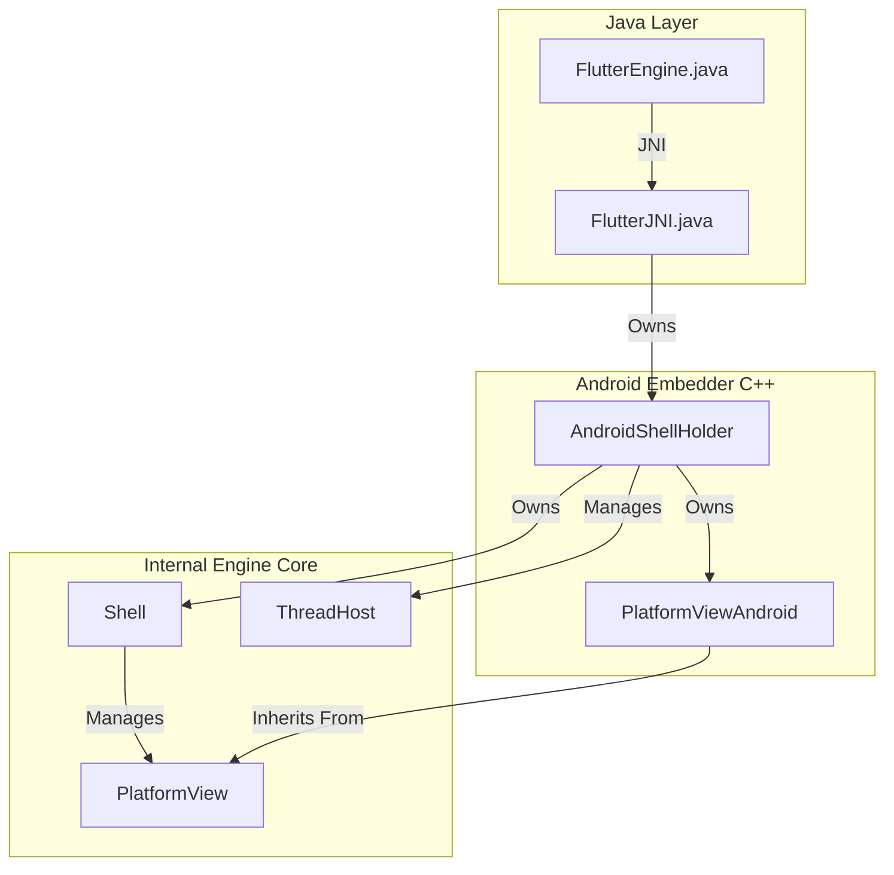
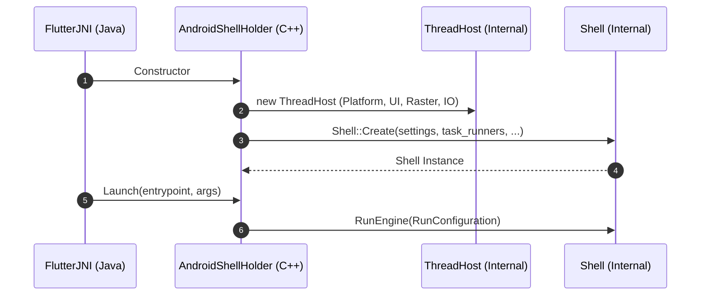
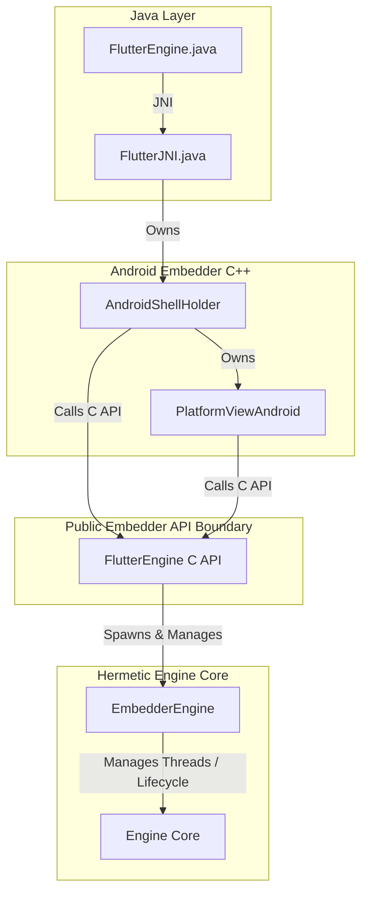
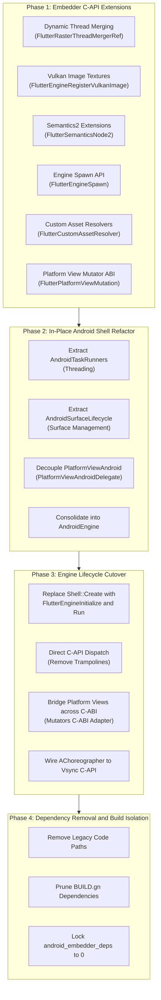
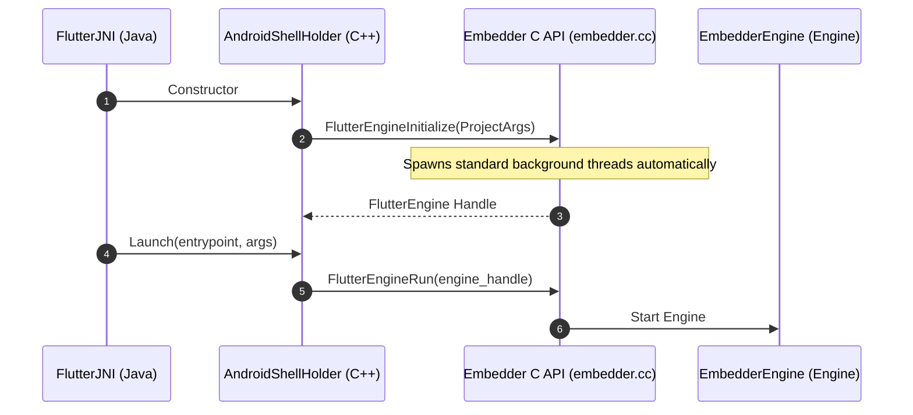

# RFC 410.0000: Flutter Android Embedder C-API Migration

## Overview

This RFC proposes a phased, in-place migration of the Flutter Android embedder (`engine/src/flutter/shell/platform/android/`) to the public Flutter Embedder C-API (`embedder.h`).

The Android embedder is currently implemented as an internal engine subsystem that directly references private C++ classes, including `flutter::PlatformView`, `flutter::Shell`, `flutter::ThreadHost`, and internal graphics headers. This creates several concrete problems:
- Changes to engine internals frequently break Android embedding code because the build system does not enforce an abstraction boundary between the two.
- Android embedder code cannot be tested in isolation from internal engine classes.
- Third-party desktop and embedded platforms use `embedder.h`, while Flutter's mobile embedders do not. Because the Android embedder does not use the public C-API, missing features or gaps in `embedder.h` (such as platform view composition and external texture support) are not exercised by first-party code.

This document adapts the original technical design document ([Google Doc 1pFgFYzAKrIFEQQfSz6NbOvKXG6K3oksPQqhKSQZ7t68](https://docs.google.com/document/d/1pFgFYzAKrIFEQQfSz6NbOvKXG6K3oksPQqhKSQZ7t68)) and incorporates findings from two earlier experimental migration spikes (`android-embedder-migration-v7` and `android-embedder-v8`). It outlines the required additions to `embedder.h`, the refactoring of Android C++ classes, the transition to `FlutterEngineRun`, and the removal of internal dependencies from `BUILD.gn`.

## Background and Problem Statement

The native Android embedding layer in `engine/src/flutter/shell/platform/android/` consists of four main C++ components that interact directly with internal engine headers.

### Current Architecture



The components interact as follows:

#### `AndroidShellHolder` (`android_shell_holder.h`, `android_shell_holder.cc`)
Coordinates engine startup, thread configuration, and lifecycle. It creates a `ThreadHost` instance for platform, UI, raster, and IO threads, invokes `flutter::Shell::Create(...)` to start the engine, calls `shell_->Spawn(...)` for multi-engine groups, interacts with `flutter::Rasterizer` for screenshots, and registers image decoders in `flutter::ImageGeneratorRegistry`.

#### `PlatformViewAndroid` (`platform_view_android.h`, `platform_view_android.cc`)
Subclasses `flutter::PlatformView`. It constructs and dispatches internal `flutter::PlatformMessage` objects, creates `flutter::Texture` instances, manages snapshot surfaces through `flutter::SnapshotSurfaceProducer`, and handles platform views by passing `flutter::MutatorsStack` (from `flutter/flow/embedded_views.h`) to `flutter::ExternalViewEmbedder`.

#### `FlutterMain` (`flutter_main.h`, `flutter_main.cc`)
Manages static engine initialization. It configures `flutter::Settings`, sets up background callback persistence using `flutter/lib/ui/plugins/callback_cache.h`, and interacts directly with `flutter/runtime/dart_vm.h` and `flutter/runtime/dart_service_isolate.h`.

#### `VsyncWaiterAndroid` (`vsync_waiter_android.h`, `vsync_waiter_android.cc`)
Subclasses `flutter::VsyncWaiter` and schedules frame callbacks through the engine's internal `TaskRunners`.

### Current Engine Lifecycle and Threading

In the current implementation, `AndroidShellHolder` manually provisions thread hosts and directly initializes the `Shell`:



### Dependency Entanglement in `BUILD.gn`

Because of these references, the `flutter_shell_native_src` target in `engine/src/flutter/shell/platform/android/BUILD.gn` depends directly on engine internal targets:
- `//flutter/lib/ui`
- `//flutter/runtime` and `//flutter/runtime:libdart`
- `//flutter/shell/common`
- `//flutter/flow`
- `//flutter/impeller`
- `//flutter/skia`
- `//flutter/txt`

Currently, 97 internal engine headers are included across files in `shell/platform/android/`. The build does not enforce an architectural boundary between the Android embedding and the engine core.

## Analysis of Previous Migration Spikes (v7 and v8)

To understand the design choices in this RFC, it is necessary to examine two previous attempts to migrate the Android embedder:
1. `android-embedder-migration-v7`: A clean-room experiment that constructed a parallel embedder target (`flutter_embedder_native`) alongside the production target.
2. `android-embedder-v8`: An in-place experiment that attempted to refactor the production target (`flutter_shell_native`) across 69 stacked Git branches behind a runtime flag.

Neither branch reached production. Examining how and why they failed provides the technical foundation for this proposal.

### The Parallel Target Experiment (v7: android-embedder-migration-v7)

The `v7` branch attempted a clean-room rewrite. Instead of modifying the existing `flutter_shell_native` target, it introduced a new directory (`engine/src/flutter/shell/platform/android/embedder/`) and defined an independent GN target named `flutter_embedder_native`. The plan was to build and test the new embedder in isolation, then execute a single cutover to replace the legacy target in `libflutter.so`.

This approach revealed several fundamental failure modes:

#### Build Graph Isolation and Code Drift
In the Flutter engine build system, `flutter_shell_native` is the target that compiles into `libflutter.so` and is exercised by automated test harnesses, including `flutter_shell_native_unittests`, integration tests, and DeviceLab benchmarks. Because nothing in the production build graph or CI pipeline depended on `flutter_embedder_native`, presubmit testing never ran against the experimental code.

As engineers landed daily changes in the engine core (such as Impeller updates, FML refactors, and runtime threading changes), the `v7` branch silently broke. By the time the spike attempted to validate real applications, the code had drifted substantially from `main` and required continuous re-engineering to compile.

#### Feature Omissions Under Build Pressure
To make the isolated target compile without pulling in the entire engine dependency graph, the implementation omitted several Android features:
- Virtual Display (VD) fallback: Platform views in Android rely on Virtual Display mode as a fallback when Texture Layer Hybrid Composition or SurfaceControl are unavailable. The `v7` branch omitted Virtual Display support entirely.
- ClipPath mutators on platform views: Platform views can be clipped by arbitrary paths in the Flutter layer tree. Because `SkPath` was an internal engine type not exposed in `embedder.h`, the `v7` branch dropped `ClipPath` mutators, supporting only axis-aligned rectangles (`ClipRect`) and rounded rectangles (`ClipRRect`).
- Hardware vsync synchronization: Instead of hooking into Android's native `AChoreographer` API to receive display refresh signals, the implementation fell back to a software timer.

#### Header Check Bypasses (nogncheck)
When the parallel target needed internal engine utilities, it was unable to import them cleanly because GN enforces header visibility rules. Instead of designing a public C-API abstraction for those utilities, the branch added 19 `// nogncheck` annotations in `BUILD.gn`. This defeated the primary goal of establishing an architectural boundary.

#### Takeaway from the v7 Experiment
A mobile embedder cannot be developed or validated in a parallel build target. In-repo test suites, DeviceLab harnesses, and presubmit checks only exercise the production target. Any successful migration must take place in-place within `flutter_shell_native` so that every change is continuously exercised by automated tests.

### The In-Place Experiment and Struct Trampolines (v8: android-embedder-v8)

Recognizing that parallel targets lead to drift, the subsequent `v8` spike implemented changes directly within `flutter_shell_native`. The work was split across a stack of 69 Git branches (`android-embedder-v8-branch-1` through `branch-69`) and gated behind a runtime switch (`--android-embedder-api`).

The migration was planned in four sequential stages:
- Stage 1: Define new C-API types and data structures.
- Stage 2: Refactor `AndroidShellHolder` and `PlatformViewAndroid` into a unified `AndroidEngine` class.
- Stage 3: Cut over engine lifecycle and event dispatch to public `embedder.h` APIs.
- Stage 4: Prune internal engine dependencies from `BUILD.gn`.

Although the Git commit messages and branch summaries described Stage 3 as complete, a code-level audit revealed that the public Embedder C-API was not actually being used.

#### The Struct Trampoline Pattern
Instead of dispatching events to public `embedder.h` functions (such as `FlutterEngineSendPointerEvent`), the implementation constructed intermediate structs that converted data back and forth without crossing an API boundary.

When a touch event occurred in Java, it was sent over JNI to `AndroidEngine::DispatchPointerDataPacket`. The method packed the internal engine object into a public C-API struct, passed it to a local C++ member function that had an Embedder API signature, and then immediately unpacked the C struct back into the internal engine object to call `platform_view_`:

```cpp
// The v8 Struct Trampoline Pattern:

// 1. AndroidEngine receives the internal engine PointerDataPacket over JNI:
void AndroidEngine::DispatchPointerDataPacket(std::unique_ptr<PointerDataPacket> packet) {
  // 2. Pack internal PointerDataPacket into an array of public FlutterPointerEvent structs:
  std::vector<FlutterPointerEvent> events = PackEvents(packet.get());

  // 3. Call a local helper member function on AndroidEngine:
  SendPointerEvents(events.data(), events.size());
}

// 4. Local helper method mirrors the public C-API signature, but is NOT the C-API:
FlutterEngineResult AndroidEngine::SendPointerEvents(const FlutterPointerEvent* events, size_t count) {
  // 5. Immediately unpack the public FlutterPointerEvent structs back into an internal PointerDataPacket:
  std::unique_ptr<PointerDataPacket> packet = UnpackEvents(events, count);

  // 6. Forward the unpacked internal packet directly to the legacy internal PlatformView:
  platform_view_->DispatchPointerDataPacket(std::move(packet));
  return kSuccess;
}
```

This pattern was replicated across several subsystems:
- Window metrics: `ViewportMetrics` was converted to `FlutterWindowMetricsEvent`, passed to a local helper, unpacked back into `ViewportMetrics`, and forwarded to `shell_->GetPlatformView()->SetViewportMetrics(...)`.
- Platform messages: Incoming messages were converted to `FlutterPlatformMessage`, passed to a local helper, unpacked back into `flutter::PlatformMessage`, and forwarded to `platform_view_->DispatchPlatformMessage(...)`.
- Semantics: Accessibility actions were packed into C structs, forwarded to local helpers, and unpacked back into internal semantics data structures.

In all of these cases, the code never invoked `FlutterEngineSendPointerEvent`, `FlutterEngineSendWindowMetricsEvent`, or `FlutterEngineSendPlatformMessage`. The C structs served only as temporary intermediate containers that introduced serialization overhead while the underlying execution remained entirely coupled to private engine classes.

#### Direct Shell Ownership and Lifecycle
`AndroidEngine` never acquired or held a `FlutterEngine` opaque handle (`FLUTTER_API_SYMBOL(FlutterEngine)`). Instead, `AndroidEngine` continued to manage the full set of internal engine objects:

```cpp
class AndroidEngine {
 private:
  std::unique_ptr<flutter::Shell> shell_;
  std::unique_ptr<flutter::ThreadHost> thread_host_;
  std::unique_ptr<PlatformViewAndroid> platform_view_;
  // ...
};
```

When initializing the engine in `AndroidEngine::InitializeEngine()`, the implementation directly called `flutter::Shell::Create(...)` with internal task runners and window delegates. Work was scheduled by directly accessing `shell_->GetDartVM()->GetConcurrentMessageLoop()`, and raster thread coordination called `shell_->GetRasterThreadMerger()` directly.

#### Stalled Dependency Severance
Because `AndroidEngine` continued to instantiate `flutter::Shell`, `flutter_shell_native_src` in `BUILD.gn` could not drop its dependencies on `//flutter/runtime`, `//flutter/lib/ui`, `//flutter/skia`, `//flutter/flow`, and `//flutter/impeller`. At the end of the 69-branch stack, the codebase still contained 97 direct includes of internal engine headers. Stage 4 was never achievable because the cutover in Stage 3 was incomplete.

### Root-Cause Analysis: Gaps in the Public Embedder C-API

The engineers on the `v8` spike resorted to struct trampolines because they encountered functional gaps in `embedder.h`. The public C-API had been designed primarily for desktop platforms (macOS, Windows, Linux) and lacked the capabilities required by Android:

- Dynamic Raster Thread Merging (Blocker B-4): Android Hybrid Composition requires synchronizing platform views with Flutter's rendering loop. To avoid deadlocks when Android native views update during Flutter frame rasterization, Flutter temporarily merges the raster thread into the platform thread (`FlutterRasterThreadMerger`). Because `embedder.h` only supported static, separate task runners with no API to lease or release threads dynamically, cutting over to `embedder.h` would have broken Hybrid Composition on Android.
- External Texture Duality (Blocker B-5): Android has two external texture paradigms: modern zero-copy `AHardwareBuffer` surfaces rendered via Vulkan (`SurfaceProducer`), and legacy OpenGL ES texture IDs updated via `SurfaceTexture.updateTexImage()`. While `embedder.h` had an API for OpenGL textures, it lacked any mechanism to register Vulkan-backed hardware buffers (`VkImage`).
- Platform View Mutator Serialization (Blocker B-6): Platform views on Android must support geometric transformations and clipping operations (rectangles, rounded rectangles, arbitrary paths, and opacity). Internally, these are managed by `flutter::MutatorsStack` in `flow/embedded_views.h`. Removing internal headers left the embedder with no way to convey mutator operations to the engine because `embedder.h` provided no ABI-stable representation of mutators.
- Semantics and Accessibility Parity (Blocker B-7): Android's `AccessibilityBridge` requires rich semantic node properties (`maxValueLength`, `currentValueLength`, `linkUrl`, `locale`, `minValue`, `maxValue`, and `identifier`). These fields did not exist in the original `FlutterSemanticsNode` struct in `embedder.h`. Using the public API would have caused functional regressions for accessibility users.
- APK Asset Resolution (Blocker B-8): Desktop embedders read assets from a filesystem directory path provided via `FlutterProjectArgs.assets_path`. On Android, assets are packaged inside the APK/AAB archive and read via `AAssetManager`. Without an in-memory mapping callback in `embedder.h`, the Android embedder would have had to unpack assets to disk on every application startup.
- Multi-Engine Spawning (Blocker B-9): Android Add-to-App architectures rely on `FlutterEngineGroup` to spawn lightweight engines that share the Dart VM, isolate group, and shared cache using `shell_->Spawn(...)`. `embedder.h` had no spawn API, making it impossible to support multi-engine groups without accessing internal `Shell` methods.

### Sequencing Principle of This RFC

The primary architectural lesson from `v7` and `v8` is that the C-API extensions must precede the embedder refactoring.

Attempting to refactor Android C++ code before `embedder.h` supports thread merging, hardware buffers, mutators, and custom asset resolution forces developers to take shortcuts, either dropping features (as in `v7`) or creating struct trampolines (as in `v8`).

This RFC resolves that dependency inversion by organizing the work into four sequential phases:
- Phase 1 extends `embedder.h` with the missing primitives (thread merging, Vulkan textures, mutator serialization, semantics2, custom asset resolvers, and spawning) and validates them with engine-level unit tests.
- Phase 2 refactors Android C++ classes in-place behind an abstract delegate interface, breaking the monolithic `AndroidShellHolder` into single-responsibility components.
- Phase 3 performs the genuine cutover: `AndroidEngine` initializes `FlutterEngine` via `FlutterEngineInitialize` and `FlutterEngineRunInitialized`, dispatching all input and metrics directly to public C-API functions without trampolines.
- Phase 4 prunes internal targets from `BUILD.gn` and locks the internal include count to zero using an automated CI ratchet tool.

## Implementation Comparison

| Dimension | Current Production (`flutter_shell_native`) | Parallel Target Spike (`v7: flutter_embedder_native`) | In-Place Spike (`v8: --android-embedder-api`) | Target Design (RFC 410) |
| :--- | :--- | :--- | :--- | :--- |
| Approach | Baseline legacy | Parallel build target | In-place with feature flag | In-place with feature flag |
| Engine instance | `std::unique_ptr<Shell>` | Wrapper around `FlutterEngine` | `std::unique_ptr<Shell>` | `FlutterEngine` opaque handle |
| Lifecycle entry point | `Shell::Create` | `FlutterEngineRun` (incomplete) | `Shell::Create` | `FlutterEngineInitialize` and `FlutterEngineRunInitialized` |
| Input dispatch | Internal `PointerDataPacket` | `FlutterEngineSendPointerEvent` | Struct trampoline | Direct `FlutterEngineSendPointerEvent` |
| Hybrid Composition | Internal `RasterThreadMerger` | Dropped | Internal `shell_->GetRasterThreadMerger()` | `FlutterRasterThreadMergerRef` via C-API |
| Platform view mutators | `flutter::MutatorsStack` | Dropped `ClipPath` | Internal `MutatorsStack` forwarded | `FlutterPlatformViewMutation` via C-ABI |
| External textures | Internal `flutter::Texture` | Partial (EGL only) | Internal `flutter::Texture` | `FlutterEngineRegisterVulkanImage` and `FlutterEngineRegisterExternalTexture` |
| Vsync synchronization | `VsyncWaiterAndroid` | Timer fallback | `VsyncWaiterAndroid` | `FlutterEngineOnVsync` via `AChoreographer` |
| Asset resolution | Internal `APKAssetProvider` | File path | Internal `APKAssetProvider` | `FlutterCustomAssetResolver` via C-API |
| Internal engine includes | 97 | 19 `// nogncheck` pragmas | 97 | 0 (enforced by CI ratchet) |
| GN dependencies | `lib/ui`, `runtime`, `skia`, `flow` | Bypassed with `nogncheck` | `lib/ui`, `runtime`, `skia`, `flow` | `embedder_as_internal_library` only |

## Goals and Non-Goals

### Goals

- Pure Embedder API integration: The Android embedder (`shell/platform/android/`) communicates with the Flutter engine exclusively through public headers (`flutter/shell/platform/embedder/embedder.h`).
- Header isolation: Remove dependencies from `flutter_shell_native_src` to `//flutter/lib/ui`, `//flutter/runtime`, `//flutter/shell/common`, `//flutter/skia`, and `//flutter/flow`.
- Remove header check bypasses: Eliminate all `// nogncheck` annotations in Android embedding code.
- Full composition parity: Maintain support for all Android composition modes:
  - Texture Layer Hybrid Composition (TLHC) with `AHardwareBuffer` and `SurfaceProducer`
  - Hybrid Composition (HC) with dynamic raster thread merging
  - Hybrid Composition Platform View (HCPP) with `SurfaceControl`
  - Virtual Display (VD) with texture fallback
  - External textures (`SurfaceProducer` and `SurfaceTexture`)
- Multi-engine support: Support `FlutterEngineGroup` through `FlutterEngineSpawn`.
- Reversible rollout: Implement changes in-place behind a runtime feature flag (`--android-embedder-api`) until verified.

### Non-Goals

- Separate shared library: Building the Android embedder as an independent `.so` file. The engine and Android embedder will continue to be packaged together into `libflutter.so`.
- Java and Kotlin API changes: Modifying public Java or Kotlin APIs (`FlutterActivity`, `FlutterFragment`, `FlutterEngine`). The Android developer API surface remains unchanged.
- Impeller rendering changes: Changing Impeller's Vulkan or OpenGL ES rendering backends.

## Detailed Technical Design

The migration decouples the Android embedder from internal engine headers by routing all interactions through the public Embedder C-API.

### Target Architecture



### Migration Phases

The migration is structured across four phases:



### Phase 1: Embedder C-API Extensions (`embedder.h`)

Extensions to the C-API are additive and preserve backwards compatibility with existing desktop and custom embedders.

#### Dynamic Raster Thread Merging (Blocker B-4)

Dynamic thread merging is exposed through configuration callbacks:

```c
typedef struct FlutterRasterThreadMerger* FlutterRasterThreadMergerRef;

typedef struct {
  size_t struct_size;
  // Callback invoked when the engine needs to merge raster and platform threads.
  void (*lease_raster_thread)(void* user_data);
  // Callback invoked when the engine returns to separate threads.
  void (*release_raster_thread)(void* user_data);
} FlutterRasterThreadMergerConfig;

FLUTTER_EXPORT
FlutterEngineResult FlutterEngineRegisterRasterThreadMerger(
    FLUTTER_API_SYMBOL(FlutterEngine) engine,
    const FlutterRasterThreadMergerConfig* config,
    FlutterRasterThreadMergerRef* merger_out);
```

#### Vulkan External Textures and Hardware Buffers (Blocker B-5)

Android external textures rely on two mechanisms:
- Zero-copy `AHardwareBuffer` imports via Vulkan `VkImage`.
- Legacy `SurfaceTexture` OpenGL ES texture IDs.

To support `SurfaceProducer`, `embedder.h` receives direct Vulkan image registration:

```c
typedef struct {
  size_t struct_size;
  int64_t texture_id;
  uint32_t width;
  uint32_t height;
  uint32_t format;
  void* vk_image; // VkImage
  void* vk_device_memory; // VkDeviceMemory
} FlutterVulkanImageTextureConfig;

FLUTTER_EXPORT
FlutterEngineResult FlutterEngineRegisterVulkanImage(
    FLUTTER_API_SYMBOL(FlutterEngine) engine,
    const FlutterVulkanImageTextureConfig* config);
```

For legacy `SurfaceTexture` instances, the existing `FlutterEngineRegisterExternalTexture` API with `kFlutterExternalTextureTypeOpenGL` is used.

#### Platform View Mutator Serialization

To avoid referencing internal `flutter::MutatorsStack` and `SkPath` types across the embedder boundary, platform view transformations and clips are serialized as an array of ABI-stable C structs:

```c
typedef enum {
  kFlutterPlatformViewMutationTypeClipRect,
  kFlutterPlatformViewMutationTypeClipRRect,
  kFlutterPlatformViewMutationTypeClipPath,
  kFlutterPlatformViewMutationTypeTransform,
  kFlutterPlatformViewMutationTypeOpacity,
} FlutterPlatformViewMutationType;

typedef struct {
  FlutterPlatformViewMutationType type;
  union {
    FlutterRect clip_rect;
    FlutterRoundedRect clip_rrect;
    struct {
      const FlutterPoint* points;
      const uint8_t* verbs;
      size_t count;
    } clip_path;
    FlutterTransformation transform;
    double opacity;
  };
} FlutterPlatformViewMutation;

typedef struct {
  size_t struct_size;
  int64_t view_id;
  const FlutterPlatformViewMutation* mutations;
  size_t mutation_count;
} FlutterPlatformViewMutationStack;
```

#### Extended Semantics (`FlutterSemanticsNode2`)

`FlutterSemanticsNode2` in `embedder.h` provides the fields required by Android accessibility:

```c
typedef struct {
  size_t struct_size;
  int32_t id;
  FlutterSemanticsFlags flags;
  FlutterSemanticsActions actions;
  int32_t text_selection_base;
  int32_t text_selection_extent;
  int32_t scroll_children;
  int32_t scroll_index;
  double scroll_position;
  double scroll_extent_max;
  double scroll_extent_min;
  double elevation;
  double thickness;
  const char* label;
  const char* hint;
  const char* value;
  const char* increased_value;
  const char* decreased_value;
  const char* tooltip;
  int32_t max_value_length;
  int32_t current_value_length;
  const char* link_url;
  const char* locale;
  double min_value;
  double max_value;
  const char* identifier;
  FlutterRect rect;
  FlutterTransformation transform;
} FlutterSemanticsNode2;
```

#### Custom Asset Resolution (APK Assets)

Because Android packages assets inside APKs or AABs instead of filesystem directories, the Embedder API accepts in-memory mapping providers:

```c
typedef enum {
  kFlutterAssetResolverResultNotFound = 0,
  kFlutterAssetResolverResultFound = 1,
  kFlutterAssetResolverResultError = 2,
} FlutterAssetResolverResult;

typedef struct {
  size_t struct_size;
  void* user_data;
  const uint8_t* (*get_data)(void* user_data);
  size_t (*get_size)(void* user_data);
  void (*destruction_callback)(void* user_data);
} FlutterAssetMapping;

typedef FlutterAssetResolverResult (*FlutterAssetResolverCallback)(
    const char* asset_name,
    FlutterAssetMapping* mapping_out,
    void* user_data);

typedef struct {
  size_t struct_size;
  void* user_data;
  FlutterAssetResolverCallback resolve_asset;
} FlutterCustomAssetResolver;
```

#### Multi-Engine Groups (`FlutterEngineSpawn`)

An ABI-stable configuration struct spawns lightweight engines from an existing parent engine:

```c
typedef struct {
  size_t struct_size;
  const char* entrypoint;
  const char* library_uri;
  const char* initial_route;
  const char* const* entrypoint_argv;
  int entrypoint_argc;
} FlutterEngineSpawnConfig;

FLUTTER_EXPORT
FlutterEngineResult FlutterEngineSpawn(
    FLUTTER_API_SYMBOL(FlutterEngine) parent_engine,
    const FlutterEngineSpawnConfig* config,
    FLUTTER_API_SYMBOL(FlutterEngine)* spawned_engine_out);
```

### Phase 2: In-Place Android Shell Refactoring

The existing Android embedding classes are refactored in-place to establish internal boundaries.

#### Decouple `PlatformViewAndroid` via Delegate

`PlatformViewAndroid` stops inheriting from `flutter::PlatformView`. An abstract interface (`PlatformViewAndroidDelegate`) decouples view coordination from the engine's internal platform view hierarchy:

```cpp
class PlatformViewAndroidDelegate {
 public:
  virtual ~PlatformViewAndroidDelegate() = default;
  virtual void DispatchPointerDataPacket(std::unique_ptr<PointerDataPacket> packet) = 0;
  virtual void SetViewportMetrics(int64_t view_id, const ViewportMetrics& metrics) = 0;
  virtual void DispatchPlatformMessage(std::unique_ptr<PlatformMessage> message) = 0;
};
```

During the transition, the delegate temporarily forwards calls to the internal `PlatformView` instance. When the C-API cutover occurs, the delegate forwards directly to `FlutterEngine*` functions without requiring changes to the Java/JNI layers.

#### Decomposition of `AndroidShellHolder`

`AndroidShellHolder` is split into distinct components:
- `AndroidTaskRunners`: Configures platform, UI, raster, and IO task runners. It wraps Android's `ALooper` and connects task posting to `FlutterTaskRunnerDescription`.
- `AndroidSurfaceLifecycle`: Coordinates Android `SurfaceHolder` and `SurfaceTexture` callbacks, and manages surface creation, sizing, and destruction without depending on `flutter::Rasterizer`.
- `AndroidDisplay`: Manages Vsync timing via NDK `AChoreographer`, screen refresh rates, and display metrics.
- `AndroidEngine`: The C++ embedding host that replaces `AndroidShellHolder` and owns the `FlutterEngine` opaque handle.

### Phase 3: Engine Lifecycle Cutover

Phase 3 transitions `AndroidEngine` from an internal `Shell` holder to a `FlutterEngine` client. The embedder delegates thread creation and lifecycle initialization to the public C-API:



#### Initializing `FlutterEngine`

`AndroidEngine` stops calling `Shell::Create(...)`. It configures `FlutterProjectArgs` with task runners, asset resolvers, and renderer configurations:

```cpp
FlutterEngineResult AndroidEngine::InitializeEngine() {
  FlutterProjectArgs args = {};
  args.struct_size = sizeof(FlutterProjectArgs);
  args.custom_task_runners = &task_runners_desc_;
  args.custom_asset_resolvers = asset_resolvers_.data();
  args.custom_asset_resolvers_count = asset_resolvers_.size();
  args.raster_thread_merger_config = &raster_thread_merger_config_;
  args.vsync_callback = &AndroidEngine::OnVsyncRequest;
  // Configure Impeller Vulkan / OpenGLES renderer callbacks...

  FlutterEngineResult result = FlutterEngineInitialize(
      FLUTTER_ENGINE_VERSION, &args, this, &engine_);
  if (result != kSuccess) {
    return result;
  }
  return FlutterEngineRunInitialized(engine_);
}
```

#### Direct C-API Invocation

The intermediate trampoline methods are replaced with direct calls to public C-API functions:

```cpp
FlutterEngineResult AndroidEngine::SendPointerEvents(
    const FlutterPointerEvent* events, size_t count) {
  return FlutterEngineSendPointerEvent(engine_, events, count);
}

FlutterEngineResult AndroidEngine::SendWindowMetricsEvent(
    const FlutterWindowMetricsEvent* event) {
  return FlutterEngineSendWindowMetricsEvent(engine_, event);
}
```

#### AChoreographer Integration with Vsync C-API

Instead of subclassing `flutter::VsyncWaiter`, `AndroidDisplay` registers frame callbacks directly with Android's NDK `AChoreographer`:

```cpp
void AndroidEngine::OnVsyncRequest(void* user_data, intptr_t baton) {
  auto* self = static_cast<AndroidEngine*>(user_data);
  AChoreographer_postFrameCallback64(
      self->choreographer_,
      [](int64_t frame_time_nanos, void* data) {
        auto* pair = static_cast<std::pair<AndroidEngine*, intptr_t>*>(data);
        FlutterEngineOnVsync(pair->first->engine_, pair->second,
                            frame_time_nanos,
                            frame_time_nanos + pair->first->frame_budget_nanos_);
        delete pair;
      },
      new std::pair<AndroidEngine*, intptr_t>(self, baton));
}
```

### Phase 4: Dependency Removal and Build Isolation

Once subsystems communicate with the engine through `embedder.h`, internal engine dependencies are removed from the build file.

#### Dependency Pruning in `BUILD.gn`

The `flutter_shell_native_src` target depends strictly on public and system targets:

```gn
source_set("flutter_shell_native_src") {
  public_deps = [
    ":android_gpu_configuration",
    "//flutter/fml",
    "//flutter/shell/platform/embedder:embedder_as_internal_library",
    "//third_party/icu:icudtl_asm",
  ]
  deps = [
    "//flutter/fml",
  ]
  libs = [
    "android",
    "EGL",
    "GLESv2",
  ]
}
```

#### Include Ratchet Enforcement

The `android_embedder_deps.py` tool in CI verifies that the count of internal includes decreases to zero:

```bash
# CI verification step:
python3 //flutter/tools/android_embedder_deps.py --check-zero-internal-deps
```

## Design Decisions from Previous Reviews

### Single Shared Library vs Separate Dynamic Libraries

Reviewers asked whether the Android embedder should compile into a separate `libflutter_android.so` that dynamically links against `libflutter_engine.so`.

Decision: Both components remain in a single `libflutter.so` binary. Boundary separation is enforced at compile time through GN visibility and header include rules. Producing two shared libraries would introduce dynamic linking overhead during startup, increase APK size, and complicate application packaging without offering benefits over compile-time isolation.

### Dynamic Thread Merging vs Dedicated Platform Thread

Reviewers asked whether Flutter on Android could permanently run the rasterizer on the platform thread instead of merging threads dynamically.

Decision: Running the rasterizer permanently on the platform thread causes dropped frames whenever the Android UI thread performs measure, layout, or input handling. Dynamic merging is used only while Hybrid Composition views are actively presented, and the lease is released as soon as those views are no longer displayed.

### Multi-Engine State Sharing

Reviewers asked how `FlutterEngineSpawn` preserves isolate group and VM sharing without accessing `Shell::Spawn` directly.

Decision: The public `FlutterEngineSpawn` function takes a parent `FlutterEngine` handle and delegates to `Shell::Spawn` within `embedder.cc`. This preserves isolate group sharing and fast startup while keeping the Android embedder decoupled from `Shell` internals.

## Rollout and Verification Strategy

### Runtime Feature Flag (`--android-embedder-api`)

To ensure safety during migration:
- Engine initialization reads `--android-embedder-api` from engine settings.
- CI presubmits run automated test suites with the flag enabled and disabled.
- The flag allows developers to opt out of the new embedder implementation if issues arise before the legacy implementation is removed.

### Verification Matrix

Each milestone is verified across all rendering backends and composition modes:

| Test Configuration | Impeller Vulkan | Impeller GLES | Software / Skia |
| :--- | :--- | :--- | :--- |
| Texture Layer Hybrid Composition (TLHC) | Supported | Supported | N/A |
| Hybrid Composition (HC + Thread Merging) | Supported | Supported | Supported |
| SurfaceControl (HCPP) | Supported | Supported | N/A |
| Virtual Display (VD) | Supported | Supported | Supported |
| External Textures (SurfaceProducer) | Supported | Supported | N/A |
| External Textures (SurfaceTexture) | Supported | Supported | Supported |

## Open Questions and Future Work

- iOS Embedder Alignment: How the additions to `embedder.h` (such as `FlutterRasterThreadMergerRef` and `FlutterEngineSpawn`) can be reused for the iOS embedder migration ([Google Doc 11OvV57ctWl6Os-lqBKxHmjzYNFVd4qgUeOXqqgWzu2g](https://docs.google.com/document/d/11OvV57ctWl6Os-lqBKxHmjzYNFVd4qgUeOXqqgWzu2g)).
- Binary Size Impact: Measuring whether removing unused engine code paths after decoupling reduces `libflutter.so` binary size.
- Soak Gate: Establishing criteria and soak time in Google-internal applications before removing the legacy code path and the `--android-embedder-api` flag.
