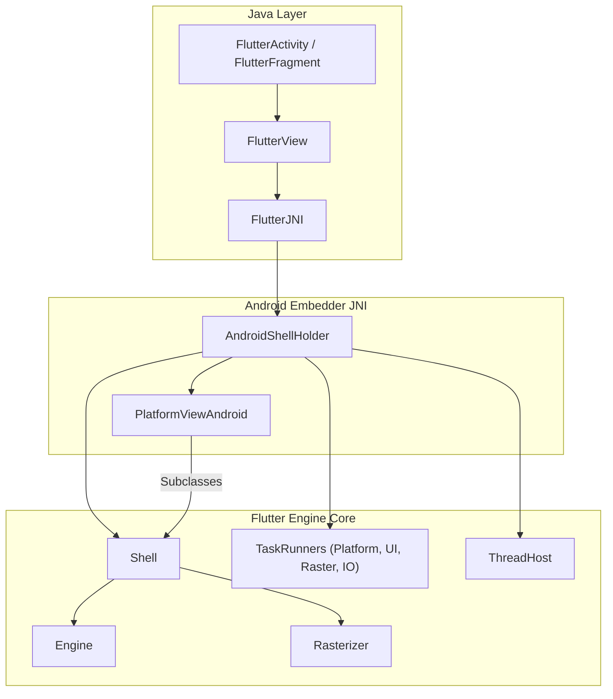
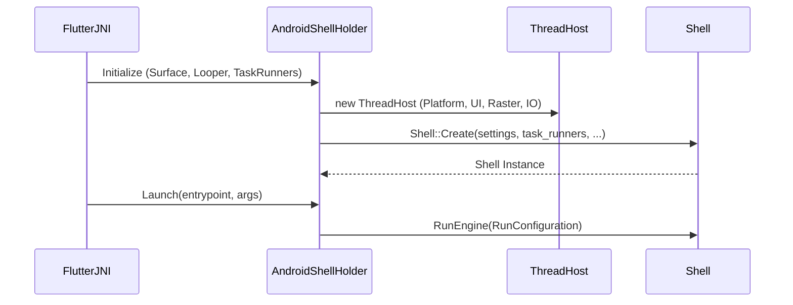
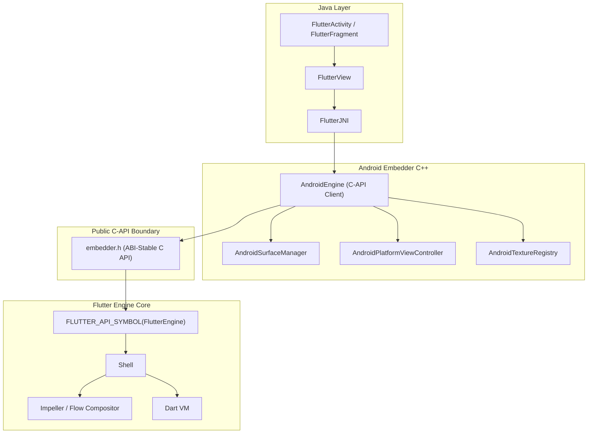
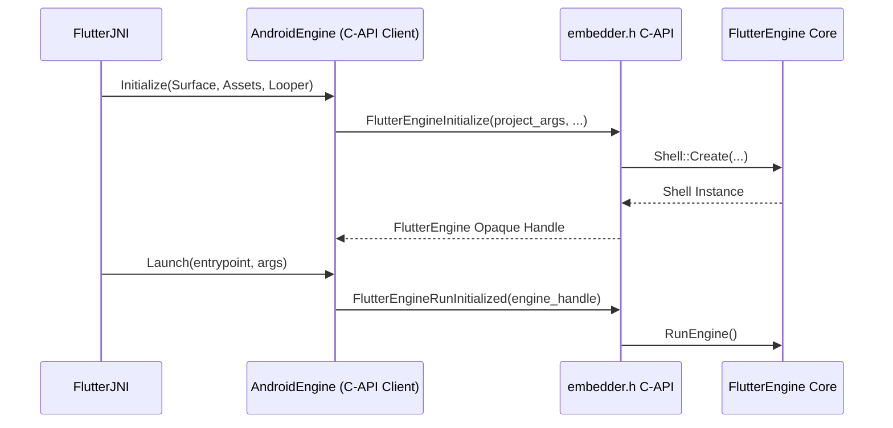
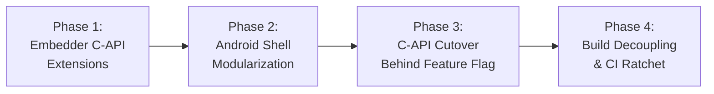
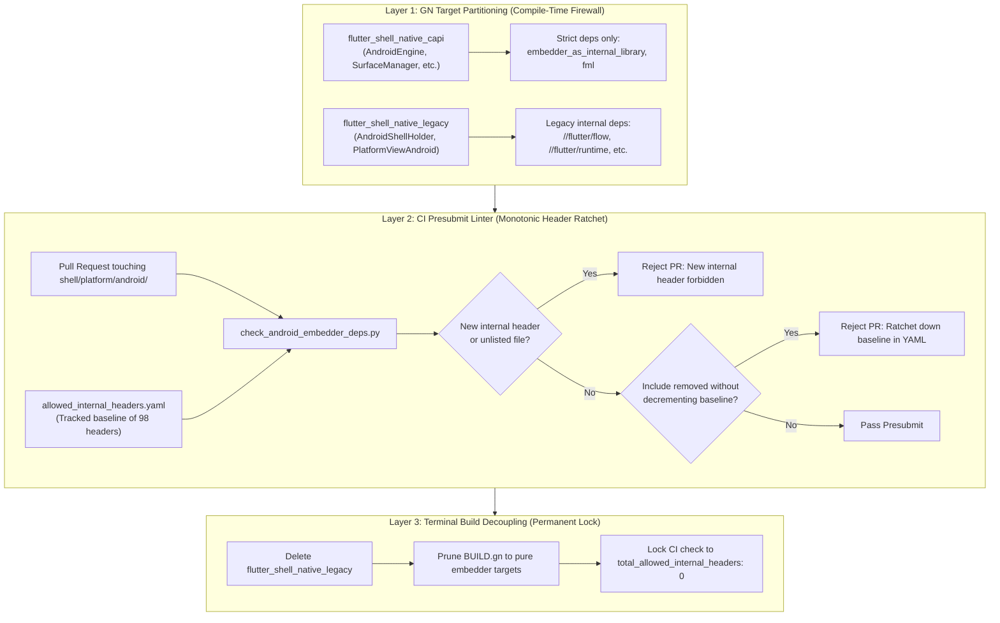

# RFC 410.0000: Flutter Android Embedder C-API Migration

## 1. Executive Summary and Overview

This RFC proposes a phased, in-place migration of the Flutter Android embedder ([`engine/src/flutter/shell/platform/android/`](https://github.com/flutter/flutter/tree/4762dec4fc9072cd9269814ef36364f35a9a66dc/engine/src/flutter/shell/platform/android)) to the public Flutter Embedder C-API ([`embedder.h`](https://github.com/flutter/flutter/blob/4762dec4fc9072cd9269814ef36364f35a9a66dc/engine/src/flutter/shell/platform/embedder/embedder.h)).

Today, the Android embedder interacts directly with engine internals: it allocates task runners, instantiates [`flutter::Shell`](https://github.com/flutter/flutter/blob/4762dec4fc9072cd9269814ef36364f35a9a66dc/engine/src/flutter/shell/common/shell.h#L113), inspects internal graphics contexts, and manages platform view compositing via private `flow` headers. This coupling causes several problems:
- Internal engine refactors in Impeller, Flow, or the Dart runtime break the Android embedder.
- Compiling `libflutter.so` requires pulling internal engine translation units into the Android target.
- Third-party desktop and embedded platforms use [`embedder.h`](https://github.com/flutter/flutter/blob/4762dec4fc9072cd9269814ef36364f35a9a66dc/engine/src/flutter/shell/platform/embedder/embedder.h), while Flutter's primary mobile embedders do not. Because the Android embedder bypasses the public C-API, missing features in [`embedder.h`](https://github.com/flutter/flutter/blob/4762dec4fc9072cd9269814ef36364f35a9a66dc/engine/src/flutter/shell/platform/embedder/embedder.h) (such as dynamic thread merging, platform view mutators, and hardware buffer external textures) are not exercised by first-party code.

This document establishes the plan to decouple the Android embedder from engine internals.

### Strict Dependency Severance

The dependency graph of [`shell/platform/android/`](https://github.com/flutter/flutter/tree/4762dec4fc9072cd9269814ef36364f35a9a66dc/engine/src/flutter/shell/platform/android) in [`BUILD.gn`](https://github.com/flutter/flutter/blob/4762dec4fc9072cd9269814ef36364f35a9a66dc/engine/src/flutter/shell/platform/android/BUILD.gn) will be reduced strictly to:
- [`//flutter/shell/platform/embedder:embedder_as_internal_library`](https://github.com/flutter/flutter/blob/4762dec4fc9072cd9269814ef36364f35a9a66dc/engine/src/flutter/shell/platform/embedder/BUILD.gn#L75) (required)
- [`//flutter/fml`](https://github.com/flutter/flutter/tree/4762dec4fc9072cd9269814ef36364f35a9a66dc/engine/src/flutter/fml) (optional)
- [`//flutter/shell/platform/common`](https://github.com/flutter/flutter/tree/4762dec4fc9072cd9269814ef36364f35a9a66dc/engine/src/flutter/shell/platform/common) (optional)
- [`//flutter/third_party`](https://github.com/flutter/flutter/tree/4762dec4fc9072cd9269814ef36364f35a9a66dc/engine/src/flutter/third_party) (optional)

All direct dependencies on internal engine modules ([`//flutter/runtime`](https://github.com/flutter/flutter/tree/4762dec4fc9072cd9269814ef36364f35a9a66dc/engine/src/flutter/runtime), [`//flutter/flow`](https://github.com/flutter/flutter/tree/4762dec4fc9072cd9269814ef36364f35a9a66dc/engine/src/flutter/flow), [`//flutter/skia`](https://github.com/flutter/flutter/tree/4762dec4fc9072cd9269814ef36364f35a9a66dc/engine/src/flutter/skia), [`//flutter/impeller`](https://github.com/flutter/flutter/tree/4762dec4fc9072cd9269814ef36364f35a9a66dc/engine/src/flutter/impeller), [`//flutter/lib/ui`](https://github.com/flutter/flutter/tree/4762dec4fc9072cd9269814ef36364f35a9a66dc/engine/src/flutter/lib/ui), [`//flutter/txt`](https://github.com/flutter/flutter/tree/4762dec4fc9072cd9269814ef36364f35a9a66dc/engine/src/flutter/txt), and [`//flutter/assets`](https://github.com/flutter/flutter/tree/4762dec4fc9072cd9269814ef36364f35a9a66dc/engine/src/flutter/assets)) will be eliminated.

### Goals

- Establish an enforced architectural boundary between Java/JNI/Android C++ and the engine core.
- Reduce direct internal engine header inclusions in [`shell/platform/android/`](https://github.com/flutter/flutter/tree/4762dec4fc9072cd9269814ef36364f35a9a66dc/engine/src/flutter/shell/platform/android) from 98 to 0.
- Enable independent compilation and stable ABI boundaries for Android embeddings.
- Maintain 100% functional, performance, and accessibility parity across all supported Android API levels and rendering backends (Impeller Vulkan, Impeller OpenGL, and legacy Skia).

### Non-Goals

- Modifying the public Java/Kotlin Flutter Android API ([`io.flutter.embedding.android.*`](https://github.com/flutter/flutter/tree/4762dec4fc9072cd9269814ef36364f35a9a66dc/engine/src/flutter/shell/platform/android/io/flutter/embedding/android)).
- Rewriting Impeller or Flow rendering internals.
- Creating a separate `.so` shared library file for the Android embedder versus the Flutter engine at this time. Compilation remains unified within `libflutter.so`.

## 2. Background and Problem Statement

The Android embedder is located in [`engine/src/flutter/shell/platform/android/`](https://github.com/flutter/flutter/tree/4762dec4fc9072cd9269814ef36364f35a9a66dc/engine/src/flutter/shell/platform/android). It does not use [`embedder.h`](https://github.com/flutter/flutter/blob/4762dec4fc9072cd9269814ef36364f35a9a66dc/engine/src/flutter/shell/platform/embedder/embedder.h). Instead, it functions as a customized implementation that interacts directly with core engine components.

### Current Production Architecture ([`flutter_shell_native`](https://github.com/flutter/flutter/blob/4762dec4fc9072cd9269814ef36364f35a9a66dc/engine/src/flutter/shell/platform/android/BUILD.gn#L75))

In the existing architecture, the Java embedding coordinates with native code through JNI interfaces, primarily [`FlutterJNI`](https://github.com/flutter/flutter/blob/4762dec4fc9072cd9269814ef36364f35a9a66dc/engine/src/flutter/shell/platform/android/io/flutter/embedding/engine/FlutterJNI.java#L108), `PlatformViewAndroidJNI`, and [`AndroidShellHolder`](https://github.com/flutter/flutter/blob/4762dec4fc9072cd9269814ef36364f35a9a66dc/engine/src/flutter/shell/platform/android/android_shell_holder.h#L38).

[`AndroidShellHolder`](https://github.com/flutter/flutter/blob/4762dec4fc9072cd9269814ef36364f35a9a66dc/engine/src/flutter/shell/platform/android/android_shell_holder.h#L38) manages the lifecycle of the engine. It creates a [`flutter::ThreadHost`](https://github.com/flutter/flutter/blob/4762dec4fc9072cd9269814ef36364f35a9a66dc/engine/src/flutter/shell/common/thread_host.h#L21) on the native side, instantiates a [`flutter::Shell`](https://github.com/flutter/flutter/blob/4762dec4fc9072cd9269814ef36364f35a9a66dc/engine/src/flutter/shell/common/shell.h#L113) object directly through [`flutter::Shell::Create(...)`](https://github.com/flutter/flutter/blob/4762dec4fc9072cd9269814ef36364f35a9a66dc/engine/src/flutter/shell/common/shell.h#L137), and owns an instance of [`PlatformViewAndroid`](https://github.com/flutter/flutter/blob/4762dec4fc9072cd9269814ef36364f35a9a66dc/engine/src/flutter/shell/platform/android/platform_view_android.h#L43).

[`PlatformViewAndroid`](https://github.com/flutter/flutter/blob/4762dec4fc9072cd9269814ef36364f35a9a66dc/engine/src/flutter/shell/platform/android/platform_view_android.h#L43) subclasses the engine's internal [`flutter::PlatformView`](https://github.com/flutter/flutter/blob/4762dec4fc9072cd9269814ef36364f35a9a66dc/engine/src/flutter/shell/common/platform_view.h#L51) class. This inheritance allows Android to interact directly with internal classes such as [`flutter::Rasterizer`](https://github.com/flutter/flutter/blob/4762dec4fc9072cd9269814ef36364f35a9a66dc/engine/src/flutter/shell/common/rasterizer.h#L114), [`flutter::Surface`](https://github.com/flutter/flutter/blob/4762dec4fc9072cd9269814ef36364f35a9a66dc/engine/src/flutter/flow/surface.h#L26), [`flutter::TextureRegistry`](https://github.com/flutter/flutter/blob/4762dec4fc9072cd9269814ef36364f35a9a66dc/engine/src/flutter/common/graphics/texture.h#L68), and [`flutter::MutatorsStack`](https://github.com/flutter/flutter/blob/4762dec4fc9072cd9269814ef36364f35a9a66dc/engine/src/flutter/flow/embedded_views.h#L211).





### Dependency Entanglement in [`BUILD.gn`](https://github.com/flutter/flutter/blob/4762dec4fc9072cd9269814ef36364f35a9a66dc/engine/src/flutter/shell/platform/android/BUILD.gn)

Because [`AndroidShellHolder`](https://github.com/flutter/flutter/blob/4762dec4fc9072cd9269814ef36364f35a9a66dc/engine/src/flutter/shell/platform/android/android_shell_holder.h#L38) and [`PlatformViewAndroid`](https://github.com/flutter/flutter/blob/4762dec4fc9072cd9269814ef36364f35a9a66dc/engine/src/flutter/shell/platform/android/platform_view_android.h#L43) reach directly into internal engine classes, [`flutter_shell_native_src`](https://github.com/flutter/flutter/blob/4762dec4fc9072cd9269814ef36364f35a9a66dc/engine/src/flutter/shell/platform/android/BUILD.gn#L95) in [`engine/src/flutter/shell/platform/android/BUILD.gn`](https://github.com/flutter/flutter/blob/4762dec4fc9072cd9269814ef36364f35a9a66dc/engine/src/flutter/shell/platform/android/BUILD.gn) depends on internal engine targets.

A forensic audit of [`shell/platform/android/`](https://github.com/flutter/flutter/tree/4762dec4fc9072cd9269814ef36364f35a9a66dc/engine/src/flutter/shell/platform/android) reveals 98 internal engine headers included across Android shell files, categorized across 9 distinct subsystems:

| Subsystem & Headers | Direct GN Dependencies | Key Internal Headers | Functional Purpose in Embedder |
| :--- | :--- | :--- | :--- |
| **Impeller & Graphics Context Setup**<br/>(29 headers) | [`//flutter/impeller`](https://github.com/flutter/flutter/tree/4762dec4fc9072cd9269814ef36364f35a9a66dc/engine/src/flutter/impeller)<br/>[`//flutter/impeller/toolkit/android`](https://github.com/flutter/flutter/tree/4762dec4fc9072cd9269814ef36364f35a9a66dc/engine/src/flutter/impeller/toolkit/android)<br/>[`//flutter/impeller/toolkit/egl`](https://github.com/flutter/flutter/tree/4762dec4fc9072cd9269814ef36364f35a9a66dc/engine/src/flutter/impeller/toolkit/egl)<br/>[`//flutter/impeller/toolkit/gles`](https://github.com/flutter/flutter/tree/4762dec4fc9072cd9269814ef36364f35a9a66dc/engine/src/flutter/impeller/toolkit/gles)<br/>[`//flutter/impeller/toolkit/glvk`](https://github.com/flutter/flutter/tree/4762dec4fc9072cd9269814ef36364f35a9a66dc/engine/src/flutter/impeller/toolkit/glvk) | [`renderer/backend/vulkan/context_vk.h`](https://github.com/flutter/flutter/blob/4762dec4fc9072cd9269814ef36364f35a9a66dc/engine/src/flutter/impeller/renderer/backend/vulkan/context_vk.h)<br/>[`surface_context_vk.h`](https://github.com/flutter/flutter/blob/4762dec4fc9072cd9269814ef36364f35a9a66dc/engine/src/flutter/impeller/renderer/backend/vulkan/surface_context_vk.h)<br/>[`renderer/backend/gles/context_gles.h`](https://github.com/flutter/flutter/blob/4762dec4fc9072cd9269814ef36364f35a9a66dc/engine/src/flutter/impeller/renderer/backend/gles/context_gles.h)<br/>[`toolkit/android/hardware_buffer.h`](https://github.com/flutter/flutter/blob/4762dec4fc9072cd9269814ef36364f35a9a66dc/engine/src/flutter/impeller/toolkit/android/hardware_buffer.h)<br/>[`renderer/backend/vulkan/android/ahb_texture_source_vk.h`](https://github.com/flutter/flutter/blob/4762dec4fc9072cd9269814ef36364f35a9a66dc/engine/src/flutter/impeller/renderer/backend/vulkan/android/ahb_texture_source_vk.h) | Initializing rendering contexts on the raster thread ([`SetupImpellerContext`](https://github.com/flutter/flutter/blob/4762dec4fc9072cd9269814ef36364f35a9a66dc/engine/src/flutter/shell/platform/android/platform_view_android.h#L128)), creating Vulkan and EGL swapchains, and managing zero-copy `AHardwareBuffer` imports. |
| **Platform Views & Layer Compositing**<br/>(2 headers) | [`//flutter/flow`](https://github.com/flutter/flutter/tree/4762dec4fc9072cd9269814ef36364f35a9a66dc/engine/src/flutter/flow) | [`flow/embedded_views.h`](https://github.com/flutter/flutter/blob/4762dec4fc9072cd9269814ef36364f35a9a66dc/engine/src/flutter/flow/embedded_views.h)<br/>[`flow/surface.h`](https://github.com/flutter/flutter/blob/4762dec4fc9072cd9269814ef36364f35a9a66dc/engine/src/flutter/flow/surface.h) | Platform view compositing across Hybrid Composition++ (HCPP via `SurfaceControl`), Hybrid Composition (HC), Texture Layer Hybrid Composition (TLHC), and Virtual Displays (VD); managing geometric clipping and transforms via [`flutter::MutatorsStack`](https://github.com/flutter/flutter/blob/4762dec4fc9072cd9269814ef36364f35a9a66dc/engine/src/flutter/flow/embedded_views.h#L211), view slicing, surface pooling ([`surface_pool.h`](https://github.com/flutter/flutter/blob/4762dec4fc9072cd9269814ef36364f35a9a66dc/engine/src/flutter/shell/platform/android/external_view_embedder/surface_pool.h)), and multi-surface composition frame results ([`external_view_embedder_2.h`](https://github.com/flutter/flutter/blob/4762dec4fc9072cd9269814ef36364f35a9a66dc/engine/src/flutter/shell/platform/android/external_view_embedder/external_view_embedder_2.h)). |
| **External Textures & Surface Control**<br/>(5 headers) | [`//flutter/common/graphics`](https://github.com/flutter/flutter/tree/4762dec4fc9072cd9269814ef36364f35a9a66dc/engine/src/flutter/common/graphics)<br/>[`//flutter/display_list`](https://github.com/flutter/flutter/tree/4762dec4fc9072cd9269814ef36364f35a9a66dc/engine/src/flutter/display_list) | [`common/graphics/texture.h`](https://github.com/flutter/flutter/blob/4762dec4fc9072cd9269814ef36364f35a9a66dc/engine/src/flutter/common/graphics/texture.h)<br/>[`common/graphics/gl_context_switch.h`](https://github.com/flutter/flutter/blob/4762dec4fc9072cd9269814ef36364f35a9a66dc/engine/src/flutter/common/graphics/gl_context_switch.h)<br/>[`display_list/image/dl_image_skia.h`](https://github.com/flutter/flutter/blob/4762dec4fc9072cd9269814ef36364f35a9a66dc/engine/src/flutter/display_list/image/dl_image_skia.h)<br/>[`display_list/geometry/dl_geometry_types.h`](https://github.com/flutter/flutter/blob/4762dec4fc9072cd9269814ef36364f35a9a66dc/engine/src/flutter/display_list/geometry/dl_geometry_types.h) | Texture lifecycle and frame updates for Android `SurfaceTexture` (OpenGL ES) and `SurfaceProducer` (Vulkan); feeding decoded video and camera frames into the DisplayList compositor. |
| **Engine Core, Lifecycle & Threading**<br/>(11 headers) | [`//flutter/shell/common`](https://github.com/flutter/flutter/tree/4762dec4fc9072cd9269814ef36364f35a9a66dc/engine/src/flutter/shell/common) | [`shell/common/shell.h`](https://github.com/flutter/flutter/blob/4762dec4fc9072cd9269814ef36364f35a9a66dc/engine/src/flutter/shell/common/shell.h)<br/>[`thread_host.h`](https://github.com/flutter/flutter/blob/4762dec4fc9072cd9269814ef36364f35a9a66dc/engine/src/flutter/shell/common/thread_host.h)<br/>[`platform_view.h`](https://github.com/flutter/flutter/blob/4762dec4fc9072cd9269814ef36364f35a9a66dc/engine/src/flutter/shell/common/platform_view.h)<br/>[`rasterizer.h`](https://github.com/flutter/flutter/blob/4762dec4fc9072cd9269814ef36364f35a9a66dc/engine/src/flutter/shell/common/rasterizer.h)<br/>[`run_configuration.h`](https://github.com/flutter/flutter/blob/4762dec4fc9072cd9269814ef36364f35a9a66dc/engine/src/flutter/shell/common/run_configuration.h)<br/>[`vsync_waiter.h`](https://github.com/flutter/flutter/blob/4762dec4fc9072cd9269814ef36364f35a9a66dc/engine/src/flutter/shell/common/vsync_waiter.h)<br/>[`snapshot_surface_producer.h`](https://github.com/flutter/flutter/blob/4762dec4fc9072cd9269814ef36364f35a9a66dc/engine/src/flutter/shell/common/snapshot_surface_producer.h) | Direct instantiation of [`flutter::Shell::Create(...)`](https://github.com/flutter/flutter/blob/4762dec4fc9072cd9269814ef36364f35a9a66dc/engine/src/flutter/shell/common/shell.h#L137), thread host allocation (Platform, UI, Raster, IO), vsync scheduling, snapshot generation, and rasterizer coordination. |
| **UI Layer & Message Dispatch**<br/>(5 headers) | [`//flutter/lib/ui`](https://github.com/flutter/flutter/tree/4762dec4fc9072cd9269814ef36364f35a9a66dc/engine/src/flutter/lib/ui) | [`lib/ui/window/platform_message.h`](https://github.com/flutter/flutter/blob/4762dec4fc9072cd9269814ef36364f35a9a66dc/engine/src/flutter/lib/ui/window/platform_message.h)<br/>[`platform_message_response.h`](https://github.com/flutter/flutter/blob/4762dec4fc9072cd9269814ef36364f35a9a66dc/engine/src/flutter/lib/ui/window/platform_message_response.h)<br/>[`lib/ui/plugins/callback_cache.h`](https://github.com/flutter/flutter/blob/4762dec4fc9072cd9269814ef36364f35a9a66dc/engine/src/flutter/lib/ui/plugins/callback_cache.h)<br/>[`lib/ui/painting/image_generator.h`](https://github.com/flutter/flutter/blob/4762dec4fc9072cd9269814ef36364f35a9a66dc/engine/src/flutter/lib/ui/painting/image_generator.h) | Binary message encoding and decoding for platform channels, background Dart entrypoint lookup ([`PluginUtilities.getCallbackHandle`](https://github.com/flutter/flutter/blob/4762dec4fc9072cd9269814ef36364f35a9a66dc/engine/src/flutter/lib/ui/plugins.dart#L54) via [`callback_cache.h`](https://github.com/flutter/flutter/blob/4762dec4fc9072cd9269814ef36364f35a9a66dc/engine/src/flutter/lib/ui/plugins/callback_cache.h)), and native platform image decoding. |
| **Dart VM, Runtime & Service Isolate**<br/>(2 headers) | [`//flutter/runtime`](https://github.com/flutter/flutter/tree/4762dec4fc9072cd9269814ef36364f35a9a66dc/engine/src/flutter/runtime)<br/>[`//flutter/runtime:libdart`](https://github.com/flutter/flutter/blob/4762dec4fc9072cd9269814ef36364f35a9a66dc/engine/src/flutter/runtime/BUILD.gn) | [`runtime/dart_vm.h`](https://github.com/flutter/flutter/blob/4762dec4fc9072cd9269814ef36364f35a9a66dc/engine/src/flutter/runtime/dart_vm.h)<br/>[`runtime/dart_service_isolate.h`](https://github.com/flutter/flutter/blob/4762dec4fc9072cd9269814ef36364f35a9a66dc/engine/src/flutter/runtime/dart_service_isolate.h) | Managing the Dart VM lifecycle, configuring concurrent message loops, isolate creation, and Dart service isolate initialization. |
| **Asset Management & Packaging**<br/>(1 header) | [`//flutter/assets`](https://github.com/flutter/flutter/tree/4762dec4fc9072cd9269814ef36364f35a9a66dc/engine/src/flutter/assets) | [`assets/asset_resolver.h`](https://github.com/flutter/flutter/blob/4762dec4fc9072cd9269814ef36364f35a9a66dc/engine/src/flutter/assets/asset_resolver.h) | Resolving assets and kernel blobs packaged within the Android APK via [`APKAssetProvider`](https://github.com/flutter/flutter/blob/4762dec4fc9072cd9269814ef36364f35a9a66dc/engine/src/flutter/shell/platform/android/apk_asset_provider.h#L17). |
| **GPU Backends & Surface Delegates**<br/>(5 headers) | [`//flutter/shell/gpu`](https://github.com/flutter/flutter/tree/4762dec4fc9072cd9269814ef36364f35a9a66dc/engine/src/flutter/shell/gpu)<br/>[`//flutter/vulkan`](https://github.com/flutter/flutter/tree/4762dec4fc9072cd9269814ef36364f35a9a66dc/engine/src/flutter/vulkan) | [`shell/gpu/gpu_surface_gl_impeller.h`](https://github.com/flutter/flutter/blob/4762dec4fc9072cd9269814ef36364f35a9a66dc/engine/src/flutter/shell/gpu/gpu_surface_gl_impeller.h)<br/>[`gpu_surface_vulkan_impeller.h`](https://github.com/flutter/flutter/blob/4762dec4fc9072cd9269814ef36364f35a9a66dc/engine/src/flutter/shell/gpu/gpu_surface_vulkan_impeller.h)<br/>[`vulkan/vulkan_native_surface_android.h`](https://github.com/flutter/flutter/blob/4762dec4fc9072cd9269814ef36364f35a9a66dc/engine/src/flutter/vulkan/vulkan_native_surface_android.h) | Implementing platform window surface delegates for OpenGL and Vulkan render pipelines. |
| **Foundational Utilities & Concurrency**<br/>(24 headers) | [`//flutter/fml`](https://github.com/flutter/flutter/tree/4762dec4fc9072cd9269814ef36364f35a9a66dc/engine/src/flutter/fml) | [`fml/raster_thread_merger.h`](https://github.com/flutter/flutter/blob/4762dec4fc9072cd9269814ef36364f35a9a66dc/engine/src/flutter/fml/raster_thread_merger.h)<br/>[`fml/task_runner.h`](https://github.com/flutter/flutter/blob/4762dec4fc9072cd9269814ef36364f35a9a66dc/engine/src/flutter/fml/task_runner.h)<br/>[`fml/message_loop.h`](https://github.com/flutter/flutter/blob/4762dec4fc9072cd9269814ef36364f35a9a66dc/engine/src/flutter/fml/message_loop.h)<br/>[`fml/concurrent_message_loop.h`](https://github.com/flutter/flutter/blob/4762dec4fc9072cd9269814ef36364f35a9a66dc/engine/src/flutter/fml/concurrent_message_loop.h)<br/>[`fml/platform/android/jni_util.h`](https://github.com/flutter/flutter/blob/4762dec4fc9072cd9269814ef36364f35a9a66dc/engine/src/flutter/fml/platform/android/jni_util.h)<br/>[`fml/platform/android/scoped_java_ref.h`](https://github.com/flutter/flutter/blob/4762dec4fc9072cd9269814ef36364f35a9a66dc/engine/src/flutter/fml/platform/android/scoped_java_ref.h) | Message loops, JNI handle wrappers, task scheduling, and raster thread leasing. |

### Technical Consequences of Coupling

This level of coupling creates several concrete maintenance problems:
- Fragile refactoring: Any change to private engine internals (such as Impeller backend refactors or Flow mutator stack updates) breaks the Android embedder.
- Prolonged rebuild times: Compiling `libflutter.so` requires rebuilding internal engine translation units even when only platform-specific code changes.
- Lack of API contract: No stable boundary prevents Android embedder code from reaching into private engine internals, inhibiting engine modularization.

## 3. Subsystem Deep-Dives: Architectural Requirements and Proposed Embedder C-APIs

To allow the Android embedder to communicate with the engine exclusively through [`embedder.h`](https://github.com/flutter/flutter/blob/4762dec4fc9072cd9269814ef36364f35a9a66dc/engine/src/flutter/shell/platform/embedder/embedder.h), the C-API must be extended to cover Android-specific subsystem requirements.

### 3.1 Graphics Surface Setup and Context Creation ([`SetupImpellerContext`](https://github.com/flutter/flutter/blob/4762dec4fc9072cd9269814ef36364f35a9a66dc/engine/src/flutter/shell/platform/android/platform_view_android.h#L128))

On Android, graphics contexts (EGL or Vulkan) require initialization on the raster thread before drawing surfaces can be allocated. Currently, [`PlatformViewAndroid`](https://github.com/flutter/flutter/blob/4762dec4fc9072cd9269814ef36364f35a9a66dc/engine/src/flutter/shell/platform/android/platform_view_android.h#L43) overrides [`PlatformView::SetupImpellerContext`](https://github.com/flutter/flutter/blob/4762dec4fc9072cd9269814ef36364f35a9a66dc/engine/src/flutter/shell/common/platform_view.h#L125) directly to establish graphics resources.

To expose this capability in [`embedder.h`](https://github.com/flutter/flutter/blob/4762dec4fc9072cd9269814ef36364f35a9a66dc/engine/src/flutter/shell/platform/embedder/embedder.h), renderer configuration structs receive dedicated raster-thread callbacks:

```c
typedef struct {
  size_t struct_size;
  // Callback invoked on the raster thread to initialize OpenGL graphics state.
  VoidCallback setup_callback;
} FlutterOpenGLRendererConfig;

typedef struct {
  size_t struct_size;
  // Callback invoked on the raster thread to initialize Vulkan graphics state.
  VoidCallback setup_callback;
} FlutterVulkanRendererConfig;
```

Additionally, [`embedder.h`](https://github.com/flutter/flutter/blob/4762dec4fc9072cd9269814ef36364f35a9a66dc/engine/src/flutter/shell/platform/embedder/embedder.h) receives an API allowing embedders to construct a render target directly from a Vulkan backing store, aligning with Impeller Vulkan swapchain requirements.

### 3.2 Dynamic Raster Thread Merging (Legacy Hybrid Composition)

Android Hybrid Composition (HC) synchronizes native Android `View` widgets with Flutter layers. During frame rendering in legacy HC mode, native Android views update on the main platform thread. If Flutter continues rasterizing on a separate raster thread, thread contention and deadlocks can occur during surface redraws.

While modern Hybrid Composition++ (HCPP, Section 3.10) bypasses thread merging entirely through `SurfaceControl` transaction fences on Android 14+ (API level 34+), legacy Hybrid Composition remains required for earlier Android API levels under Skia. To prevent deadlocks in HC mode, Flutter dynamically merges the raster thread into the platform thread ([`fml::RasterThreadMerger`](https://github.com/flutter/flutter/blob/4762dec4fc9072cd9269814ef36364f35a9a66dc/engine/src/flutter/fml/raster_thread_merger.h#L31)). While merged, both platform tasks and raster work execute on the Android platform thread. Once the platform view interaction ceases, the threads unmerge. If Skia support is deprecated and dropped on Android prior to or concurrently with this migration, this dynamic thread merging C-API extension is omitted entirely (Section 10).

The public C-API previously lacked any mechanism to lease or release threads dynamically. [`embedder.h`](https://github.com/flutter/flutter/blob/4762dec4fc9072cd9269814ef36364f35a9a66dc/engine/src/flutter/shell/platform/embedder/embedder.h) receives an API for registering a thread merger:

```c
typedef struct FlutterRasterThreadMerger* FlutterRasterThreadMergerRef;

typedef struct {
  size_t struct_size;
  void* user_data;
  // Callback invoked when the engine needs to merge raster and platform threads.
  void (*lease_raster_thread)(void* user_data);
  // Callback invoked when the engine returns to separate threads.
  void (*release_raster_thread)(void* user_data);
} FlutterRasterThreadMergerConfig;

FLUTTER_EXPORT
FlutterEngineResult FlutterEngineRegisterRasterThreadMerger(
    FLUTTER_API_SYMBOL(FlutterEngine) engine,
    const FlutterRasterThreadMergerConfig* config,
    FlutterRasterThreadMergerRef* merger_out);
```

### 3.3 External Textures (Zero-Copy Vulkan and OpenGL ES)

Android provides two distinct mechanisms for external textures:
- `SurfaceProducer`: A zero-copy pipeline that imports `AHardwareBuffer` handles directly into Vulkan (`VkImage`) or EGL (`EGLImage`).
- `SurfaceTexture`: A legacy OpenGL ES path where native frames render into a texture ID updated with `SurfaceTexture.updateTexImage()`.

The public Embedder API previously lacked an entry point for registering Vulkan-backed external images without depending on internal [`flutter::Texture`](https://github.com/flutter/flutter/blob/4762dec4fc9072cd9269814ef36364f35a9a66dc/engine/src/flutter/common/graphics/texture.h#L27) classes. [`embedder.h`](https://github.com/flutter/flutter/blob/4762dec4fc9072cd9269814ef36364f35a9a66dc/engine/src/flutter/shell/platform/embedder/embedder.h) receives direct Vulkan image registration:

```c
typedef struct {
  size_t struct_size;
  int64_t texture_id;
  uint32_t width;
  uint32_t height;
  uint32_t format;
  void* vk_image; // VkImage
  void* vk_device_memory; // VkDeviceMemory
} FlutterVulkanImageTextureConfig;

FLUTTER_EXPORT
FlutterEngineResult FlutterEngineRegisterVulkanImage(
    FLUTTER_API_SYMBOL(FlutterEngine) engine,
    const FlutterVulkanImageTextureConfig* config);
```

For legacy `SurfaceTexture` instances, the existing [`FlutterEngineRegisterExternalTexture`](https://github.com/flutter/flutter/blob/4762dec4fc9072cd9269814ef36364f35a9a66dc/engine/src/flutter/shell/platform/embedder/embedder.h#L3227) API with `kFlutterExternalTextureTypeOpenGL` is used.

### 3.4 Platform View Mutator Stack Serialization

Platform views embedded within Flutter require transformations, opacities, and clips (axis-aligned rectangles, rounded rectangles, and arbitrary vector paths) across all Android composition modes (HCPP, HC, and TLHC).

Internally, these operations are managed by [`flutter::MutatorsStack`](https://github.com/flutter/flutter/blob/4762dec4fc9072cd9269814ef36364f35a9a66dc/engine/src/flutter/flow/embedded_views.h#L211) in [`flow/embedded_views.h`](https://github.com/flutter/flutter/blob/4762dec4fc9072cd9269814ef36364f35a9a66dc/engine/src/flutter/flow/embedded_views.h). Because `flow` and `SkPath` headers cannot cross the C-API boundary, mutators must be serialized into an ABI-stable array of C structs:

```c
typedef enum {
  kFlutterPlatformViewMutationTypeClipRect,
  kFlutterPlatformViewMutationTypeClipRRect,
  kFlutterPlatformViewMutationTypeClipPath,
  kFlutterPlatformViewMutationTypeTransform,
  kFlutterPlatformViewMutationTypeOpacity,
} FlutterPlatformViewMutationType;

typedef struct {
  FlutterPlatformViewMutationType type;
  union {
    FlutterRect clip_rect;
    FlutterRoundedRect clip_rrect;
    struct {
      const FlutterPoint* points;
      const uint8_t* verbs;
      size_t count;
    } clip_path;
    FlutterTransformation transform;
    double opacity;
  };
} FlutterPlatformViewMutation;

typedef struct {
  size_t struct_size;
  int64_t view_id;
  const FlutterPlatformViewMutation* mutations;
  size_t mutation_count;
} FlutterPlatformViewMutationStack;
```

Platform view display callbacks in `FlutterPlatformViewRendererConfig` accept this serialized mutation stack, enabling complete geometric rendering without engine internal dependencies.

### 3.5 Accessibility and Semantics Parity (`Semantics2`)

Android's [`AccessibilityBridge`](https://github.com/flutter/flutter/blob/4762dec4fc9072cd9269814ef36364f35a9a66dc/engine/src/flutter/shell/platform/android/io/flutter/view/AccessibilityBridge.java#L80) requires semantics metadata that was absent in the original [`FlutterSemanticsNode`](https://github.com/flutter/flutter/blob/4762dec4fc9072cd9269814ef36364f35a9a66dc/engine/src/flutter/shell/platform/embedder/embedder.h#L1599) struct, including `maxValueLength`, `currentValueLength`, `linkUrl`, `locale`, `minValue`, `maxValue`, `identifier`, `traversalParent`, `hitTestTransform`, and `role`.

To maintain accessibility parity on Android without breaking existing desktop embedders, [`embedder.h`](https://github.com/flutter/flutter/blob/4762dec4fc9072cd9269814ef36364f35a9a66dc/engine/src/flutter/shell/platform/embedder/embedder.h) receives `FlutterSemanticsNode2` and `FlutterSemanticsUpdate2`:

```c
typedef struct {
  size_t struct_size;
  int32_t id;
  FlutterSemanticsFlags flags;
  FlutterSemanticsActions actions;
  int32_t text_selection_base;
  int32_t text_selection_extent;
  int32_t scroll_children;
  int32_t scroll_index;
  double scroll_position;
  double scroll_extent_max;
  double scroll_extent_min;
  double elevation;
  double thickness;
  const char* label;
  const char* hint;
  const char* value;
  const char* increased_value;
  const char* decreased_value;
  const char* tooltip;
  int32_t max_value_length;
  int32_t current_value_length;
  const char* link_url;
  const char* locale;
  double min_value;
  double max_value;
  const char* identifier;
  int32_t traversal_parent;
  FlutterRect rect;
  FlutterTransformation transform;
  FlutterTransformation hit_test_transform;
} FlutterSemanticsNode2;

typedef struct {
  size_t struct_size;
  size_t node_count;
  const FlutterSemanticsNode2** nodes;
  size_t custom_action_count;
  const FlutterSemanticsCustomAction** custom_actions;
} FlutterSemanticsUpdate2;

FLUTTER_EXPORT
FlutterEngineResult FlutterEngineUpdateSemantics2(
    FLUTTER_API_SYMBOL(FlutterEngine) engine,
    const FlutterSemanticsUpdate2* update);
```

### 3.6 Dart Deferred Library Loading

Android supports dynamic delivery through Google Play Feature Delivery / split APKs. When Dart code requests a deferred library via `deferred as`, the embedder must download or extract the split APK and load the compiled snapshot into the running isolate.

Currently, this is handled through private calls to [`PlatformView::LoadDartDeferredLibrary`](https://github.com/flutter/flutter/blob/4762dec4fc9072cd9269814ef36364f35a9a66dc/engine/src/flutter/shell/common/platform_view.h#L321). [`embedder.h`](https://github.com/flutter/flutter/blob/4762dec4fc9072cd9269814ef36364f35a9a66dc/engine/src/flutter/shell/platform/embedder/embedder.h) is extended with callbacks and entry points mirroring the Dart SDK deferred loading API:

```c
typedef size_t (*FlutterRequestDartDeferredLibraryCallback)(
    intptr_t loading_unit_id,
    void* user_data);

typedef struct {
  size_t struct_size;
  intptr_t loading_unit_id;
  const uint8_t* isolate_snapshot_data;
  size_t isolate_snapshot_data_size;
  const uint8_t* snapshot_instructions;
  size_t isolate_snapshot_instructions_size;
} FlutterLoadDeferredLibraryInfo;

FLUTTER_EXPORT
FlutterEngineResult FlutterEngineLoadDartDeferredLibrary(
    FLUTTER_API_SYMBOL(FlutterEngine) engine,
    const FlutterLoadDeferredLibraryInfo* load_info);

typedef struct {
  size_t struct_size;
  intptr_t loading_unit_id;
  const char* error_message;
  bool transient;
} FlutterLoadDeferredLibraryErrorInfo;

FLUTTER_EXPORT
FlutterEngineResult FlutterEngineLoadDartDeferredLibraryError(
    FLUTTER_API_SYMBOL(FlutterEngine) engine,
    const FlutterLoadDeferredLibraryErrorInfo* error_info);
```

### 3.7 Custom Asset and Kernel Resolution (APK / In-Memory Mapping)

Desktop embedders load assets from loose files in a filesystem directory passed to [`FlutterProjectArgs.assets_path`](https://github.com/flutter/flutter/blob/4762dec4fc9072cd9269814ef36364f35a9a66dc/engine/src/flutter/shell/platform/embedder/embedder.h#L2519). On Android, assets are packaged inside APK or AAB archives and accessed through the NDK `AAssetManager`. Passing file paths would require extracting all assets to disk during startup, which causes latency and disk consumption.

[`embedder.h`](https://github.com/flutter/flutter/blob/4762dec4fc9072cd9269814ef36364f35a9a66dc/engine/src/flutter/shell/platform/embedder/embedder.h) receives an asset resolver callback interface that maps assets into memory directly from the APK archive:

```c
typedef enum {
  kFlutterAssetResolverResultNotFound = 0,
  kFlutterAssetResolverResultFound = 1,
  kFlutterAssetResolverResultError = 2,
} FlutterAssetResolverResult;

typedef struct {
  size_t struct_size;
  void* user_data;
  const uint8_t* (*get_data)(void* user_data);
  size_t (*get_size)(void* user_data);
  void (*destruction_callback)(void* user_data);
} FlutterAssetMapping;

typedef FlutterAssetResolverResult (*FlutterAssetResolverGetAsMappingCallback)(
    const char* asset_name,
    FlutterAssetMapping* mapping_out,
    void* user_data);

typedef struct {
  size_t struct_size;
  void* user_data;
  const char* resolver_name;
  FlutterAssetResolverGetAsMappingCallback get_as_mapping_callback;
} FlutterAssetResolver;
```

An array of `FlutterAssetResolver` pointers is passed into [`FlutterProjectArgs.custom_asset_resolvers`](https://github.com/flutter/flutter/blob/4762dec4fc9072cd9269814ef36364f35a9a66dc/engine/src/flutter/shell/platform/embedder/embedder.h), allowing the engine to stream assets directly from the APK.

### 3.8 Multi-Engine Spawning and Add-to-App (`FlutterEngineSpawn`)

Android Add-to-App architectures rely on `FlutterEngineGroup` to spawn lightweight engines that share the Dart VM, isolate group, and shared cache using [`shell_->Spawn(...)`](https://github.com/flutter/flutter/blob/4762dec4fc9072cd9269814ef36364f35a9a66dc/engine/src/flutter/shell/common/shell.h#L248).

The public C-API had no spawn API, making it impossible to support multi-engine groups without accessing internal `Shell` methods. [`embedder.h`](https://github.com/flutter/flutter/blob/4762dec4fc9072cd9269814ef36364f35a9a66dc/engine/src/flutter/shell/platform/embedder/embedder.h) receives `FlutterEngineSpawn`:

```c
typedef struct {
  size_t struct_size;
  const char* entrypoint;
  const char* library_uri;
  const char* initial_route;
  const char* const* entrypoint_argv;
  int entrypoint_argc;
  void* user_data;
} FlutterEngineSpawnConfig;

FLUTTER_EXPORT
FlutterEngineResult FlutterEngineSpawn(
    FLUTTER_API_SYMBOL(FlutterEngine) parent_engine,
    const FlutterEngineSpawnConfig* config,
    FLUTTER_API_SYMBOL(FlutterEngine)* spawned_engine_out);
```

### 3.9 Renderer Availability and Lifecycle Signals

Android window surfaces are created and destroyed dynamically by the operating system (e.g. during application backgrounding, activity recreations, or configuration changes). The embedder must inform the engine when the underlying window surface is available or invalid without calling protected methods on `PlatformView`.

[`embedder.h`](https://github.com/flutter/flutter/blob/4762dec4fc9072cd9269814ef36364f35a9a66dc/engine/src/flutter/shell/platform/embedder/embedder.h) exposes public lifecycle entry points:

```c
FLUTTER_EXPORT
FlutterEngineResult FlutterEngineNotifyCreated(
    FLUTTER_API_SYMBOL(FlutterEngine) engine);

FLUTTER_EXPORT
FlutterEngineResult FlutterEngineNotifyDestroyed(
    FLUTTER_API_SYMBOL(FlutterEngine) engine);

FLUTTER_EXPORT
FlutterEngineResult FlutterEngineSetGpuAvailability(
    FLUTTER_API_SYMBOL(FlutterEngine) engine,
    FlutterGpuAvailability availability);
```

### 3.10 Hybrid Composition++ (HCPP) and SurfaceControl Compositing

Starting with Android 14 (API level 34), Flutter supports Hybrid Composition++ (HCPP) under the Impeller Vulkan backend ([`shell/platform/android/external_view_embedder/external_view_embedder_2.h`](https://github.com/flutter/flutter/blob/4762dec4fc9072cd9269814ef36364f35a9a66dc/engine/src/flutter/shell/platform/android/external_view_embedder/external_view_embedder_2.h)).

Unlike legacy Hybrid Composition (Section 3.2), which merges the raster thread into the platform thread to avoid synchronization deadlocks, HCPP delegates layer compositing directly to Android's OS window compositor (SurfaceFlinger) using `SurfaceControl` and `SurfaceControl.Transaction`:
- **Independent Thread Execution**: Flutter rasterization and Android `View` updates execute asynchronously on separate threads without thread leasing or merging overhead.
- **Hierarchical Surface Tree**: The embedder arranges the base Flutter surface, native platform views, and Flutter overlay slices into a tree of `SurfaceControl` nodes.
- **Hardware Fence Synchronization**: Visual synchronization is achieved at the GPU level via hardware sync fences (`ASyncFence` / Vulkan binary semaphores) passed through `SurfaceControl.Transaction` commits, delivering zero-latency touch responses and eliminating frame tearing.

To support HCPP through [`embedder.h`](https://github.com/flutter/flutter/blob/4762dec4fc9072cd9269814ef36364f35a9a66dc/engine/src/flutter/shell/platform/embedder/embedder.h), the public C-API provides multi-layer compositing primitives through [`FlutterCompositor`](https://github.com/flutter/flutter/blob/4762dec4fc9072cd9269814ef36364f35a9a66dc/engine/src/flutter/shell/platform/embedder/embedder.h#L2322):
1. **Compositor Backing Stores**: The embedder registers a `FlutterCompositor` configuration where `create_backing_store_callback` allocates `AHardwareBuffer`-backed Vulkan swapchains managed by an embedder-owned surface pool ([`surface_pool.h`](https://github.com/flutter/flutter/blob/4762dec4fc9072cd9269814ef36364f35a9a66dc/engine/src/flutter/shell/platform/android/external_view_embedder/surface_pool.h)).
2. **Layer Slicing and Dispatch**: During frame presentation, `present_layers_callback` delivers an ordered list of `FlutterLayer` items:
   - `kFlutterLayerContentTypeBackingStore`: Rendered Flutter graphics slices (base surface or overlay surfaces).
   - `kFlutterLayerContentTypePlatformView`: Embedded native Android `View` nodes, accompanied by `FlutterPlatformViewIdentifier` and serialized `FlutterPlatformViewMutation` arrays (Section 3.4).
3. **Fence Transfer and Atomic Commit**: The compositor callback provides synchronization primitives allowing the embedder to extract presentation fences from Vulkan layers and attach them to `SurfaceControl.Transaction` operations:

```c
typedef struct {
  size_t struct_size;
  // File descriptor representing an ASyncFence or sync_fence fd.
  // Passed to SurfaceControl.Transaction.setBuffer() on Android API 34+.
  int synchronization_fence_fd;
} FlutterVulkanLayerSyncInfo;
```

In HCPP mode, `AndroidPlatformViewController` translates the ordered `FlutterLayer` sequence directly into atomic `SurfaceControl.Transaction` calls (`setLayer`, `setCrop`, `setMatrix`, `setBuffer`), committing all layer updates to SurfaceFlinger synchronously with the Android display refresh.

## 4. Target Architecture and Design Principles

The target architecture establishes a strict C-ABI boundary between the Android embedder and the engine core.





### Pure Embedder API Client

In the target architecture:
- `AndroidEngine` holds only an opaque [`FLUTTER_API_SYMBOL(FlutterEngine)`](https://github.com/flutter/flutter/blob/4762dec4fc9072cd9269814ef36364f35a9a66dc/engine/src/flutter/shell/platform/embedder/embedder.h#L1523) handle.
- Event dispatch (touch, window metrics, platform messages, accessibility) calls public functions: [`FlutterEngineSendPointerEvent`](https://github.com/flutter/flutter/blob/4762dec4fc9072cd9269814ef36364f35a9a66dc/engine/src/flutter/shell/platform/embedder/embedder.h#L3082), [`FlutterEngineSendWindowMetricsEvent`](https://github.com/flutter/flutter/blob/4762dec4fc9072cd9269814ef36364f35a9a66dc/engine/src/flutter/shell/platform/embedder/embedder.h#L3077), [`FlutterEngineSendPlatformMessage`](https://github.com/flutter/flutter/blob/4762dec4fc9072cd9269814ef36364f35a9a66dc/engine/src/flutter/shell/platform/embedder/embedder.h#L3114), and `FlutterEngineUpdateSemantics2`.
- Engine initialization delegates thread creation to the engine via [`FlutterEngineInitialize`](https://github.com/flutter/flutter/blob/4762dec4fc9072cd9269814ef36364f35a9a66dc/engine/src/flutter/shell/platform/embedder/embedder.h#L2970) and [`FlutterEngineRunInitialized`](https://github.com/flutter/flutter/blob/4762dec4fc9072cd9269814ef36364f35a9a66dc/engine/src/flutter/shell/platform/embedder/embedder.h#L3006).

### Decomposition of [`AndroidShellHolder`](https://github.com/flutter/flutter/blob/4762dec4fc9072cd9269814ef36364f35a9a66dc/engine/src/flutter/shell/platform/android/android_shell_holder.h#L38)

To replace the monolithic [`AndroidShellHolder`](https://github.com/flutter/flutter/blob/4762dec4fc9072cd9269814ef36364f35a9a66dc/engine/src/flutter/shell/platform/android/android_shell_holder.h#L38), its responsibilities are divided into discrete components with single responsibilities:
- `AndroidEngine`: Owns the `FlutterEngine` opaque handle, manages lifecycle state transitions, and coordinates initialization arguments.
- `AndroidSurfaceManager`: Coordinates native window surfaces (`ANativeWindow`), rendering backend selection (Vulkan, OpenGL, or Software), and resize notifications.
- `AndroidPlatformViewController`: Manages all platform view composition modes: Hybrid Composition++ (HCPP via `SurfaceControl` on API 34+), legacy Hybrid Composition (HC via thread merging), Texture Layer Hybrid Composition (TLHC), and Virtual Displays (VD). Serializes mutator stacks into `FlutterPlatformViewMutation` arrays, coordinates `SurfaceControl.Transaction` pipelines with `PlatformViewsController2`, and routes touch events.
- `AndroidTextureRegistry`: Manages `SurfaceTexture` (OpenGL ES) and `SurfaceProducer` (Vulkan) texture registrations.
- `AndroidAccessibilityBridge`: Translates `FlutterSemanticsUpdate2` trees into Android `AccessibilityNodeInfo` hierarchies.
- `AndroidTaskRunnerAdapter`: Bridges Android platform loopers (`ALooper`) to `FlutterTaskRunnerDescription`.

Each component interacts with the engine through abstract delegate interfaces, enabling headless C++ unit tests with mock engines without running a full Android environment.

## 5. Analysis of Migration Models: Parallel Rebuild vs Incremental In-Place Rebuild

An architectural evaluation of migration methodologies for major platform embedders demonstrates the structural trade-offs between two primary models:

### Model A: Parallel Rebuild with Switchover (Clean-Room Target)

In this model, developers construct an isolated build target and directory alongside production (e.g. `flutter_embedder_native`), implement the new C-API embedder in isolation, and plan a single cutover in `libflutter.so`.

This model encounters three structural failure modes:

1. Build Graph Isolation and Drift: Production test suites, benchmarks, and CI presubmits only exercise the active production target ([`flutter_shell_native`](https://github.com/flutter/flutter/blob/4762dec4fc9072cd9269814ef36364f35a9a66dc/engine/src/flutter/shell/platform/android/BUILD.gn#L75)). Experimental code developed in an isolated target drifts silently as engine internals evolve on `main`. By the time the spike attempts to validate real applications, the code has drifted substantially and requires continuous re-engineering to compile.
2. Feature Omissions Under Build Pressure: To make an isolated target compile without pulling in the entire engine graph, engineers are incentivized to omit complex platform features (such as Virtual Display fallback, arbitrary clip paths, or hardware vsync). These omissions make production cutover impossible without regressions.
3. Header Check Bypasses (`// nogncheck`): When the parallel target needs internal engine utilities, it cannot import them cleanly because GN enforces header visibility rules. Instead of designing public C-API abstractions, developers add `// nogncheck` annotations in [`BUILD.gn`](https://github.com/flutter/flutter/blob/4762dec4fc9072cd9269814ef36364f35a9a66dc/engine/src/flutter/shell/platform/android/BUILD.gn), defeating the architectural boundary.

Conclusion: Parallel rebuild is an anti-pattern for production mobile embedders with extensive CI test harnesses.

### Model B: Incremental In-Place Rebuild

In this model, developers refactor the existing production target in-place behind feature flags and abstract interfaces, validating every incremental change continuously against existing CI suites.

While superior to parallel rebuilds, incremental in-place migrations carry subtle risks that must be actively guarded against:

1. The Struct Trampoline Trap: When developers attempt to adopt C-API data structures before the engine core supports them, they construct intermediate structs that convert data back and forth without crossing an API boundary.

```cpp
// The Struct Trampoline Anti-Pattern:

// 1. AndroidEngine receives an internal engine PointerDataPacket over JNI:
void AndroidEngine::DispatchPointerDataPacket(std::unique_ptr<PointerDataPacket> packet) {
  // 2. Pack internal PointerDataPacket into an array of public FlutterPointerEvent structs:
  std::vector<FlutterPointerEvent> events = PackEvents(packet.get());

  // 3. Call a local helper member function on AndroidEngine:
  SendPointerEvents(events.data(), events.size());
}

// 4. Local helper method mirrors the public C-API signature, but is NOT the C-API:
FlutterEngineResult AndroidEngine::SendPointerEvents(const FlutterPointerEvent* events, size_t count) {
  // 5. Immediately unpack the public FlutterPointerEvent structs back into an internal PointerDataPacket:
  std::unique_ptr<PointerDataPacket> packet = UnpackEvents(events, count);

  // 6. Forward the unpacked internal packet directly to the legacy internal PlatformView:
  platform_view_->DispatchPointerDataPacket(std::move(packet));
  return kSuccess;
}
```

In this pattern, public C-API functions ([`FlutterEngineSendPointerEvent`](https://github.com/flutter/flutter/blob/4762dec4fc9072cd9269814ef36364f35a9a66dc/engine/src/flutter/shell/platform/embedder/embedder.h#L3082)) are never actually invoked. The C structs serve only as temporary containers, adding serialization overhead while the underlying implementation remains coupled to private engine classes.
2. Direct Engine Core Ownership: If the refactored class continues to instantiate [`flutter::Shell`](https://github.com/flutter/flutter/blob/4762dec4fc9072cd9269814ef36364f35a9a66dc/engine/src/flutter/shell/common/shell.h#L113) directly and access [`shell_->GetDartVM()`](https://github.com/flutter/flutter/blob/4762dec4fc9072cd9269814ef36364f35a9a66dc/engine/src/flutter/shell/common/shell.h#L189), it never transitions to holding an opaque `FlutterEngine` handle.
3. Stalled Dependency Severance: Because `Shell` is still instantiated, [`BUILD.gn`](https://github.com/flutter/flutter/blob/4762dec4fc9072cd9269814ef36364f35a9a66dc/engine/src/flutter/shell/platform/android/BUILD.gn) cannot drop dependencies on [`//flutter/runtime`](https://github.com/flutter/flutter/tree/4762dec4fc9072cd9269814ef36364f35a9a66dc/engine/src/flutter/runtime), [`//flutter/flow`](https://github.com/flutter/flutter/tree/4762dec4fc9072cd9269814ef36364f35a9a66dc/engine/src/flutter/flow), and [`//flutter/lib/ui`](https://github.com/flutter/flutter/tree/4762dec4fc9072cd9269814ef36364f35a9a66dc/engine/src/flutter/lib/ui). The migration stalls with internal headers remaining entangled.

### The Sequencing Principle

The primary lesson from past migration attempts is that C-API extensions must strictly precede platform embedder refactoring.

Attempting to refactor Android C++ code before [`embedder.h`](https://github.com/flutter/flutter/blob/4762dec4fc9072cd9269814ef36364f35a9a66dc/engine/src/flutter/shell/platform/embedder/embedder.h) supports thread merging, hardware buffers, mutators, and custom asset resolution forces developers to either drop features or create struct trampolines. Extending [`embedder.h`](https://github.com/flutter/flutter/blob/4762dec4fc9072cd9269814ef36364f35a9a66dc/engine/src/flutter/shell/platform/embedder/embedder.h) first ensures that each incremental refactoring step cuts over to a genuine C-API entry point.

### Migration Methodology Comparison

| Dimension | Model A: Parallel Rebuild (Clean-Room Target) | Model B: Incremental In-Place Rebuild (RFC 410) |
| :--- | :--- | :--- |
| **CI Presubmit Validation** | Production presubmit checks and DeviceLab tests only exercise [`flutter_shell_native`](https://github.com/flutter/flutter/blob/4762dec4fc9072cd9269814ef36364f35a9a66dc/engine/src/flutter/shell/platform/android/BUILD.gn#L75). The parallel target receives no automated regression coverage. | Full continuous test coverage. All refactored code lives in the active [`flutter_shell_native`](https://github.com/flutter/flutter/blob/4762dec4fc9072cd9269814ef36364f35a9a66dc/engine/src/flutter/shell/platform/android/BUILD.gn#L75) target and executes in every CI presubmit. |
| **Code Drift & Synchronization** | High. An isolated target diverges silently as engine core internals evolve on `main`, requiring large, high-friction synchronizations. | Zero. Incremental changes merge directly into the production tree in small, independently reviewable pull requests. |
| **Platform Feature Parity** | High risk of omitting difficult platform features (such as HCPP `SurfaceControl` swapchains, fallback composition modes, arbitrary clip paths, or hardware vsync) under build pressure. | Complete feature parity preserved. Existing platform behaviors continue executing and are verified against existing test suites before cutover. |
| **Rollback & Cutover Risk** | High risk. Requires a single large-scale binary switch in `libflutter.so`. Reverting requires reverting the entire cutover change. | Negligible. Cutover occurs behind a runtime feature flag, allowing instantaneous fallback to legacy paths in tests and early dogfood builds. |
| **Architectural Boundary Enforcement** | Vulnerable to bypassing GN visibility rules (such as adding `// nogncheck`) to access unexposed engine utilities. | Strict. Required C-APIs are designed and landed in [`embedder.h`](https://github.com/flutter/flutter/blob/4762dec4fc9072cd9269814ef36364f35a9a66dc/engine/src/flutter/shell/platform/embedder/embedder.h) first, followed by ratcheted dependency severance in [`BUILD.gn`](https://github.com/flutter/flutter/blob/4762dec4fc9072cd9269814ef36364f35a9a66dc/engine/src/flutter/shell/platform/android/BUILD.gn). |

## 6. Phased Implementation Strategy

To ensure continuous testing and avoid architectural traps, the migration is executed in four sequential phases:



### Phase 1: Embedder C-API Extensions ([`embedder.h`](https://github.com/flutter/flutter/blob/4762dec4fc9072cd9269814ef36364f35a9a66dc/engine/src/flutter/shell/platform/embedder/embedder.h))

All C-API extensions specified in Section 3 (Sections 3.1 through 3.10) are implemented in [`embedder.h`](https://github.com/flutter/flutter/blob/4762dec4fc9072cd9269814ef36364f35a9a66dc/engine/src/flutter/shell/platform/embedder/embedder.h) and [`embedder.cc`](https://github.com/flutter/flutter/blob/4762dec4fc9072cd9269814ef36364f35a9a66dc/engine/src/flutter/shell/platform/embedder/embedder.cc).

Each new API is validated with automated engine unit tests ([`embedder_unittests`](https://github.com/flutter/flutter/blob/4762dec4fc9072cd9269814ef36364f35a9a66dc/engine/src/flutter/shell/platform/embedder/BUILD.gn#L89)) using mock platform delegates. No Android-specific files are modified in Phase 1.

Phase 1 must be fully merged and green across CI trees before Phase 2 begins.

### Phase 2: Android Shell Modularization and GN Target Partitioning

[`AndroidShellHolder`](https://github.com/flutter/flutter/blob/4762dec4fc9072cd9269814ef36364f35a9a66dc/engine/src/flutter/shell/platform/android/android_shell_holder.h#L38), [`PlatformViewAndroid`](https://github.com/flutter/flutter/blob/4762dec4fc9072cd9269814ef36364f35a9a66dc/engine/src/flutter/shell/platform/android/platform_view_android.h#L43), and [`external_view_embedder/`](https://github.com/flutter/flutter/tree/4762dec4fc9072cd9269814ef36364f35a9a66dc/engine/src/flutter/shell/platform/android/external_view_embedder) are refactored in-place inside [`flutter_shell_native`](https://github.com/flutter/flutter/blob/4762dec4fc9072cd9269814ef36364f35a9a66dc/engine/src/flutter/shell/platform/android/BUILD.gn#L75).

To establish a compile-time firewall, the GN build graph is partitioned into two distinct source sets:
- `flutter_shell_native_capi`: Contains the newly created modular components (`AndroidEngine`, `AndroidSurfaceManager`, `AndroidPlatformViewController`, `AndroidTextureRegistry`, `AndroidAccessibilityBridge`). This target depends strictly on [`//flutter/shell/platform/embedder:embedder_as_internal_library`](https://github.com/flutter/flutter/blob/4762dec4fc9072cd9269814ef36364f35a9a66dc/engine/src/flutter/shell/platform/embedder/BUILD.gn#L75), [`//flutter/fml`](https://github.com/flutter/flutter/tree/4762dec4fc9072cd9269814ef36364f35a9a66dc/engine/src/flutter/fml), and [`//flutter/shell/platform/common`](https://github.com/flutter/flutter/tree/4762dec4fc9072cd9269814ef36364f35a9a66dc/engine/src/flutter/shell/platform/common). GN's default header checking prevents these files from including any internal engine headers.
- `flutter_shell_native_legacy`: Contains the legacy [`AndroidShellHolder`](https://github.com/flutter/flutter/blob/4762dec4fc9072cd9269814ef36364f35a9a66dc/engine/src/flutter/shell/platform/android/android_shell_holder.h#L38), [`PlatformViewAndroid`](https://github.com/flutter/flutter/blob/4762dec4fc9072cd9269814ef36364f35a9a66dc/engine/src/flutter/shell/platform/android/platform_view_android.h#L43), and legacy external view embedders, retaining existing internal dependencies until cutover.

An abstract delegate interface (`AndroidEngineDelegate`) decouples component logic from engine lifecycle management. All existing unit tests in [`flutter_shell_native_unittests`](https://github.com/flutter/flutter/blob/4762dec4fc9072cd9269814ef36364f35a9a66dc/engine/src/flutter/shell/platform/android/BUILD.gn#L48) must pass continuously.

### Phase 3: Genuine C-API Cutover Behind Feature Flag

`AndroidEngine` is updated to initialize `FlutterEngine` via [`FlutterEngineInitialize`](https://github.com/flutter/flutter/blob/4762dec4fc9072cd9269814ef36364f35a9a66dc/engine/src/flutter/shell/platform/embedder/embedder.h#L2970) and [`FlutterEngineRunInitialized`](https://github.com/flutter/flutter/blob/4762dec4fc9072cd9269814ef36364f35a9a66dc/engine/src/flutter/shell/platform/embedder/embedder.h#L3006).

Event dispatch routes directly to public C-API entry points:
- Touch events: [`FlutterEngineSendPointerEvent`](https://github.com/flutter/flutter/blob/4762dec4fc9072cd9269814ef36364f35a9a66dc/engine/src/flutter/shell/platform/embedder/embedder.h#L3082)
- Viewport metrics: [`FlutterEngineSendWindowMetricsEvent`](https://github.com/flutter/flutter/blob/4762dec4fc9072cd9269814ef36364f35a9a66dc/engine/src/flutter/shell/platform/embedder/embedder.h#L3077)
- Platform messages: [`FlutterEngineSendPlatformMessage`](https://github.com/flutter/flutter/blob/4762dec4fc9072cd9269814ef36364f35a9a66dc/engine/src/flutter/shell/platform/embedder/embedder.h#L3114)
- Semantics updates: `FlutterEngineUpdateSemantics2`
- Texture registrations: `FlutterEngineRegisterVulkanImage` and [`FlutterEngineRegisterExternalTexture`](https://github.com/flutter/flutter/blob/4762dec4fc9072cd9269814ef36364f35a9a66dc/engine/src/flutter/shell/platform/embedder/embedder.h#L3227)
- Compositor and multi-surface presentation: [`FlutterCompositor`](https://github.com/flutter/flutter/blob/4762dec4fc9072cd9269814ef36364f35a9a66dc/engine/src/flutter/shell/platform/embedder/embedder.h#L2322) layer presentation coordinating `SurfaceControl.Transaction` commits in HCPP mode and thread-merged views in HC mode.

No intermediate struct trampolines are permitted. Execution is gated behind a runtime feature flag.

### Phase 4: Build Decoupling and Legacy Deletion

Once the C-API path passes all functional and performance tests, [`BUILD.gn`](https://github.com/flutter/flutter/blob/4762dec4fc9072cd9269814ef36364f35a9a66dc/engine/src/flutter/shell/platform/android/BUILD.gn) is decoupled:
- Remove legacy [`AndroidShellHolder`](https://github.com/flutter/flutter/blob/4762dec4fc9072cd9269814ef36364f35a9a66dc/engine/src/flutter/shell/platform/android/android_shell_holder.h#L38) code paths and delete the `flutter_shell_native_legacy` source set.
- Remove dependencies on [`//flutter/runtime`](https://github.com/flutter/flutter/tree/4762dec4fc9072cd9269814ef36364f35a9a66dc/engine/src/flutter/runtime), [`//flutter/flow`](https://github.com/flutter/flutter/tree/4762dec4fc9072cd9269814ef36364f35a9a66dc/engine/src/flutter/flow), [`//flutter/skia`](https://github.com/flutter/flutter/tree/4762dec4fc9072cd9269814ef36364f35a9a66dc/engine/src/flutter/skia), [`//flutter/impeller`](https://github.com/flutter/flutter/tree/4762dec4fc9072cd9269814ef36364f35a9a66dc/engine/src/flutter/impeller), [`//flutter/lib/ui`](https://github.com/flutter/flutter/tree/4762dec4fc9072cd9269814ef36364f35a9a66dc/engine/src/flutter/lib/ui), [`//flutter/txt`](https://github.com/flutter/flutter/tree/4762dec4fc9072cd9269814ef36364f35a9a66dc/engine/src/flutter/txt), and [`//flutter/assets`](https://github.com/flutter/flutter/tree/4762dec4fc9072cd9269814ef36364f35a9a66dc/engine/src/flutter/assets).
- Restrict dependencies strictly to:
  - [`//flutter/shell/platform/embedder:embedder_as_internal_library`](https://github.com/flutter/flutter/blob/4762dec4fc9072cd9269814ef36364f35a9a66dc/engine/src/flutter/shell/platform/embedder/BUILD.gn#L75) (required)
  - [`//flutter/fml`](https://github.com/flutter/flutter/tree/4762dec4fc9072cd9269814ef36364f35a9a66dc/engine/src/flutter/fml) (optional)
  - [`//flutter/shell/platform/common`](https://github.com/flutter/flutter/tree/4762dec4fc9072cd9269814ef36364f35a9a66dc/engine/src/flutter/shell/platform/common) (optional)
  - [`//flutter/third_party`](https://github.com/flutter/flutter/tree/4762dec4fc9072cd9269814ef36364f35a9a66dc/engine/src/flutter/third_party) (optional)
- Lock the CI ratchet tool to zero allowed internal headers.

### The Dependency Ratchet Mechanism

In a large codebase with active development, multi-quarter refactoring efforts face persistent regression risks: developers resolving defects or introducing features may inadvertently add new `#include` directives referencing private engine headers, or introduce `// nogncheck` annotations to bypass visibility boundaries.

To enforce that dependency reduction is strictly monotonic throughout the migration, an automated ratchet system operates across three distinct layers:



#### Layer 1: GN Target Partitioning (Compile-Time Firewall)

In Phase 2, the Android native source set in [`shell/platform/android/BUILD.gn`](https://github.com/flutter/flutter/blob/4762dec4fc9072cd9269814ef36364f35a9a66dc/engine/src/flutter/shell/platform/android/BUILD.gn) is partitioned into two distinct targets:
1. `flutter_shell_native_capi`: Contains newly authored modular components (`AndroidEngine`, `AndroidSurfaceManager`, `AndroidPlatformViewController`, `AndroidTextureRegistry`, `AndroidAccessibilityBridge`). This target declares dependencies strictly on [`//flutter/shell/platform/embedder:embedder_as_internal_library`](https://github.com/flutter/flutter/blob/4762dec4fc9072cd9269814ef36364f35a9a66dc/engine/src/flutter/shell/platform/embedder/BUILD.gn#L75), [`//flutter/fml`](https://github.com/flutter/flutter/tree/4762dec4fc9072cd9269814ef36364f35a9a66dc/engine/src/flutter/fml), and [`//flutter/shell/platform/common`](https://github.com/flutter/flutter/tree/4762dec4fc9072cd9269814ef36364f35a9a66dc/engine/src/flutter/shell/platform/common). Because GN evaluates `check_includes = true` during builds, any attempt to include headers from undeclared targets (such as [`//flutter/flow`](https://github.com/flutter/flutter/tree/4762dec4fc9072cd9269814ef36364f35a9a66dc/engine/src/flutter/flow) or [`//flutter/runtime`](https://github.com/flutter/flutter/tree/4762dec4fc9072cd9269814ef36364f35a9a66dc/engine/src/flutter/runtime)) causes a compilation error immediately.
2. `flutter_shell_native_legacy`: Contains the legacy [`AndroidShellHolder`](https://github.com/flutter/flutter/blob/4762dec4fc9072cd9269814ef36364f35a9a66dc/engine/src/flutter/shell/platform/android/android_shell_holder.h#L38) and [`PlatformViewAndroid`](https://github.com/flutter/flutter/blob/4762dec4fc9072cd9269814ef36364f35a9a66dc/engine/src/flutter/shell/platform/android/platform_view_android.h#L43) implementations, retaining existing internal engine dependencies until final cutover.

This split creates a physical boundary in the build graph: new C++ code is prevented from acquiring internal dependencies from inception.

#### Layer 2: Monotonic Header Inclusion Ratchet (`check_android_embedder_deps.py`)

To prevent the quarantined legacy files from accumulating additional internal includes during Phase 2 and Phase 3, an automated presubmit linter enforces a monotonic reduction policy.

The linter references a version-controlled baseline configuration file located at `shell/platform/android/allowed_internal_headers.yaml`:

```yaml
version: 1
total_allowed_internal_headers: 98
subsystems:
  impeller:
    count: 29
    allowed_headers:
      - "flutter/impeller/renderer/backend/vulkan/context_vk.h"
      - "flutter/impeller/renderer/backend/gles/context_gles.h"
      - "flutter/impeller/toolkit/android/hardware_buffer.h"
  flow:
    count: 2
    allowed_headers:
      - "flutter/flow/embedded_views.h"
      - "flutter/flow/surface.h"
  engine_core:
    count: 11
    allowed_headers:
      - "flutter/shell/common/shell.h"
      - "flutter/shell/common/thread_host.h"
      - "flutter/shell/common/platform_view.h"
```

The presubmit linter evaluates four deterministic rules against incoming pull requests:
- **Zero New Files Rule**: Only source files explicitly registered in `allowed_internal_headers.yaml` may contain internal engine includes. Any inclusion in a new file fails presubmit.
- **Zero New Headers Rule**: If a pull request introduces an `#include "flutter/..."` directive that does not match an entry in the allowlist for that file, presubmit fails with an error indicating the violating header and requiring the API to be routed through [`embedder.h`](https://github.com/flutter/flutter/blob/4762dec4fc9072cd9269814ef36364f35a9a66dc/engine/src/flutter/shell/platform/embedder/embedder.h).
- **Monotonic Decrement Rule**: When an incremental refactoring removes an internal `#include` directive from a source file, the linter observes that the actual count is lower than the baseline in `allowed_internal_headers.yaml`. The linter requires the developer to remove the header from `allowed_internal_headers.yaml` and decrement `total_allowed_internal_headers` in the same pull request. Once merged, the ratchet locks the lower count permanently.
- **Prohibition of Escape Hatches**: The linter parses [`shell/platform/android/BUILD.gn`](https://github.com/flutter/flutter/blob/4762dec4fc9072cd9269814ef36364f35a9a66dc/engine/src/flutter/shell/platform/android/BUILD.gn) and rejects any modification introducing `// nogncheck` or widening GN target visibility.

#### Layer 3: Terminal Build Decoupling (Permanent Lock)

Following Phase 3 feature flag validation:
1. `flutter_shell_native_legacy` and its source files are deleted from the repository.
2. The allowlist configuration is locked permanently:
   ```yaml
   total_allowed_internal_headers: 0
   subsystems: {}
   ```
3. All internal GN dependencies ([`//flutter/runtime`](https://github.com/flutter/flutter/tree/4762dec4fc9072cd9269814ef36364f35a9a66dc/engine/src/flutter/runtime), [`//flutter/flow`](https://github.com/flutter/flutter/tree/4762dec4fc9072cd9269814ef36364f35a9a66dc/engine/src/flutter/flow), [`//flutter/lib/ui`](https://github.com/flutter/flutter/tree/4762dec4fc9072cd9269814ef36364f35a9a66dc/engine/src/flutter/lib/ui), [`//flutter/impeller`](https://github.com/flutter/flutter/tree/4762dec4fc9072cd9269814ef36364f35a9a66dc/engine/src/flutter/impeller), [`//flutter/assets`](https://github.com/flutter/flutter/tree/4762dec4fc9072cd9269814ef36364f35a9a66dc/engine/src/flutter/assets), [`//flutter/shell/common`](https://github.com/flutter/flutter/tree/4762dec4fc9072cd9269814ef36364f35a9a66dc/engine/src/flutter/shell/common)) are pruned from [`shell/platform/android/BUILD.gn`](https://github.com/flutter/flutter/blob/4762dec4fc9072cd9269814ef36364f35a9a66dc/engine/src/flutter/shell/platform/android/BUILD.gn).
4. Any future pull request including an internal header will fail both `gn check` at compile time and the presubmit ratchet script, preventing architectural regression permanently.

## 7. Verification, Testing, and Benchmarking Plan

Because Android is Flutter's largest mobile deployment target, verification must confirm functional, performance, and accessibility parity.

### Engine Unit Tests

- Headless C++ unit tests for each modularized component (`AndroidSurfaceManager`, `AndroidPlatformViewController`, `AndroidTextureRegistry`) using mock engine delegates.
- Unit tests validating the serialization and deserialization of `FlutterPlatformViewMutation` structs.

### Android Integration Tests

- [`flutter_shell_native_unittests`](https://github.com/flutter/flutter/blob/4762dec4fc9072cd9269814ef36364f35a9a66dc/engine/src/flutter/shell/platform/android/BUILD.gn#L48) executed under both legacy and C-API flag configurations.
- Platform view lifecycle and composition tests verifying Hybrid Composition++ (HCPP with `SurfaceControl` on API 34+), legacy Hybrid Composition (HC), Texture Layer Hybrid Composition (TLHC), and Virtual Displays (VD) under both flag configurations.
- Android embedding integration tests verifying JNI message channels, background isolate callbacks, and deferred library loading.

### DeviceLab Benchmarks

- Frame pacing and rasterization latency benchmarks (comparing legacy vs C-API) to ensure that the C-ABI abstraction does not introduce frame drops or scheduling jitter.
- Platform view scrolling benchmarks across HCPP and HC modes, measuring GPU sync fence latency, `SurfaceControl.Transaction` submission timing, and touch response.
- Startup latency benchmarks on low-end and high-end devices, verifying that `FlutterAssetResolver` memory mapping maintains zero-copy asset loading performance.

### Golden and Conformance Tests

- Platform view rendering goldens validating that clipping paths, rounded rectangles, and opacity mutators render identically under HCPP (`SurfaceControl` Vulkan), HC, and TLHC.
- External texture playback verification across video player and camera plugins.

## 8. Feature Flag Design and Rollout Plan

To minimize risk across production apps, the migration uses a runtime feature flag supported by an Adapter Pattern.

### Feature Flag Architecture

Three potential flag strategies were evaluated:
- Class Duplication: Duplicating classes (such as [`PlatformViewAndroid`](https://github.com/flutter/flutter/blob/4762dec4fc9072cd9269814ef36364f35a9a66dc/engine/src/flutter/shell/platform/android/platform_view_android.h#L43) and `PlatformViewEmbedderAndroid`). Rejected because duplicating complex JNI bindings creates high maintenance overhead and causes bug fix drift during the coexistence period.
- Compile-Time `#ifdef`: Using preprocessor guards. Rejected because it requires compiling two distinct engine binaries in CI, increases build matrix complexity, and prevents runtime canary testing.
- Adapter / Delegate Pattern (Selected): [`AndroidShellHolder`](https://github.com/flutter/flutter/blob/4762dec4fc9072cd9269814ef36364f35a9a66dc/engine/src/flutter/shell/platform/android/android_shell_holder.h#L38) delegates core engine operations to an abstract interface (`AndroidEngineDelegate`). Two implementations coexist during the transition:
  - `LegacyAndroidEngineDelegate`: Manages the internal `Shell` instance.
  - `EmbedderAndroidEngineDelegate`: Manages the `FlutterEngine` opaque handle via [`embedder.h`](https://github.com/flutter/flutter/blob/4762dec4fc9072cd9269814ef36364f35a9a66dc/engine/src/flutter/shell/platform/embedder/embedder.h).

This pattern keeps JNI bridges, window surface managers, and texture registries unified while allowing engine execution to be toggled cleanly at runtime.

### Configuration and Ingestion Channels

The feature flag can be toggled through three channels:
1. Android Manifest Metadata: `<meta-data android:name="io.flutter.embedding.android.EnableEmbedderApi" android:value="true" />` allows app developers to opt in during testing.
2. Command-Line Switch: `--android-embedder-api` passed via `flutter run` or engine launch arguments.
3. Programmatic Java API: `FlutterLoader.Settings.setEnableEmbedderApi(true)` allows host applications and test runners to configure the flag programmatically.

### Phased Rollout Lifecycle

The rollout proceeds through six distinct stages:

1. Stage 1: Internal Engine Development and Unit Testing
   - The flag defaults to `false`.
   - New C-API paths are exercised exclusively in targeted C++ unit tests and local developer builds.
2. Stage 2: CI Dual-Run Matrix
   - Automated CI runs all test suites ([`flutter_shell_native_unittests`](https://github.com/flutter/flutter/blob/4762dec4fc9072cd9269814ef36364f35a9a66dc/engine/src/flutter/shell/platform/android/BUILD.gn#L48), integration tests, and DeviceLab benchmarks) under a 2x2 matrix testing both embedder implementations against both platform view pipelines:
     - Embedder configurations: `--android-embedder-api=false` and `--android-embedder-api=true`.
     - Platform view configurations: `--enable-hcpp-and-surface-control=false` (legacy HC/TLHC) and `--enable-hcpp-and-surface-control=true` (modern HCPP on API 34+).
3. Stage 3: Google3 Internal Canary Testing
   - Following reviewer feedback, early real-world validation is gathered by enabling the flag across representative Google3 Flutter Android applications.
   - Crash reporting, frame timing metrics, and memory telemetry are monitored for anomalies.
4. Stage 4: Opt-In Developer Beta
   - The flag is exposed in the Flutter Beta channel, allowing external developers to test their apps by adding metadata to `AndroidManifest.xml`.
   - Issues are tracked under the GitHub label `embedder-c-api-migration`.
5. Stage 5: Default Cutover on Master / Dev Channel
   - The default flag value is flipped to `true` on Flutter `master`.
   - All DeviceLab and integration test bots run with the C-API path as the primary configuration.
6. Stage 6: Stable Release and Flag Burn-Down
   - After one full release cycle on Flutter Stable with the flag enabled by default:
     - The runtime switch and manifest metadata check are removed.
     - `LegacyAndroidEngineDelegate` and legacy [`AndroidShellHolder`](https://github.com/flutter/flutter/blob/4762dec4fc9072cd9269814ef36364f35a9a66dc/engine/src/flutter/shell/platform/android/android_shell_holder.h#L38) implementations are deleted.
     - The CI include ratchet permanently locks internal includes to zero.

## 9. Risks, Mitigations, and Alternatives Considered

### Risks and Mitigations

- Risk: Performance regression in event dispatch or texture rendering due to C-API abstraction.
  - Mitigation: [`embedder.h`](https://github.com/flutter/flutter/blob/4762dec4fc9072cd9269814ef36364f35a9a66dc/engine/src/flutter/shell/platform/embedder/embedder.h) structures use plain C data layouts with zero heap allocations during per-frame event dispatch. Event data is passed via direct function pointers.
- Risk: Degradation of Hybrid Composition++ (HCPP) hardware buffer presentation or `SurfaceControl` transaction synchronization.
  - Mitigation: HCPP surface pooling and fence handling are ported directly into the modular `AndroidPlatformViewController` delegating to `PlatformViewsController2`. DeviceLab benchmarks run side-by-side on Android 14+ devices comparing frame pacing and transaction submission times.
- Risk: Clipping anomalies in complex platform views.
  - Mitigation: Serialization of mutator stacks is verified with golden tests across Android API levels, comparing visual output between legacy and C-API paths.
- Risk: Memory footprint increase from duplicate engine scaffolding.
  - Mitigation: The Adapter Pattern ensures that only one engine delegate is instantiated per engine instance.

### Alternatives Considered

- Alternative 1: Parallel Build Target Rewrite. Rejected because isolated build targets drift from `main`, are not tested by CI presubmits, and incentivize omitting platform features.
- Alternative 2: In-Place Migration with Struct Trampolines. Rejected because intermediate struct conversion without public C-API calls retains 100% coupling to engine internals and keeps 98 internal includes in [`BUILD.gn`](https://github.com/flutter/flutter/blob/4762dec4fc9072cd9269814ef36364f35a9a66dc/engine/src/flutter/shell/platform/android/BUILD.gn).
- Alternative 3: Status Quo (Tightly Coupled Direct Shell Interaction). Rejected because it permanently blocks engine modularization, slows builds, and prevents establishing a stable ABI boundary for Android.

## 10. Architectural Simplification Under Impeller-Only Constraints (Skia Deprecation)

The baseline migration strategy detailed in Sections 1 through 9 assumes that the Android embedder must maintain parity across both the modern Impeller backend (Vulkan and OpenGLES) and the legacy Skia backend (OpenGLES and Software rasterization). Retaining Skia imposes significant architectural weight on the Android embedder C++ layer: it requires dual rendering abstractions, complex dynamic thread merging to support legacy Hybrid Composition, EGL context sharing, and direct dependencies on 26 Skia headers.

If the Flutter project decides to drop Skia support on Android—making Impeller the sole rendering backend—prior to or concurrently with the embedder migration, the implementation complexity, surface area, and testing burden are reduced substantially. This section analyzes the specific architectural simplifications enabled by an Impeller-only constraint.

### Immediate Elimination of 26 Skia Headers

As demonstrated in the dependency entanglement audit (Section 2), 26 of the 98 internal headers tangled within [`shell/platform/android/`](https://github.com/flutter/flutter/tree/4762dec4fc9072cd9269814ef36364f35a9a66dc/engine/src/flutter/shell/platform/android) belong to `//third_party/skia`. These headers include core Skia data structures and Ganesh GPU management interfaces:
- Core 2D canvas, image, and geometry structures: [`SkCanvas.h`](https://github.com/flutter/flutter/blob/4762dec4fc9072cd9269814ef36364f35a9a66dc/engine/src/flutter/third_party/skia/include/core/SkCanvas.h), [`SkColorSpace.h`](https://github.com/flutter/flutter/blob/4762dec4fc9072cd9269814ef36364f35a9a66dc/engine/src/flutter/third_party/skia/include/core/SkColorSpace.h), [`SkImage.h`](https://github.com/flutter/flutter/blob/4762dec4fc9072cd9269814ef36364f35a9a66dc/engine/src/flutter/third_party/skia/include/core/SkImage.h), [`SkPaint.h`](https://github.com/flutter/flutter/blob/4762dec4fc9072cd9269814ef36364f35a9a66dc/engine/src/flutter/third_party/skia/include/core/SkPaint.h), [`SkPath.h`](https://github.com/flutter/flutter/blob/4762dec4fc9072cd9269814ef36364f35a9a66dc/engine/src/flutter/third_party/skia/include/core/SkPath.h), [`SkPicture.h`](https://github.com/flutter/flutter/blob/4762dec4fc9072cd9269814ef36364f35a9a66dc/engine/src/flutter/third_party/skia/include/core/SkPicture.h), [`SkRRect.h`](https://github.com/flutter/flutter/blob/4762dec4fc9072cd9269814ef36364f35a9a66dc/engine/src/flutter/third_party/skia/include/core/SkRRect.h), and [`SkSurface.h`](https://github.com/flutter/flutter/blob/4762dec4fc9072cd9269814ef36364f35a9a66dc/engine/src/flutter/third_party/skia/include/core/SkSurface.h).
- Ganesh GPU context and backend interface structures: [`GrDirectContext.h`](https://github.com/flutter/flutter/blob/4762dec4fc9072cd9269814ef36364f35a9a66dc/engine/src/flutter/third_party/skia/include/gpu/ganesh/GrDirectContext.h), [`GrBackendSurface.h`](https://github.com/flutter/flutter/blob/4762dec4fc9072cd9269814ef36364f35a9a66dc/engine/src/flutter/third_party/skia/include/gpu/ganesh/GrBackendSurface.h), [`GrGLInterface.h`](https://github.com/flutter/flutter/blob/4762dec4fc9072cd9269814ef36364f35a9a66dc/engine/src/flutter/third_party/skia/include/gpu/ganesh/gl/GrGLInterface.h), and [`GrVkBackendContext.h`](https://github.com/flutter/flutter/blob/4762dec4fc9072cd9269814ef36364f35a9a66dc/engine/src/flutter/third_party/skia/include/gpu/ganesh/vk/GrVkBackendContext.h).

Under an Impeller-only model, all direct dependencies on `//third_party/skia` in [`shell/platform/android/BUILD.gn`](https://github.com/flutter/flutter/blob/4762dec4fc9072cd9269814ef36364f35a9a66dc/engine/src/flutter/shell/platform/android/BUILD.gn) are excised immediately in Phase 1 rather than lingering through Phase 5. The starting baseline for the dependency ratchet (Section 6.1) drops from 98 headers to 72 headers on day one.

### Elimination of the Dynamic Raster Thread Merger C-API Extension

In the baseline design, Section 3.2 proposes extending [`embedder.h`](https://github.com/flutter/flutter/blob/4762dec4fc9072cd9269814ef36364f35a9a66dc/engine/src/flutter/shell/platform/embedder/embedder.h) with [`FlutterEngineRegisterRasterThreadMerger`](https://github.com/flutter/flutter/blob/4762dec4fc9072cd9269814ef36364f35a9a66dc/engine/src/flutter/shell/platform/embedder/embedder.h), `FlutterRasterThreadMergerConfig`, and `FlutterRasterThreadMergerRef`.

Dynamic thread merging via [`fml::RasterThreadMerger`](https://github.com/flutter/flutter/blob/4762dec4fc9072cd9269814ef36364f35a9a66dc/engine/src/flutter/fml/raster_thread_merger.h#L31) was invented specifically for legacy Hybrid Composition under Skia. In that legacy architecture, native Android `View` widgets render and mutate on Android's main UI thread, while Flutter draws overlay layers on the engine raster thread. When Flutter rasterizes over a live Android view, thread contention and deadlocks occur unless the raster thread temporarily merges execution into the platform thread.

Impeller supersedes legacy Hybrid Composition with two asynchronous compositing models:
1. Hybrid Composition++ (HCPP, Section 3.10) on Android 14+ (API level 34+): Flutter renders its base surfaces and overlay slices onto `AHardwareBuffer`-backed Vulkan swapchains. Multi-surface compositing is delegated directly to Android's OS window compositor (SurfaceFlinger) using `SurfaceControl.Transaction` and hardware sync fences (`ASyncFence`). Rasterization and platform view updates execute independently on separate threads without thread merging or synchronization deadlocks.
2. Texture Layer Hybrid Composition (TLHC) on API levels below 34: Native Android views render into offscreen hardware buffers consumed as external textures by Impeller. Impeller draws the entire scene asynchronously on the raster thread without blocking the platform thread.

Dropping Skia allows the complete retirement of legacy Hybrid Composition. Because neither HCPP nor TLHC requires thread leasing, Section 3.2 can be struck entirely from the proposed C-API expansion. This keeps [`embedder.h`](https://github.com/flutter/flutter/blob/4762dec4fc9072cd9269814ef36364f35a9a66dc/engine/src/flutter/shell/platform/embedder/embedder.h) lean, prevents leaking engine-internal threading assumptions into the public ABI, and eliminates subtle thread-leasing state bugs.

### Surface and Context Management Consolidation

Under the current hybrid codebase, surface management must support five discrete backend permutations across Skia and Impeller:
- [`AndroidSurfaceGLSkia`](https://github.com/flutter/flutter/blob/4762dec4fc9072cd9269814ef36364f35a9a66dc/engine/src/flutter/shell/platform/android/android_surface_gl_skia.h#L22): Manages `GrDirectContext` lifecycles, EGL display/context negotiation, FBO query via `GLContextFBO`, and `GrGLInterface` function pointers.
- [`AndroidSurfaceSoftware`](https://github.com/flutter/flutter/blob/4762dec4fc9072cd9269814ef36364f35a9a66dc/engine/src/flutter/shell/platform/android/android_surface_software.h#L18): CPU raster fallback allocating `SkSurface::MakeRasterDirect` over locked `ANativeWindow_Buffer` memory.
- [`AndroidSurfaceVkImpeller`](https://github.com/flutter/flutter/blob/4762dec4fc9072cd9269814ef36364f35a9a66dc/engine/src/flutter/shell/platform/android/android_surface_vk_impeller.h): Impeller Vulkan surface implementation.
- [`AndroidSurfaceGLImpeller`](https://github.com/flutter/flutter/blob/4762dec4fc9072cd9269814ef36364f35a9a66dc/engine/src/flutter/shell/platform/android/android_surface_gl_impeller.h): Impeller OpenGLES surface implementation.
- [`AndroidContext`](https://github.com/flutter/flutter/blob/4762dec4fc9072cd9269814ef36364f35a9a66dc/engine/src/flutter/shell/platform/android/context/android_context.h#L24): Implements shared context storage tracking `sk_sp<GrDirectContext> main_context_`, `SetMainSkiaContext()`, and `GetMainSkiaContext()`.

Dropping Skia enables:
- Direct deletion of `AndroidSurfaceGLSkia`, `AndroidSurfaceSoftware`, and `AndroidContextGLSkia`.
- Removal of all Skia context pointer tracking from [`AndroidContext`](https://github.com/flutter/flutter/blob/4762dec4fc9072cd9269814ef36364f35a9a66dc/engine/src/flutter/shell/platform/android/context/android_context.h#L24), eliminating GPU resource leaks and context abandon handling (`GrDirectContext::abandonContext()`) on Android activity pause.
- Consolidation of `AndroidSurfaceManager` into a unified `ANativeWindow` window management component interfacing with Impeller Vulkan as primary and Impeller OpenGLES as fallback.
- Simplification of renderer configuration callbacks in [`embedder.h`](https://github.com/flutter/flutter/blob/4762dec4fc9072cd9269814ef36364f35a9a66dc/engine/src/flutter/shell/platform/embedder/embedder.h): `FlutterOpenGLRendererConfig.setup_callback` and `FlutterVulkanRendererConfig.setup_callback` only configure standard GPU hardware queues and display buffers, without configuring Skia texture caches or Ganesh capabilities.

### Retirement of Legacy External View Embedder and Virtual Displays

The Android embedder currently retains two distinct external view embedders:
- Legacy [`AndroidExternalViewEmbedder`](https://github.com/flutter/flutter/blob/4762dec4fc9072cd9269814ef36364f35a9a66dc/engine/src/flutter/shell/platform/android/external_view_embedder/external_view_embedder.h#L29): Subclasses `flutter::ExternalViewEmbedder` in [`flow/embedded_views.h`](https://github.com/flutter/flutter/blob/4762dec4fc9072cd9269814ef36364f35a9a66dc/engine/src/flutter/flow/embedded_views.h). It records `SkPicture` streams, manages intermediate `SkSurface` offscreen canvases, and clips platform views via `SkCanvas::clipPath`.
- Modern `ExternalViewEmbedder2` ([`external_view_embedder_2.h`](https://github.com/flutter/flutter/blob/4762dec4fc9072cd9269814ef36364f35a9a66dc/engine/src/flutter/shell/platform/android/external_view_embedder/external_view_embedder_2.h)): Manages an embedder-owned `SurfacePool` ([`surface_pool.h`](https://github.com/flutter/flutter/blob/4762dec4fc9072cd9269814ef36364f35a9a66dc/engine/src/flutter/shell/platform/android/external_view_embedder/surface_pool.h)) of `SurfaceControl` overlay surfaces and hardware sync fences.

In an Impeller-only environment:
- Legacy `external_view_embedder.cc` and `external_view_embedder.h` are deleted completely.
- Virtual Display (VD) mode fallback—which renders platform views into an offscreen `VirtualDisplay` backed by a `SurfaceTexture`—is permanently retired. Virtual Displays suffer from severe touch latency, lack of accessibility bridge synchronization, and poor frame pacing.
- The platform view subsystem collapses into a single implementation inside `AndroidPlatformViewController`: HCPP on Android 14+ and TLHC on Android 13 and below.

### External Texture Pipeline Consolidation

Skia external textures on Android rely on two legacy components:
- [`SurfaceTextureExternalTextureGLSkia`](https://github.com/flutter/flutter/blob/4762dec4fc9072cd9269814ef36364f35a9a66dc/engine/src/flutter/shell/platform/android/surface_texture_external_texture_gl_skia.h)
- [`ImageExternalTextureGLSkia`](https://github.com/flutter/flutter/blob/4762dec4fc9072cd9269814ef36364f35a9a66dc/engine/src/flutter/shell/platform/android/image_external_texture_gl_skia.h)

These classes manage EGL context sharing, thread-specific `eglMakeCurrent` bindings, and Skia `GrBackendTexture` wrapping. Driver bugs in Android GPU drivers frequently cause EGL context corruption or orphaned texture IDs during backgrounding.

Impeller unifies external textures on `AHardwareBuffer` surfaces via `SurfaceProducer`:
- Vulkan hardware buffers: [`image_external_texture_vk_impeller.h`](https://github.com/flutter/flutter/blob/4762dec4fc9072cd9269814ef36364f35a9a66dc/engine/src/flutter/shell/platform/android/image_external_texture_vk_impeller.h)
- OpenGLES hardware buffers: [`image_external_texture_gl_impeller.h`](https://github.com/flutter/flutter/blob/4762dec4fc9072cd9269814ef36364f35a9a66dc/engine/src/flutter/shell/platform/android/image_external_texture_gl_impeller.h)

Dropping Skia eliminates the legacy EGL texture wrappers. `AndroidTextureRegistry` only interacts with the public C-API `FlutterEngineRegisterVulkanImage` and `FlutterEngineRegisterExternalTexture` entry points.

### Clean Geometry and Mutator Stack Serialization

Platform view mutator stacks under Skia require serializing and deserializing arbitrary `SkPath` vector verbs and `SkRegion` clip masks to support rounded rect and path clipping. Converting between `SkPath` and platform-agnostic structures requires maintaining custom path serialization code or rasterizing clips into mask textures.

Impeller represents all 2D shapes natively using its own geometric primitives (`impeller::Path`, `impeller::Rect`, `impeller::RRect`). Because Impeller decouples geometry from third-party graphics engines, mutator serialization across [`embedder.h`](https://github.com/flutter/flutter/blob/4762dec4fc9072cd9269814ef36364f35a9a66dc/engine/src/flutter/shell/platform/embedder/embedder.h) (`FlutterPlatformViewMutation`) only needs to convey standard transformation matrices, axis-aligned bounds, and corner radii. This eliminates Skia path conversion routines and reduces memory allocations during frame presentation.

### Halving the CI Dual-Run Matrix and Accelerating Delivery

Under the full migration plan (Section 8), CI presubmits must test every stage across a 2x2x3 matrix:
- Embedder configuration: `--android-embedder-api=false` vs `--android-embedder-api=true`
- Platform view configuration: `--enable-hcpp-and-surface-control=false` vs `--enable-hcpp-and-surface-control=true`
- Rendering backend: Impeller Vulkan, Impeller OpenGLES, and legacy Skia OpenGLES

Dropping Skia collapses this validation space:
- All Skia backend test runs in LUCI and DeviceLab are eliminated.
- Test matrix execution times and emulator host resource usage are reduced by approximately 50%.
- GPU driver flakes unique to Skia on older Android emulator system images are eliminated.
- Engineers do not need to build, test, or maintain temporary Skia adapter bridges during Phase 2 and Phase 3, shortening the engineering schedule for full C-API cutover.

### Migration Scope Comparison

| Architectural Dimension | Full Plan (Skia Parity Maintained) | Simplified Plan (Impeller-Only Android) |
|---|---|---|
| **Internal Engine Header Entanglement** | 98 headers across 8 engine subsystems | 72 headers (26 `//third_party/skia` headers eliminated immediately) |
| **Direct GN Dependency on Skia** | Retained through Phase 1-5; severed in Phase 6 | Completely excised from [`BUILD.gn`](https://github.com/flutter/flutter/blob/4762dec4fc9072cd9269814ef36364f35a9a66dc/engine/src/flutter/shell/platform/android/BUILD.gn) in Phase 1 |
| **Dynamic Thread Merging C-API** | Required ([`FlutterEngineRegisterRasterThreadMerger`](https://github.com/flutter/flutter/blob/4762dec4fc9072cd9269814ef36364f35a9a66dc/engine/src/flutter/shell/platform/embedder/embedder.h)) | Omitted completely; HCPP and TLHC operate asynchronously |
| **Surface Management Implementations** | 5 backends (`GLSkia`, `Software`, `VkImpeller`, `GLImpeller`, `ContextGLSkia`) | 2 backends (Impeller Vulkan and Impeller OpenGLES) |
| **Platform View Embedders** | Dual pipelines ([`external_view_embedder.h`](https://github.com/flutter/flutter/blob/4762dec4fc9072cd9269814ef36364f35a9a66dc/engine/src/flutter/shell/platform/android/external_view_embedder/external_view_embedder.h) and [`external_view_embedder_2.h`](https://github.com/flutter/flutter/blob/4762dec4fc9072cd9269814ef36364f35a9a66dc/engine/src/flutter/shell/platform/android/external_view_embedder/external_view_embedder_2.h)) + Virtual Display | Single pipeline: HCPP on API 34+, TLHC on API <34. Legacy embedder and VD deleted |
| **External Texture Pipelines** | Dual `SurfaceTexture` (EGL/Ganesh) and `SurfaceProducer` (Vulkan) | Unified `AHardwareBuffer` / `SurfaceProducer` pipeline |
| **Mutator Serialization Complexity** | High (must support `SkPath` conversions and region rasterization) | Moderate (direct entity geometry: transforms, bounds, radii) |
| **CI Dual-Run Matrix Permutations** | 2x2x3 (Embedder x Platform Views x Backends) | 2x2 (Embedder x Platform Views, all on Impeller) |
| **Risk of GPU Context Leaks** | Elevated (`GrDirectContext` lifecycle, EGL context loss) | Minimal (managed Vulkan queues and hardware buffers) |

## 11. Open Questions and Community Discussion

- Granularity of `FlutterPlatformViewMutation` serialization: Whether complex custom clipping paths should be serialized as vector verbs and points or pre-rasterized masks when passing across the C-ABI.
- Native vsync provider abstraction: Whether [`embedder.h`](https://github.com/flutter/flutter/blob/4762dec4fc9072cd9269814ef36364f35a9a66dc/engine/src/flutter/shell/platform/embedder/embedder.h) should expose an explicit vsync provider callback interface for Android's native `AChoreographer`, or continue relying on internal message loop scheduling.
- Long-term deprecation timeline for Virtual Display platform views: Virtual Display mode is legacy fallback technology on Android; establishing an explicit deprecation timeline in favor of Hybrid Composition++ (HCPP via `SurfaceControl`) and Texture Layer Hybrid Composition (TLHC) will simplify embedder maintenance.
