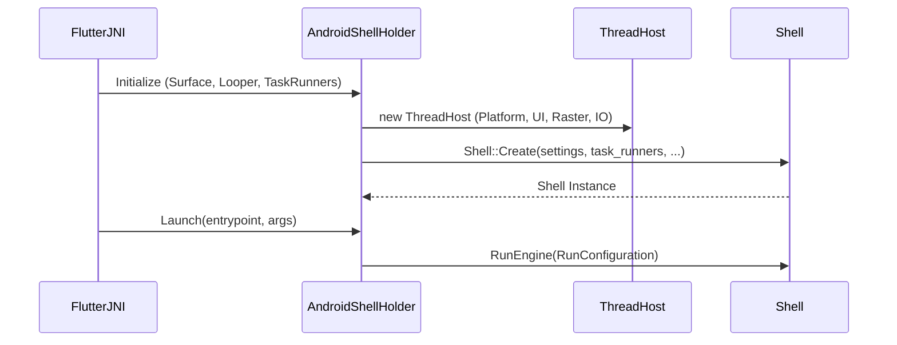
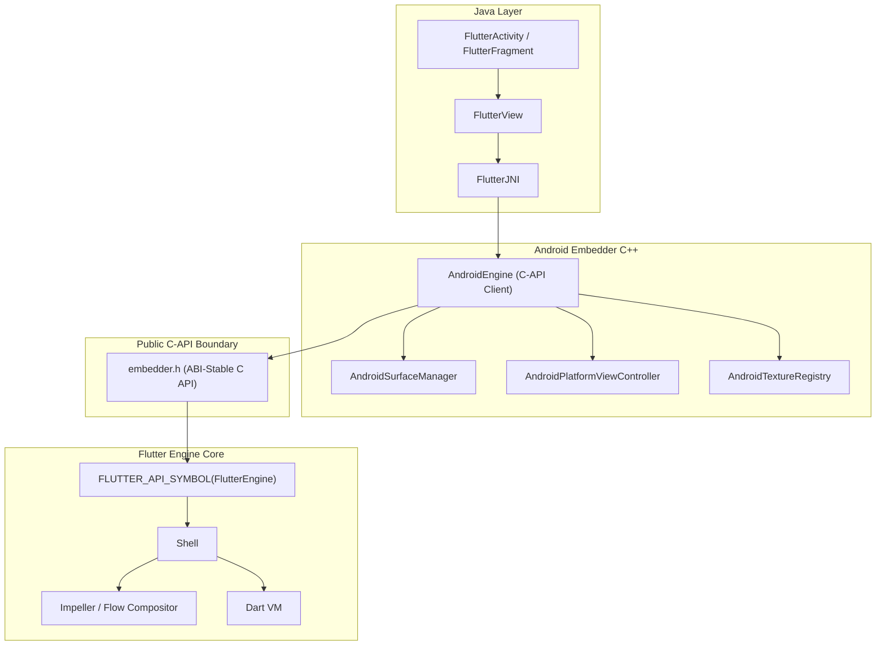
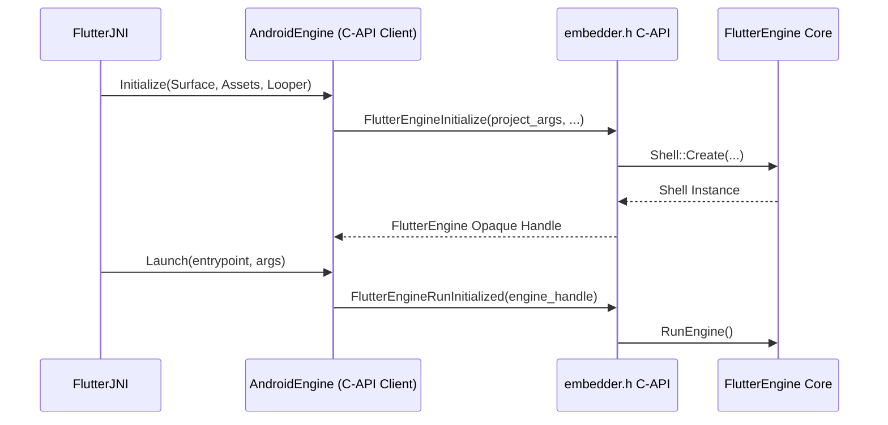
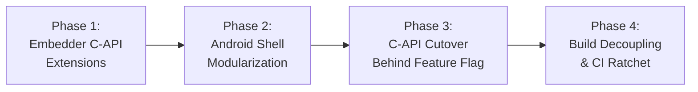
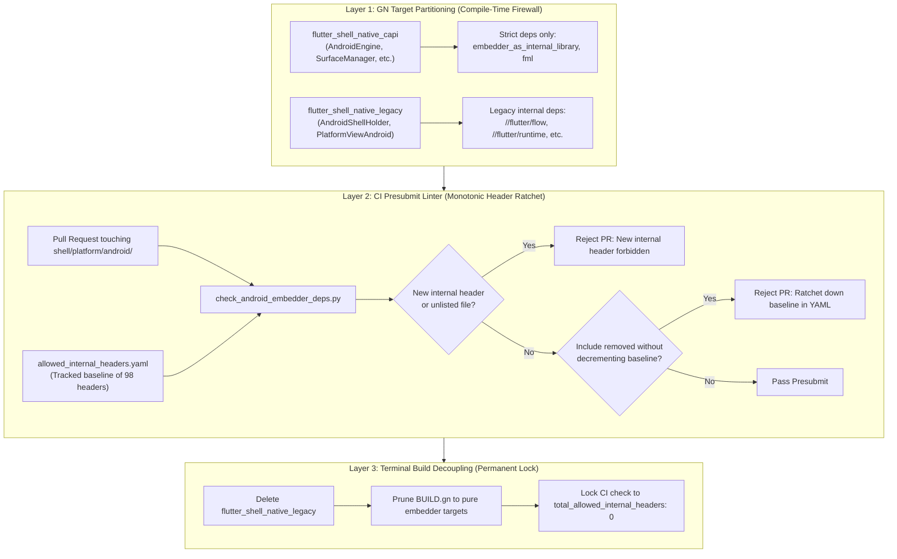

# RFC 410.0000: Flutter Android Embedder C-API Migration

## Executive Summary and Overview

This RFC proposes a phased, in-place migration of the Flutter Android embedder ([`engine/src/flutter/shell/platform/android/`](https://github.com/flutter/flutter/tree/4762dec4fc9072cd9269814ef36364f35a9a66dc/engine/src/flutter/shell/platform/android)) to the public Flutter Embedder C-API ([`embedder.h`](https://github.com/flutter/flutter/blob/4762dec4fc9072cd9269814ef36364f35a9a66dc/engine/src/flutter/shell/platform/embedder/embedder.h)).

Today, the Android embedder interacts directly with engine internals: it allocates task runners, instantiates [`flutter::Shell`](https://github.com/flutter/flutter/blob/4762dec4fc9072cd9269814ef36364f35a9a66dc/engine/src/flutter/shell/common/shell.h#L113), inspects internal graphics contexts, and manages platform view compositing via private `flow` headers. This coupling causes several problems:
- Internal engine refactors in Impeller, Flow, or the Dart runtime break the Android embedder.
- Compiling `libflutter.so` requires pulling internal engine translation units into the Android target.
- Third-party desktop and embedded platforms use [`embedder.h`](https://github.com/flutter/flutter/blob/4762dec4fc9072cd9269814ef36364f35a9a66dc/engine/src/flutter/shell/platform/embedder/embedder.h), while Flutter's primary mobile embedders do not. Because the Android embedder bypasses the public C-API, missing features in [`embedder.h`](https://github.com/flutter/flutter/blob/4762dec4fc9072cd9269814ef36364f35a9a66dc/engine/src/flutter/shell/platform/embedder/embedder.h) (such as dynamic thread merging, platform view mutators, and hardware buffer external textures) are not exercised by first-party code.

This document establishes the plan to decouple the Android embedder from engine internals.

### Strict Dependency Severance

The dependency graph of [`shell/platform/android/`](https://github.com/flutter/flutter/tree/4762dec4fc9072cd9269814ef36364f35a9a66dc/engine/src/flutter/shell/platform/android) in [`BUILD.gn`](https://github.com/flutter/flutter/blob/4762dec4fc9072cd9269814ef36364f35a9a66dc/engine/src/flutter/shell/platform/android/BUILD.gn) will be reduced strictly to:
- [`//flutter/shell/platform/embedder:embedder_as_internal_library`](https://github.com/flutter/flutter/blob/4762dec4fc9072cd9269814ef36364f35a9a66dc/engine/src/flutter/shell/platform/embedder/BUILD.gn#L75) (required)
- [`//flutter/fml`](https://github.com/flutter/flutter/tree/4762dec4fc9072cd9269814ef36364f35a9a66dc/engine/src/flutter/fml) (optional)
- [`//flutter/shell/platform/common`](https://github.com/flutter/flutter/tree/4762dec4fc9072cd9269814ef36364f35a9a66dc/engine/src/flutter/shell/platform/common) (optional)
- [`//flutter/third_party`](https://github.com/flutter/flutter/tree/4762dec4fc9072cd9269814ef36364f35a9a66dc/engine/src/flutter/third_party) (optional)

All direct dependencies on internal engine modules ([`//flutter/runtime`](https://github.com/flutter/flutter/tree/4762dec4fc9072cd9269814ef36364f35a9a66dc/engine/src/flutter/runtime), [`//flutter/flow`](https://github.com/flutter/flutter/tree/4762dec4fc9072cd9269814ef36364f35a9a66dc/engine/src/flutter/flow), [`//flutter/skia`](https://github.com/flutter/flutter/tree/4762dec4fc9072cd9269814ef36364f35a9a66dc/engine/src/flutter/skia), [`//flutter/impeller`](https://github.com/flutter/flutter/tree/4762dec4fc9072cd9269814ef36364f35a9a66dc/engine/src/flutter/impeller), [`//flutter/lib/ui`](https://github.com/flutter/flutter/tree/4762dec4fc9072cd9269814ef36364f35a9a66dc/engine/src/flutter/lib/ui), [`//flutter/txt`](https://github.com/flutter/flutter/tree/4762dec4fc9072cd9269814ef36364f35a9a66dc/engine/src/flutter/txt), and [`//flutter/assets`](https://github.com/flutter/flutter/tree/4762dec4fc9072cd9269814ef36364f35a9a66dc/engine/src/flutter/assets)) will be eliminated.

### Goals

- Establish an enforced architectural boundary between Java/JNI/Android C++ and the engine core.
- Reduce direct internal engine header inclusions in [`shell/platform/android/`](https://github.com/flutter/flutter/tree/4762dec4fc9072cd9269814ef36364f35a9a66dc/engine/src/flutter/shell/platform/android) from 98 to 0.
- Enable independent compilation and stable ABI boundaries for Android embeddings.
- Maintain 100% functional, performance, and accessibility parity across all supported Android API levels and rendering backends (Impeller Vulkan, Impeller OpenGL, and legacy Skia).

### Non-Goals

- Modifying the public Java/Kotlin Flutter Android API ([`io.flutter.embedding.android.*`](https://github.com/flutter/flutter/tree/4762dec4fc9072cd9269814ef36364f35a9a66dc/engine/src/flutter/shell/platform/android/io/flutter/embedding/android)).
- Repackaging or splitting `libflutter.so` into separate shared libraries (such as `libflutter_engine.so` and `libflutter_embedder.so`). Compilation remains unified within `libflutter.so` to avoid symbol export inflation, increased APK binary size, and runtime dynamic linker overhead on Android.

## Background and Problem Statement

The Android embedder is located in [`engine/src/flutter/shell/platform/android/`](https://github.com/flutter/flutter/tree/4762dec4fc9072cd9269814ef36364f35a9a66dc/engine/src/flutter/shell/platform/android). It does not use [`embedder.h`](https://github.com/flutter/flutter/blob/4762dec4fc9072cd9269814ef36364f35a9a66dc/engine/src/flutter/shell/platform/embedder/embedder.h). Instead, it is a customized implementation that interacts directly with core engine components.

### Current Production Architecture ([`flutter_shell_native`](https://github.com/flutter/flutter/blob/4762dec4fc9072cd9269814ef36364f35a9a66dc/engine/src/flutter/shell/platform/android/BUILD.gn#L75))

In the existing architecture, the Java embedding coordinates with native code through JNI interfaces, primarily [`FlutterJNI`](https://github.com/flutter/flutter/blob/4762dec4fc9072cd9269814ef36364f35a9a66dc/engine/src/flutter/shell/platform/android/io/flutter/embedding/engine/FlutterJNI.java#L108), [`PlatformViewAndroidJNI`](https://github.com/flutter/flutter/blob/4762dec4fc9072cd9269814ef36364f35a9a66dc/engine/src/flutter/shell/platform/android/jni/platform_view_android_jni.h#L38), and [`AndroidShellHolder`](https://github.com/flutter/flutter/blob/4762dec4fc9072cd9269814ef36364f35a9a66dc/engine/src/flutter/shell/platform/android/android_shell_holder.h#L38). When initializing the engine from the platform side, [`FlutterJNI.attachToNative()`](https://github.com/flutter/flutter/blob/4762dec4fc9072cd9269814ef36364f35a9a66dc/engine/src/flutter/shell/platform/android/io/flutter/embedding/engine/FlutterJNI.java#L433-L442) invokes native attachment via [`nativeAttach`](https://github.com/flutter/flutter/blob/4762dec4fc9072cd9269814ef36364f35a9a66dc/engine/src/flutter/shell/platform/android/io/flutter/embedding/engine/FlutterJNI.java#L449), which dispatches across the JNI registration table ([`RegisterApi`](https://github.com/flutter/flutter/blob/4762dec4fc9072cd9269814ef36364f35a9a66dc/engine/src/flutter/shell/platform/android/platform_view_android_jni_impl.cc#L754-L760)) into [`AttachJNI`](https://github.com/flutter/flutter/blob/4762dec4fc9072cd9269814ef36364f35a9a66dc/engine/src/flutter/shell/platform/android/platform_view_android_jni_impl.cc#L185-L197) to instantiate the shell holder:

```cpp
// Existing JNI attachment in shell/platform/android/platform_view_android_jni_impl.cc
static jlong AttachJNI(JNIEnv* env, jclass clazz, jobject flutterJNI) {
  fml::jni::JavaObjectWeakGlobalRef java_object(env, flutterJNI);
  std::shared_ptr<PlatformViewAndroidJNI> jni_facade =
      std::make_shared<PlatformViewAndroidJNIImpl>(java_object);
  auto shell_holder = std::make_unique<AndroidShellHolder>(
      FlutterMain::Get().GetSettings(), jni_facade,
      FlutterMain::Get().GetAndroidRenderingAPI());
  if (shell_holder->IsValid()) {
    return reinterpret_cast<jlong>(shell_holder.release());
  } else {
    return 0;
  }
}
```

[`AndroidShellHolder`](https://github.com/flutter/flutter/blob/4762dec4fc9072cd9269814ef36364f35a9a66dc/engine/src/flutter/shell/platform/android/android_shell_holder.h#L38) manages the lifecycle of the engine. It creates a [`flutter::ThreadHost`](https://github.com/flutter/flutter/blob/4762dec4fc9072cd9269814ef36364f35a9a66dc/engine/src/flutter/shell/common/thread_host.h#L21) on the [native side](https://github.com/flutter/flutter/blob/4762dec4fc9072cd9269814ef36364f35a9a66dc/engine/src/flutter/shell/platform/android/android_shell_holder.cc#L98-L113), instantiates a [`flutter::Shell`](https://github.com/flutter/flutter/blob/4762dec4fc9072cd9269814ef36364f35a9a66dc/engine/src/flutter/shell/common/shell.h#L113) object [directly](https://github.com/flutter/flutter/blob/4762dec4fc9072cd9269814ef36364f35a9a66dc/engine/src/flutter/shell/platform/android/android_shell_holder.cc#L158-L164) through [`flutter::Shell::Create(...)`](https://github.com/flutter/flutter/blob/4762dec4fc9072cd9269814ef36364f35a9a66dc/engine/src/flutter/shell/common/shell.h#L137), and [owns an instance](https://github.com/flutter/flutter/blob/4762dec4fc9072cd9269814ef36364f35a9a66dc/engine/src/flutter/shell/platform/android/android_shell_holder.cc#L117-L128) of [`PlatformViewAndroid`](https://github.com/flutter/flutter/blob/4762dec4fc9072cd9269814ef36364f35a9a66dc/engine/src/flutter/shell/platform/android/platform_view_android.h#L43):

```cpp
// Existing Shell and ThreadHost instantiation in shell/platform/android/android_shell_holder.cc
flutter::ThreadHost::ThreadHostConfig host_config(
    thread_label, mask, AndroidPlatformThreadConfigSetter);
// ...
thread_host_ = std::make_shared<ThreadHost>(host_config);

Shell::CreateCallback<PlatformView> on_create_platform_view =
    [&jni_facade, &weak_platform_view, rendering_api](Shell& shell) {
      auto platform_view_android = std::make_unique<PlatformViewAndroid>(
          shell, shell.GetTaskRunners(), jni_facade, rendering_api);
      weak_platform_view = platform_view_android->GetWeakPtr();
      return platform_view_android;
    };

Shell::CreateCallback<Rasterizer> on_create_rasterizer = [](Shell& shell) {
  return std::make_unique<Rasterizer>(shell);
};

shell_ = Shell::Create(GetDefaultPlatformData(),  // window data
                       task_runners,              // task runners
                       settings_,                 // settings
                       on_create_platform_view,   // platform view factory
                       on_create_rasterizer       // rasterizer factory
);
```

To start execution, [`FlutterJNI.runBundleAndSnapshotFromLibrary`](https://github.com/flutter/flutter/blob/4762dec4fc9072cd9269814ef36364f35a9a66dc/engine/src/flutter/shell/platform/android/io/flutter/embedding/engine/FlutterJNI.java#L1072-L1089) forwards to [`RunBundleAndSnapshotFromLibrary`](https://github.com/flutter/flutter/blob/4762dec4fc9072cd9269814ef36364f35a9a66dc/engine/src/flutter/shell/platform/android/platform_view_android_jni_impl.cc#L298-L318), calling [`AndroidShellHolder::Launch`](https://github.com/flutter/flutter/blob/4762dec4fc9072cd9269814ef36364f35a9a66dc/engine/src/flutter/shell/platform/android/android_shell_holder.cc#L287-L305) which instructs the shell to [run the engine](https://github.com/flutter/flutter/blob/4762dec4fc9072cd9269814ef36364f35a9a66dc/engine/src/flutter/shell/platform/android/android_shell_holder.cc#L304) with the resolved [`RunConfiguration`](https://github.com/flutter/flutter/blob/4762dec4fc9072cd9269814ef36364f35a9a66dc/engine/src/flutter/shell/common/run_configuration.h#L44).

[`PlatformViewAndroid`](https://github.com/flutter/flutter/blob/4762dec4fc9072cd9269814ef36364f35a9a66dc/engine/src/flutter/shell/platform/android/platform_view_android.h#L43) [subclasses the engine's internal `flutter::PlatformView` class](https://github.com/flutter/flutter/blob/4762dec4fc9072cd9269814ef36364f35a9a66dc/engine/src/flutter/shell/platform/android/platform_view_android.cc#L151-L160) (defined in [`platform_view.h`](https://github.com/flutter/flutter/blob/4762dec4fc9072cd9269814ef36364f35a9a66dc/engine/src/flutter/shell/common/platform_view.h#L51)):

```cpp
// Existing subclassing of internal engine PlatformView in shell/platform/android/platform_view_android.h
class PlatformViewAndroid final : public PlatformView {
 public:
  PlatformViewAndroid(PlatformView::Delegate& delegate,
                      const flutter::TaskRunners& task_runners,
                      const std::shared_ptr<PlatformViewAndroidJNI>& jni_facade,
                      AndroidRenderingAPI rendering_api);
  // ...
  void NotifyCreated(fml::RefPtr<AndroidNativeWindow> native_window);
  void NotifyDestroyed();
};
```

This inheritance allows Android to interact directly with internal classes such as [`flutter::Rasterizer`](https://github.com/flutter/flutter/blob/4762dec4fc9072cd9269814ef36364f35a9a66dc/engine/src/flutter/shell/common/rasterizer.h#L114) (created via [rasterizer factory callbacks](https://github.com/flutter/flutter/blob/4762dec4fc9072cd9269814ef36364f35a9a66dc/engine/src/flutter/shell/platform/android/android_shell_holder.cc#L130-L132)), [`flutter::Surface`](https://github.com/flutter/flutter/blob/4762dec4fc9072cd9269814ef36364f35a9a66dc/engine/src/flutter/flow/surface.h#L26) (created directly by [`PlatformViewAndroid::CreateRenderingSurface()`](https://github.com/flutter/flutter/blob/4762dec4fc9072cd9269814ef36364f35a9a66dc/engine/src/flutter/shell/platform/android/platform_view_android.cc#L426-L431)), [`flutter::TextureRegistry`](https://github.com/flutter/flutter/blob/4762dec4fc9072cd9269814ef36364f35a9a66dc/engine/src/flutter/common/graphics/texture.h#L68) (manipulated via [`PlatformViewAndroid::RegisterExternalTexture`](https://github.com/flutter/flutter/blob/4762dec4fc9072cd9269814ef36364f35a9a66dc/engine/src/flutter/shell/platform/android/platform_view_android.cc#L337-L380)), and [`flutter::MutatorsStack`](https://github.com/flutter/flutter/blob/4762dec4fc9072cd9269814ef36364f35a9a66dc/engine/src/flutter/flow/embedded_views.h#L211) (dispatched across JNI via [`PlatformViewAndroidJNIImpl::FlutterViewOnDisplayPlatformView`](https://github.com/flutter/flutter/blob/4762dec4fc9072cd9269814ef36364f35a9a66dc/engine/src/flutter/shell/platform/android/platform_view_android_jni_impl.cc#L1748-L1775)). In addition, window and surface lifecycle events flow from Android callbacks directly into [`PlatformViewAndroid`](https://github.com/flutter/flutter/blob/4762dec4fc9072cd9269814ef36364f35a9a66dc/engine/src/flutter/shell/platform/android/platform_view_android.cc#L184-L248): [`SurfaceCreated`](https://github.com/flutter/flutter/blob/4762dec4fc9072cd9269814ef36364f35a9a66dc/engine/src/flutter/shell/platform/android/platform_view_android_jni_impl.cc#L264-L269) calls [`NotifyCreated`](https://github.com/flutter/flutter/blob/4762dec4fc9072cd9269814ef36364f35a9a66dc/engine/src/flutter/shell/platform/android/platform_view_android.cc#L184-L219) to bind the native window with a synchronous waitable event latch:

```cpp
// Existing synchronous surface lifecycle blocking in shell/platform/android/platform_view_android.cc
void PlatformViewAndroid::NotifyCreated(
    fml::RefPtr<AndroidNativeWindow> native_window) {
  if (android_surface_) {
    InstallFirstFrameCallback();
    fml::AutoResetWaitableEvent latch;
    fml::TaskRunner::RunNowOrPostTask(
        task_runners_.GetRasterTaskRunner(),
        [&latch, surface = android_surface_.get(),
         native_window = std::move(native_window), jni_facade = jni_facade_]() {
          surface->SetNativeWindow(native_window, jni_facade);
          latch.Signal();
        });
    latch.Wait();
  }
  PlatformView::NotifyCreated();
}
```

Similarly, [`SurfaceChanged`](https://github.com/flutter/flutter/blob/4762dec4fc9072cd9269814ef36364f35a9a66dc/engine/src/flutter/shell/platform/android/platform_view_android_jni_impl.cc#L285-L292) triggers [`NotifyChanged`](https://github.com/flutter/flutter/blob/4762dec4fc9072cd9269814ef36364f35a9a66dc/engine/src/flutter/shell/platform/android/platform_view_android.cc#L236-L248) to resize the onscreen surface, and [`SurfaceDestroyed`](https://github.com/flutter/flutter/blob/4762dec4fc9072cd9269814ef36364f35a9a66dc/engine/src/flutter/shell/platform/android/platform_view_android_jni_impl.cc#L294-L296) triggers [`NotifyDestroyed`](https://github.com/flutter/flutter/blob/4762dec4fc9072cd9269814ef36364f35a9a66dc/engine/src/flutter/shell/platform/android/platform_view_android.cc#L221-L234) to tear down the raster surface context synchronously.




### Dependency Entanglement in [`BUILD.gn`](https://github.com/flutter/flutter/blob/4762dec4fc9072cd9269814ef36364f35a9a66dc/engine/src/flutter/shell/platform/android/BUILD.gn)

Because [`AndroidShellHolder`](https://github.com/flutter/flutter/blob/4762dec4fc9072cd9269814ef36364f35a9a66dc/engine/src/flutter/shell/platform/android/android_shell_holder.h#L38) and [`PlatformViewAndroid`](https://github.com/flutter/flutter/blob/4762dec4fc9072cd9269814ef36364f35a9a66dc/engine/src/flutter/shell/platform/android/platform_view_android.h#L43) reach directly into internal engine classes, [`flutter_shell_native_src`](https://github.com/flutter/flutter/blob/4762dec4fc9072cd9269814ef36364f35a9a66dc/engine/src/flutter/shell/platform/android/BUILD.gn#L95) in [`engine/src/flutter/shell/platform/android/BUILD.gn`](https://github.com/flutter/flutter/blob/4762dec4fc9072cd9269814ef36364f35a9a66dc/engine/src/flutter/shell/platform/android/BUILD.gn) depends on internal engine targets.

An audit of [`shell/platform/android/`](https://github.com/flutter/flutter/tree/4762dec4fc9072cd9269814ef36364f35a9a66dc/engine/src/flutter/shell/platform/android) reveals 98 internal engine headers included across Android shell files, categorized across 9 distinct subsystems:

| Subsystem & Headers | Direct GN Dependencies | Key Internal Headers | Functional Purpose in Embedder |
| :--- | :--- | :--- | :--- |
| **Impeller & Graphics Context Setup**<br/>(29 headers) | [`//flutter/impeller`](https://github.com/flutter/flutter/tree/4762dec4fc9072cd9269814ef36364f35a9a66dc/engine/src/flutter/impeller)<br/>[`//flutter/impeller/toolkit/android`](https://github.com/flutter/flutter/tree/4762dec4fc9072cd9269814ef36364f35a9a66dc/engine/src/flutter/impeller/toolkit/android)<br/>[`//flutter/impeller/toolkit/egl`](https://github.com/flutter/flutter/tree/4762dec4fc9072cd9269814ef36364f35a9a66dc/engine/src/flutter/impeller/toolkit/egl)<br/>[`//flutter/impeller/toolkit/gles`](https://github.com/flutter/flutter/tree/4762dec4fc9072cd9269814ef36364f35a9a66dc/engine/src/flutter/impeller/toolkit/gles)<br/>[`//flutter/impeller/toolkit/glvk`](https://github.com/flutter/flutter/tree/4762dec4fc9072cd9269814ef36364f35a9a66dc/engine/src/flutter/impeller/toolkit/glvk) | [`renderer/backend/vulkan/context_vk.h`](https://github.com/flutter/flutter/blob/4762dec4fc9072cd9269814ef36364f35a9a66dc/engine/src/flutter/impeller/renderer/backend/vulkan/context_vk.h)<br/>[`surface_context_vk.h`](https://github.com/flutter/flutter/blob/4762dec4fc9072cd9269814ef36364f35a9a66dc/engine/src/flutter/impeller/renderer/backend/vulkan/surface_context_vk.h)<br/>[`renderer/backend/gles/context_gles.h`](https://github.com/flutter/flutter/blob/4762dec4fc9072cd9269814ef36364f35a9a66dc/engine/src/flutter/impeller/renderer/backend/gles/context_gles.h)<br/>[`toolkit/android/hardware_buffer.h`](https://github.com/flutter/flutter/blob/4762dec4fc9072cd9269814ef36364f35a9a66dc/engine/src/flutter/impeller/toolkit/android/hardware_buffer.h)<br/>[`renderer/backend/vulkan/android/ahb_texture_source_vk.h`](https://github.com/flutter/flutter/blob/4762dec4fc9072cd9269814ef36364f35a9a66dc/engine/src/flutter/impeller/renderer/backend/vulkan/android/ahb_texture_source_vk.h) | Initializing rendering contexts on the raster thread ([`SetupImpellerContext`](https://github.com/flutter/flutter/blob/4762dec4fc9072cd9269814ef36364f35a9a66dc/engine/src/flutter/shell/platform/android/platform_view_android.h#L128)), creating Vulkan and EGL swapchains, and managing zero-copy [`AHardwareBuffer`](https://developer.android.com/ndk/reference/group/a-hardware-buffer) imports. |
| **Platform Views & Layer Compositing**<br/>(2 headers) | [`//flutter/flow`](https://github.com/flutter/flutter/tree/4762dec4fc9072cd9269814ef36364f35a9a66dc/engine/src/flutter/flow) | [`flow/embedded_views.h`](https://github.com/flutter/flutter/blob/4762dec4fc9072cd9269814ef36364f35a9a66dc/engine/src/flutter/flow/embedded_views.h)<br/>[`flow/surface.h`](https://github.com/flutter/flutter/blob/4762dec4fc9072cd9269814ef36364f35a9a66dc/engine/src/flutter/flow/surface.h) | Platform view compositing across Hybrid Composition++ (HCPP via [`SurfaceControl`](https://developer.android.com/reference/android/view/SurfaceControl)), Hybrid Composition (HC), Texture Layer Hybrid Composition (TLHC), and Virtual Displays (VD); managing geometric clipping and transforms via [`flutter::MutatorsStack`](https://github.com/flutter/flutter/blob/4762dec4fc9072cd9269814ef36364f35a9a66dc/engine/src/flutter/flow/embedded_views.h#L211), view slicing, surface pooling ([`surface_pool.h`](https://github.com/flutter/flutter/blob/4762dec4fc9072cd9269814ef36364f35a9a66dc/engine/src/flutter/shell/platform/android/external_view_embedder/surface_pool.h)), and multi-surface composition frame results ([`external_view_embedder_2.h`](https://github.com/flutter/flutter/blob/4762dec4fc9072cd9269814ef36364f35a9a66dc/engine/src/flutter/shell/platform/android/external_view_embedder/external_view_embedder_2.h)). |
| **External Textures & Surface Control**<br/>(5 headers) | [`//flutter/common/graphics`](https://github.com/flutter/flutter/tree/4762dec4fc9072cd9269814ef36364f35a9a66dc/engine/src/flutter/common/graphics)<br/>[`//flutter/display_list`](https://github.com/flutter/flutter/tree/4762dec4fc9072cd9269814ef36364f35a9a66dc/engine/src/flutter/display_list) | [`common/graphics/texture.h`](https://github.com/flutter/flutter/blob/4762dec4fc9072cd9269814ef36364f35a9a66dc/engine/src/flutter/common/graphics/texture.h)<br/>[`common/graphics/gl_context_switch.h`](https://github.com/flutter/flutter/blob/4762dec4fc9072cd9269814ef36364f35a9a66dc/engine/src/flutter/common/graphics/gl_context_switch.h)<br/>[`display_list/image/dl_image_skia.h`](https://github.com/flutter/flutter/blob/4762dec4fc9072cd9269814ef36364f35a9a66dc/engine/src/flutter/display_list/image/dl_image_skia.h)<br/>[`display_list/geometry/dl_geometry_types.h`](https://github.com/flutter/flutter/blob/4762dec4fc9072cd9269814ef36364f35a9a66dc/engine/src/flutter/display_list/geometry/dl_geometry_types.h) | Texture lifecycle and frame updates for Android [`SurfaceTexture`](https://developer.android.com/reference/android/graphics/SurfaceTexture) (OpenGL ES) and `SurfaceProducer` (Vulkan); feeding decoded video and camera frames into the [`DisplayList`](https://github.com/flutter/flutter/blob/4762dec4fc9072cd9269814ef36364f35a9a66dc/engine/src/flutter/display_list/display_list.h) compositor. |
| **Engine Core, Lifecycle & Threading**<br/>(11 headers) | [`//flutter/shell/common`](https://github.com/flutter/flutter/tree/4762dec4fc9072cd9269814ef36364f35a9a66dc/engine/src/flutter/shell/common) | [`shell/common/shell.h`](https://github.com/flutter/flutter/blob/4762dec4fc9072cd9269814ef36364f35a9a66dc/engine/src/flutter/shell/common/shell.h)<br/>[`thread_host.h`](https://github.com/flutter/flutter/blob/4762dec4fc9072cd9269814ef36364f35a9a66dc/engine/src/flutter/shell/common/thread_host.h)<br/>[`platform_view.h`](https://github.com/flutter/flutter/blob/4762dec4fc9072cd9269814ef36364f35a9a66dc/engine/src/flutter/shell/common/platform_view.h)<br/>[`rasterizer.h`](https://github.com/flutter/flutter/blob/4762dec4fc9072cd9269814ef36364f35a9a66dc/engine/src/flutter/shell/common/rasterizer.h)<br/>[`run_configuration.h`](https://github.com/flutter/flutter/blob/4762dec4fc9072cd9269814ef36364f35a9a66dc/engine/src/flutter/shell/common/run_configuration.h)<br/>[`vsync_waiter.h`](https://github.com/flutter/flutter/blob/4762dec4fc9072cd9269814ef36364f35a9a66dc/engine/src/flutter/shell/common/vsync_waiter.h)<br/>[`snapshot_surface_producer.h`](https://github.com/flutter/flutter/blob/4762dec4fc9072cd9269814ef36364f35a9a66dc/engine/src/flutter/shell/common/snapshot_surface_producer.h) | Direct instantiation of [`flutter::Shell::Create(...)`](https://github.com/flutter/flutter/blob/4762dec4fc9072cd9269814ef36364f35a9a66dc/engine/src/flutter/shell/common/shell.h#L137), thread host allocation (Platform, UI, Raster, IO), vsync scheduling, snapshot generation, and rasterizer coordination. |
| **UI Layer & Message Dispatch**<br/>(5 headers) | [`//flutter/lib/ui`](https://github.com/flutter/flutter/tree/4762dec4fc9072cd9269814ef36364f35a9a66dc/engine/src/flutter/lib/ui) | [`lib/ui/window/platform_message.h`](https://github.com/flutter/flutter/blob/4762dec4fc9072cd9269814ef36364f35a9a66dc/engine/src/flutter/lib/ui/window/platform_message.h)<br/>[`platform_message_response.h`](https://github.com/flutter/flutter/blob/4762dec4fc9072cd9269814ef36364f35a9a66dc/engine/src/flutter/lib/ui/window/platform_message_response.h)<br/>[`lib/ui/plugins/callback_cache.h`](https://github.com/flutter/flutter/blob/4762dec4fc9072cd9269814ef36364f35a9a66dc/engine/src/flutter/lib/ui/plugins/callback_cache.h)<br/>[`lib/ui/painting/image_generator.h`](https://github.com/flutter/flutter/blob/4762dec4fc9072cd9269814ef36364f35a9a66dc/engine/src/flutter/lib/ui/painting/image_generator.h) | Binary message encoding and decoding for platform channels, background Dart entrypoint lookup ([`PluginUtilities.getCallbackHandle`](https://github.com/flutter/flutter/blob/4762dec4fc9072cd9269814ef36364f35a9a66dc/engine/src/flutter/lib/ui/plugins.dart#L54) via [`callback_cache.h`](https://github.com/flutter/flutter/blob/4762dec4fc9072cd9269814ef36364f35a9a66dc/engine/src/flutter/lib/ui/plugins/callback_cache.h)), and native platform image decoding. |
| **Dart VM, Runtime & Service Isolate**<br/>(2 headers) | [`//flutter/runtime`](https://github.com/flutter/flutter/tree/4762dec4fc9072cd9269814ef36364f35a9a66dc/engine/src/flutter/runtime)<br/>[`//flutter/runtime:libdart`](https://github.com/flutter/flutter/blob/4762dec4fc9072cd9269814ef36364f35a9a66dc/engine/src/flutter/runtime/BUILD.gn) | [`runtime/dart_vm.h`](https://github.com/flutter/flutter/blob/4762dec4fc9072cd9269814ef36364f35a9a66dc/engine/src/flutter/runtime/dart_vm.h)<br/>[`runtime/dart_service_isolate.h`](https://github.com/flutter/flutter/blob/4762dec4fc9072cd9269814ef36364f35a9a66dc/engine/src/flutter/runtime/dart_service_isolate.h) | Managing the Dart VM lifecycle, configuring concurrent message loops, isolate creation, and Dart service isolate initialization. |
| **Asset Management & Packaging**<br/>(1 header) | [`//flutter/assets`](https://github.com/flutter/flutter/tree/4762dec4fc9072cd9269814ef36364f35a9a66dc/engine/src/flutter/assets) | [`assets/asset_resolver.h`](https://github.com/flutter/flutter/blob/4762dec4fc9072cd9269814ef36364f35a9a66dc/engine/src/flutter/assets/asset_resolver.h) | Resolving assets and kernel blobs packaged within the Android APK via [`APKAssetProvider`](https://github.com/flutter/flutter/blob/4762dec4fc9072cd9269814ef36364f35a9a66dc/engine/src/flutter/shell/platform/android/apk_asset_provider.h#L17). |
| **GPU Backends & Surface Delegates**<br/>(5 headers) | [`//flutter/shell/gpu`](https://github.com/flutter/flutter/tree/4762dec4fc9072cd9269814ef36364f35a9a66dc/engine/src/flutter/shell/gpu)<br/>[`//flutter/vulkan`](https://github.com/flutter/flutter/tree/4762dec4fc9072cd9269814ef36364f35a9a66dc/engine/src/flutter/vulkan) | [`shell/gpu/gpu_surface_gl_impeller.h`](https://github.com/flutter/flutter/blob/4762dec4fc9072cd9269814ef36364f35a9a66dc/engine/src/flutter/shell/gpu/gpu_surface_gl_impeller.h)<br/>[`gpu_surface_vulkan_impeller.h`](https://github.com/flutter/flutter/blob/4762dec4fc9072cd9269814ef36364f35a9a66dc/engine/src/flutter/shell/gpu/gpu_surface_vulkan_impeller.h)<br/>[`vulkan/vulkan_native_surface_android.h`](https://github.com/flutter/flutter/blob/4762dec4fc9072cd9269814ef36364f35a9a66dc/engine/src/flutter/vulkan/vulkan_native_surface_android.h) | Implementing platform window surface delegates for OpenGL and Vulkan render pipelines. |
| **Foundational Utilities & Concurrency**<br/>(24 headers) | [`//flutter/fml`](https://github.com/flutter/flutter/tree/4762dec4fc9072cd9269814ef36364f35a9a66dc/engine/src/flutter/fml) | [`fml/raster_thread_merger.h`](https://github.com/flutter/flutter/blob/4762dec4fc9072cd9269814ef36364f35a9a66dc/engine/src/flutter/fml/raster_thread_merger.h)<br/>[`fml/task_runner.h`](https://github.com/flutter/flutter/blob/4762dec4fc9072cd9269814ef36364f35a9a66dc/engine/src/flutter/fml/task_runner.h)<br/>[`fml/message_loop.h`](https://github.com/flutter/flutter/blob/4762dec4fc9072cd9269814ef36364f35a9a66dc/engine/src/flutter/fml/message_loop.h)<br/>[`fml/concurrent_message_loop.h`](https://github.com/flutter/flutter/blob/4762dec4fc9072cd9269814ef36364f35a9a66dc/engine/src/flutter/fml/concurrent_message_loop.h)<br/>[`fml/platform/android/jni_util.h`](https://github.com/flutter/flutter/blob/4762dec4fc9072cd9269814ef36364f35a9a66dc/engine/src/flutter/fml/platform/android/jni_util.h)<br/>[`fml/platform/android/scoped_java_ref.h`](https://github.com/flutter/flutter/blob/4762dec4fc9072cd9269814ef36364f35a9a66dc/engine/src/flutter/fml/platform/android/scoped_java_ref.h) | Message loops, JNI handle wrappers, task scheduling, and raster thread leasing. |

### Technical Consequences of Coupling

This level of coupling creates several concrete maintenance problems:
- Fragile refactoring: Any change to private engine internals (such as Impeller backend refactors or Flow mutator stack updates) breaks the Android embedder.
- Prolonged rebuild times: Compiling `libflutter.so` requires rebuilding internal engine translation units even when only platform-specific code changes.
- Lack of API contract: No stable boundary prevents Android embedder code from reaching into private engine internals, which inhibits engine modularization.

## Detailed Design

To allow the Android embedder to communicate with the engine exclusively through [`embedder.h`](https://github.com/flutter/flutter/blob/4762dec4fc9072cd9269814ef36364f35a9a66dc/engine/src/flutter/shell/platform/embedder/embedder.h), the C-API must be extended to cover Android-specific subsystem requirements. Each proposed extension corresponds directly to uncoupling one of the internal subsystems identified in the dependency audit and empowering a modular target architecture component (`AndroidEngine`, `AndroidSurfaceManager`, `AndroidPlatformViewController`, `AndroidTextureRegistry`, `AndroidAccessibilityBridge`, `AndroidTaskRunnerAdapter`, and `APKAssetProvider`).

### Graphics Surface Setup, Context Ownership, and Surface Lifecycle ([`SetupImpellerContext`](https://github.com/flutter/flutter/blob/4762dec4fc9072cd9269814ef36364f35a9a66dc/engine/src/flutter/shell/platform/android/platform_view_android.h#L128))

On Android, graphics context creation must be cleanly decoupled from window surface presentation. The embedder initializes or acquires the graphics context (such as Vulkan `VkInstance`, physical device, logical `VkDevice`, `VkQueue`, and Vulkan proc loaders, or EGL display, context, and config) prior to invoking `FlutterEngineInitialize`.

In the existing engine architecture, [`AndroidContextDynamicImpeller`](https://github.com/flutter/flutter/blob/4762dec4fc9072cd9269814ef36364f35a9a66dc/engine/src/flutter/shell/platform/android/android_context_dynamic_impeller.h#L23) defers the decision between Vulkan and OpenGL ES until [`GetImpellerContext`](https://github.com/flutter/flutter/blob/4762dec4fc9072cd9269814ef36364f35a9a66dc/engine/src/flutter/shell/platform/android/android_context_dynamic_impeller.cc#L162) is first called on the raster thread via [`SetupImpellerContext`](https://github.com/flutter/flutter/blob/4762dec4fc9072cd9269814ef36364f35a9a66dc/engine/src/flutter/shell/platform/android/platform_view_android.cc#L567-L570):

```cpp
// Existing deferred graphics resolution in shell/platform/android/android_context_dynamic_impeller.cc
void AndroidContextDynamicImpeller::SetupImpellerContext() {
  if (vk_context_ || gl_context_) {
    return;
  }
  vk_context_ = GetActualRenderingAPIForImpeller(android_get_device_api_level(),
                                                 settings_);
  if (!vk_context_) {
    gl_context_ = std::make_shared<AndroidContextGLImpeller>(
        std::make_unique<impeller::egl::Display>(),
        settings_.enable_gpu_tracing, io_task_runner_);
  }
}
```

Because `embedder.h` requires a concrete renderer configuration struct (`FlutterRendererConfig` selecting `kOpenGL` or `kVulkan`) at `FlutterEngineInitialize` time, backend resolution is performed during early embedder initialization (`FlutterLoader` and native context probe) before passing renderer pointers to the engine.

To configure raster-thread graphics state and resources, renderer configuration structs provide context setup callbacks:

```c
typedef struct {
  size_t struct_size;
  // Callback invoked on the raster thread to initialize OpenGL graphics state.
  VoidCallback setup_callback;
} FlutterOpenGLRendererConfig;

typedef struct {
  size_t struct_size;
  // Callback invoked on the raster thread to initialize Vulkan graphics state.
  VoidCallback setup_callback;
} FlutterVulkanRendererConfig;
```

[`embedder.h`](https://github.com/flutter/flutter/blob/4762dec4fc9072cd9269814ef36364f35a9a66dc/engine/src/flutter/shell/platform/embedder/embedder.h) also receives an API to construct a render target directly from a Vulkan backing store, matching Impeller Vulkan swapchain requirements. Window surface attachments ([`ANativeWindow`](https://developer.android.com/ndk/reference/group/a-native-window)) and swapchains are created and destroyed dynamically across Android [`Activity`](https://developer.android.com/reference/android/app/Activity) lifecycle events via `FlutterEngineNotifyCreated` and `FlutterEngineNotifyDestroyed` (see Renderer Availability and Lifecycle Signals) without destroying the underlying GPU context.

### Dynamic Raster Thread Merging (Legacy Hybrid Composition)

Android Hybrid Composition (HC) synchronizes native Android [`View`](https://developer.android.com/reference/android/view/View) widgets with Flutter layers. During frame rendering in legacy HC mode, native Android views update on the main platform thread. If Flutter continues rasterizing on a separate raster thread, thread contention and deadlocks can occur during surface redraws.

While modern Hybrid Composition++ (HCPP, see Hybrid Composition++ (HCPP) and SurfaceControl Compositing) bypasses thread merging through [`SurfaceControl`](https://developer.android.com/reference/android/view/SurfaceControl) transaction fences on Android 14+ (API level 34+), legacy Hybrid Composition remains required for earlier Android API levels under Skia. To prevent deadlocks in HC mode, Flutter dynamically merges the raster thread into the platform thread ([`fml::RasterThreadMerger`](https://github.com/flutter/flutter/blob/4762dec4fc9072cd9269814ef36364f35a9a66dc/engine/src/flutter/fml/raster_thread_merger.h#L31)). In the current architecture, [`AndroidExternalViewEmbedder::PostPrerollAction`](https://github.com/flutter/flutter/blob/4762dec4fc9072cd9269814ef36364f35a9a66dc/engine/src/flutter/shell/platform/android/external_view_embedder/external_view_embedder.cc#L188-L213) checks if the layer tree contains platform views and manages the lease term directly:

```cpp
// Existing thread leasing in shell/platform/android/external_view_embedder/external_view_embedder.cc
PostPrerollResult AndroidExternalViewEmbedder::PostPrerollAction(
    const fml::RefPtr<fml::RasterThreadMerger>& raster_thread_merger) {
  if (!FrameHasPlatformLayers()) {
    return PostPrerollResult::kSuccess;
  }
  if (!raster_thread_merger->IsMerged()) {
    CancelFrame();
    raster_thread_merger->MergeWithLease(kDefaultMergedLeaseDuration);
    return PostPrerollResult::kSkipAndRetryFrame;
  }
  raster_thread_merger->ExtendLeaseTo(kDefaultMergedLeaseDuration);
  if (previous_frame_view_count_ == 0) {
    return PostPrerollResult::kResubmitFrame;
  }
  return PostPrerollResult::kSuccess;
}
```

While merged, both platform tasks and raster work execute on the Android platform thread. Once the platform view interaction ceases, the threads unmerge. If Skia support is deprecated and dropped on Android prior to or concurrently with this migration, this dynamic thread merging C-API extension is omitted entirely (see Architectural Simplification Under Impeller-Only Constraints).

#### Empirical Characterization of Lease Dynamics

Characterization of [`RasterThreadMerger`](https://github.com/flutter/flutter/blob/4762dec4fc9072cd9269814ef36364f35a9a66dc/engine/src/flutter/fml/raster_thread_merger.h#L31) during scroll interactions with embedded platform views reveals two operating regimes:

1. **Steady-State Scroll Behavior**: While platform views remain visible in the viewport, every layer tree contains platform view layers. The embedder calls `ExtendLeaseTo(10)` on every frame (using a standard lease duration of 10 frames, which yields approximately 166 ms of hysteresis at a 60 Hz refresh rate). Each frame decrements the remaining lease count from 10 to 9, but the subsequent frame immediately resets the lease back to 10. While platform views remain visible, threads remain continuously merged with zero toggle flapping between merged and unmerged states.
2. **View Departure and Hysteresis**: When the viewport scrolls past the last platform view or the view is dismissed, subsequent frames contain no platform layers. The embedder halts lease extensions. Over the next 10 consecutive frames, the remaining lease count decrements on each frame (9, 8, ..., 0). On the 10th frame after view departure, the lease count reaches 0, `UnMergeNowIfLastOne()` executes, and the rasterizer transitions back to independent multi-threaded execution. This 10-frame lease term provides essential hysteresis, preventing transient gaps without platform layers (such as during dynamic view recycling or brief animations) from repeatedly merging and unmerging OS threads.

#### Interaction with Static Thread Merging

Flutter supports running with statically merged platform and UI or raster threads via `--merged-platform-ui-thread` or `kMergeAfterLaunch`. When task queues are statically merged:
- `RasterThreadMerger` lease operations (`MergeWithLease`, `ExtendLeaseTo`, `DecrementLease`, `UnMergeNowIfLastOne`) are safe no-ops.
- `FlutterRasterThreadMergerIsMerged` and `FlutterRasterThreadMergerIsOnPlatformThread` unconditionally return `true`.

Dynamic thread merging composes safely with static merging without requiring separate code branches.

#### C-ABI Specification

The public C-API previously lacked any mechanism to lease or release threads dynamically. [`embedder.h`](https://github.com/flutter/flutter/blob/4762dec4fc9072cd9269814ef36364f35a9a66dc/engine/src/flutter/shell/platform/embedder/embedder.h) is extended with an opaque thread merger handle and frame lifecycle callbacks:

```c
/// Opaque handle to the engine-owned raster thread merger.
/// Lifetime: Valid only for the duration of the callback to which it is passed.
/// Embedders must not store or retain this pointer across callback invocations.
typedef struct FlutterRasterThreadMerger* FlutterRasterThreadMergerRef;

/// Result returned from FlutterPostPrerollCallback to guide frame scheduling.
typedef enum {
  /// The frame may proceed to rasterization normally.
  kFlutterPostPrerollResultSuccess,
  /// The frame composition changed; resubmit the frame immediately.
  kFlutterPostPrerollResultResubmitFrame,
  /// Threads were merged; cancel current rasterization and retry on the merged thread.
  kFlutterPostPrerollResultSkipAndRetryFrame,
} FlutterPostPrerollResult;

/// Threading state provided to compositor lifecycle callbacks.
typedef struct {
  /// Size of this struct in bytes. Must be initialized to sizeof(FlutterFrameThreadingInfo).
  size_t struct_size;
  /// Handle to the raster thread merger. NULL if dynamic thread merging is not enabled
  /// or if task runners are statically merged.
  FlutterRasterThreadMergerRef thread_merger;
  /// True if the callback is executing on the platform task runner.
  bool is_on_platform_thread;
  /// Reserved for user context pointer.
  void* user_data;
} FlutterFrameThreadingInfo;

/// Callback invoked after scene preroll to allow the embedder to inspect composition
/// layers and request thread merging if platform views are present.
typedef FlutterPostPrerollResult (*FlutterPostPrerollCallback)(
    const FlutterFrameThreadingInfo* threading_info);

/// Callback invoked before and after rasterizing a compositor frame.
typedef void (*FlutterCompositorFrameCallback)(
    const FlutterFrameThreadingInfo* threading_info);
```

These hooks are incorporated directly into [`FlutterCompositor`](https://github.com/flutter/flutter/blob/4762dec4fc9072cd9269814ef36364f35a9a66dc/engine/src/flutter/shell/platform/embedder/embedder.h#L2322):

```c
  /// Declares whether this compositor supports dynamic merging of the raster
  /// and platform threads. Read once during FlutterEngineInitialize.
  /// If true, post_preroll_callback must also be provided.
  bool supports_dynamic_thread_merging;

  /// Invoked after preroll to determine if thread merging is needed.
  /// Required if supports_dynamic_thread_merging is true.
  FlutterPostPrerollCallback post_preroll_callback;

  /// Invoked prior to rasterizing the frame.
  FlutterCompositorFrameCallback begin_frame_callback;

  /// Invoked after completing frame rasterization and recycling surfaces.
  FlutterCompositorFrameCallback end_frame_callback;
```

Corresponding proc table additions provide thread lease control:

```c
/// Returns true if the raster and platform threads are currently merged.
FLUTTER_EXPORT
bool FlutterRasterThreadMergerIsMerged(
    FlutterRasterThreadMergerRef merger);

/// Returns true if caller is executing on the platform thread.
FLUTTER_EXPORT
bool FlutterRasterThreadMergerIsOnPlatformThread(
    FlutterRasterThreadMergerRef merger);

/// Merges the raster thread onto the platform thread with the specified lease term in frames.
FLUTTER_EXPORT
void FlutterRasterThreadMergerMergeWithLease(
    FlutterRasterThreadMergerRef merger,
    size_t lease_term_frames);

/// Extends the current merged lease to the specified frame count.
FLUTTER_EXPORT
void FlutterRasterThreadMergerExtendLeaseTo(
    FlutterRasterThreadMergerRef merger,
    size_t lease_term_frames);
```

#### Cross-Embedder Inertness and Validation Guarantees

The dynamic thread merging extensions maintain zero overhead and inert behavior across platforms:
- **Desktop Embedders (Linux, macOS, Windows)**: All existing embedders zero-initialize `FlutterCompositor`. Because `supports_dynamic_thread_merging` evaluates to `false` when zero-initialized, no `RasterThreadMerger` is allocated, and compositor frame execution proceeds without thread checks or overhead.
- **Fail-Fast Validation**: If an embedder declares `supports_dynamic_thread_merging = true` but fails to provide a `post_preroll_callback` pointer, [`FlutterEngineInitialize`](https://github.com/flutter/flutter/blob/4762dec4fc9072cd9269814ef36364f35a9a66dc/engine/src/flutter/shell/platform/embedder/embedder.h#L2970) immediately returns `kInvalidArguments` rather than falling back silently.

### External Textures (Zero-Copy Vulkan and OpenGL ES)

Android provides two distinct mechanisms for external textures:
- `SurfaceProducer`: A zero-copy pipeline that imports [`AHardwareBuffer`](https://developer.android.com/ndk/reference/group/a-hardware-buffer) handles directly into Vulkan (`VkImage`) or EGL (`EGLImage`).
- [`SurfaceTexture`](https://developer.android.com/reference/android/graphics/SurfaceTexture): A legacy OpenGL ES path where native frames render into a texture ID updated with [`SurfaceTexture.updateTexImage()`](https://developer.android.com/reference/android/graphics/SurfaceTexture#updateTexImage()).

The public Embedder API previously lacked an entry point for registering Vulkan-backed external images without depending on internal [`flutter::Texture`](https://github.com/flutter/flutter/blob/4762dec4fc9072cd9269814ef36364f35a9a66dc/engine/src/flutter/common/graphics/texture.h#L27) classes. [`embedder.h`](https://github.com/flutter/flutter/blob/4762dec4fc9072cd9269814ef36364f35a9a66dc/engine/src/flutter/shell/platform/embedder/embedder.h) receives direct Vulkan image registration:

```c
typedef struct {
  size_t struct_size;
  int64_t texture_id;
  uint32_t width;
  uint32_t height;
  uint32_t format;
  void* vk_image; // VkImage
  void* vk_device_memory; // VkDeviceMemory
} FlutterVulkanImageTextureConfig;

FLUTTER_EXPORT
FlutterEngineResult FlutterEngineRegisterVulkanImage(
    FLUTTER_API_SYMBOL(FlutterEngine) engine,
    const FlutterVulkanImageTextureConfig* config);
```

For legacy [`SurfaceTexture`](https://developer.android.com/reference/android/graphics/SurfaceTexture) instances, the existing [`FlutterEngineRegisterExternalTexture`](https://github.com/flutter/flutter/blob/4762dec4fc9072cd9269814ef36364f35a9a66dc/engine/src/flutter/shell/platform/embedder/embedder.h#L3227) API with `kFlutterExternalTextureTypeOpenGL` is used. However, the existing [`FlutterOpenGLTexture`](https://github.com/flutter/flutter/blob/4762dec4fc9072cd9269814ef36364f35a9a66dc/engine/src/flutter/shell/platform/embedder/embedder.h#L1121) struct only specifies target, name, format, and dimensions; it lacks a UV coordinate transformation matrix. On Android, [`SurfaceTexture.getTransformMatrix()`](https://developer.android.com/reference/android/graphics/SurfaceTexture#getTransformMatrix(float[])) provides a 4x4 matrix accounting for camera sensor rotation, video decoder padding, and coordinate inversion. In the existing architecture, [`SurfaceTextureExternalTexture::Update()`](https://github.com/flutter/flutter/blob/4762dec4fc9072cd9269814ef36364f35a9a66dc/engine/src/flutter/shell/platform/android/surface_texture_external_texture.cc#L134-L143) queries this matrix through [`PlatformViewAndroidJNIImpl::SurfaceTextureGetTransformMatrix`](https://github.com/flutter/flutter/blob/4762dec4fc9072cd9269814ef36364f35a9a66dc/engine/src/flutter/shell/platform/android/platform_view_android_jni_impl.cc#L1626-L1645) and returns an [`SkM44`](https://github.com/flutter/flutter/blob/4762dec4fc9072cd9269814ef36364f35a9a66dc/engine/src/flutter/third_party/skia/include/core/SkM44.h) matrix directly:

```cpp
// Existing UV transformation querying in shell/platform/android/surface_texture_external_texture.cc
void SurfaceTextureExternalTexture::Update() {
  jni_facade_->SurfaceTextureUpdateTexImage(
      fml::jni::ScopedJavaLocalRef<jobject>(surface_texture_));
  transform_ = jni_facade_->SurfaceTextureGetTransformMatrix(
      fml::jni::ScopedJavaLocalRef<jobject>(surface_texture_));
}

const SkM44& SurfaceTextureExternalTexture::GetCurrentUVTransformation() const {
  return transform_;
}
```

Without this matrix, external video and camera frames render inverted or distorted.

To resolve this gap, [`embedder.h`](https://github.com/flutter/flutter/blob/4762dec4fc9072cd9269814ef36364f35a9a66dc/engine/src/flutter/shell/platform/embedder/embedder.h) introduces `FlutterOpenGLTexture2`:

```c
typedef struct {
  size_t struct_size;
  uint32_t target;
  uint32_t name;
  uint32_t format;
  void* user_data;
  VoidCallback destruction_callback;
  uint32_t width;
  uint32_t height;
  FlutterTransformation uv_transform;
} FlutterOpenGLTexture2;
```

Under OpenGL ES, platform view compositing also faces constraints: because [`SurfaceControl`](https://developer.android.com/reference/android/view/SurfaceControl) transaction sync fences depend on Vulkan hardware synchronization, OpenGL platform views must use Texture Layer Hybrid Composition (TLHC) or legacy Hybrid Composition rather than HCPP.

### Platform View Mutator Stack Serialization

Platform views embedded within Flutter require transformations, opacities, and clips (axis-aligned rectangles, rounded rectangles, and arbitrary vector paths) across all Android composition modes (HCPP, HC, and TLHC).

Internally, these operations are managed by [`flutter::MutatorsStack`](https://github.com/flutter/flutter/blob/4762dec4fc9072cd9269814ef36364f35a9a66dc/engine/src/flutter/flow/embedded_views.h#L211) in [`flow/embedded_views.h`](https://github.com/flutter/flutter/blob/4762dec4fc9072cd9269814ef36364f35a9a66dc/engine/src/flutter/flow/embedded_views.h). Because `flow` and `SkPath` headers cannot cross the C-API boundary, mutators must be serialized into an ABI-stable array of C structs:

```c
typedef enum {
  kFlutterPlatformViewMutationTypeClipRect,
  kFlutterPlatformViewMutationTypeClipRRect,
  kFlutterPlatformViewMutationTypeClipPath,
  kFlutterPlatformViewMutationTypeTransform,
  kFlutterPlatformViewMutationTypeOpacity,
} FlutterPlatformViewMutationType;

typedef struct {
  FlutterPlatformViewMutationType type;
  union {
    FlutterRect clip_rect;
    FlutterRoundedRect clip_rrect;
    struct {
      const FlutterPoint* points;
      const uint8_t* verbs;
      size_t count;
    } clip_path;
    FlutterTransformation transform;
    double opacity;
  };
} FlutterPlatformViewMutation;

typedef struct {
  size_t struct_size;
  int64_t view_id;
  const FlutterPlatformViewMutation* mutations;
  size_t mutation_count;
} FlutterPlatformViewMutationStack;
```

Platform view display callbacks in `FlutterPlatformViewRendererConfig` accept this serialized mutation stack to perform complete geometric rendering without engine internal dependencies.

### Accessibility and Semantics Parity (`Semantics2`)

Android's [`AccessibilityBridge`](https://github.com/flutter/flutter/blob/4762dec4fc9072cd9269814ef36364f35a9a66dc/engine/src/flutter/shell/platform/android/io/flutter/view/AccessibilityBridge.java#L80) requires semantics metadata that was absent in the original [`FlutterSemanticsNode`](https://github.com/flutter/flutter/blob/4762dec4fc9072cd9269814ef36364f35a9a66dc/engine/src/flutter/shell/platform/embedder/embedder.h#L1599) struct, including `maxValueLength`, `currentValueLength`, `linkUrl`, `locale`, `minValue`, `maxValue`, `identifier`, `traversalParent`, `hitTestTransform`, and `role`.

To maintain accessibility parity on Android without breaking existing desktop embedders, [`embedder.h`](https://github.com/flutter/flutter/blob/4762dec4fc9072cd9269814ef36364f35a9a66dc/engine/src/flutter/shell/platform/embedder/embedder.h) receives `FlutterSemanticsNode2` and `FlutterSemanticsUpdate2`:

```c
typedef struct {
  size_t struct_size;
  int32_t id;
  FlutterSemanticsFlags flags;
  FlutterSemanticsActions actions;
  int32_t text_selection_base;
  int32_t text_selection_extent;
  int32_t scroll_children;
  int32_t scroll_index;
  double scroll_position;
  double scroll_extent_max;
  double scroll_extent_min;
  double elevation;
  double thickness;
  const char* label;
  const char* hint;
  const char* value;
  const char* increased_value;
  const char* decreased_value;
  const char* tooltip;
  int32_t max_value_length;
  int32_t current_value_length;
  const char* link_url;
  const char* locale;
  double min_value;
  double max_value;
  const char* identifier;
  int32_t traversal_parent;
  FlutterRect rect;
  FlutterTransformation transform;
  FlutterTransformation hit_test_transform;
} FlutterSemanticsNode2;

typedef struct {
  size_t struct_size;
  size_t node_count;
  const FlutterSemanticsNode2** nodes;
  size_t custom_action_count;
  const FlutterSemanticsCustomAction** custom_actions;
} FlutterSemanticsUpdate2;

FLUTTER_EXPORT
FlutterEngineResult FlutterEngineUpdateSemantics2(
    FLUTTER_API_SYMBOL(FlutterEngine) engine,
    const FlutterSemanticsUpdate2* update);
```

### Dart Deferred Library Loading

Android supports dynamic delivery through Google Play Feature Delivery / split APKs. When Dart code requests a deferred library via `deferred as`, the embedder must download or extract the split APK and load the compiled snapshot into the running isolate.

Currently, this is handled through private calls across JNI in [`LoadDartDeferredLibrary`](https://github.com/flutter/flutter/blob/4762dec4fc9072cd9269814ef36364f35a9a66dc/engine/src/flutter/shell/platform/android/platform_view_android_jni_impl.cc#L701-L735) into [`PlatformViewAndroid::LoadDartDeferredLibrary`](https://github.com/flutter/flutter/blob/4762dec4fc9072cd9269814ef36364f35a9a66dc/engine/src/flutter/shell/platform/android/platform_view_android.cc#L508-L514):

```cpp
// Existing JNI deferred loading invocation in shell/platform/android/platform_view_android_jni_impl.cc
static void LoadDartDeferredLibrary(JNIEnv* env,
                                    jobject obj,
                                    jlong shell_holder,
                                    jint jLoadingUnitId,
                                    jobjectArray jSearchPaths) {
  // ... resolve symbols data_mapping and instructions_mapping via dlopen ...
  ANDROID_SHELL_HOLDER->GetPlatformView()->LoadDartDeferredLibrary(
      loading_unit_id, std::move(data_mapping),
      std::move(instructions_mapping));
}
```

[`embedder.h`](https://github.com/flutter/flutter/blob/4762dec4fc9072cd9269814ef36364f35a9a66dc/engine/src/flutter/shell/platform/embedder/embedder.h) is extended with callbacks and entry points mirroring the Dart SDK deferred loading API:

```c
typedef size_t (*FlutterRequestDartDeferredLibraryCallback)(
    intptr_t loading_unit_id,
    void* user_data);

typedef struct {
  size_t struct_size;
  intptr_t loading_unit_id;
  const uint8_t* isolate_snapshot_data;
  size_t isolate_snapshot_data_size;
  const uint8_t* snapshot_instructions;
  size_t isolate_snapshot_instructions_size;
} FlutterLoadDeferredLibraryInfo;

FLUTTER_EXPORT
FlutterEngineResult FlutterEngineLoadDartDeferredLibrary(
    FLUTTER_API_SYMBOL(FlutterEngine) engine,
    const FlutterLoadDeferredLibraryInfo* load_info);

typedef struct {
  size_t struct_size;
  intptr_t loading_unit_id;
  const char* error_message;
  bool transient;
} FlutterLoadDeferredLibraryErrorInfo;

FLUTTER_EXPORT
FlutterEngineResult FlutterEngineLoadDartDeferredLibraryError(
    FLUTTER_API_SYMBOL(FlutterEngine) engine,
    const FlutterLoadDeferredLibraryErrorInfo* error_info);
```

### Custom Asset and Kernel Resolution (APK / In-Memory Mapping)

Desktop embedders load assets from loose files in a filesystem directory passed to [`FlutterProjectArgs.assets_path`](https://github.com/flutter/flutter/blob/4762dec4fc9072cd9269814ef36364f35a9a66dc/engine/src/flutter/shell/platform/embedder/embedder.h#L2519). On Android, assets are packaged inside APK or AAB archives and accessed through the NDK [`AAssetManager`](https://developer.android.com/ndk/reference/group/asset) via [`APKAssetProvider`](https://github.com/flutter/flutter/blob/4762dec4fc9072cd9269814ef36364f35a9a66dc/engine/src/flutter/shell/platform/android/apk_asset_provider.h#L26), which subclasses the internal engine [`AssetResolver`](https://github.com/flutter/flutter/blob/4762dec4fc9072cd9269814ef36364f35a9a66dc/engine/src/flutter/assets/asset_resolver.h#L23):

```cpp
// Existing internal AssetResolver inheritance in shell/platform/android/apk_asset_provider.h
class APKAssetProvider final : public AssetResolver {
 public:
  explicit APKAssetProvider(JNIEnv* env,
                            jobject assetManager,
                            std::string directory);
  std::unique_ptr<APKAssetProvider> Clone() const;
};
```

Passing file paths would require extracting all assets to disk during startup, which causes latency and disk consumption.

[`embedder.h`](https://github.com/flutter/flutter/blob/4762dec4fc9072cd9269814ef36364f35a9a66dc/engine/src/flutter/shell/platform/embedder/embedder.h) receives an asset resolver callback interface that maps assets into memory directly from the APK archive:

```c
typedef enum {
  kFlutterAssetResolverResultNotFound = 0,
  kFlutterAssetResolverResultFound = 1,
  kFlutterAssetResolverResultError = 2,
} FlutterAssetResolverResult;

typedef struct {
  size_t struct_size;
  void* user_data;
  const uint8_t* (*get_data)(void* user_data);
  size_t (*get_size)(void* user_data);
  void (*destruction_callback)(void* user_data);
} FlutterAssetMapping;

typedef FlutterAssetResolverResult (*FlutterAssetResolverGetAsMappingCallback)(
    const char* asset_name,
    FlutterAssetMapping* mapping_out,
    void* user_data);

typedef struct {
  size_t struct_size;
  void* user_data;
  const char* resolver_name;
  FlutterAssetResolverGetAsMappingCallback get_as_mapping_callback;
  // Indicates if the resolver remains valid after the underlying Android
  // AAssetManager instance changes or is recreated.
  bool is_valid_after_asset_manager_change;
} FlutterAssetResolver;

FLUTTER_EXPORT
FlutterEngineResult FlutterEngineUpdateAssetResolver(
    FLUTTER_API_SYMBOL(FlutterEngine) engine,
    const FlutterAssetResolver* resolver);
```

An array of `FlutterAssetResolver` pointers passes into [`FlutterProjectArgs.custom_asset_resolvers`](https://github.com/flutter/flutter/blob/4762dec4fc9072cd9269814ef36364f35a9a66dc/engine/src/flutter/shell/platform/embedder/embedder.h) so that the engine streams assets directly from the APK. During hot restart, the engine calls `UpdateAssetResolverByType` to reload asset manifests and updated Dart bytecode bundles without restarting the native engine instance. `FlutterEngineUpdateAssetResolver` allows the embedder to refresh or replace registered resolvers at runtime.

### Multi-Engine Spawning and Add-to-App (`FlutterEngineSpawn`)

Android Add-to-App architectures rely on `FlutterEngineGroup` to spawn lightweight engines that share the Dart VM, isolate group, and shared cache. In the existing architecture, [`AndroidShellHolder::Spawn`](https://github.com/flutter/flutter/blob/4762dec4fc9072cd9269814ef36364f35a9a66dc/engine/src/flutter/shell/platform/android/android_shell_holder.cc#L240-L285) reaches directly into [`shell_->Spawn(...)`](https://github.com/flutter/flutter/blob/4762dec4fc9072cd9269814ef36364f35a9a66dc/engine/src/flutter/shell/common/shell.h#L248):

```cpp
// Existing spawning in shell/platform/android/android_shell_holder.cc
std::unique_ptr<flutter::Shell> shell =
    shell_->Spawn(std::move(config.value()), initial_route,
                  on_create_platform_view, on_create_rasterizer);

return std::unique_ptr<AndroidShellHolder>(new AndroidShellHolder(
    GetSettings(), jni_facade, thread_host_, std::move(shell),
    apk_asset_provider_->Clone(), weak_platform_view,
    android_context->RenderingApi()));
```

The public C-API lacked a spawn API, which prevented multi-engine groups from operating without internal `Shell` methods. [`embedder.h`](https://github.com/flutter/flutter/blob/4762dec4fc9072cd9269814ef36364f35a9a66dc/engine/src/flutter/shell/platform/embedder/embedder.h) receives `FlutterEngineSpawn`:

```c
typedef struct {
  size_t struct_size;
  const char* entrypoint;
  const char* library_uri;
  const char* initial_route;
  const char* const* entrypoint_argv;
  int entrypoint_argc;
  void* user_data;
} FlutterEngineSpawnConfig;

FLUTTER_EXPORT
FlutterEngineResult FlutterEngineSpawn(
    FLUTTER_API_SYMBOL(FlutterEngine) parent_engine,
    const FlutterEngineSpawnConfig* config,
    FLUTTER_API_SYMBOL(FlutterEngine)* spawned_engine_out);
```

The `FlutterEngineSpawnConfig` struct uses the info struct pattern (`struct_size`) to maintain forward ABI compatibility. The `initial_route` parameter matches `Shell::Spawn` and `AndroidShellHolder::Spawn` so that spawned isolates mount distinct route hierarchies immediately upon launch.

Spawned shells share the parent engine's `AndroidContext` / Impeller device context (Vulkan instance, physical device, logical device, queue handles, pipeline cache, and texture pools) in addition to sharing the Dart VM and root isolate group. This sharing avoids driver re-initialization and eliminates pipeline compilation spikes when creating secondary Flutter views in Add-to-App configurations.

### Renderer Availability and Lifecycle Signals

Android window surfaces are created and destroyed dynamically by the operating system during [`Activity`](https://developer.android.com/reference/android/app/Activity) transitions, configuration changes, or backgrounding. The embedder must coordinate surface availability and GPU context lifecycle without calling protected methods on `PlatformView`.

#### Orthogonality of Configuration and Availability

A central design principle of the C-API architecture is that renderer configuration and surface availability represent orthogonal axes:
- **Static Renderer Configuration**: The GPU instance, physical device, logical device, queue handles (Vulkan), or EGL display, context, and configurations persist throughout the engine's lifetime inside `FlutterRendererConfig`.
- **Dynamic Surface Attachment**: Window presentation targets ([`ANativeWindow`](https://developer.android.com/ndk/reference/group/a-native-window)) attach and detach dynamically across Android [`Activity`](https://developer.android.com/reference/android/app/Activity) lifecycle events.
- **Dynamic GPU Execution Switch**: Process permission to submit commands to the GPU driver toggles between foreground and background states to satisfy OS process management policies.

Attempting to recreate the entire `FlutterRendererConfig` during window lifecycle changes introduces severe driver overhead and destroys pipeline caches. Instead, [`embedder.h`](https://github.com/flutter/flutter/blob/4762dec4fc9072cd9269814ef36364f35a9a66dc/engine/src/flutter/shell/platform/embedder/embedder.h) decouples static configuration from dynamic surface availability:

```c
/// GPU availability states for FlutterEngineSetGpuAvailability.
typedef enum {
  /// GPU operations permitted. Rasterizer executes normally.
  kFlutterGpuAvailabilityAvailable = 0,
  /// Intermediate backgrounding state: synchronously flushes pending command
  /// queues, drains resource deletions on the IO task runner, and marks the
  /// GPU unavailable before process suspension.
  kFlutterGpuAvailabilityFlushAndMakeUnavailable = 1,
  /// Blocks raster thread from submitting commands to the GPU driver.
  kFlutterGpuAvailabilityUnavailable = 2,
} FlutterGpuAvailability;

FLUTTER_EXPORT
FlutterEngineResult FlutterEngineNotifyCreated(
    FLUTTER_API_SYMBOL(FlutterEngine) engine);

FLUTTER_EXPORT
FlutterEngineResult FlutterEngineNotifyDestroyed(
    FLUTTER_API_SYMBOL(FlutterEngine) engine);

FLUTTER_EXPORT
FlutterEngineResult FlutterEngineSetGpuAvailability(
    FLUTTER_API_SYMBOL(FlutterEngine) engine,
    FlutterGpuAvailability availability);
```

#### Lifecycle Mapping and Synchronous Destruction Contract

These entry points map to Android [`SurfaceHolder.Callback`](https://developer.android.com/reference/android/view/SurfaceHolder.Callback) and [`Activity`](https://developer.android.com/reference/android/app/Activity) lifecycle events:
- [`surfaceCreated`](https://developer.android.com/reference/android/view/SurfaceHolder.Callback#surfaceCreated(android.view.SurfaceHolder)): The embedder binds the native window ([`ANativeWindow`](https://developer.android.com/ndk/reference/group/a-native-window)) and calls `FlutterEngineNotifyCreated` to allocate swapchains and resume rendering.
- [`surfaceChanged`](https://developer.android.com/reference/android/view/SurfaceHolder.Callback#surfaceChanged(android.view.SurfaceHolder,%20int,%20int,%20int)): The embedder transmits physical dimension and scale changes to the engine via `FlutterEngineSendWindowMetricsEvent`.
- [`surfaceDestroyed`](https://developer.android.com/reference/android/view/SurfaceHolder.Callback#surfaceDestroyed(android.view.SurfaceHolder)): **Hard Synchronous Contract**. The embedder calls `FlutterEngineNotifyDestroyed`. The engine flushes pending rasterization workloads, tears down on-screen swapchains, drains pending resource deletions on the IO thread, and releases native window references synchronously before [`surfaceDestroyed()`](https://developer.android.com/reference/android/view/SurfaceHolder.Callback#surfaceDestroyed(android.view.SurfaceHolder)) returns to the Android OS. This prevents `SIGSEGV` or `EGL_BAD_NATIVE_WINDOW` errors caused by subsequent rasterization attempts on invalidated window handles.
- [`Activity`](https://developer.android.com/reference/android/app/Activity) [`onStop`](https://developer.android.com/reference/android/app/Activity#onStop()) / [`onStart`](https://developer.android.com/reference/android/app/Activity#onStart()): When an application is backgrounded, the OS may reclaim volatile GPU allocations. The embedder invokes `FlutterEngineSetGpuAvailability(engine, kFlutterGpuAvailabilityFlushAndMakeUnavailable)` followed by `kFlutterGpuAvailabilityUnavailable` to drain command buffers and suspend raster tasks without terminating the engine or tearing down isolate groups. When the [`Activity`](https://developer.android.com/reference/android/app/Activity) returns to the foreground, `FlutterEngineSetGpuAvailability(engine, kFlutterGpuAvailabilityAvailable)` restores raster scheduling.

#### Cross-Platform Alignment with iOS

This lifecycle mechanism establishes direct parity with the iOS engine backgrounding contract in [`shell/platform/darwin/ios/framework/Source/FlutterEngine.mm`](https://github.com/flutter/flutter/blob/4762dec4fc9072cd9269814ef36364f35a9a66dc/engine/src/flutter/shell/platform/darwin/ios/framework/Source/FlutterEngine.mm#L857) and [`Shell::SetGpuAvailability`](https://github.com/flutter/flutter/blob/4762dec4fc9072cd9269814ef36364f35a9a66dc/engine/src/flutter/shell/common/shell.h#L64):
- On iOS, submitting GPU commands while in the background triggers fatal OS process termination (Jetsam `0x8badf00d`). iOS calls `SetGpuAvailability(kFlushAndMakeUnavailable)` upon backgrounding to flush pending work and prevent crashes.
- On Android, attempting GPU operations after window detachment risks driver timeouts (`VK_ERROR_DEVICE_LOST`) or memory corruption when the OS evicts application GPU memory.
- `FlutterEngineSetGpuAvailability` provides a unified, cross-platform C-API abstraction that satisfies both Android and iOS operational requirements.

### Hybrid Composition++ (HCPP) and SurfaceControl Compositing

Starting with Android 14 (API level 34), Flutter supports Hybrid Composition++ (HCPP) under the Impeller Vulkan backend ([`shell/platform/android/external_view_embedder/external_view_embedder_2.h`](https://github.com/flutter/flutter/blob/4762dec4fc9072cd9269814ef36364f35a9a66dc/engine/src/flutter/shell/platform/android/external_view_embedder/external_view_embedder_2.h)).

Unlike legacy Hybrid Composition (see Dynamic Raster Thread Merging), which merges the raster thread into the platform thread to avoid synchronization deadlocks, HCPP delegates layer compositing directly to Android's OS window compositor ([`SurfaceFlinger`](https://source.android.com/docs/core/graphics/surfaceflinger-windowmanager)) using [`SurfaceControl`](https://developer.android.com/reference/android/view/SurfaceControl) and [`SurfaceControl.Transaction`](https://developer.android.com/reference/android/view/SurfaceControl.Transaction):
- **Independent Thread Execution**: Flutter rasterization and Android [`View`](https://developer.android.com/reference/android/view/View) updates execute asynchronously on separate threads without thread leasing or merging overhead.
- **Hierarchical Surface Tree**: The embedder arranges the base Flutter surface, native platform views, and Flutter overlay slices into a tree of [`SurfaceControl`](https://developer.android.com/reference/android/view/SurfaceControl) nodes.
- **Hardware Fence Synchronization**: Visual synchronization occurs at the GPU level via hardware sync fences ([`ASyncFence`](https://developer.android.com/ndk/reference/group/sync) / Vulkan binary semaphores) passed through [`SurfaceControl.Transaction`](https://developer.android.com/reference/android/view/SurfaceControl.Transaction) commits to deliver zero-latency touch responses and prevent frame tearing.

To support HCPP through [`embedder.h`](https://github.com/flutter/flutter/blob/4762dec4fc9072cd9269814ef36364f35a9a66dc/engine/src/flutter/shell/platform/embedder/embedder.h), the public C-API provides multi-layer compositing primitives through [`FlutterCompositor`](https://github.com/flutter/flutter/blob/4762dec4fc9072cd9269814ef36364f35a9a66dc/engine/src/flutter/shell/platform/embedder/embedder.h#L2322):
1. **Compositor Backing Stores**: The embedder registers a `FlutterCompositor` configuration where `create_backing_store_callback` allocates [`AHardwareBuffer`](https://developer.android.com/ndk/reference/group/a-hardware-buffer)-backed Vulkan swapchains managed by an embedder-owned surface pool ([`surface_pool.h`](https://github.com/flutter/flutter/blob/4762dec4fc9072cd9269814ef36364f35a9a66dc/engine/src/flutter/shell/platform/android/external_view_embedder/surface_pool.h)).
2. **Layer Slicing and Dispatch**: During frame presentation, `present_layers_callback` delivers an ordered list of `FlutterLayer` items:
   - `kFlutterLayerContentTypeBackingStore`: Rendered Flutter graphics slices (base surface or overlay surfaces).
   - `kFlutterLayerContentTypePlatformView`: Embedded native Android [`View`](https://developer.android.com/reference/android/view/View) nodes, accompanied by `FlutterPlatformViewIdentifier` and serialized `FlutterPlatformViewMutation` arrays (see Platform View Mutator Stack Serialization).
3. **Fence Transfer and Atomic Commit**: The compositor callback provides synchronization primitives allowing the embedder to extract presentation fences from Vulkan layers and attach them to [`SurfaceControl.Transaction`](https://developer.android.com/reference/android/view/SurfaceControl.Transaction) operations:

```c
typedef struct {
  size_t struct_size;
  // File descriptor representing an ASyncFence or sync_fence fd.
  // Passed to SurfaceControl.Transaction.setBuffer() on Android API 34+.
  int synchronization_fence_fd;
} FlutterVulkanLayerSyncInfo;
```

In HCPP mode, `AndroidPlatformViewController` translates the ordered `FlutterLayer` sequence directly into atomic [`SurfaceControl.Transaction`](https://developer.android.com/reference/android/view/SurfaceControl.Transaction) calls ([`setLayer`](https://developer.android.com/reference/android/view/SurfaceControl.Transaction#setLayer(android.view.SurfaceControl,%20int)), [`setCrop`](https://developer.android.com/reference/android/view/SurfaceControl.Transaction#setCrop(android.view.SurfaceControl,%20android.graphics.Rect)), [`setMatrix`](https://developer.android.com/reference/android/view/SurfaceControl.Transaction#setMatrix(android.view.SurfaceControl,%20float,%20float,%20float,%20float)), [`setBuffer`](https://developer.android.com/reference/android/view/SurfaceControl.Transaction#setBuffer(android.view.SurfaceControl,%20android.hardware.HardwareBuffer))), which commits all layer updates to [`SurfaceFlinger`](https://source.android.com/docs/core/graphics/surfaceflinger-windowmanager) synchronously with the Android display refresh.

### Task Runner Configuration, Thread Priorities, and Threading Modes

The Android embedder requires custom task runners to drive engine tasks on Android OS message loops. In [`FlutterProjectArgs`](https://github.com/flutter/flutter/blob/4762dec4fc9072cd9269814ef36364f35a9a66dc/engine/src/flutter/shell/platform/embedder/embedder.h#L2480), `custom_task_runners` cannot be `nullptr`. The embedder supplies task runner delegates driving Android's main thread [`ALooper`](https://developer.android.com/ndk/reference/group/looper) / [`Looper`](https://developer.android.com/reference/android/os/Looper) (platform task runner) alongside dedicated worker threads (UI, raster, and IO task runners).

Thread priority configuration on Android requires system-level tuning. In the existing architecture, `AndroidPlatformThreadConfigSetter` (located in [`android_shell_holder.cc`](https://github.com/flutter/flutter/blob/4762dec4fc9072cd9269814ef36364f35a9a66dc/engine/src/flutter/shell/platform/android/android_shell_holder.cc#L35-L75)) uses `setpriority()` system calls to set Linux thread scheduling priorities:

```cpp
// Existing thread priority configuration in shell/platform/android/android_shell_holder.cc
static void AndroidPlatformThreadConfigSetter(
    const fml::Thread::ThreadConfig& config) {
  fml::Thread::SetCurrentThreadName(config);
  switch (config.priority) {
    case fml::Thread::ThreadPriority::kBackground: {
      fml::RequestAffinity(fml::CpuAffinity::kEfficiency);
      if (::setpriority(PRIO_PROCESS, 0, 10) != 0) {
        FML_LOG(ERROR) << "Failed to set IO task runner priority";
      }
      break;
    }
    case fml::Thread::ThreadPriority::kDisplay: {
      fml::RequestAffinity(fml::CpuAffinity::kNotEfficiency);
      if (::setpriority(PRIO_PROCESS, 0, -1) != 0) {
        FML_LOG(ERROR) << "Failed to set UI task runner priority";
      }
      break;
    }
    case fml::Thread::ThreadPriority::kRaster: {
      fml::RequestAffinity(fml::CpuAffinity::kNotEfficiency);
      if (::setpriority(PRIO_PROCESS, 0, -5) != 0) {
        if (::setpriority(PRIO_PROCESS, 0, -2) != 0) {
          FML_LOG(ERROR) << "Failed to set raster task runner priority";
        }
      }
      break;
    }
    default:
      fml::RequestAffinity(fml::CpuAffinity::kNotPerformance);
      if (::setpriority(PRIO_PROCESS, 0, 0) != 0) {
        FML_LOG(ERROR) << "Failed to set priority";
      }
  }
}
```

The C-API embedder wires `FlutterCustomTaskRunners::thread_priority_setter` to execute `setpriority()`, reconciling the priority discrepancy between Android's embedder (which configures the IO task runner to `kNormal` priority, Linux nice value 0) and the engine-managed default (`kBackground`, Linux nice value 10).

Internal consumers relying on the `kMergeAfterLaunch` threading model are supported without adding public fields to [`embedder.h`](https://github.com/flutter/flutter/blob/4762dec4fc9072cd9269814ef36364f35a9a66dc/engine/src/flutter/shell/platform/embedder/embedder.h). The embedder passes the engine switch `--merged-platform-ui-thread=mergeAfterLaunch` via `FlutterProjectArgs.command_line_argv`. In Java, [`FlutterLoader.ensureInitializationComplete`](https://github.com/flutter/flutter/blob/4762dec4fc9072cd9269814ef36364f35a9a66dc/engine/src/flutter/shell/platform/android/io/flutter/embedding/engine/loader/FlutterLoader.java#L162) synthesizes this command-line argument dynamically from application manifest metadata and runtime configuration.

Background plugins that execute Dart entrypoints out of process or without an active `FlutterView` rely on callback registration ([`PluginUtilities.getCallbackHandle`](https://github.com/flutter/flutter/blob/4762dec4fc9072cd9269814ef36364f35a9a66dc/engine/src/flutter/lib/ui/plugins/callback_cache.h)). In the C-API architecture, callback cache operations interact with process-scoped utilities instead of individual engine instances and persist across engine lifecycles.

### Platform Channel Messaging, Background Handlers, and Task Queues

In the existing Android architecture, [`PlatformMessageHandlerAndroid::DoesHandlePlatformMessageOnPlatformThread`](https://github.com/flutter/flutter/blob/4762dec4fc9072cd9269814ef36364f35a9a66dc/engine/src/flutter/shell/platform/android/platform_message_handler_android.h#L23-L25) returns `false` to permit message dispatch from arbitrary threads:

```cpp
// Existing Android message dispatch in shell/platform/android/platform_message_handler_android.h
class PlatformMessageHandlerAndroid : public PlatformMessageHandler {
 public:
  bool DoesHandlePlatformMessageOnPlatformThread() const override {
    return false;
  }
  void HandlePlatformMessage(std::unique_ptr<PlatformMessage> message) override;
};
```

```cpp
// Existing Android message dispatch in shell/platform/android/platform_message_handler_android.cc
void PlatformMessageHandlerAndroid::HandlePlatformMessage(
    std::unique_ptr<flutter::PlatformMessage> message) {
  // Called from any thread.
  int response_id = next_response_id_.fetch_add(1);
  if (auto response = message->response()) {
    std::lock_guard lock(pending_responses_mutex_);
    pending_responses_[response_id] = response;
  }
  jni_facade_->FlutterViewHandlePlatformMessage(std::move(message),
                                                response_id);
}
```

In contrast, desktop embedders using [`embedder.h`](https://github.com/flutter/flutter/blob/4762dec4fc9072cd9269814ef36364f35a9a66dc/engine/src/flutter/shell/platform/embedder/embedder.h) return `true` (enforcing platform-thread handling in [`PlatformViewEmbedder`](https://github.com/flutter/flutter/blob/4762dec4fc9072cd9269814ef36364f35a9a66dc/engine/src/flutter/shell/platform/embedder/platform_view_embedder.cc#L34-L36)):

```cpp
// Desktop embedder behavior in shell/platform/embedder/platform_view_embedder.cc
virtual bool DoesHandlePlatformMessageOnPlatformThread() const {
  return true;
}
```

Forcing mobile platforms to conform to desktop's `true` model would introduce severe performance and architectural regressions.

#### Architectural Rationale for Off-Platform-Thread Dispatch

Returning `false` provides two critical architectural capabilities on mobile platforms:
1. **Zero Main-Thread Contention for Background Channels**: Flutter plugins handling high-bandwidth or compute-heavy workloads (such as camera stream ingestion, local database operations via SQLite, network responses, and cryptography) register background task queues via `BinaryMessenger.makeBackgroundTaskQueue()`. Because message dispatch does not force an intermediate hop to the platform thread, this traffic bypasses Android's main [`Looper`](https://developer.android.com/reference/android/os/Looper) entirely. The platform main thread remains dedicated to view layout, input processing, and frame presentation.
2. **Elimination of Latency and Head-of-Line Blocking**: Forcing a hop from the engine UI thread through the platform thread before dispatching to a background worker pool introduces an extra event loop dispatch cycle and thread context switch. If the Android main thread is blocked performing expensive view inflation or layout measurement passes, background channel execution stalls behind that work, which negates the advantage of offloading work to background workers.

#### C-ABI Specification

To reconcile this discrepancy without breaking existing desktop embedders, [`embedder.h`](https://github.com/flutter/flutter/blob/4762dec4fc9072cd9269814ef36364f35a9a66dc/engine/src/flutter/shell/platform/embedder/embedder.h) introduces an explicit configuration field and an extended callback:

```c
/// Callback invoked when the engine delivers a platform message from Dart.
/// When does_handle_platform_messages_on_platform_thread is false, this
/// callback may be invoked from any thread (typically the engine UI thread).
/// Embedders are responsible for dispatching to the appropriate task runner
/// or background worker pool.
typedef void (*FlutterPlatformMessageCallback2)(
    const FlutterPlatformMessage* message,
    void* user_data);
```

In [`FlutterProjectArgs`](https://github.com/flutter/flutter/blob/4762dec4fc9072cd9269814ef36364f35a9a66dc/engine/src/flutter/shell/platform/embedder/embedder.h#L2480):

```c
  /// When true (or zero-initialized default for legacy embedders), the engine
  /// routes all incoming platform messages to the platform task runner before
  /// invoking platform_message_callback.
  ///
  /// When false, the engine invokes platform_message_callback2 (or
  /// platform_message_callback) directly on the originating thread
  /// (typically the UI task runner) so the embedder can route
  /// directly to background worker queues without platform thread hopping.
  bool does_handle_platform_messages_on_platform_thread;
```

#### Android and iOS Cross-Platform Parity

This configuration field satisfies both mobile embedder targets:
- **Zero-Initialization Safety**: Existing desktop embedders (Linux, macOS, Windows) zero-initialize `FlutterProjectArgs`, which defaults the field to `true` and preserves their single-threaded platform message assumptions.
- **Mobile Embedder Parity**: Both Android and iOS explicitly set `does_handle_platform_messages_on_platform_thread = false`. On iOS, `PlatformMessageHandlerIos::DoesHandlePlatformMessageOnPlatformThread()` returns `false` to dispatch directly to custom task queues or background GCD dispatch queues. On Android, incoming messages delivered to `FlutterPlatformMessageCallback2` on the UI thread inspect registered channel handlers in `DartMessenger`:
  - If registered with a `BinaryMessenger.TaskQueue`, the task is dispatched directly to that queue's background executor pool.
  - If registered on the default queue, the task posts to the Android platform [`Looper`](https://developer.android.com/reference/android/os/Looper).
  - Responses submitted via [`FlutterEngineSendPlatformMessageResponse`](https://github.com/flutter/flutter/blob/4762dec4fc9072cd9269814ef36364f35a9a66dc/engine/src/flutter/shell/platform/embedder/embedder.h#L3133) execute safely from any thread without main-thread hops.

For empty platform messages, the C-API guarantees that a message where `message_size == 0` and `message == nullptr` is delivered to the framework as an empty byte buffer without triggering null-pointer dereferences or serialization assertions.

### Pointer Input Events, Application Locale, and Non-Linear Font Scaling

Android touch, stylus, and mouse interactions processed in [`AndroidTouchProcessor.java`](https://github.com/flutter/flutter/blob/4762dec4fc9072cd9269814ef36364f35a9a66dc/engine/src/flutter/shell/platform/android/io/flutter/embedding/android/AndroidTouchProcessor.java#L434) provide axis and device metadata. The C-API embedder populates [`FlutterPointerEvent`](https://github.com/flutter/flutter/blob/4762dec4fc9072cd9269814ef36364f35a9a66dc/engine/src/flutter/shell/platform/embedder/embedder.h#L1377) with:
- Device kind: `kFlutterPointerDeviceKindTouch`, `kFlutterPointerDeviceKindMouse`, `kFlutterPointerDeviceKindStylus`, or `kFlutterPointerDeviceKindTrackpad`.
- Axis values: `tilt`, `orientation`, `pressure`, and secondary scroll axes.
- Button states: primary, secondary, and stylus barrel buttons.

Platform-agnostic features use dedicated C-APIs instead of platform channels:
1. **Synchronous Locale Configuration**: Configuring application locales via platform channels introduces serialization latency and asynchronous hops. [`embedder.h`](https://github.com/flutter/flutter/blob/4762dec4fc9072cd9269814ef36364f35a9a66dc/engine/src/flutter/shell/platform/embedder/embedder.h) provides `FlutterEngineSetApplicationLocale` to update language, script, and country settings synchronously during startup and configuration changes:

```c
typedef struct {
  size_t struct_size;
  const char* language_code;
  const char* country_code;
  const char* script_code;
  const char* variant_code;
} FlutterLocaleInfo;

FLUTTER_EXPORT
FlutterEngineResult FlutterEngineSetApplicationLocale(
    FLUTTER_API_SYMBOL(FlutterEngine) engine,
    const FlutterLocaleInfo* locale);
```

2. **Non-Linear Font Scaling**: Android 14+ (API level 34+) implements non-linear font scaling curves, scaling large typography at lower ratios than body text to avoid clipping. Font scale curves are encoded directly in [`FlutterWindowMetricsEvent`](https://github.com/flutter/flutter/blob/4762dec4fc9072cd9269814ef36364f35a9a66dc/engine/src/flutter/shell/platform/embedder/embedder.h#L1340) for direct ingestion by LibTxt and the framework, avoiding JSON serialization overhead across platform channels.

## Target Architecture and Design Principles

The target architecture establishes a strict C-ABI boundary between the Android embedder and the engine core.





### Pure Embedder API Client

In the target architecture:
- `AndroidEngine` holds only an opaque [`FLUTTER_API_SYMBOL(FlutterEngine)`](https://github.com/flutter/flutter/blob/4762dec4fc9072cd9269814ef36364f35a9a66dc/engine/src/flutter/shell/platform/embedder/embedder.h#L1523) handle.
- Event dispatch (touch, window metrics, platform messages, accessibility) calls public functions: [`FlutterEngineSendPointerEvent`](https://github.com/flutter/flutter/blob/4762dec4fc9072cd9269814ef36364f35a9a66dc/engine/src/flutter/shell/platform/embedder/embedder.h#L3082), [`FlutterEngineSendWindowMetricsEvent`](https://github.com/flutter/flutter/blob/4762dec4fc9072cd9269814ef36364f35a9a66dc/engine/src/flutter/shell/platform/embedder/embedder.h#L3077), [`FlutterEngineSendPlatformMessage`](https://github.com/flutter/flutter/blob/4762dec4fc9072cd9269814ef36364f35a9a66dc/engine/src/flutter/shell/platform/embedder/embedder.h#L3114), and `FlutterEngineUpdateSemantics2`.
- Engine initialization delegates thread creation to the engine via [`FlutterEngineInitialize`](https://github.com/flutter/flutter/blob/4762dec4fc9072cd9269814ef36364f35a9a66dc/engine/src/flutter/shell/platform/embedder/embedder.h#L2970) and [`FlutterEngineRunInitialized`](https://github.com/flutter/flutter/blob/4762dec4fc9072cd9269814ef36364f35a9a66dc/engine/src/flutter/shell/platform/embedder/embedder.h#L3006).

### Decomposition of [`AndroidShellHolder`](https://github.com/flutter/flutter/blob/4762dec4fc9072cd9269814ef36364f35a9a66dc/engine/src/flutter/shell/platform/android/android_shell_holder.h#L38)

In the legacy architecture, [`AndroidShellHolder`](https://github.com/flutter/flutter/blob/4762dec4fc9072cd9269814ef36364f35a9a66dc/engine/src/flutter/shell/platform/android/android_shell_holder.h#L38) and [`PlatformViewAndroid`](https://github.com/flutter/flutter/blob/4762dec4fc9072cd9269814ef36364f35a9a66dc/engine/src/flutter/shell/platform/android/platform_view_android.h#L43) act as monolithic intermediaries that reach directly into 9 internal engine subsystems (98 internal headers). Because [`embedder.h`](https://github.com/flutter/flutter/blob/4762dec4fc9072cd9269814ef36364f35a9a66dc/engine/src/flutter/shell/platform/embedder/embedder.h) was historically authored with desktop assumptions (single static window surfaces, loose filesystem asset paths, synchronous message dispatch on the platform thread, and no multi-layer platform view compositing), the Android embedder could not adopt the C-API without regressing production features.

To eliminate this coupling, the target architecture dismantles `AndroidShellHolder` into discrete, single-responsibility components. Each component communicates with the engine solely through public C-APIs in [`embedder.h`](https://github.com/flutter/flutter/blob/4762dec4fc9072cd9269814ef36364f35a9a66dc/engine/src/flutter/shell/platform/embedder/embedder.h):

- `AndroidEngine`: Owns the opaque [`FLUTTER_API_SYMBOL(FlutterEngine)`](https://github.com/flutter/flutter/blob/4762dec4fc9072cd9269814ef36364f35a9a66dc/engine/src/flutter/shell/platform/embedder/embedder.h#L1523) handle, manages engine lifecycle transitions, configures custom task runners, routes platform messages to background executors without main-thread hops, configures application locales synchronously, and coordinates multi-engine spawning via `FlutterEngineSpawn`.
- `AndroidSurfaceManager`: Coordinates native window surfaces ([`ANativeWindow`](https://developer.android.com/ndk/reference/group/a-native-window)), manages graphics backend context setup (Vulkan and OpenGL ES), handles window resize events, enforces synchronous surface destruction contracts before [`surfaceDestroyed()`](https://developer.android.com/reference/android/view/SurfaceHolder.Callback#surfaceDestroyed(android.view.SurfaceHolder)) returns, and suspends GPU command submission during application backgrounding via `FlutterEngineSetGpuAvailability`.
- `AndroidPlatformViewController`: Manages all platform view composition modes: Hybrid Composition++ (HCPP via [`SurfaceControl`](https://developer.android.com/reference/android/view/SurfaceControl) on API 34+), legacy Hybrid Composition (HC via dynamic raster thread leasing), Texture Layer Hybrid Composition (TLHC), and Virtual Displays (VD). Serializes mutator stacks into `FlutterPlatformViewMutation` arrays, coordinates [`SurfaceControl.Transaction`](https://developer.android.com/reference/android/view/SurfaceControl.Transaction) pipelines using presentation sync fences, and routes input events.
- `AndroidTextureRegistry`: Manages [`SurfaceTexture`](https://developer.android.com/reference/android/graphics/SurfaceTexture) (OpenGL ES) with 4x4 UV transformation matrices and zero-copy `SurfaceProducer` ([`AHardwareBuffer`](https://developer.android.com/ndk/reference/group/a-hardware-buffer) / Vulkan) texture registrations.
- `AndroidAccessibilityBridge`: Translates `FlutterSemanticsUpdate2` trees into Android [`AccessibilityNodeInfo`](https://developer.android.com/reference/android/view/accessibility/AccessibilityNodeInfo) hierarchies without depending on engine Flow semantics headers.
- `AndroidTaskRunnerAdapter`: Bridges Android platform message loops ([`ALooper`](https://developer.android.com/ndk/reference/group/looper)) and worker threads to `FlutterTaskRunnerDescription`, tuning OS-level Linux thread priorities via `setpriority()`.
- `APKAssetProvider`: Implements `FlutterAssetResolver` to stream kernel blobs and application assets directly from Android APK or AAB archives via NDK [`AAssetManager`](https://developer.android.com/ndk/reference/group/asset) memory mapping without disk extraction.

#### Mapping Embedder C-APIs to Target Architecture Components

The proposed extensions to [`embedder.h`](https://github.com/flutter/flutter/blob/4762dec4fc9072cd9269814ef36364f35a9a66dc/engine/src/flutter/shell/platform/embedder/embedder.h) are not general utility additions; each corresponds directly to severing private engine headers and uncoupling an internal subsystem into an independent target component:

| Target Component | Eliminated Internal Engine Dependencies | Required Embedder C-API Additions | Architectural Decoupling Benefit |
| :--- | :--- | :--- | :--- |
| **`AndroidEngine`** | [`//flutter/shell/common`](https://github.com/flutter/flutter/tree/4762dec4fc9072cd9269814ef36364f35a9a66dc/engine/src/flutter/shell/common) ([`shell.h`](https://github.com/flutter/flutter/blob/4762dec4fc9072cd9269814ef36364f35a9a66dc/engine/src/flutter/shell/common/shell.h), [`run_configuration.h`](https://github.com/flutter/flutter/blob/4762dec4fc9072cd9269814ef36364f35a9a66dc/engine/src/flutter/shell/common/run_configuration.h))<br>[`//flutter/runtime`](https://github.com/flutter/flutter/tree/4762dec4fc9072cd9269814ef36364f35a9a66dc/engine/src/flutter/runtime) ([`dart_vm.h`](https://github.com/flutter/flutter/blob/4762dec4fc9072cd9269814ef36364f35a9a66dc/engine/src/flutter/runtime/dart_vm.h))<br>[`//flutter/lib/ui`](https://github.com/flutter/flutter/tree/4762dec4fc9072cd9269814ef36364f35a9a66dc/engine/src/flutter/lib/ui) ([`platform_message.h`](https://github.com/flutter/flutter/blob/4762dec4fc9072cd9269814ef36364f35a9a66dc/engine/src/flutter/lib/ui/window/platform_message.h)) | - `FlutterEngineInitialize` / `FlutterEngineRunInitialized`<br>- `FlutterEngineSpawn` (`FlutterEngineSpawnConfig`)<br>- `FlutterEngineSetApplicationLocale`<br>- `FlutterProjectArgs.does_handle_platform_messages_on_platform_thread`<br>- `FlutterPlatformMessageCallback2`<br>- `FlutterEngineLoadDartDeferredLibrary` | Holds only an opaque handle [`FLUTTER_API_SYMBOL(FlutterEngine)`](https://github.com/flutter/flutter/blob/4762dec4fc9072cd9269814ef36364f35a9a66dc/engine/src/flutter/shell/platform/embedder/embedder.h#L1523). Decouples Dart VM lifecycle and engine groups from Java JNI wrappers; eliminates UI thread hops for background task queues. |
| **`AndroidSurfaceManager`** | [`//flutter/shell/common`](https://github.com/flutter/flutter/tree/4762dec4fc9072cd9269814ef36364f35a9a66dc/engine/src/flutter/shell/common) ([`platform_view.h`](https://github.com/flutter/flutter/blob/4762dec4fc9072cd9269814ef36364f35a9a66dc/engine/src/flutter/shell/common/platform_view.h), [`rasterizer.h`](https://github.com/flutter/flutter/blob/4762dec4fc9072cd9269814ef36364f35a9a66dc/engine/src/flutter/shell/common/rasterizer.h))<br>[`//flutter/impeller`](https://github.com/flutter/flutter/tree/4762dec4fc9072cd9269814ef36364f35a9a66dc/engine/src/flutter/impeller) (context setup headers)<br>[`//flutter/vulkan`](https://github.com/flutter/flutter/tree/4762dec4fc9072cd9269814ef36364f35a9a66dc/engine/src/flutter/vulkan) ([`vulkan_native_surface_android.h`](https://github.com/flutter/flutter/blob/4762dec4fc9072cd9269814ef36364f35a9a66dc/engine/src/flutter/vulkan/vulkan_native_surface_android.h)) | - `FlutterEngineNotifyCreated`<br>- `FlutterEngineNotifyDestroyed`<br>- `FlutterEngineSetGpuAvailability` (`FlutterGpuAvailability`)<br>- `FlutterOpenGLRendererConfig.setup_callback`<br>- `FlutterVulkanRendererConfig.setup_callback` | Replaces protected methods on `PlatformViewAndroid`. Handles transient OS window attachments and teardowns synchronously without destroying device contexts or pipeline caches; coordinates GPU suspension during application backgrounding. |
| **`AndroidPlatformViewController`** | [`//flutter/flow`](https://github.com/flutter/flutter/tree/4762dec4fc9072cd9269814ef36364f35a9a66dc/engine/src/flutter/flow) ([`embedded_views.h`](https://github.com/flutter/flutter/blob/4762dec4fc9072cd9269814ef36364f35a9a66dc/engine/src/flutter/flow/embedded_views.h), [`surface.h`](https://github.com/flutter/flutter/blob/4762dec4fc9072cd9269814ef36364f35a9a66dc/engine/src/flutter/flow/surface.h))<br>[`//flutter/fml`](https://github.com/flutter/flutter/tree/4762dec4fc9072cd9269814ef36364f35a9a66dc/engine/src/flutter/fml) ([`raster_thread_merger.h`](https://github.com/flutter/flutter/blob/4762dec4fc9072cd9269814ef36364f35a9a66dc/engine/src/flutter/fml/raster_thread_merger.h)) | - `FlutterCompositor` (`create_backing_store_callback`, `present_layers_callback`)<br>- `FlutterPlatformViewMutationStack`<br>- `FlutterVulkanLayerSyncInfo` (`synchronization_fence_fd`)<br>- `FlutterRasterThreadMergerRef`<br>- `FlutterPostPrerollCallback` | Unifies all platform view modes (HCPP, HC, TLHC, VD) behind the standard `FlutterCompositor` layer abstraction. Bypasses engine `MutatorsStack` and Skia geometry headers via ABI-stable serialization; delegates synchronization to `SurfaceControl` transaction fences or dynamic thread leasing. |
| **`AndroidTextureRegistry`** | [`//flutter/common/graphics`](https://github.com/flutter/flutter/tree/4762dec4fc9072cd9269814ef36364f35a9a66dc/engine/src/flutter/common/graphics) ([`texture.h`](https://github.com/flutter/flutter/blob/4762dec4fc9072cd9269814ef36364f35a9a66dc/engine/src/flutter/common/graphics/texture.h), [`gl_context_switch.h`](https://github.com/flutter/flutter/blob/4762dec4fc9072cd9269814ef36364f35a9a66dc/engine/src/flutter/common/graphics/gl_context_switch.h)) | - `FlutterEngineRegisterVulkanImage`<br>- `FlutterOpenGLTexture2` (`uv_transform`)<br>- `FlutterEngineMarkExternalTextureFrameAvailable`<br>- `FlutterEngineUnregisterExternalTexture` | Eliminates subclassing of internal C++ `flutter::Texture`. Supports zero-copy `AHardwareBuffer` Vulkan texture import and delivers 4x4 UV transformation matrices for `SurfaceTexture` camera and video streams. |
| **`AndroidAccessibilityBridge`** | [`//flutter/flow`](https://github.com/flutter/flutter/tree/4762dec4fc9072cd9269814ef36364f35a9a66dc/engine/src/flutter/flow) ([`flow/semantics/semantics_node.h`](https://github.com/flutter/flutter/blob/4762dec4fc9072cd9269814ef36364f35a9a66dc/engine/src/flutter/flow/semantics/semantics_node.h)) | - `FlutterSemanticsNode2`<br>- `FlutterSemanticsUpdate2`<br>- `FlutterEngineUpdateSemantics2` | Delivers complete accessibility semantics metadata (URLs, ranges, locale, scroll indices, hit test transforms) to Java `AccessibilityBridge` without coupling to internal engine structs. |
| **`AndroidTaskRunnerAdapter`** | [`//flutter/fml`](https://github.com/flutter/flutter/tree/4762dec4fc9072cd9269814ef36364f35a9a66dc/engine/src/flutter/fml) ([`task_runner.h`](https://github.com/flutter/flutter/blob/4762dec4fc9072cd9269814ef36364f35a9a66dc/engine/src/flutter/fml/task_runner.h), [`message_loop.h`](https://github.com/flutter/flutter/blob/4762dec4fc9072cd9269814ef36364f35a9a66dc/engine/src/flutter/fml/message_loop.h)) | - `FlutterCustomTaskRunners`<br>- `FlutterTaskRunnerDescription`<br>- `thread_priority_setter`<br>- `supports_dynamic_thread_merging` | Wraps Android's native `ALooper` and dedicated POSIX worker threads into public task runner descriptions; configures Linux nice values directly via `setpriority()`. |
| **`APKAssetProvider`** | [`//flutter/assets`](https://github.com/flutter/flutter/tree/4762dec4fc9072cd9269814ef36364f35a9a66dc/engine/src/flutter/assets) ([`asset_resolver.h`](https://github.com/flutter/flutter/blob/4762dec4fc9072cd9269814ef36364f35a9a66dc/engine/src/flutter/assets/asset_resolver.h)) | - `FlutterAssetResolver`<br>- `FlutterAssetMapping`<br>- `FlutterEngineUpdateAssetResolver` | Replaces inheritance from internal `flutter::AssetResolver`. Reads kernel bytecode and flutter_assets directly from Android APK archives via NDK `AAssetManager` memory mapping. |

#### Architectural Decoupling and Testability Impact

Decoupling these subsystems through explicit C-ABIs delivers decisive architectural benefits:
1. **Headless Unit Testability**: Under the legacy architecture, testing `AndroidShellHolder` or `PlatformViewAndroid` requires either initializing the full engine stack (including real GPU contexts and Dart VM instances) or linking against extensive internal engine mocks. Under the decomposed architecture, each component (`AndroidSurfaceManager`, `AndroidPlatformViewController`, `AndroidTextureRegistry`, `AndroidAccessibilityBridge`) interacts with its collaborator through an abstract C++ delegate interface (such as `AndroidEngineDelegate`). C++ unit tests can instantiate each component in complete isolation, supplying a mock delegate that asserts on C-API calls without spinning up background threads, initializing `libdart`, or invoking NDK functions.
2. **Independent Subsystem Evolution**: Changes to the engine core (such as Impeller backend updates, Flow layer optimizations, or Dart VM upgrades) no longer impact the Android platform embedding so long as the ABI contract in `embedder.h` remains unchanged. Conversely, Android-specific features (such as adapting to new Android OS releases or refining `SurfaceControl` transaction handling) can be implemented without editing internal engine translation units.
3. **Strict Build Boundary**: The target components depend solely on the single GN target `//flutter/shell/platform/embedder:embedder`, which simplifies the Android build graph and eliminates compilation coupling.

## Analysis of Migration Models: Parallel Rebuild vs Incremental In-Place Rebuild

An architectural evaluation of migration methodologies for major platform embedders demonstrates the structural trade-offs between two primary models:

### Model A: Parallel Rebuild with Switchover (Clean-Room Target)

In this model, developers construct an isolated build target and directory alongside production (e.g. `flutter_embedder_native`), implement the new C-API embedder in isolation, and plan a single cutover in `libflutter.so`.

This model encounters three structural failure modes:

1. Build Graph Isolation and Drift: Production test suites, benchmarks, and CI presubmits only exercise the active production target ([`flutter_shell_native`](https://github.com/flutter/flutter/blob/4762dec4fc9072cd9269814ef36364f35a9a66dc/engine/src/flutter/shell/platform/android/BUILD.gn#L75)). Experimental code developed in an isolated target drifts silently as engine internals evolve on `main`. By the time the spike attempts to validate real applications, the code has diverged substantially from the engine repository and requires continuous re-engineering to compile.
2. Feature Omissions Under Build Pressure: To make an isolated target compile without pulling in the entire engine graph, engineers are incentivized to omit complex platform features (such as Virtual Display fallback, arbitrary clip paths, or hardware vsync). These omissions make production cutover impossible without regressions.
3. Header Check Bypasses (`// nogncheck`): When the parallel target needs internal engine utilities, it cannot import them cleanly because GN enforces header visibility rules. Instead of designing public C-API abstractions, developers add `// nogncheck` annotations in [`BUILD.gn`](https://github.com/flutter/flutter/blob/4762dec4fc9072cd9269814ef36364f35a9a66dc/engine/src/flutter/shell/platform/android/BUILD.gn), which circumvents the architectural boundary.

For production mobile embedders with extensive test suites, an isolated parallel target separates new development from continuous integration, so defects and drift accumulate undetected until the eventual cutover.

### Model B: Incremental In-Place Rebuild

In this model, developers refactor the existing production target in-place behind feature flags and abstract interfaces to validate every incremental change continuously against existing CI suites.

While superior to parallel rebuilds, incremental in-place migrations carry distinct risks:

1. The Struct Trampoline Trap: When developers attempt to adopt C-API data structures before the engine core supports them, they construct intermediate structs that convert data back and forth without crossing an API boundary.

```cpp
// The Struct Trampoline Anti-Pattern:

// 1. AndroidEngine receives an internal engine PointerDataPacket over JNI:
void AndroidEngine::DispatchPointerDataPacket(std::unique_ptr<PointerDataPacket> packet) {
  // 2. Pack internal PointerDataPacket into an array of public FlutterPointerEvent structs:
  std::vector<FlutterPointerEvent> events = PackEvents(packet.get());

  // 3. Call a local helper member function on AndroidEngine:
  SendPointerEvents(events.data(), events.size());
}

// 4. Local helper method mirrors the public C-API signature, but is NOT the C-API:
FlutterEngineResult AndroidEngine::SendPointerEvents(const FlutterPointerEvent* events, size_t count) {
  // 5. Immediately unpack the public FlutterPointerEvent structs back into an internal PointerDataPacket:
  std::unique_ptr<PointerDataPacket> packet = UnpackEvents(events, count);

  // 6. Forward the unpacked internal packet directly to the legacy internal PlatformView:
  platform_view_->DispatchPointerDataPacket(std::move(packet));
  return kSuccess;
}
```

In this pattern, public C-API functions ([`FlutterEngineSendPointerEvent`](https://github.com/flutter/flutter/blob/4762dec4fc9072cd9269814ef36364f35a9a66dc/engine/src/flutter/shell/platform/embedder/embedder.h#L3082)) are never actually invoked. The C structs serve only as temporary containers; this introduces serialization overhead while the underlying implementation remains coupled to private engine classes.
2. Direct Engine Core Ownership: If the refactored class continues to instantiate [`flutter::Shell`](https://github.com/flutter/flutter/blob/4762dec4fc9072cd9269814ef36364f35a9a66dc/engine/src/flutter/shell/common/shell.h#L113) directly and access [`shell_->GetDartVM()`](https://github.com/flutter/flutter/blob/4762dec4fc9072cd9269814ef36364f35a9a66dc/engine/src/flutter/shell/common/shell.h#L189), it never transitions to holding an opaque `FlutterEngine` handle.
3. Stalled Dependency Severance: Because `Shell` is still instantiated, [`BUILD.gn`](https://github.com/flutter/flutter/blob/4762dec4fc9072cd9269814ef36364f35a9a66dc/engine/src/flutter/shell/platform/android/BUILD.gn) cannot drop dependencies on [`//flutter/runtime`](https://github.com/flutter/flutter/tree/4762dec4fc9072cd9269814ef36364f35a9a66dc/engine/src/flutter/runtime), [`//flutter/flow`](https://github.com/flutter/flutter/tree/4762dec4fc9072cd9269814ef36364f35a9a66dc/engine/src/flutter/flow), and [`//flutter/lib/ui`](https://github.com/flutter/flutter/tree/4762dec4fc9072cd9269814ef36364f35a9a66dc/engine/src/flutter/lib/ui). The migration stalls with internal headers remaining entangled.

### The Sequencing Principle

The primary lesson from past migration attempts is that C-API extensions must strictly precede platform embedder refactoring.

Attempting to refactor Android C++ code before [`embedder.h`](https://github.com/flutter/flutter/blob/4762dec4fc9072cd9269814ef36364f35a9a66dc/engine/src/flutter/shell/platform/embedder/embedder.h) supports thread merging, hardware buffers, mutators, and custom asset resolution forces developers to either drop features or create struct trampolines. Extending [`embedder.h`](https://github.com/flutter/flutter/blob/4762dec4fc9072cd9269814ef36364f35a9a66dc/engine/src/flutter/shell/platform/embedder/embedder.h) first guarantees that each incremental refactoring step cuts over to a genuine C-API entry point.

### Migration Methodology Comparison

| Dimension | Model A: Parallel Rebuild (Clean-Room Target) | Model B: Incremental In-Place Rebuild (RFC 410) |
| :--- | :--- | :--- |
| **CI Presubmit Validation** | Production presubmit checks and DeviceLab tests only exercise [`flutter_shell_native`](https://github.com/flutter/flutter/blob/4762dec4fc9072cd9269814ef36364f35a9a66dc/engine/src/flutter/shell/platform/android/BUILD.gn#L75). The parallel target receives no automated regression coverage. | Full continuous test coverage. All refactored code lives in the active [`flutter_shell_native`](https://github.com/flutter/flutter/blob/4762dec4fc9072cd9269814ef36364f35a9a66dc/engine/src/flutter/shell/platform/android/BUILD.gn#L75) target and executes in every CI presubmit. |
| **Code Drift & Synchronization** | High. An isolated target diverges silently as engine core internals evolve on `main`, which leads to large, high-friction synchronizations. | Zero. Incremental changes merge directly into the production tree in small, independently reviewable pull requests. |
| **Platform Feature Parity** | High risk of omitting difficult platform features (such as HCPP [`SurfaceControl`](https://developer.android.com/reference/android/view/SurfaceControl) swapchains, fallback composition modes, arbitrary clip paths, or hardware vsync) under build pressure. | Complete feature parity preserved. Existing platform behaviors continue executing and are verified against existing test suites before cutover. |
| **Rollback & Cutover Risk** | High risk. Requires a single large-scale binary switch in `libflutter.so`. Reverting requires reverting the entire cutover change. | Negligible. Cutover occurs behind a runtime feature flag to provide instantaneous fallback to legacy paths in tests and early dogfood builds. |
| **Architectural Boundary Enforcement** | Vulnerable to bypassing GN visibility rules (such as adding `// nogncheck`) to access unexposed engine utilities. | Strict. Required C-APIs are designed and landed in [`embedder.h`](https://github.com/flutter/flutter/blob/4762dec4fc9072cd9269814ef36364f35a9a66dc/engine/src/flutter/shell/platform/embedder/embedder.h) first, followed by ratcheted dependency severance in [`BUILD.gn`](https://github.com/flutter/flutter/blob/4762dec4fc9072cd9269814ef36364f35a9a66dc/engine/src/flutter/shell/platform/android/BUILD.gn). |

## Phased Implementation Strategy

To maintain continuous test coverage and avoid architectural traps, the migration executes in four sequential phases:



### Phase 1: Embedder C-API Extensions ([`embedder.h`](https://github.com/flutter/flutter/blob/4762dec4fc9072cd9269814ef36364f35a9a66dc/engine/src/flutter/shell/platform/embedder/embedder.h))

All C-API extensions specified in Detailed Design are implemented in [`embedder.h`](https://github.com/flutter/flutter/blob/4762dec4fc9072cd9269814ef36364f35a9a66dc/engine/src/flutter/shell/platform/embedder/embedder.h) and [`embedder.cc`](https://github.com/flutter/flutter/blob/4762dec4fc9072cd9269814ef36364f35a9a66dc/engine/src/flutter/shell/platform/embedder/embedder.cc).

Each new API is validated with automated engine unit tests ([`embedder_unittests`](https://github.com/flutter/flutter/blob/4762dec4fc9072cd9269814ef36364f35a9a66dc/engine/src/flutter/shell/platform/embedder/BUILD.gn#L89)) using mock platform delegates. No Android-specific files are modified in Phase 1.

Phase 1 must be fully merged and green across CI trees before Phase 2 begins.

### Phase 2: Android Shell Modularization and GN Target Partitioning

[`AndroidShellHolder`](https://github.com/flutter/flutter/blob/4762dec4fc9072cd9269814ef36364f35a9a66dc/engine/src/flutter/shell/platform/android/android_shell_holder.h#L38), [`PlatformViewAndroid`](https://github.com/flutter/flutter/blob/4762dec4fc9072cd9269814ef36364f35a9a66dc/engine/src/flutter/shell/platform/android/platform_view_android.h#L43), and [`external_view_embedder/`](https://github.com/flutter/flutter/tree/4762dec4fc9072cd9269814ef36364f35a9a66dc/engine/src/flutter/shell/platform/android/external_view_embedder) are refactored in-place inside [`flutter_shell_native`](https://github.com/flutter/flutter/blob/4762dec4fc9072cd9269814ef36364f35a9a66dc/engine/src/flutter/shell/platform/android/BUILD.gn#L75).

To establish a compile-time firewall, the GN build graph is partitioned into two distinct source sets:
- `flutter_shell_native_capi`: Contains the newly created modular components (`AndroidEngine`, `AndroidSurfaceManager`, `AndroidPlatformViewController`, `AndroidTextureRegistry`, `AndroidAccessibilityBridge`). This target depends strictly on [`//flutter/shell/platform/embedder:embedder_as_internal_library`](https://github.com/flutter/flutter/blob/4762dec4fc9072cd9269814ef36364f35a9a66dc/engine/src/flutter/shell/platform/embedder/BUILD.gn#L75), [`//flutter/fml`](https://github.com/flutter/flutter/tree/4762dec4fc9072cd9269814ef36364f35a9a66dc/engine/src/flutter/fml), and [`//flutter/shell/platform/common`](https://github.com/flutter/flutter/tree/4762dec4fc9072cd9269814ef36364f35a9a66dc/engine/src/flutter/shell/platform/common). GN's default header checking prevents these files from including any internal engine headers.
- `flutter_shell_native_legacy`: Contains the legacy [`AndroidShellHolder`](https://github.com/flutter/flutter/blob/4762dec4fc9072cd9269814ef36364f35a9a66dc/engine/src/flutter/shell/platform/android/android_shell_holder.h#L38), [`PlatformViewAndroid`](https://github.com/flutter/flutter/blob/4762dec4fc9072cd9269814ef36364f35a9a66dc/engine/src/flutter/shell/platform/android/platform_view_android.h#L43), and legacy external view embedders, and retains existing internal dependencies until cutover.

An abstract delegate interface (`AndroidEngineDelegate`) decouples component logic from engine lifecycle management. All existing unit tests in [`flutter_shell_native_unittests`](https://github.com/flutter/flutter/blob/4762dec4fc9072cd9269814ef36364f35a9a66dc/engine/src/flutter/shell/platform/android/BUILD.gn#L48) must pass continuously.

### Phase 3: Genuine C-API Cutover Behind Feature Flag

`AndroidEngine` is updated to initialize `FlutterEngine` via [`FlutterEngineInitialize`](https://github.com/flutter/flutter/blob/4762dec4fc9072cd9269814ef36364f35a9a66dc/engine/src/flutter/shell/platform/embedder/embedder.h#L2970) and [`FlutterEngineRunInitialized`](https://github.com/flutter/flutter/blob/4762dec4fc9072cd9269814ef36364f35a9a66dc/engine/src/flutter/shell/platform/embedder/embedder.h#L3006).

Event dispatch routes directly to public C-API entry points:
- Touch events: [`FlutterEngineSendPointerEvent`](https://github.com/flutter/flutter/blob/4762dec4fc9072cd9269814ef36364f35a9a66dc/engine/src/flutter/shell/platform/embedder/embedder.h#L3082)
- Viewport metrics: [`FlutterEngineSendWindowMetricsEvent`](https://github.com/flutter/flutter/blob/4762dec4fc9072cd9269814ef36364f35a9a66dc/engine/src/flutter/shell/platform/embedder/embedder.h#L3077)
- Platform messages: [`FlutterEngineSendPlatformMessage`](https://github.com/flutter/flutter/blob/4762dec4fc9072cd9269814ef36364f35a9a66dc/engine/src/flutter/shell/platform/embedder/embedder.h#L3114)
- Semantics updates: `FlutterEngineUpdateSemantics2`
- Texture registrations: `FlutterEngineRegisterVulkanImage` and [`FlutterEngineRegisterExternalTexture`](https://github.com/flutter/flutter/blob/4762dec4fc9072cd9269814ef36364f35a9a66dc/engine/src/flutter/shell/platform/embedder/embedder.h#L3227)
- Compositor and multi-surface presentation: [`FlutterCompositor`](https://github.com/flutter/flutter/blob/4762dec4fc9072cd9269814ef36364f35a9a66dc/engine/src/flutter/shell/platform/embedder/embedder.h#L2322) layer presentation coordinating [`SurfaceControl.Transaction`](https://developer.android.com/reference/android/view/SurfaceControl.Transaction) commits in HCPP mode and thread-merged views in HC mode.

No intermediate struct trampolines are permitted. Execution is gated behind a runtime feature flag.

#### Polymorphic Delegation via `AndroidEngineDelegate` in Phase 3

To safely transition from internal engine structures to the C-API without regressions or monolithic cutover risks, `AndroidShellHolder` / `AndroidEngine` relies on the abstract `AndroidEngineDelegate` seam introduced in Phase 2. During Phase 3, the active implementation is chosen at runtime based on the `--android-embedder-api` feature flag:

1. **`LegacyAndroidEngineDelegate` (Flag = OFF)**:
   - Directs lifecycle and events to internal engine components: [`flutter::Shell`](https://github.com/flutter/flutter/blob/4762dec4fc9072cd9269814ef36364f35a9a66dc/engine/src/flutter/shell/common/shell.h#L137), [`PlatformViewAndroid`](https://github.com/flutter/flutter/blob/4762dec4fc9072cd9269814ef36364f35a9a66dc/engine/src/flutter/shell/platform/android/platform_view_android.h#L43), and [`fml::ThreadHost`](https://github.com/flutter/flutter/blob/4762dec4fc9072cd9269814ef36364f35a9a66dc/engine/src/flutter/shell/common/thread_host.h#L27).
   - Retains private engine dependencies (`//flutter/flow`, `//flutter/runtime`, `//flutter/impeller`).
   - Provides the fallback and regression baseline.

2. **`EmbedderAndroidEngineDelegate` (Flag = ON)**:
   - Encapsulates the opaque `FlutterEngine` handle.
   - Forwards all operations strictly through the public C-API in [`embedder.h`](https://github.com/flutter/flutter/blob/4762dec4fc9072cd9269814ef36364f35a9a66dc/engine/src/flutter/shell/platform/embedder/embedder.h) (`FlutterEngineSendPointerEvent`, `FlutterEngineSendWindowMetricsEvent`, `FlutterEngineSendPlatformMessage`, `FlutterEngineUpdateSemantics2`, and `FlutterCompositor`).
   - Declares strict dependencies only on [`//flutter/shell/platform/embedder:embedder_as_internal_library`](https://github.com/flutter/flutter/blob/4762dec4fc9072cd9269814ef36364f35a9a66dc/engine/src/flutter/shell/platform/embedder/BUILD.gn#L75) and [`//flutter/fml`](https://github.com/flutter/flutter/tree/4762dec4fc9072cd9269814ef36364f35a9a66dc/engine/src/flutter/fml).

3. **Decoupled Modular Component Interactions**:
   The modular platform components interact with the delegate without awareness of the underlying engine implementation:
   - `AndroidSurfaceManager` invokes `NotifySurfaceCreated` and `NotifySurfaceDestroyed` on `AndroidEngineDelegate`.
   - `AndroidPlatformViewController` delegates platform view layer compositions and coordinates mutations.
   - `AndroidTextureRegistry` dispatches external texture registration and frame availability notifications.
   - `AndroidAccessibilityBridge` receives translated semantics trees.

```mermaid
flowchart TD
    subgraph JavaPlatform["Java / JNI Layer"]
        FlutterJNI["io.flutter.embedding.engine.FlutterJNI"]
    end

    subgraph HostWrapper["Android Platform Shell Host"]
        AndroidShell["AndroidShellHolder / AndroidEngine"]
        FlagCheck{"--android-embedder-api<br/>Feature Flag Active?"}
    end

    subgraph DelegateInterface["Polymorphic Seam (AndroidEngineDelegate)"]
        AEDelegate["interface: AndroidEngineDelegate<br/>----------------------------------------<br/>+ Launch()<br/>+ NotifySurfaceCreated(window)<br/>+ NotifySurfaceDestroyed()<br/>+ SendPointerEvent(packet)<br/>+ SendWindowMetrics(metrics)<br/>+ SendPlatformMessage(msg)<br/>+ UpdateSemantics(update)<br/>+ RegisterExternalTexture(id)"]
    end

    subgraph ModularComponents["Modular Platform Components"]
        SurfaceMgr["AndroidSurfaceManager"]
        PVController["AndroidPlatformViewController"]
        TexRegistry["AndroidTextureRegistry"]
        A11yBridge["AndroidAccessibilityBridge"]
    end

    subgraph LegacyBackend["Legacy Engine Backend (Flag = OFF)"]
        LegacyDelegate["LegacyAndroidEngineDelegate"]
        InternalShell["flutter::Shell"]
        LegacyPV["PlatformViewAndroid"]
        ThreadHost["fml::ThreadHost<br/>(Platform, UI, Raster, IO)"]
        InternalDeps["Internal Engine Dependencies:<br/>//flutter/flow<br/>//flutter/runtime<br/>//flutter/impeller<br/>//flutter/skia"]
    end

    subgraph CAPIBackend["C-API Embedder Backend (Flag = ON)"]
        EmbedderDelegate["EmbedderAndroidEngineDelegate"]
        CAPIHandle["FlutterEngine (Opaque Handle)"]
        EmbedderH["embedder.h Public C-ABI<br/>----------------------------------------<br/>FlutterEngineInitialize()<br/>FlutterEngineNotifyCreated()<br/>FlutterEngineSendPointerEvent()<br/>FlutterEngineSendWindowMetricsEvent()<br/>FlutterEngineSendPlatformMessage()<br/>FlutterCompositor Callbacks"]
        StrictDeps["Strict Dependencies:<br/>//flutter/shell/platform/embedder<br/>//flutter/fml<br/>//flutter/shell/platform/common"]
    end

    FlutterJNI --> AndroidShell
    AndroidShell --> FlagCheck

    SurfaceMgr -.->|Surface Lifecycle| AndroidShell
    PVController -.->|Platform Views| AndroidShell
    TexRegistry -.->|External Textures| AndroidShell
    A11yBridge -.->|Semantics Updates| AndroidShell

    FlagCheck -->|Flag = OFF<br/>(Default / Fallback)| LegacyDelegate
    FlagCheck -->|Flag = ON<br/>(C-API Target)| EmbedderDelegate

    LegacyDelegate -.->|implements| AEDelegate
    EmbedderDelegate -.->|implements| AEDelegate

    LegacyDelegate --> InternalShell
    InternalShell --> LegacyPV
    InternalShell --> ThreadHost
    LegacyDelegate --> InternalDeps

    EmbedderDelegate --> CAPIHandle
    CAPIHandle --> EmbedderH
    EmbedderDelegate --> StrictDeps
```

### Phase 4: Build Decoupling and Legacy Deletion

Once the C-API path passes all functional and performance tests, [`BUILD.gn`](https://github.com/flutter/flutter/blob/4762dec4fc9072cd9269814ef36364f35a9a66dc/engine/src/flutter/shell/platform/android/BUILD.gn) is decoupled:
- Remove legacy [`AndroidShellHolder`](https://github.com/flutter/flutter/blob/4762dec4fc9072cd9269814ef36364f35a9a66dc/engine/src/flutter/shell/platform/android/android_shell_holder.h#L38) code paths and delete the `flutter_shell_native_legacy` source set.
- Remove dependencies on [`//flutter/runtime`](https://github.com/flutter/flutter/tree/4762dec4fc9072cd9269814ef36364f35a9a66dc/engine/src/flutter/runtime), [`//flutter/flow`](https://github.com/flutter/flutter/tree/4762dec4fc9072cd9269814ef36364f35a9a66dc/engine/src/flutter/flow), [`//flutter/skia`](https://github.com/flutter/flutter/tree/4762dec4fc9072cd9269814ef36364f35a9a66dc/engine/src/flutter/skia), [`//flutter/impeller`](https://github.com/flutter/flutter/tree/4762dec4fc9072cd9269814ef36364f35a9a66dc/engine/src/flutter/impeller), [`//flutter/lib/ui`](https://github.com/flutter/flutter/tree/4762dec4fc9072cd9269814ef36364f35a9a66dc/engine/src/flutter/lib/ui), [`//flutter/txt`](https://github.com/flutter/flutter/tree/4762dec4fc9072cd9269814ef36364f35a9a66dc/engine/src/flutter/txt), and [`//flutter/assets`](https://github.com/flutter/flutter/tree/4762dec4fc9072cd9269814ef36364f35a9a66dc/engine/src/flutter/assets).
- Restrict dependencies strictly to:
  - [`//flutter/shell/platform/embedder:embedder_as_internal_library`](https://github.com/flutter/flutter/blob/4762dec4fc9072cd9269814ef36364f35a9a66dc/engine/src/flutter/shell/platform/embedder/BUILD.gn#L75) (required)
  - [`//flutter/fml`](https://github.com/flutter/flutter/tree/4762dec4fc9072cd9269814ef36364f35a9a66dc/engine/src/flutter/fml) (optional)
  - [`//flutter/shell/platform/common`](https://github.com/flutter/flutter/tree/4762dec4fc9072cd9269814ef36364f35a9a66dc/engine/src/flutter/shell/platform/common) (optional)
  - [`//flutter/third_party`](https://github.com/flutter/flutter/tree/4762dec4fc9072cd9269814ef36364f35a9a66dc/engine/src/flutter/third_party) (optional)
- Lock the CI ratchet tool to zero allowed internal headers.

### The Dependency Ratchet Mechanism

In a large codebase with active development, multi-quarter refactoring efforts face persistent regression risks: developers resolving defects or introducing features may inadvertently add new `#include` directives referencing private engine headers, or introduce `// nogncheck` annotations to bypass visibility boundaries.

To enforce that dependency reduction is strictly monotonic throughout the migration, an automated ratchet system operates across three distinct layers:



#### Layer 1: GN Target Partitioning (Compile-Time Firewall)

In Phase 2, the Android native source set in [`shell/platform/android/BUILD.gn`](https://github.com/flutter/flutter/blob/4762dec4fc9072cd9269814ef36364f35a9a66dc/engine/src/flutter/shell/platform/android/BUILD.gn) is partitioned into two distinct targets:
1. `flutter_shell_native_capi`: Contains newly authored modular components (`AndroidEngine`, `AndroidSurfaceManager`, `AndroidPlatformViewController`, `AndroidTextureRegistry`, `AndroidAccessibilityBridge`). This target declares dependencies strictly on [`//flutter/shell/platform/embedder:embedder_as_internal_library`](https://github.com/flutter/flutter/blob/4762dec4fc9072cd9269814ef36364f35a9a66dc/engine/src/flutter/shell/platform/embedder/BUILD.gn#L75), [`//flutter/fml`](https://github.com/flutter/flutter/tree/4762dec4fc9072cd9269814ef36364f35a9a66dc/engine/src/flutter/fml), and [`//flutter/shell/platform/common`](https://github.com/flutter/flutter/tree/4762dec4fc9072cd9269814ef36364f35a9a66dc/engine/src/flutter/shell/platform/common). Because GN evaluates `check_includes = true` during builds, any attempt to include headers from undeclared targets (such as [`//flutter/flow`](https://github.com/flutter/flutter/tree/4762dec4fc9072cd9269814ef36364f35a9a66dc/engine/src/flutter/flow) or [`//flutter/runtime`](https://github.com/flutter/flutter/tree/4762dec4fc9072cd9269814ef36364f35a9a66dc/engine/src/flutter/runtime)) causes a compilation error immediately.
2. `flutter_shell_native_legacy`: Contains the legacy [`AndroidShellHolder`](https://github.com/flutter/flutter/blob/4762dec4fc9072cd9269814ef36364f35a9a66dc/engine/src/flutter/shell/platform/android/android_shell_holder.h#L38) and [`PlatformViewAndroid`](https://github.com/flutter/flutter/blob/4762dec4fc9072cd9269814ef36364f35a9a66dc/engine/src/flutter/shell/platform/android/platform_view_android.h#L43) implementations, retaining existing internal engine dependencies until final cutover.

This split creates a physical boundary in the build graph: new C++ code is prevented from acquiring internal dependencies from inception.

#### Layer 2: Monotonic Header Inclusion Ratchet (`check_android_embedder_deps.py`)

To prevent the quarantined legacy files from accumulating additional internal includes during Phase 2 and Phase 3, an automated presubmit linter enforces a monotonic reduction policy.

The linter references a version-controlled baseline configuration file located at `shell/platform/android/allowed_internal_headers.yaml`:

```yaml
version: 1
total_allowed_internal_headers: 98
subsystems:
  impeller:
    count: 29
    allowed_headers:
      - "flutter/impeller/renderer/backend/vulkan/context_vk.h"
      - "flutter/impeller/renderer/backend/gles/context_gles.h"
      - "flutter/impeller/toolkit/android/hardware_buffer.h"
  flow:
    count: 2
    allowed_headers:
      - "flutter/flow/embedded_views.h"
      - "flutter/flow/surface.h"
  engine_core:
    count: 11
    allowed_headers:
      - "flutter/shell/common/shell.h"
      - "flutter/shell/common/thread_host.h"
      - "flutter/shell/common/platform_view.h"
```

The presubmit linter evaluates four deterministic rules against incoming pull requests:
- **Zero New Files Rule**: Only source files explicitly registered in `allowed_internal_headers.yaml` may contain internal engine includes. Any inclusion in a new file fails presubmit.
- **Zero New Headers Rule**: If a pull request introduces an `#include "flutter/..."` directive that does not match an entry in the allowlist for that file, presubmit fails with an error indicating the violating header and requiring the API to be routed through [`embedder.h`](https://github.com/flutter/flutter/blob/4762dec4fc9072cd9269814ef36364f35a9a66dc/engine/src/flutter/shell/platform/embedder/embedder.h).
- **Monotonic Decrement Rule**: When an incremental refactoring removes an internal `#include` directive from a source file, the linter observes that the actual count is lower than the baseline in `allowed_internal_headers.yaml`. The linter requires the developer to remove the header from `allowed_internal_headers.yaml` and decrement `total_allowed_internal_headers` in the same pull request. Once merged, the ratchet locks the lower count permanently.
- **Prohibition of Escape Hatches**: The linter parses [`shell/platform/android/BUILD.gn`](https://github.com/flutter/flutter/blob/4762dec4fc9072cd9269814ef36364f35a9a66dc/engine/src/flutter/shell/platform/android/BUILD.gn) and rejects any modification introducing `// nogncheck` or widening GN target visibility.

#### Layer 3: Terminal Build Decoupling (Permanent Lock)

Following Phase 3 feature flag validation:
1. `flutter_shell_native_legacy` and its source files are deleted from the repository.
2. The allowlist configuration is locked permanently:
   ```yaml
   total_allowed_internal_headers: 0
   subsystems: {}
   ```
3. All internal GN dependencies ([`//flutter/runtime`](https://github.com/flutter/flutter/tree/4762dec4fc9072cd9269814ef36364f35a9a66dc/engine/src/flutter/runtime), [`//flutter/flow`](https://github.com/flutter/flutter/tree/4762dec4fc9072cd9269814ef36364f35a9a66dc/engine/src/flutter/flow), [`//flutter/lib/ui`](https://github.com/flutter/flutter/tree/4762dec4fc9072cd9269814ef36364f35a9a66dc/engine/src/flutter/lib/ui), [`//flutter/impeller`](https://github.com/flutter/flutter/tree/4762dec4fc9072cd9269814ef36364f35a9a66dc/engine/src/flutter/impeller), [`//flutter/assets`](https://github.com/flutter/flutter/tree/4762dec4fc9072cd9269814ef36364f35a9a66dc/engine/src/flutter/assets), [`//flutter/shell/common`](https://github.com/flutter/flutter/tree/4762dec4fc9072cd9269814ef36364f35a9a66dc/engine/src/flutter/shell/common)) are pruned from [`shell/platform/android/BUILD.gn`](https://github.com/flutter/flutter/blob/4762dec4fc9072cd9269814ef36364f35a9a66dc/engine/src/flutter/shell/platform/android/BUILD.gn).
4. Any future pull request including an internal header will fail both `gn check` at compile time and the presubmit ratchet script, which permanently prevents architectural regressions.

## Verification, Testing, and Benchmarking Plan

Because Android is Flutter's largest mobile deployment target, verification must confirm functional, performance, and accessibility parity.

### Engine Unit Tests

- Headless C++ unit tests for each modularized component (`AndroidSurfaceManager`, `AndroidPlatformViewController`, `AndroidTextureRegistry`) using mock engine delegates.
- Unit tests validating the serialization and deserialization of `FlutterPlatformViewMutation` structs.

### Android Integration Tests

- [`flutter_shell_native_unittests`](https://github.com/flutter/flutter/blob/4762dec4fc9072cd9269814ef36364f35a9a66dc/engine/src/flutter/shell/platform/android/BUILD.gn#L48) executed under both legacy and C-API flag configurations.
- Platform view lifecycle and composition tests verifying Hybrid Composition++ (HCPP with [`SurfaceControl`](https://developer.android.com/reference/android/view/SurfaceControl) on API 34+), legacy Hybrid Composition (HC), Texture Layer Hybrid Composition (TLHC), and Virtual Displays (VD) under both flag configurations.
- Android embedding integration tests verifying JNI message channels, background isolate callbacks, and deferred library loading.

### DeviceLab Benchmarks

- Frame pacing and rasterization latency benchmarks (comparing legacy vs C-API) to verify that the C-ABI abstraction does not introduce frame drops or scheduling jitter.
- Platform view scrolling benchmarks across HCPP and HC modes to measure GPU sync fence latency, [`SurfaceControl.Transaction`](https://developer.android.com/reference/android/view/SurfaceControl.Transaction) submission timing, and touch response.
- Startup latency benchmarks on low-end and high-end devices to verify that `FlutterAssetResolver` memory mapping maintains zero-copy asset loading performance.

### Golden and Conformance Tests

- Platform view rendering goldens validating that clipping paths, rounded rectangles, and opacity mutators render identically under HCPP ([`SurfaceControl`](https://developer.android.com/reference/android/view/SurfaceControl) Vulkan), HC, and TLHC.
- External texture playback verification across video player and camera plugins.

### Pre-Existing Android Embedder Testing Gaps

Historical testing in the Android embedder contains notable test coverage gaps, particularly around concurrency and OS lifecycle transitions. Relying solely on existing tests risks false-positive test runs where pre-existing bugs remain hidden during the refactor. The following test suites must be implemented up front prior to enabling the C-API embedder in production:

1. **Thread-Sensitive Concurrency and Race Conditions**:
   - Surface destruction concurrent with rasterizer frame submission: Native Android [`SurfaceView`](https://developer.android.com/reference/android/view/SurfaceView) and [`TextureView`](https://developer.android.com/reference/android/view/TextureView) lifecycles destroy surfaces asynchronously on the Android UI thread while the rasterizer submits draw calls on the raster thread. Dedicated concurrency tests must simulate rapid window detachment during active frame rendering to catch race conditions and dangling surface handles.
   - Initialization and destruction races: Multi-threaded startup where Flutter engine initialization coincides with rapid [`Activity`](https://developer.android.com/reference/android/app/Activity) destruction to verify thread safety across `FlutterJNI`, [`ALooper`](https://developer.android.com/ndk/reference/group/looper) callbacks, and native task runners.

2. **[`Activity`](https://developer.android.com/reference/android/app/Activity) and Window Lifecycle Transitions**:
   - Full [`Activity`](https://developer.android.com/reference/android/app/Activity) lifecycle permutations: Explicit tests exercising [`onPause`](https://developer.android.com/reference/android/app/Activity#onPause()) -> [`onResume`](https://developer.android.com/reference/android/app/Activity#onResume()), [`onStop`](https://developer.android.com/reference/android/app/Activity#onStop()) -> [`onRestart`](https://developer.android.com/reference/android/app/Activity#onRestart()) -> [`onStart`](https://developer.android.com/reference/android/app/Activity#onStart()), and [`onDestroy`](https://developer.android.com/reference/android/app/Activity#onDestroy()) -> [`onCreate`](https://developer.android.com/reference/android/app/Activity#onCreate(android.os.Bundle)) (including configuration changes such as screen rotation, split-screen multi-window mode changes, and foldable device posture folds).
   - Window surface reattachment without engine destruction: Testing that `FlutterEngineNotifyDestroyed` followed by `FlutterEngineNotifyCreated` cleanly rebinds new swapchains and preserves running isolate state without context leaks or corrupted render targets.

3. **Multi-Display and Presentation Surfaces**:
   - Presentation displays: Android applications projecting secondary UI to external displays (via [`android.app.Presentation`](https://developer.android.com/reference/android/app/Presentation), wireless casting, or Android Auto) operate multiple window surfaces across distinct refresh rates and display densities. Dedicated integration tests must validate multiple simultaneous embedder instances.

4. **Background Execution and Headless Services**:
   - Background execution without an attached window surface: Testing headless execution inside Android [`Service`](https://developer.android.com/reference/android/app/Service) or [`BroadcastReceiver`](https://developer.android.com/reference/android/content/BroadcastReceiver) components (e.g., background work managers, geofencing, background audio) to confirm that background platform channels, Dart isolates, and deferred library loaders execute properly when no window surface is bound and GPU resources are unavailable.

## Feature Flag Design and Rollout Plan

To minimize risk across production apps, the migration uses a runtime feature flag supported by an Adapter Pattern.

### Feature Flag Architecture

Three potential flag strategies were evaluated:
- Class Duplication: Duplicating classes (such as [`PlatformViewAndroid`](https://github.com/flutter/flutter/blob/4762dec4fc9072cd9269814ef36364f35a9a66dc/engine/src/flutter/shell/platform/android/platform_view_android.h#L43) and `PlatformViewEmbedderAndroid`). Rejected because duplicating complex JNI bindings creates high maintenance overhead and causes bug fix drift during the coexistence period.
- Compile-Time `#ifdef`: Using preprocessor guards. Rejected because it requires compiling two distinct engine binaries in CI, increases build matrix complexity, and prevents runtime canary testing.
- Adapter / Delegate Pattern (Selected): [`AndroidShellHolder`](https://github.com/flutter/flutter/blob/4762dec4fc9072cd9269814ef36364f35a9a66dc/engine/src/flutter/shell/platform/android/android_shell_holder.h#L38) delegates core engine operations to an abstract interface (`AndroidEngineDelegate`). Two implementations coexist during the transition:
  - `LegacyAndroidEngineDelegate`: Manages the internal `Shell` instance.
  - `EmbedderAndroidEngineDelegate`: Manages the `FlutterEngine` opaque handle via [`embedder.h`](https://github.com/flutter/flutter/blob/4762dec4fc9072cd9269814ef36364f35a9a66dc/engine/src/flutter/shell/platform/embedder/embedder.h).

This pattern keeps JNI bridges, window surface managers, and texture registries unified while allowing engine execution to be toggled cleanly at runtime.

### Configuration and Ingestion Channels

The feature flag can be toggled through three channels:
1. Android Manifest Metadata: `<meta-data android:name="io.flutter.embedding.android.EnableEmbedderApi" android:value="true" />` allows app developers to opt in during testing.
2. Command-Line Switch: `--android-embedder-api` passed via `flutter run` or engine launch arguments.
3. Programmatic Java API: `FlutterLoader.Settings.setEnableEmbedderApi(true)` allows host applications and test runners to configure the flag programmatically.

### Phased Rollout Lifecycle

The rollout proceeds through six distinct stages:

1. Stage 1: Internal Engine Development and Unit Testing
   - The flag defaults to `false`.
   - New C-API paths are exercised exclusively in targeted C++ unit tests and local developer builds.
2. Stage 2: CI Dual-Run Matrix
   - Automated CI runs all test suites ([`flutter_shell_native_unittests`](https://github.com/flutter/flutter/blob/4762dec4fc9072cd9269814ef36364f35a9a66dc/engine/src/flutter/shell/platform/android/BUILD.gn#L48), integration tests, and DeviceLab benchmarks) under a matrix validating both embedder implementations against all four platform view implementations across supported rendering backends:
     - Embedder configurations (2): `--android-embedder-api=false` (legacy `AndroidShellHolder`) and `--android-embedder-api=true` (new C-API `AndroidEngine`).
     - Platform view implementations (4): Hybrid Composition++ (HCPP via [`SurfaceControl`](https://developer.android.com/reference/android/view/SurfaceControl) on API 34+), legacy Hybrid Composition (HC via dynamic thread merging), Texture Layer Hybrid Composition (TLHC), and Virtual Displays (VD).
     - Rendering backends (3): Impeller Vulkan, Impeller OpenGLES, and legacy Skia OpenGLES.
3. Stage 3: Google3 Internal Canary Testing
   - Following reviewer feedback, early real-world validation is gathered by enabling the flag across representative Google3 Flutter Android applications.
   - Crash reporting, frame timing metrics, and memory telemetry are monitored for anomalies.
4. Stage 4: Opt-In Developer Beta
   - The flag is exposed in the Flutter Beta channel so external developers can test their apps by adding metadata to `AndroidManifest.xml`.
   - Issues are tracked under the GitHub label `embedder-c-api-migration`.
5. Stage 5: Default Cutover on Master / Dev Channel
   - The default flag value is flipped to `true` on Flutter `master`.
   - All DeviceLab and integration test bots run with the C-API path as the primary configuration.
6. Stage 6: Stable Release and Flag Burn-Down
   - After one full release cycle on Flutter Stable with the flag enabled by default:
     - The runtime switch and manifest metadata check are removed.
     - `LegacyAndroidEngineDelegate` and legacy [`AndroidShellHolder`](https://github.com/flutter/flutter/blob/4762dec4fc9072cd9269814ef36364f35a9a66dc/engine/src/flutter/shell/platform/android/android_shell_holder.h#L38) implementations are deleted.
     - The CI include ratchet permanently locks internal includes to zero.

## Risks, Mitigations, and Alternatives Considered

### Risks and Mitigations

- Risk: Performance regression in event dispatch or texture rendering due to C-API abstraction.
  - Mitigation: [`embedder.h`](https://github.com/flutter/flutter/blob/4762dec4fc9072cd9269814ef36364f35a9a66dc/engine/src/flutter/shell/platform/embedder/embedder.h) structures use plain C data layouts with zero heap allocations during per-frame event dispatch. Event data is passed via direct function pointers.
- Risk: Degradation of Hybrid Composition++ (HCPP) hardware buffer presentation or [`SurfaceControl`](https://developer.android.com/reference/android/view/SurfaceControl) transaction synchronization.
  - Mitigation: HCPP surface pooling and fence handling are ported directly into the modular `AndroidPlatformViewController` delegating to `PlatformViewsController2`. DeviceLab benchmarks run side-by-side on Android 14+ devices comparing frame pacing and transaction submission times.
- Risk: Clipping anomalies in complex platform views.
  - Mitigation: Serialization of mutator stacks is verified with golden tests across Android API levels, comparing visual output between legacy and C-API paths.
- Risk: Memory footprint increase from duplicate engine scaffolding.
  - Mitigation: The Adapter Pattern enforces that only one engine delegate is instantiated per engine instance.

### Alternatives Considered

- Alternative 1: Parallel Build Target Rewrite. Rejected because isolated build targets drift from `main`, are not tested by CI presubmits, and incentivize omitting platform features.
- Alternative 2: In-Place Migration with Struct Trampolines. Rejected because intermediate struct conversion without public C-API calls retains 100% coupling to engine internals and keeps 98 internal includes in [`BUILD.gn`](https://github.com/flutter/flutter/blob/4762dec4fc9072cd9269814ef36364f35a9a66dc/engine/src/flutter/shell/platform/android/BUILD.gn).
- Alternative 3: Status Quo (Tightly Coupled Direct Shell Interaction). Rejected because it permanently blocks engine modularization, slows builds, and prevents establishing a stable ABI boundary for Android.

## Architectural Simplification Under Impeller-Only Constraints (Skia Deprecation)

The baseline migration strategy detailed in preceding sections assumes that the Android embedder must maintain parity across both the modern Impeller backend (Vulkan and OpenGLES) and the legacy Skia backend (OpenGLES and Software rasterization). Retaining Skia imposes significant architectural weight on the Android embedder C++ layer: it requires dual rendering abstractions, complex dynamic thread merging to support legacy Hybrid Composition, EGL context sharing, and direct dependencies on 26 Skia headers.

If the Flutter project drops Skia support on Android (establishing Impeller as the sole rendering backend) before or during the embedder migration, implementation complexity and testing requirements decrease considerably. This section analyzes the architectural simplifications enabled by an Impeller-only constraint.

### Immediate Elimination of 26 Skia Headers

As demonstrated in the dependency entanglement audit (Background and Problem Statement), 26 of the 98 internal headers tangled within [`shell/platform/android/`](https://github.com/flutter/flutter/tree/4762dec4fc9072cd9269814ef36364f35a9a66dc/engine/src/flutter/shell/platform/android) belong to `//third_party/skia`. These headers include core Skia data structures and Ganesh GPU management interfaces:
- Core 2D canvas, image, and geometry structures: [`SkCanvas.h`](https://github.com/flutter/flutter/blob/4762dec4fc9072cd9269814ef36364f35a9a66dc/engine/src/flutter/third_party/skia/include/core/SkCanvas.h), [`SkColorSpace.h`](https://github.com/flutter/flutter/blob/4762dec4fc9072cd9269814ef36364f35a9a66dc/engine/src/flutter/third_party/skia/include/core/SkColorSpace.h), [`SkImage.h`](https://github.com/flutter/flutter/blob/4762dec4fc9072cd9269814ef36364f35a9a66dc/engine/src/flutter/third_party/skia/include/core/SkImage.h), [`SkPaint.h`](https://github.com/flutter/flutter/blob/4762dec4fc9072cd9269814ef36364f35a9a66dc/engine/src/flutter/third_party/skia/include/core/SkPaint.h), [`SkPath.h`](https://github.com/flutter/flutter/blob/4762dec4fc9072cd9269814ef36364f35a9a66dc/engine/src/flutter/third_party/skia/include/core/SkPath.h), [`SkPicture.h`](https://github.com/flutter/flutter/blob/4762dec4fc9072cd9269814ef36364f35a9a66dc/engine/src/flutter/third_party/skia/include/core/SkPicture.h), [`SkRRect.h`](https://github.com/flutter/flutter/blob/4762dec4fc9072cd9269814ef36364f35a9a66dc/engine/src/flutter/third_party/skia/include/core/SkRRect.h), and [`SkSurface.h`](https://github.com/flutter/flutter/blob/4762dec4fc9072cd9269814ef36364f35a9a66dc/engine/src/flutter/third_party/skia/include/core/SkSurface.h).
- Ganesh GPU context and backend interface structures: [`GrDirectContext.h`](https://github.com/flutter/flutter/blob/4762dec4fc9072cd9269814ef36364f35a9a66dc/engine/src/flutter/third_party/skia/include/gpu/ganesh/GrDirectContext.h), [`GrBackendSurface.h`](https://github.com/flutter/flutter/blob/4762dec4fc9072cd9269814ef36364f35a9a66dc/engine/src/flutter/third_party/skia/include/gpu/ganesh/GrBackendSurface.h), [`GrGLInterface.h`](https://github.com/flutter/flutter/blob/4762dec4fc9072cd9269814ef36364f35a9a66dc/engine/src/flutter/third_party/skia/include/gpu/ganesh/gl/GrGLInterface.h), and [`GrVkBackendContext.h`](https://github.com/flutter/flutter/blob/4762dec4fc9072cd9269814ef36364f35a9a66dc/engine/src/flutter/third_party/skia/include/gpu/ganesh/vk/GrVkBackendContext.h).

Under an Impeller-only model, all direct dependencies on `//third_party/skia` in [`shell/platform/android/BUILD.gn`](https://github.com/flutter/flutter/blob/4762dec4fc9072cd9269814ef36364f35a9a66dc/engine/src/flutter/shell/platform/android/BUILD.gn) are excised immediately in Phase 1 instead of waiting until Phase 5. The starting baseline for the dependency ratchet (The Dependency Ratchet Mechanism) drops from 98 headers to 72 headers on day one.

### Elimination of the Dynamic Raster Thread Merger C-API Extension

In the baseline design, dynamic raster thread merging proposes extending [`embedder.h`](https://github.com/flutter/flutter/blob/4762dec4fc9072cd9269814ef36364f35a9a66dc/engine/src/flutter/shell/platform/embedder/embedder.h) with [`FlutterEngineRegisterRasterThreadMerger`](https://github.com/flutter/flutter/blob/4762dec4fc9072cd9269814ef36364f35a9a66dc/engine/src/flutter/shell/platform/embedder/embedder.h), `FlutterRasterThreadMergerConfig`, and `FlutterRasterThreadMergerRef`.

Dynamic thread merging via [`fml::RasterThreadMerger`](https://github.com/flutter/flutter/blob/4762dec4fc9072cd9269814ef36364f35a9a66dc/engine/src/flutter/fml/raster_thread_merger.h#L31) was invented specifically for legacy Hybrid Composition under Skia. In that legacy architecture, native Android [`View`](https://developer.android.com/reference/android/view/View) widgets render and mutate on Android's main UI thread, while Flutter draws overlay layers on the engine raster thread. When Flutter rasterizes over a live Android view, thread contention and deadlocks occur unless the raster thread temporarily merges execution into the platform thread.

Impeller supersedes legacy Hybrid Composition with two asynchronous compositing models:
1. Hybrid Composition++ (HCPP, see Hybrid Composition++ (HCPP) and SurfaceControl Compositing) on Android 14+ (API level 34+): Flutter renders its base surfaces and overlay slices onto [`AHardwareBuffer`](https://developer.android.com/ndk/reference/group/a-hardware-buffer)-backed Vulkan swapchains. Multi-surface compositing is delegated directly to Android's OS window compositor ([`SurfaceFlinger`](https://source.android.com/docs/core/graphics/surfaceflinger-windowmanager)) using [`SurfaceControl.Transaction`](https://developer.android.com/reference/android/view/SurfaceControl.Transaction) and hardware sync fences ([`ASyncFence`](https://developer.android.com/ndk/reference/group/sync)). Rasterization and platform view updates execute independently on separate threads without thread merging or synchronization deadlocks.
2. Texture Layer Hybrid Composition (TLHC) on API levels below 34: Native Android views render into offscreen hardware buffers consumed as external textures by Impeller. Impeller draws the entire scene asynchronously on the raster thread without blocking the platform thread.

Retiring legacy Hybrid Composition eliminates the need for dynamic thread leasing. Because neither HCPP nor TLHC requires thread leasing, dynamic raster thread merging can be struck entirely from the proposed C-API expansion. This keeps [`embedder.h`](https://github.com/flutter/flutter/blob/4762dec4fc9072cd9269814ef36364f35a9a66dc/engine/src/flutter/shell/platform/embedder/embedder.h) lean, prevents leaking engine-internal threading assumptions into the public ABI, and eliminates thread-leasing state bugs.

### Surface and Context Management Consolidation

Under the current hybrid codebase, surface management must support five discrete backend permutations across Skia and Impeller:
- [`AndroidSurfaceGLSkia`](https://github.com/flutter/flutter/blob/4762dec4fc9072cd9269814ef36364f35a9a66dc/engine/src/flutter/shell/platform/android/android_surface_gl_skia.h#L22): Manages `GrDirectContext` lifecycles, EGL display/context negotiation, FBO query via `GLContextFBO`, and `GrGLInterface` function pointers.
- [`AndroidSurfaceSoftware`](https://github.com/flutter/flutter/blob/4762dec4fc9072cd9269814ef36364f35a9a66dc/engine/src/flutter/shell/platform/android/android_surface_software.h#L18): CPU raster fallback allocating `SkSurface::MakeRasterDirect` over locked [`ANativeWindow_Buffer`](https://developer.android.com/ndk/reference/struct/a-native-window-buffer) memory.
- [`AndroidSurfaceVkImpeller`](https://github.com/flutter/flutter/blob/4762dec4fc9072cd9269814ef36364f35a9a66dc/engine/src/flutter/shell/platform/android/android_surface_vk_impeller.h): Impeller Vulkan surface implementation.
- [`AndroidSurfaceGLImpeller`](https://github.com/flutter/flutter/blob/4762dec4fc9072cd9269814ef36364f35a9a66dc/engine/src/flutter/shell/platform/android/android_surface_gl_impeller.h): Impeller OpenGLES surface implementation.
- [`AndroidContext`](https://github.com/flutter/flutter/blob/4762dec4fc9072cd9269814ef36364f35a9a66dc/engine/src/flutter/shell/platform/android/context/android_context.h#L24): Implements shared context storage tracking `sk_sp<GrDirectContext> main_context_`, `SetMainSkiaContext()`, and `GetMainSkiaContext()`.

Without Skia, surface orchestration collapses into a smaller set of responsibilities:
- Direct deletion of `AndroidSurfaceGLSkia`, `AndroidContextGLSkia`, and the legacy internal `AndroidSurfaceSoftware` implementation (replacing it with the ABI-stable `FlutterSoftwareRendererConfig` for Google3 testing).
- Removal of all Skia context pointer tracking from [`AndroidContext`](https://github.com/flutter/flutter/blob/4762dec4fc9072cd9269814ef36364f35a9a66dc/engine/src/flutter/shell/platform/android/context/android_context.h#L24), which eliminates GPU resource leaks and context abandon handling (`GrDirectContext::abandonContext()`) on Android activity pause.
- Consolidation of `AndroidSurfaceManager` into a unified [`ANativeWindow`](https://developer.android.com/ndk/reference/group/a-native-window) window management component interfacing with Impeller Vulkan as primary, Impeller OpenGLES as fallback, and `FlutterSoftwareRendererConfig` for headless Google3 test execution.
- Simplification of renderer configuration callbacks in [`embedder.h`](https://github.com/flutter/flutter/blob/4762dec4fc9072cd9269814ef36364f35a9a66dc/engine/src/flutter/shell/platform/embedder/embedder.h): `FlutterOpenGLRendererConfig.setup_callback` and `FlutterVulkanRendererConfig.setup_callback` only configure standard GPU hardware queues and display buffers, without configuring Skia texture caches or Ganesh capabilities.

### Retirement of Legacy External View Embedder and Virtual Displays

The Android embedder currently retains two distinct external view embedders:
- Legacy [`AndroidExternalViewEmbedder`](https://github.com/flutter/flutter/blob/4762dec4fc9072cd9269814ef36364f35a9a66dc/engine/src/flutter/shell/platform/android/external_view_embedder/external_view_embedder.h#L29): Subclasses `flutter::ExternalViewEmbedder` in [`flow/embedded_views.h`](https://github.com/flutter/flutter/blob/4762dec4fc9072cd9269814ef36364f35a9a66dc/engine/src/flutter/flow/embedded_views.h). It records `SkPicture` streams, manages intermediate `SkSurface` offscreen canvases, and clips platform views via `SkCanvas::clipPath`.
- Modern `ExternalViewEmbedder2` ([`external_view_embedder_2.h`](https://github.com/flutter/flutter/blob/4762dec4fc9072cd9269814ef36364f35a9a66dc/engine/src/flutter/shell/platform/android/external_view_embedder/external_view_embedder_2.h)): Manages an embedder-owned `SurfacePool` ([`surface_pool.h`](https://github.com/flutter/flutter/blob/4762dec4fc9072cd9269814ef36364f35a9a66dc/engine/src/flutter/shell/platform/android/external_view_embedder/surface_pool.h)) of [`SurfaceControl`](https://developer.android.com/reference/android/view/SurfaceControl) overlay surfaces and hardware sync fences.

In an Impeller-only environment:
- Legacy `external_view_embedder.cc` and `external_view_embedder.h` are deleted completely.
- Virtual Display (VD) mode fallback (which renders platform views into an offscreen [`VirtualDisplay`](https://developer.android.com/reference/android/hardware/display/VirtualDisplay) backed by a [`SurfaceTexture`](https://developer.android.com/reference/android/graphics/SurfaceTexture)) is permanently retired. Virtual Displays introduce touch latency, desynchronize accessibility bridges, and degrade frame pacing.
- The platform view subsystem collapses into a single implementation inside `AndroidPlatformViewController`: HCPP on Android 14+ and TLHC on Android 13 and below.

### External Texture Pipeline Consolidation

Skia external textures on Android rely on two legacy components:
- [`SurfaceTextureExternalTextureGLSkia`](https://github.com/flutter/flutter/blob/4762dec4fc9072cd9269814ef36364f35a9a66dc/engine/src/flutter/shell/platform/android/surface_texture_external_texture_gl_skia.h)
- [`ImageExternalTextureGLSkia`](https://github.com/flutter/flutter/blob/4762dec4fc9072cd9269814ef36364f35a9a66dc/engine/src/flutter/shell/platform/android/image_external_texture_gl_skia.h)

These classes manage EGL context sharing, thread-specific `eglMakeCurrent` bindings, and Skia `GrBackendTexture` wrapping. Driver bugs in Android GPU drivers frequently cause EGL context corruption or orphaned texture IDs during backgrounding.

Impeller unifies external textures on [`AHardwareBuffer`](https://developer.android.com/ndk/reference/group/a-hardware-buffer) surfaces via `SurfaceProducer`:
- Vulkan hardware buffers: [`image_external_texture_vk_impeller.h`](https://github.com/flutter/flutter/blob/4762dec4fc9072cd9269814ef36364f35a9a66dc/engine/src/flutter/shell/platform/android/image_external_texture_vk_impeller.h)
- OpenGLES hardware buffers: [`image_external_texture_gl_impeller.h`](https://github.com/flutter/flutter/blob/4762dec4fc9072cd9269814ef36364f35a9a66dc/engine/src/flutter/shell/platform/android/image_external_texture_gl_impeller.h)

Excising Skia removes the legacy EGL texture wrappers. `AndroidTextureRegistry` only interacts with the public C-API `FlutterEngineRegisterVulkanImage` and `FlutterEngineRegisterExternalTexture` entry points.

### Clean Geometry and Mutator Stack Serialization

Platform view mutator stacks under Skia require serializing and deserializing arbitrary `SkPath` vector verbs and `SkRegion` clip masks to support rounded rect and path clipping. Converting between `SkPath` and platform-agnostic structures requires maintaining custom path serialization code or rasterizing clips into mask textures.

Impeller represents all 2D shapes natively using its own geometric primitives (`impeller::Path`, `impeller::Rect`, `impeller::RRect`). Because Impeller decouples geometry from third-party graphics engines, mutator serialization across [`embedder.h`](https://github.com/flutter/flutter/blob/4762dec4fc9072cd9269814ef36364f35a9a66dc/engine/src/flutter/shell/platform/embedder/embedder.h) (`FlutterPlatformViewMutation`) only needs to convey standard transformation matrices, axis-aligned bounds, and corner radii. This eliminates Skia path conversion routines and reduces memory allocations during frame presentation.

### Elimination of SLIMPELLER Preprocessor Branching

The Flutter engine codebase currently maintains pervasive conditional compilation guards (`#if !SLIMPELLER`) across the Android embedder C++ source files, including [`android_context.h`](https://github.com/flutter/flutter/blob/4762dec4fc9072cd9269814ef36364f35a9a66dc/engine/src/flutter/shell/platform/android/context/android_context.h#L14), [`android_context.cc`](https://github.com/flutter/flutter/blob/4762dec4fc9072cd9269814ef36364f35a9a66dc/engine/src/flutter/shell/platform/android/context/android_context.cc#L13), [`flutter_main.cc`](https://github.com/flutter/flutter/blob/4762dec4fc9072cd9269814ef36364f35a9a66dc/engine/src/flutter/shell/platform/android/flutter_main.cc#L128), and [`platform_view_android.cc`](https://github.com/flutter/flutter/blob/4762dec4fc9072cd9269814ef36364f35a9a66dc/engine/src/flutter/shell/platform/android/platform_view_android.cc#L27).

These macros bifurcate the Android embedder into two distinct compilation personalities: standard Flutter (which compiles Ganesh and Skia headers) and `SLIMPELLER` (which strips Skia). Maintaining dual configurations increases cognitive overhead, causes build discrepancies, and doubles compilation targets. Retiring Skia permanently removes `#if !SLIMPELLER` branching so all local builds and CI test harnesses execute against an identical, unified Android engine implementation.

### Simplified Runtime Graphics Negotiation and Driver Workarounds

Under the hybrid engine, [`FlutterMain::SelectedRenderingAPI`](https://github.com/flutter/flutter/blob/4762dec4fc9072cd9269814ef36364f35a9a66dc/engine/src/flutter/shell/platform/android/flutter_main.cc#L271-L302) contains multi-way fallback heuristics, driver blacklists (such as `!IsVivante()`), software rendering checks, and fallback logic across `kSoftware`, `kSkiaOpenGLES`, `kImpellerOpenGLES`, and `kImpellerVulkan`:

```cpp
// Runtime rendering API selection in shell/platform/android/flutter_main.cc
AndroidRenderingAPI FlutterMain::SelectedRenderingAPI(const Settings& settings,
                                                      int api_level) {
#if !SLIMPELLER
  if (settings.enable_software_rendering) {
    if (settings.enable_impeller) {
      FML_CHECK(!settings.enable_impeller)
          << "Impeller does not support software rendering. Either disable "
             "software rendering or disable impeller.";
    }
    return AndroidRenderingAPI::kSoftware;
  }

  // Debug/Profile only functionality for testing a specific
  // backend configuration.
#ifndef FLUTTER_RELEASE
  if (settings.requested_rendering_backend == "opengles" &&
      settings.enable_impeller) {
    return AndroidRenderingAPI::kImpellerOpenGLES;
  }
  if (settings.requested_rendering_backend == "vulkan" &&
      settings.enable_impeller) {
    return AndroidRenderingAPI::kImpellerVulkan;
  }
#endif

  if (settings.enable_impeller &&
      api_level >= kMinimumAndroidApiLevelForImpeller && !IsVivante()) {
    return AndroidRenderingAPI::kImpellerAutoselect;
  }

  return AndroidRenderingAPI::kSkiaOpenGLES;
#else
  return AndroidRenderingAPI::kImpellerAutoselect;
#endif  // !SLIMPELLER
}
```

In an Impeller-only architecture, graphics negotiation reduces to a single query: if Vulkan is available and meets minimum API requirements, select Impeller Vulkan; otherwise, select Impeller OpenGLES. The embedder drops all driver blacklists, software CPU raster fallbacks, and runtime Skia switches.

### Elimination of SkSL Shader Pre-Warming Infrastructure

Skia on Android suffers from first-frame compilation jank, requiring an elaborate shader pre-warming subsystem:
- Packaging `.sksl.json` shader bundles in APK assets.
- Parsing SkSL bundles during isolate startup via [`AssetResolver`](https://github.com/flutter/flutter/blob/4762dec4fc9072cd9269814ef36364f35a9a66dc/engine/src/flutter/assets/asset_resolver.h#L23).
- Pre-compiling shaders on the raster thread using `ShaderWarmup` in [`flutter::Shell`](https://github.com/flutter/flutter/blob/4762dec4fc9072cd9269814ef36364f35a9a66dc/engine/src/flutter/shell/common/shell.h#L113).
- Managing on-disk persistent SkSL caches.

Because Impeller compiles all shaders Ahead-of-Time (AOT) to SPIR-V and GLSL during the engine build, the embedder completely excises all SkSL asset resolution, runtime shader cache parsing, and pre-warming scaffolding from the startup sequence.

### Task Switcher Thumbnail Simplification

When an Android application is paused, Android captures a thumbnail of the application window for the system task switcher (Recents screen). Under Skia, the embedder maintained [`AndroidSnapshotSurfaceProducer`](https://github.com/flutter/flutter/blob/4762dec4fc9072cd9269814ef36364f35a9a66dc/engine/src/flutter/shell/platform/android/surface/snapshot_surface_producer.h#L14) via [`PlatformViewAndroid::CreateSnapshotSurfaceProducer`](https://github.com/flutter/flutter/blob/4762dec4fc9072cd9269814ef36364f35a9a66dc/engine/src/flutter/shell/platform/android/platform_view_android.cc#L443-L449) and [`AndroidSurfaceGLSkia::CreateSnapshotSurface`](https://github.com/flutter/flutter/blob/4762dec4fc9072cd9269814ef36364f35a9a66dc/engine/src/flutter/shell/platform/android/android_surface_gl_skia.cc#L207-L219), executing synchronous GPU-to-CPU pixel readbacks ([`GrDirectContext::readPixels`](https://github.com/flutter/flutter/blob/4762dec4fc9072cd9269814ef36364f35a9a66dc/engine/src/flutter/third_party/skia/include/gpu/ganesh/GrDirectContext.h) or `SkSurface::makeImageSnapshot`) on the raster thread.

Under Impeller with [`SurfaceControl`](https://developer.android.com/reference/android/view/SurfaceControl) (HCPP), Android's [`SurfaceFlinger`](https://source.android.com/docs/core/graphics/surfaceflinger-windowmanager) OS compositor captures hardware surface snapshots directly from the hardware buffer tree, which eliminates engine-side CPU pixel readbacks and simplifies activity pause handling.

### Java Embedding Layer and Manifest Simplification

The Java embedding layer ([`io.flutter.embedding.android.*`](https://github.com/flutter/flutter/tree/4762dec4fc9072cd9269814ef36364f35a9a66dc/engine/src/flutter/shell/platform/android/io/flutter/embedding/android)) maintains configuration checks:
- Parsing the `io.flutter.embedding.android.EnableImpeller` metadata flag in `AndroidManifest.xml`.
- Conditional branching in [`FlutterJNI`](https://github.com/flutter/flutter/blob/4762dec4fc9072cd9269814ef36364f35a9a66dc/engine/src/flutter/shell/platform/android/io/flutter/embedding/engine/FlutterJNI.java) via `isImpellerEnabled()`.
- Maintaining legacy [`SurfaceTexture`](https://developer.android.com/reference/android/graphics/SurfaceTexture) fallbacks in `FlutterRenderer` when `RenderMode.texture` is requested.

Operating exclusively on Impeller deprecates the `EnableImpeller` manifest tag, removes `isImpellerEnabled()` branching, and standardizes Java `FlutterRenderer` on `SurfaceProducer` and hardware buffers.

### Binary Size and Memory Footprint Reduction

Skia Ganesh, Skia's Vulkan context manager, Skia's GL interface wrappers, and the Skia software rasterizer represent megabytes of compiled C++ code in `libflutter.so`. Compiling an Impeller-only engine strips these unused Skia compilation units; this reduces APK/AAB download size across ABI architectures and reduces runtime dirty memory (RSS) by eliminating Skia's internal texture caches and glyph caches.

### The Google3 Testing Constraint: Preserving Software Rendering via FlutterSoftwareRendererConfig

A critical operational requirement for Flutter is compatibility with Google3 automated test infrastructure (Forge and TAP). Google3 test workers execute in containerized Linux sandboxes on Borg without physical GPUs, hardware Vulkan drivers, or hardware OpenGL ES contexts. A wide range of headless integration tests, Robolectric suites, screenshot validations, and unit tests run in these environments with software rendering enabled (`--enable-software-rendering`).

Because Impeller is a GPU-native architecture targeting Vulkan and OpenGLES, it does not include a native CPU software rasterizer. Running Impeller on CPU workers requires software Vulkan emulation such as SwiftShader, which introduces significant JIT compilation overhead, higher memory footprints, and CPU instruction set requirements (such as AVX) that are not available across all Borg worker pools.

Preserving software rendering for Google3 headless tests does not require retaining direct dependencies on Skia headers in the Android embedder C++ layer:
1. Native C-API Software Interface: The public C-API provides a first-class software rendering interface via [`FlutterSoftwareRendererConfig`](https://github.com/flutter/flutter/blob/4762dec4fc9072cd9269814ef36364f35a9a66dc/engine/src/flutter/shell/platform/embedder/embedder.h#L1045) and [`SoftwareSurfacePresentCallback`](https://github.com/flutter/flutter/blob/4762dec4fc9072cd9269814ef36364f35a9a66dc/engine/src/flutter/shell/platform/embedder/embedder.h#L975).
2. Raw Pixel Buffer Delivery: Under this configuration, the engine core executes CPU rasterization and invokes `SoftwareSurfacePresentCallback` with a plain memory pointer (`const void* allocation`, `size_t row_bytes`, `size_t height`), which `AndroidSurfaceManager` copies directly to [`ANativeWindow_lock`](https://developer.android.com/ndk/reference/group/a-native-window#anativewindow_lock) / [`ANativeWindow_unlockAndPost`](https://developer.android.com/ndk/reference/group/a-native-window#anativewindow_unlockandpost) or in-memory test framebuffers.
3. Complete Header Isolation: The Android embedder C++ layer interacts solely with the plain C data pointer; this eliminates direct inclusions of [`SkSurface.h`](https://github.com/flutter/flutter/blob/4762dec4fc9072cd9269814ef36364f35a9a66dc/engine/src/flutter/third_party/skia/include/core/SkSurface.h) or [`GrDirectContext.h`](https://github.com/flutter/flutter/blob/4762dec4fc9072cd9269814ef36364f35a9a66dc/engine/src/flutter/third_party/skia/include/gpu/ganesh/GrDirectContext.h).
4. Build Target Partitioning: Production Android client builds (`libflutter.so`) can strip the software rasterizer entirely to minimize download size, while Google3 test targets and headless test runners compile with `FlutterSoftwareRendererConfig` enabled.

This distinction decouples the deprecation of Skia GPU rendering on physical devices from the necessity of headless CPU testing in Google3.

### Halving the CI Dual-Run Matrix and Accelerating Delivery

Under the full migration plan (Feature Flag Design and Rollout Plan), CI presubmits must qualify the embedder across a 2x4x3 matrix:
- Embedder configurations (2): `--android-embedder-api=false` vs `--android-embedder-api=true`
- Platform view implementations (4): Hybrid Composition++ (HCPP), legacy Hybrid Composition (HC), Texture Layer Hybrid Composition (TLHC), and Virtual Displays (VD)
- Rendering backends (3): Impeller Vulkan, Impeller OpenGLES, and legacy Skia OpenGLES

An Impeller-only scope simplifies this testing matrix along two independent axes:
1. Platform view implementations drop from 4 to 2: Virtual Display (VD) mode and legacy Hybrid Composition (HC with thread merging) are retired entirely; only HCPP (API 34+) and TLHC (API <34) remain.
2. Rendering backends drop from 3 to 2: Skia OpenGLES test suites are eliminated; only Impeller Vulkan and Impeller OpenGLES remain.

This collapses the testing matrix from a 2x4x3 space down to 2x2x2 (2 Embedders x 2 Platform View Modes [HCPP & TLHC] x 2 Impeller Backends):
- CI execution times and emulator resource usage across LUCI and DeviceLab drop by more than 60%.
- Flaky tests caused by legacy thread merging deadlocks and Skia GPU driver bugs on older emulator images are eliminated.
- Engineers do not need to build, test, or maintain temporary Skia adapter bridges during Phase 2 and Phase 3, which accelerates the engineering schedule for full C-API cutover.

### Migration Scope Comparison

| Architectural Dimension | Full Plan (Skia Parity Maintained) | Simplified Plan (Impeller-Only Android) |
|---|---|---|
| **Internal Engine Header Entanglement** | 98 headers across 8 engine subsystems | 72 headers (26 `//third_party/skia` headers eliminated immediately) |
| **Direct GN Dependency on Skia** | Retained through Phase 1-5; severed in Phase 6 | Completely excised from [`BUILD.gn`](https://github.com/flutter/flutter/blob/4762dec4fc9072cd9269814ef36364f35a9a66dc/engine/src/flutter/shell/platform/android/BUILD.gn) in Phase 1 |
| **Dynamic Thread Merging C-API** | Required ([`FlutterEngineRegisterRasterThreadMerger`](https://github.com/flutter/flutter/blob/4762dec4fc9072cd9269814ef36364f35a9a66dc/engine/src/flutter/shell/platform/embedder/embedder.h)) | Omitted completely; HCPP and TLHC operate asynchronously |
| **Surface Management Implementations** | 5 backends (`GLSkia`, `Software`, `VkImpeller`, `GLImpeller`, `ContextGLSkia`) | Unified C-API manager: Impeller Vulkan & OpenGLES in production; [`FlutterSoftwareRendererConfig`](https://github.com/flutter/flutter/blob/4762dec4fc9072cd9269814ef36364f35a9a66dc/engine/src/flutter/shell/platform/embedder/embedder.h#L1045) for Google3 tests (0 Skia headers) |
| **Platform View Embedders** | Dual pipelines ([`external_view_embedder.h`](https://github.com/flutter/flutter/blob/4762dec4fc9072cd9269814ef36364f35a9a66dc/engine/src/flutter/shell/platform/android/external_view_embedder/external_view_embedder.h) and [`external_view_embedder_2.h`](https://github.com/flutter/flutter/blob/4762dec4fc9072cd9269814ef36364f35a9a66dc/engine/src/flutter/shell/platform/android/external_view_embedder/external_view_embedder_2.h)) + Virtual Display | Single pipeline: HCPP on API 34+, TLHC on API <34. Legacy embedder and VD deleted |
| **External Texture Pipelines** | Dual [`SurfaceTexture`](https://developer.android.com/reference/android/graphics/SurfaceTexture) (EGL/Ganesh) and `SurfaceProducer` (Vulkan) | Unified [`AHardwareBuffer`](https://developer.android.com/ndk/reference/group/a-hardware-buffer) / `SurfaceProducer` pipeline |
| **Mutator Serialization Complexity** | High (must support `SkPath` conversions and region rasterization) | Moderate (direct entity geometry: transforms, bounds, radii) |
| **`SLIMPELLER` Preprocessor Guards** | Pervasive conditional compilation forks across C++ embedder | Completely eliminated; unified single build configuration |
| **Runtime Graphics Selection** | 4-way fallback logic with GPU driver blacklists (`!IsVivante()`) | Binary query: Vulkan with OpenGLES fallback in production; Software rendering strictly for Google3 headless test flags |
| **Shader Compilation & Pre-Warming** | SkSL asset bundles, on-disk caches, and `ShaderWarmup` | Build-time AOT SPIR-V compilation; zero runtime pre-warming |
| **Task Switcher Snapshots** | Synchronous GPU-to-CPU pixel readbacks ([`SnapshotSurfaceProducer`](https://github.com/flutter/flutter/blob/4762dec4fc9072cd9269814ef36364f35a9a66dc/engine/src/flutter/shell/platform/android/surface/snapshot_surface_producer.h#L24)) | OS-level [`SurfaceFlinger`](https://source.android.com/docs/core/graphics/surfaceflinger-windowmanager) hardware snapshotting without CPU copy |
| **Java Embedding Branches** | `EnableImpeller` manifest flag & `FlutterJNI.isImpellerEnabled()` | Impeller always active; manifest flag and branches removed |
| **Compiled Engine Binary Size** | Contains Ganesh, Skia Vulkan/GL, CPU rasterizer | Several megabytes smaller `libflutter.so` per ABI architecture |
| **CI Matrix Permutations** | 2x4x3 (2 Embedders x 4 View Modes x 3 Backends) | 2x2x2 (2 Embedders x 2 View Modes [HCPP, TLHC] x 2 Impeller Backends) |
| **Risk of GPU Context Leaks** | Elevated (`GrDirectContext` lifecycle, EGL context loss) | Minimal (managed Vulkan queues and hardware buffers) |

## Open Questions and Community Discussion

- Granularity of `FlutterPlatformViewMutation` serialization: Whether complex custom clipping paths should be serialized as vector verbs and points or pre-rasterized masks when passing across the C-ABI.
- Native vsync provider abstraction: Whether [`embedder.h`](https://github.com/flutter/flutter/blob/4762dec4fc9072cd9269814ef36364f35a9a66dc/engine/src/flutter/shell/platform/embedder/embedder.h) should expose an explicit vsync provider callback interface for Android's native [`AChoreographer`](https://developer.android.com/ndk/reference/group/choreographer), or continue relying on internal message loop scheduling.
- Long-term deprecation timeline for Virtual Display platform views: Virtual Display mode is legacy fallback technology on Android; establishing an explicit deprecation timeline in favor of Hybrid Composition++ (HCPP via [`SurfaceControl`](https://developer.android.com/reference/android/view/SurfaceControl)) and Texture Layer Hybrid Composition (TLHC) will simplify embedder maintenance.
