# RFC 410.0000: Flutter Android Embedder C-API Migration

## Executive Summary and Overview

This RFC proposes a phased, in-place migration of the Flutter Android embedder ([`engine/src/flutter/shell/platform/android/`](https://github.com/flutter/flutter/tree/4762dec4fc9072cd9269814ef36364f35a9a66dc/engine/src/flutter/shell/platform/android)) to the public Flutter Embedder C-API ([`embedder.h`](https://github.com/flutter/flutter/blob/4762dec4fc9072cd9269814ef36364f35a9a66dc/engine/src/flutter/shell/platform/embedder/embedder.h)).

Today, the Android embedder interacts directly with engine internals: it allocates task runners, instantiates [`flutter::Shell`](https://github.com/flutter/flutter/blob/4762dec4fc9072cd9269814ef36364f35a9a66dc/engine/src/flutter/shell/common/shell.h#L113), inspects internal graphics contexts, and manages platform view compositing via private `flow` headers. This coupling causes several problems:

- Internal engine refactors in Impeller, Flow, or the Dart runtime break the Android embedder.
- Compiling `libflutter.so` requires pulling internal engine translation units into the Android target.
- Third-party desktop and embedded platforms use [`embedder.h`](https://github.com/flutter/flutter/blob/4762dec4fc9072cd9269814ef36364f35a9a66dc/engine/src/flutter/shell/platform/embedder/embedder.h), while Flutter's primary mobile embedders do not. Because the Android embedder bypasses the public C-API, missing features in [`embedder.h`](https://github.com/flutter/flutter/blob/4762dec4fc9072cd9269814ef36364f35a9a66dc/engine/src/flutter/shell/platform/embedder/embedder.h) (such as dynamic thread merging, platform view mutators, and hardware buffer external textures) are not exercised by first-party code.

This document establishes the plan to decouple the Android embedder from engine internals.

### Strict Dependency Management

The dependency graph of [`shell/platform/android/`](https://github.com/flutter/flutter/tree/4762dec4fc9072cd9269814ef36364f35a9a66dc/engine/src/flutter/shell/platform/android) in [`BUILD.gn`](https://github.com/flutter/flutter/blob/4762dec4fc9072cd9269814ef36364f35a9a66dc/engine/src/flutter/shell/platform/android/BUILD.gn) will be reduced strictly to:

- [`//flutter/shell/platform/embedder:embedder_headers`](https://github.com/flutter/flutter/blob/4762dec4fc9072cd9269814ef36364f35a9a66dc/engine/src/flutter/shell/platform/embedder/BUILD.gn#L210) and [`//flutter/shell/platform/embedder:embedder_as_internal_library`](https://github.com/flutter/flutter/blob/4762dec4fc9072cd9269814ef36364f35a9a66dc/engine/src/flutter/shell/platform/embedder/BUILD.gn#L206) (with `defines = [ "FLUTTER_ENGINE_NO_PROTOTYPES" ]` enforcing dynamic `FlutterEngineProcTable` resolution)
- [`//flutter/fml`](https://github.com/flutter/flutter/tree/4762dec4fc9072cd9269814ef36364f35a9a66dc/engine/src/flutter/fml)
- [`//flutter/common`](https://github.com/flutter/flutter/tree/4762dec4fc9072cd9269814ef36364f35a9a66dc/engine/src/flutter/common)
- [`//flutter/assets`](https://github.com/flutter/flutter/tree/4762dec4fc9072cd9269814ef36364f35a9a66dc/engine/src/flutter/assets)

All direct dependencies on internal engine subsystems ([`//flutter/shell/common`](https://github.com/flutter/flutter/tree/4762dec4fc9072cd9269814ef36364f35a9a66dc/engine/src/flutter/shell/common), [`//flutter/runtime`](https://github.com/flutter/flutter/tree/4762dec4fc9072cd9269814ef36364f35a9a66dc/engine/src/flutter/runtime), [`//flutter/flow`](https://github.com/flutter/flutter/tree/4762dec4fc9072cd9269814ef36364f35a9a66dc/engine/src/flutter/flow), [`//flutter/skia`](https://github.com/flutter/flutter/tree/4762dec4fc9072cd9269814ef36364f35a9a66dc/engine/src/flutter/skia), [`//flutter/impeller`](https://github.com/flutter/flutter/tree/4762dec4fc9072cd9269814ef36364f35a9a66dc/engine/src/flutter/impeller), [`//flutter/lib/ui`](https://github.com/flutter/flutter/tree/4762dec4fc9072cd9269814ef36364f35a9a66dc/engine/src/flutter/lib/ui), and [`//flutter/txt`](https://github.com/flutter/flutter/tree/4762dec4fc9072cd9269814ef36364f35a9a66dc/engine/src/flutter/txt)) will be eliminated.

### Goals

- Establish an enforced architectural boundary between Android embedder and the engine core.
- Reduce direct internal engine header inclusions in [`shell/platform/android/`](https://github.com/flutter/flutter/tree/4762dec4fc9072cd9269814ef36364f35a9a66dc/engine/src/flutter/shell/platform/android) from 98 to 0.
- Enable independent compilation and stable ABI boundaries for Android embeddings.
- Maintain complete behavioral correctness, performance parity, and accessibility support across all supported Android API levels and rendering backends (Impeller Vulkan, Impeller OpenGL, and legacy Skia).

### Non-Goals

- Modifying the public Java/Kotlin Flutter Android API ([`io.flutter.embedding.android.*`](https://github.com/flutter/flutter/tree/4762dec4fc9072cd9269814ef36364f35a9a66dc/engine/src/flutter/shell/platform/android/io/flutter/embedding/android)).
- Repackaging or splitting `libflutter.so` into separate shared libraries (such as `libflutter_engine.so` and `libflutter_embedder.so`). Compilation remains unified within `libflutter.so` to avoid symbol export inflation, increased APK binary size, and runtime dynamic linker overhead on Android.

## Background and Problem Statement

The Android embedder is located in [`engine/src/flutter/shell/platform/android/`](https://github.com/flutter/flutter/tree/4762dec4fc9072cd9269814ef36364f35a9a66dc/engine/src/flutter/shell/platform/android). It does not use [`embedder.h`](https://github.com/flutter/flutter/blob/4762dec4fc9072cd9269814ef36364f35a9a66dc/engine/src/flutter/shell/platform/embedder/embedder.h). Instead, it is a customized implementation that interacts directly with core engine components.

### Current Production Architecture ([`flutter_shell_native`](https://github.com/flutter/flutter/blob/4762dec4fc9072cd9269814ef36364f35a9a66dc/engine/src/flutter/shell/platform/android/BUILD.gn#L75))

In the existing architecture, the Java embedding coordinates with native code through JNI interfaces, primarily [`FlutterJNI`](https://github.com/flutter/flutter/blob/4762dec4fc9072cd9269814ef36364f35a9a66dc/engine/src/flutter/shell/platform/android/io/flutter/embedding/engine/FlutterJNI.java#L108), [`PlatformViewAndroidJNI`](https://github.com/flutter/flutter/blob/4762dec4fc9072cd9269814ef36364f35a9a66dc/engine/src/flutter/shell/platform/android/jni/platform_view_android_jni.h#L38), and [`AndroidShellHolder`](https://github.com/flutter/flutter/blob/4762dec4fc9072cd9269814ef36364f35a9a66dc/engine/src/flutter/shell/platform/android/android_shell_holder.h#L38). When initializing the engine from the platform side, [`FlutterJNI.attachToNative()`](https://github.com/flutter/flutter/blob/4762dec4fc9072cd9269814ef36364f35a9a66dc/engine/src/flutter/shell/platform/android/io/flutter/embedding/engine/FlutterJNI.java#L433-L442) invokes native attachment via [`nativeAttach`](https://github.com/flutter/flutter/blob/4762dec4fc9072cd9269814ef36364f35a9a66dc/engine/src/flutter/shell/platform/android/io/flutter/embedding/engine/FlutterJNI.java#L449), which dispatches across the JNI registration table ([`RegisterApi`](https://github.com/flutter/flutter/blob/4762dec4fc9072cd9269814ef36364f35a9a66dc/engine/src/flutter/shell/platform/android/platform_view_android_jni_impl.cc#L754-L760)) into [`AttachJNI`](https://github.com/flutter/flutter/blob/4762dec4fc9072cd9269814ef36364f35a9a66dc/engine/src/flutter/shell/platform/android/platform_view_android_jni_impl.cc#L185-L197) to instantiate the shell holder:

```cpp
// Existing JNI attachment in shell/platform/android/platform_view_android_jni_impl.cc
static jlong AttachJNI(JNIEnv* env, jclass clazz, jobject flutterJNI) {
  fml::jni::JavaObjectWeakGlobalRef java_object(env, flutterJNI);
  std::shared_ptr<PlatformViewAndroidJNI> jni_facade =
      std::make_shared<PlatformViewAndroidJNIImpl>(java_object);
  auto shell_holder = std::make_unique<AndroidShellHolder>(
      FlutterMain::Get().GetSettings(), jni_facade,
      FlutterMain::Get().GetAndroidRenderingAPI());
  if (shell_holder->IsValid()) {
    return reinterpret_cast<jlong>(shell_holder.release());
  } else {
    return 0;
  }
}
```

[`AndroidShellHolder`](https://github.com/flutter/flutter/blob/4762dec4fc9072cd9269814ef36364f35a9a66dc/engine/src/flutter/shell/platform/android/android_shell_holder.h#L38) manages the lifecycle of the engine. It creates a [`flutter::ThreadHost`](https://github.com/flutter/flutter/blob/4762dec4fc9072cd9269814ef36364f35a9a66dc/engine/src/flutter/shell/common/thread_host.h#L21) on the [native side](https://github.com/flutter/flutter/blob/4762dec4fc9072cd9269814ef36364f35a9a66dc/engine/src/flutter/shell/platform/android/android_shell_holder.cc#L98-L113), instantiates a [`flutter::Shell`](https://github.com/flutter/flutter/blob/4762dec4fc9072cd9269814ef36364f35a9a66dc/engine/src/flutter/shell/common/shell.h#L113) object [directly](https://github.com/flutter/flutter/blob/4762dec4fc9072cd9269814ef36364f35a9a66dc/engine/src/flutter/shell/platform/android/android_shell_holder.cc#L158-L164) through [`flutter::Shell::Create(...)`](https://github.com/flutter/flutter/blob/4762dec4fc9072cd9269814ef36364f35a9a66dc/engine/src/flutter/shell/common/shell.h#L137), and [owns an instance](https://github.com/flutter/flutter/blob/4762dec4fc9072cd9269814ef36364f35a9a66dc/engine/src/flutter/shell/platform/android/android_shell_holder.cc#L117-L128) of [`PlatformViewAndroid`](https://github.com/flutter/flutter/blob/4762dec4fc9072cd9269814ef36364f35a9a66dc/engine/src/flutter/shell/platform/android/platform_view_android.h#L43):

```cpp
// Existing Shell and ThreadHost instantiation in shell/platform/android/android_shell_holder.cc
flutter::ThreadHost::ThreadHostConfig host_config(
    thread_label, mask, AndroidPlatformThreadConfigSetter);
// ...
thread_host_ = std::make_shared<ThreadHost>(host_config);

Shell::CreateCallback<PlatformView> on_create_platform_view =
    [&jni_facade, &weak_platform_view, rendering_api](Shell& shell) {
      auto platform_view_android = std::make_unique<PlatformViewAndroid>(
          shell, shell.GetTaskRunners(), jni_facade, rendering_api);
      weak_platform_view = platform_view_android->GetWeakPtr();
      return platform_view_android;
    };

Shell::CreateCallback<Rasterizer> on_create_rasterizer = [](Shell& shell) {
  return std::make_unique<Rasterizer>(shell);
};

shell_ = Shell::Create(GetDefaultPlatformData(),  // window data
                       task_runners,              // task runners
                       settings_,                 // settings
                       on_create_platform_view,   // platform view factory
                       on_create_rasterizer       // rasterizer factory
);
```

To start execution, [`FlutterJNI.runBundleAndSnapshotFromLibrary`](https://github.com/flutter/flutter/blob/4762dec4fc9072cd9269814ef36364f35a9a66dc/engine/src/flutter/shell/platform/android/io/flutter/embedding/engine/FlutterJNI.java#L1072-L1089) forwards to [`RunBundleAndSnapshotFromLibrary`](https://github.com/flutter/flutter/blob/4762dec4fc9072cd9269814ef36364f35a9a66dc/engine/src/flutter/shell/platform/android/platform_view_android_jni_impl.cc#L298-L318). This function calls [`AndroidShellHolder::Launch`](https://github.com/flutter/flutter/blob/4762dec4fc9072cd9269814ef36364f35a9a66dc/engine/src/flutter/shell/platform/android/android_shell_holder.cc#L287-L305), which instructs the shell to [run the engine](https://github.com/flutter/flutter/blob/4762dec4fc9072cd9269814ef36364f35a9a66dc/engine/src/flutter/shell/platform/android/android_shell_holder.cc#L304) with the resolved [`RunConfiguration`](https://github.com/flutter/flutter/blob/4762dec4fc9072cd9269814ef36364f35a9a66dc/engine/src/flutter/shell/common/run_configuration.h#L44).

[`PlatformViewAndroid`](https://github.com/flutter/flutter/blob/4762dec4fc9072cd9269814ef36364f35a9a66dc/engine/src/flutter/shell/platform/android/platform_view_android.h#L43) [subclasses the engine's internal `flutter::PlatformView` class](https://github.com/flutter/flutter/blob/4762dec4fc9072cd9269814ef36364f35a9a66dc/engine/src/flutter/shell/platform/android/platform_view_android.cc#L151-L160) (defined in [`platform_view.h`](https://github.com/flutter/flutter/blob/4762dec4fc9072cd9269814ef36364f35a9a66dc/engine/src/flutter/shell/common/platform_view.h#L51)):

```cpp
// Existing subclassing of internal engine PlatformView in shell/platform/android/platform_view_android.h
class PlatformViewAndroid final : public PlatformView {
 public:
  PlatformViewAndroid(PlatformView::Delegate& delegate,
                      const flutter::TaskRunners& task_runners,
                      const std::shared_ptr<PlatformViewAndroidJNI>& jni_facade,
                      AndroidRenderingAPI rendering_api);
  // ...
  void NotifyCreated(fml::RefPtr<AndroidNativeWindow> native_window);
  void NotifyDestroyed();
};
```

This inheritance allows Android to interact directly with internal classes such as [`flutter::Rasterizer`](https://github.com/flutter/flutter/blob/4762dec4fc9072cd9269814ef36364f35a9a66dc/engine/src/flutter/shell/common/rasterizer.h#L114) (created via [rasterizer factory callbacks](https://github.com/flutter/flutter/blob/4762dec4fc9072cd9269814ef36364f35a9a66dc/engine/src/flutter/shell/platform/android/android_shell_holder.cc#L130-L132)), [`flutter::Surface`](https://github.com/flutter/flutter/blob/4762dec4fc9072cd9269814ef36364f35a9a66dc/engine/src/flutter/flow/surface.h#L26) (created directly by [`PlatformViewAndroid::CreateRenderingSurface()`](https://github.com/flutter/flutter/blob/4762dec4fc9072cd9269814ef36364f35a9a66dc/engine/src/flutter/shell/platform/android/platform_view_android.cc#L426-L431)), [`flutter::TextureRegistry`](https://github.com/flutter/flutter/blob/4762dec4fc9072cd9269814ef36364f35a9a66dc/engine/src/flutter/common/graphics/texture.h#L68) (manipulated via [`PlatformViewAndroid::RegisterExternalTexture`](https://github.com/flutter/flutter/blob/4762dec4fc9072cd9269814ef36364f35a9a66dc/engine/src/flutter/shell/platform/android/platform_view_android.cc#L337-L380)), and [`flutter::MutatorsStack`](https://github.com/flutter/flutter/blob/4762dec4fc9072cd9269814ef36364f35a9a66dc/engine/src/flutter/flow/embedded_views.h#L211) (dispatched across JNI via [`PlatformViewAndroidJNIImpl::FlutterViewOnDisplayPlatformView`](https://github.com/flutter/flutter/blob/4762dec4fc9072cd9269814ef36364f35a9a66dc/engine/src/flutter/shell/platform/android/platform_view_android_jni_impl.cc#L1748-L1775)). In addition, window and surface lifecycle events flow from Android callbacks directly into [`PlatformViewAndroid`](https://github.com/flutter/flutter/blob/4762dec4fc9072cd9269814ef36364f35a9a66dc/engine/src/flutter/shell/platform/android/platform_view_android.cc#L184-L248): [`SurfaceCreated`](https://github.com/flutter/flutter/blob/4762dec4fc9072cd9269814ef36364f35a9a66dc/engine/src/flutter/shell/platform/android/platform_view_android_jni_impl.cc#L264-L269) calls [`NotifyCreated`](https://github.com/flutter/flutter/blob/4762dec4fc9072cd9269814ef36364f35a9a66dc/engine/src/flutter/shell/platform/android/platform_view_android.cc#L184-L219) to bind the native window with a synchronous waitable event latch:

```cpp
// Existing synchronous surface lifecycle blocking in shell/platform/android/platform_view_android.cc
void PlatformViewAndroid::NotifyCreated(
    fml::RefPtr<AndroidNativeWindow> native_window) {
  if (android_surface_) {
    InstallFirstFrameCallback();
    fml::AutoResetWaitableEvent latch;
    fml::TaskRunner::RunNowOrPostTask(
        task_runners_.GetRasterTaskRunner(),
        [&latch, surface = android_surface_.get(),
         native_window = std::move(native_window), jni_facade = jni_facade_]() {
          surface->SetNativeWindow(native_window, jni_facade);
          latch.Signal();
        });
    latch.Wait();
  }
  PlatformView::NotifyCreated();
}
```

Similarly, [`SurfaceChanged`](https://github.com/flutter/flutter/blob/4762dec4fc9072cd9269814ef36364f35a9a66dc/engine/src/flutter/shell/platform/android/platform_view_android_jni_impl.cc#L285-L292) triggers [`NotifyChanged`](https://github.com/flutter/flutter/blob/4762dec4fc9072cd9269814ef36364f35a9a66dc/engine/src/flutter/shell/platform/android/platform_view_android.cc#L236-L248) to resize the onscreen surface, and [`SurfaceDestroyed`](https://github.com/flutter/flutter/blob/4762dec4fc9072cd9269814ef36364f35a9a66dc/engine/src/flutter/shell/platform/android/platform_view_android_jni_impl.cc#L294-L296) triggers [`NotifyDestroyed`](https://github.com/flutter/flutter/blob/4762dec4fc9072cd9269814ef36364f35a9a66dc/engine/src/flutter/shell/platform/android/platform_view_android.cc#L221-L234) to tear down the raster surface context synchronously.

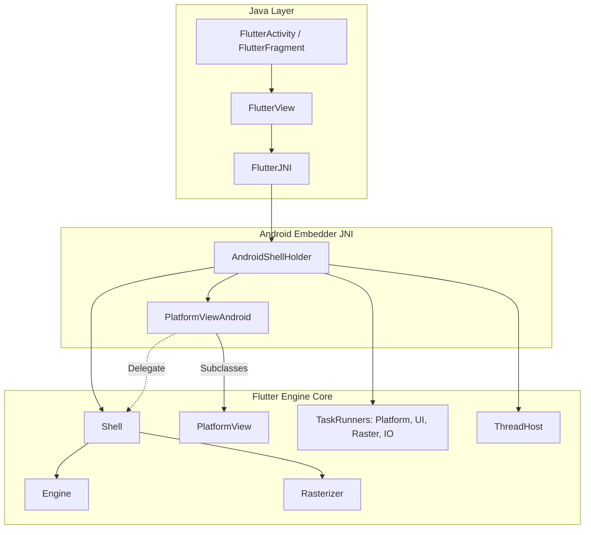

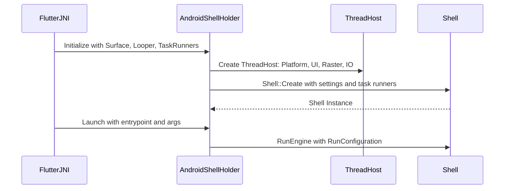

### Dependency Entanglement in [`BUILD.gn`](https://github.com/flutter/flutter/blob/4762dec4fc9072cd9269814ef36364f35a9a66dc/engine/src/flutter/shell/platform/android/BUILD.gn)

Because [`AndroidShellHolder`](https://github.com/flutter/flutter/blob/4762dec4fc9072cd9269814ef36364f35a9a66dc/engine/src/flutter/shell/platform/android/android_shell_holder.h#L38) and [`PlatformViewAndroid`](https://github.com/flutter/flutter/blob/4762dec4fc9072cd9269814ef36364f35a9a66dc/engine/src/flutter/shell/platform/android/platform_view_android.h#L43) reach directly into internal engine classes, [`flutter_shell_native_src`](https://github.com/flutter/flutter/blob/4762dec4fc9072cd9269814ef36364f35a9a66dc/engine/src/flutter/shell/platform/android/BUILD.gn#L95) in [`engine/src/flutter/shell/platform/android/BUILD.gn`](https://github.com/flutter/flutter/blob/4762dec4fc9072cd9269814ef36364f35a9a66dc/engine/src/flutter/shell/platform/android/BUILD.gn) depends on internal engine targets.

An audit of [`shell/platform/android/`](https://github.com/flutter/flutter/tree/4762dec4fc9072cd9269814ef36364f35a9a66dc/engine/src/flutter/shell/platform/android) reveals 98 internal engine headers included across Android shell files, categorized across 9 distinct subsystems:

| Subsystem & Headers | Direct GN Dependencies | Key Internal Headers | Functional Purpose in Embedder |
| :--- | :--- | :--- | :--- |
| **Impeller & Graphics Context Setup**<br/>(29 headers) | [`//flutter/impeller`](https://github.com/flutter/flutter/tree/4762dec4fc9072cd9269814ef36364f35a9a66dc/engine/src/flutter/impeller)<br/>[`//flutter/impeller/toolkit/android`](https://github.com/flutter/flutter/tree/4762dec4fc9072cd9269814ef36364f35a9a66dc/engine/src/flutter/impeller/toolkit/android)<br/>[`//flutter/impeller/toolkit/egl`](https://github.com/flutter/flutter/tree/4762dec4fc9072cd9269814ef36364f35a9a66dc/engine/src/flutter/impeller/toolkit/egl)<br/>[`//flutter/impeller/toolkit/gles`](https://github.com/flutter/flutter/tree/4762dec4fc9072cd9269814ef36364f35a9a66dc/engine/src/flutter/impeller/toolkit/gles)<br/>[`//flutter/impeller/toolkit/glvk`](https://github.com/flutter/flutter/tree/4762dec4fc9072cd9269814ef36364f35a9a66dc/engine/src/flutter/impeller/toolkit/glvk) | [`renderer/backend/vulkan/context_vk.h`](https://github.com/flutter/flutter/blob/4762dec4fc9072cd9269814ef36364f35a9a66dc/engine/src/flutter/impeller/renderer/backend/vulkan/context_vk.h)<br/>[`surface_context_vk.h`](https://github.com/flutter/flutter/blob/4762dec4fc9072cd9269814ef36364f35a9a66dc/engine/src/flutter/impeller/renderer/backend/vulkan/surface_context_vk.h)<br/>[`renderer/backend/gles/context_gles.h`](https://github.com/flutter/flutter/blob/4762dec4fc9072cd9269814ef36364f35a9a66dc/engine/src/flutter/impeller/renderer/backend/gles/context_gles.h)<br/>[`toolkit/android/hardware_buffer.h`](https://github.com/flutter/flutter/blob/4762dec4fc9072cd9269814ef36364f35a9a66dc/engine/src/flutter/impeller/toolkit/android/hardware_buffer.h)<br/>[`renderer/backend/vulkan/android/ahb_texture_source_vk.h`](https://github.com/flutter/flutter/blob/4762dec4fc9072cd9269814ef36364f35a9a66dc/engine/src/flutter/impeller/renderer/backend/vulkan/android/ahb_texture_source_vk.h) | Initializing rendering contexts on the raster thread ([`SetupImpellerContext`](https://github.com/flutter/flutter/blob/4762dec4fc9072cd9269814ef36364f35a9a66dc/engine/src/flutter/shell/platform/android/platform_view_android.h#L128)), creating Vulkan and EGL swapchains, and managing zero-copy [`AHardwareBuffer`](https://developer.android.com/ndk/reference/group/a-hardware-buffer) imports. |
| **Platform Views & Layer Compositing**<br/>(2 headers) | [`//flutter/flow`](https://github.com/flutter/flutter/tree/4762dec4fc9072cd9269814ef36364f35a9a66dc/engine/src/flutter/flow) | [`flow/embedded_views.h`](https://github.com/flutter/flutter/blob/4762dec4fc9072cd9269814ef36364f35a9a66dc/engine/src/flutter/flow/embedded_views.h)<br/>[`flow/surface.h`](https://github.com/flutter/flutter/blob/4762dec4fc9072cd9269814ef36364f35a9a66dc/engine/src/flutter/flow/surface.h) | Platform view compositing across Hybrid Composition++ (HCPP via [`SurfaceControl`](https://developer.android.com/reference/android/view/SurfaceControl)), Hybrid Composition (HC), Texture Layer Hybrid Composition (TLHC), and Virtual Displays (VD); managing geometric clipping and transforms via [`flutter::MutatorsStack`](https://github.com/flutter/flutter/blob/4762dec4fc9072cd9269814ef36364f35a9a66dc/engine/src/flutter/flow/embedded_views.h#L211), view slicing, surface pooling ([`surface_pool.h`](https://github.com/flutter/flutter/blob/4762dec4fc9072cd9269814ef36364f35a9a66dc/engine/src/flutter/shell/platform/android/external_view_embedder/surface_pool.h)), and multi-surface composition frame results ([`external_view_embedder_2.h`](https://github.com/flutter/flutter/blob/4762dec4fc9072cd9269814ef36364f35a9a66dc/engine/src/flutter/shell/platform/android/external_view_embedder/external_view_embedder_2.h)). |
| **External Textures & Surface Control**<br/>(5 headers) | [`//flutter/common/graphics`](https://github.com/flutter/flutter/tree/4762dec4fc9072cd9269814ef36364f35a9a66dc/engine/src/flutter/common/graphics)<br/>[`//flutter/display_list`](https://github.com/flutter/flutter/tree/4762dec4fc9072cd9269814ef36364f35a9a66dc/engine/src/flutter/display_list) | [`common/graphics/texture.h`](https://github.com/flutter/flutter/blob/4762dec4fc9072cd9269814ef36364f35a9a66dc/engine/src/flutter/common/graphics/texture.h)<br/>[`common/graphics/gl_context_switch.h`](https://github.com/flutter/flutter/blob/4762dec4fc9072cd9269814ef36364f35a9a66dc/engine/src/flutter/common/graphics/gl_context_switch.h)<br/>[`display_list/image/dl_image_skia.h`](https://github.com/flutter/flutter/blob/4762dec4fc9072cd9269814ef36364f35a9a66dc/engine/src/flutter/display_list/image/dl_image_skia.h)<br/>[`display_list/geometry/dl_geometry_types.h`](https://github.com/flutter/flutter/blob/4762dec4fc9072cd9269814ef36364f35a9a66dc/engine/src/flutter/display_list/geometry/dl_geometry_types.h) | Texture lifecycle and frame updates for Android [`SurfaceTexture`](https://developer.android.com/reference/android/graphics/SurfaceTexture) (OpenGL ES) and [`SurfaceProducer`](https://github.com/flutter/flutter/blob/4762dec4fc9072cd9269814ef36364f35a9a66dc/engine/src/flutter/shell/platform/android/io/flutter/view/TextureRegistry.java#L21) (Vulkan); feeding decoded video and camera frames into the [`DisplayList`](https://github.com/flutter/flutter/blob/4762dec4fc9072cd9269814ef36364f35a9a66dc/engine/src/flutter/display_list/display_list.h) compositor. |
| **Engine Core, Lifecycle & Threading**<br/>(11 headers) | [`//flutter/shell/common`](https://github.com/flutter/flutter/tree/4762dec4fc9072cd9269814ef36364f35a9a66dc/engine/src/flutter/shell/common) | [`shell/common/shell.h`](https://github.com/flutter/flutter/blob/4762dec4fc9072cd9269814ef36364f35a9a66dc/engine/src/flutter/shell/common/shell.h)<br/>[`thread_host.h`](https://github.com/flutter/flutter/blob/4762dec4fc9072cd9269814ef36364f35a9a66dc/engine/src/flutter/shell/common/thread_host.h)<br/>[`platform_view.h`](https://github.com/flutter/flutter/blob/4762dec4fc9072cd9269814ef36364f35a9a66dc/engine/src/flutter/shell/common/platform_view.h)<br/>[`rasterizer.h`](https://github.com/flutter/flutter/blob/4762dec4fc9072cd9269814ef36364f35a9a66dc/engine/src/flutter/shell/common/rasterizer.h)<br/>[`run_configuration.h`](https://github.com/flutter/flutter/blob/4762dec4fc9072cd9269814ef36364f35a9a66dc/engine/src/flutter/shell/common/run_configuration.h)<br/>[`vsync_waiter.h`](https://github.com/flutter/flutter/blob/4762dec4fc9072cd9269814ef36364f35a9a66dc/engine/src/flutter/shell/common/vsync_waiter.h)<br/>[`snapshot_surface_producer.h`](https://github.com/flutter/flutter/blob/4762dec4fc9072cd9269814ef36364f35a9a66dc/engine/src/flutter/shell/common/snapshot_surface_producer.h) | Direct instantiation of [`flutter::Shell::Create(...)`](https://github.com/flutter/flutter/blob/4762dec4fc9072cd9269814ef36364f35a9a66dc/engine/src/flutter/shell/common/shell.h#L137), thread host allocation (Platform, UI, Raster, IO), vsync scheduling, snapshot generation, and rasterizer coordination. |
| **UI Layer & Message Dispatch**<br/>(5 headers) | [`//flutter/lib/ui`](https://github.com/flutter/flutter/tree/4762dec4fc9072cd9269814ef36364f35a9a66dc/engine/src/flutter/lib/ui) | [`lib/ui/window/platform_message.h`](https://github.com/flutter/flutter/blob/4762dec4fc9072cd9269814ef36364f35a9a66dc/engine/src/flutter/lib/ui/window/platform_message.h)<br/>[`platform_message_response.h`](https://github.com/flutter/flutter/blob/4762dec4fc9072cd9269814ef36364f35a9a66dc/engine/src/flutter/lib/ui/window/platform_message_response.h)<br/>[`lib/ui/plugins/callback_cache.h`](https://github.com/flutter/flutter/blob/4762dec4fc9072cd9269814ef36364f35a9a66dc/engine/src/flutter/lib/ui/plugins/callback_cache.h)<br/>[`lib/ui/painting/image_generator.h`](https://github.com/flutter/flutter/blob/4762dec4fc9072cd9269814ef36364f35a9a66dc/engine/src/flutter/lib/ui/painting/image_generator.h) | Binary message encoding and decoding for platform channels, background Dart entrypoint lookup ([`PluginUtilities.getCallbackHandle`](https://github.com/flutter/flutter/blob/4762dec4fc9072cd9269814ef36364f35a9a66dc/engine/src/flutter/lib/ui/plugins.dart#L54) via [`callback_cache.h`](https://github.com/flutter/flutter/blob/4762dec4fc9072cd9269814ef36364f35a9a66dc/engine/src/flutter/lib/ui/plugins/callback_cache.h)), and native platform image decoding. |
| **Dart VM, Runtime & Service Isolate**<br/>(2 headers) | [`//flutter/runtime`](https://github.com/flutter/flutter/tree/4762dec4fc9072cd9269814ef36364f35a9a66dc/engine/src/flutter/runtime)<br/>[`//flutter/runtime:libdart`](https://github.com/flutter/flutter/blob/4762dec4fc9072cd9269814ef36364f35a9a66dc/engine/src/flutter/runtime/BUILD.gn) | [`runtime/dart_vm.h`](https://github.com/flutter/flutter/blob/4762dec4fc9072cd9269814ef36364f35a9a66dc/engine/src/flutter/runtime/dart_vm.h)<br/>[`runtime/dart_service_isolate.h`](https://github.com/flutter/flutter/blob/4762dec4fc9072cd9269814ef36364f35a9a66dc/engine/src/flutter/runtime/dart_service_isolate.h) | Managing the Dart VM lifecycle, configuring concurrent message loops, isolate creation, and Dart service isolate initialization. |
| **Asset Management & Packaging**<br/>(1 header) | [`//flutter/assets`](https://github.com/flutter/flutter/tree/4762dec4fc9072cd9269814ef36364f35a9a66dc/engine/src/flutter/assets) | [`assets/asset_resolver.h`](https://github.com/flutter/flutter/blob/4762dec4fc9072cd9269814ef36364f35a9a66dc/engine/src/flutter/assets/asset_resolver.h) | Resolving assets and kernel blobs packaged within the Android APK via [`APKAssetProvider`](https://github.com/flutter/flutter/blob/4762dec4fc9072cd9269814ef36364f35a9a66dc/engine/src/flutter/shell/platform/android/apk_asset_provider.h#L17). |
| **GPU Backends & Surface Delegates**<br/>(5 headers) | [`//flutter/shell/gpu`](https://github.com/flutter/flutter/tree/4762dec4fc9072cd9269814ef36364f35a9a66dc/engine/src/flutter/shell/gpu)<br/>[`//flutter/vulkan`](https://github.com/flutter/flutter/tree/4762dec4fc9072cd9269814ef36364f35a9a66dc/engine/src/flutter/vulkan) | [`shell/gpu/gpu_surface_gl_impeller.h`](https://github.com/flutter/flutter/blob/4762dec4fc9072cd9269814ef36364f35a9a66dc/engine/src/flutter/shell/gpu/gpu_surface_gl_impeller.h)<br/>[`gpu_surface_vulkan_impeller.h`](https://github.com/flutter/flutter/blob/4762dec4fc9072cd9269814ef36364f35a9a66dc/engine/src/flutter/shell/gpu/gpu_surface_vulkan_impeller.h)<br/>[`vulkan/vulkan_native_surface_android.h`](https://github.com/flutter/flutter/blob/4762dec4fc9072cd9269814ef36364f35a9a66dc/engine/src/flutter/vulkan/vulkan_native_surface_android.h) | Implementing platform window surface delegates for OpenGL and Vulkan render pipelines. |
| **Foundational Utilities & Concurrency**<br/>(24 headers) | [`//flutter/fml`](https://github.com/flutter/flutter/tree/4762dec4fc9072cd9269814ef36364f35a9a66dc/engine/src/flutter/fml) | [`fml/raster_thread_merger.h`](https://github.com/flutter/flutter/blob/4762dec4fc9072cd9269814ef36364f35a9a66dc/engine/src/flutter/fml/raster_thread_merger.h)<br/>[`fml/task_runner.h`](https://github.com/flutter/flutter/blob/4762dec4fc9072cd9269814ef36364f35a9a66dc/engine/src/flutter/fml/task_runner.h)<br/>[`fml/message_loop.h`](https://github.com/flutter/flutter/blob/4762dec4fc9072cd9269814ef36364f35a9a66dc/engine/src/flutter/fml/message_loop.h)<br/>[`fml/concurrent_message_loop.h`](https://github.com/flutter/flutter/blob/4762dec4fc9072cd9269814ef36364f35a9a66dc/engine/src/flutter/fml/concurrent_message_loop.h)<br/>[`fml/platform/android/jni_util.h`](https://github.com/flutter/flutter/blob/4762dec4fc9072cd9269814ef36364f35a9a66dc/engine/src/flutter/fml/platform/android/jni_util.h)<br/>[`fml/platform/android/scoped_java_ref.h`](https://github.com/flutter/flutter/blob/4762dec4fc9072cd9269814ef36364f35a9a66dc/engine/src/flutter/fml/platform/android/scoped_java_ref.h) | Message loops, JNI handle wrappers, task scheduling, and raster thread leasing. |

### Technical Consequences of Coupling

This level of coupling creates several concrete maintenance problems:

- Fragile refactoring: Any change to private engine internals (such as Impeller backend refactors or Flow mutator stack updates) breaks the Android embedder.
- Prolonged rebuild times: Compiling `libflutter.so` requires rebuilding internal engine translation units even when only platform-specific code changes.
- Lack of API contract: No stable boundary prevents Android embedder code from reaching into private engine internals, which inhibits engine modularization.

## Detailed Design

To allow the Android embedder to communicate with the engine exclusively through [`embedder.h`](https://github.com/flutter/flutter/blob/4762dec4fc9072cd9269814ef36364f35a9a66dc/engine/src/flutter/shell/platform/embedder/embedder.h), the C-API must be extended to cover Android-specific subsystem requirements. Each proposed extension corresponds directly to uncoupling one of the internal subsystems identified in the dependency audit and supporting a target embedder component (`FlutterEmbedderNative`, `JniRouter` / `JniDelegate` / `JvmInvoker`, `AndroidSurfaceControl`, `AndroidPlatformViewsController`, `AndroidMutatorsMapper`, `AndroidHardwareBuffer`, `AndroidVulkanExternalTexture`, `AndroidSemanticsMapper`, `AndroidWindowMetricsMapper`, `AndroidVsyncWaiter`, `AndroidVMInit`, `AndroidEngineGroup`, and [`APKAssetProvider`](https://github.com/flutter/flutter/blob/4762dec4fc9072cd9269814ef36364f35a9a66dc/engine/src/flutter/shell/platform/android/apk_asset_provider.h#L17)).

### Graphics Surface Setup, Context Ownership, and Surface Lifecycle ([`SetupImpellerContext`](https://github.com/flutter/flutter/blob/4762dec4fc9072cd9269814ef36364f35a9a66dc/engine/src/flutter/shell/platform/android/platform_view_android.h#L128))

On Android, graphics context creation must be cleanly decoupled from window surface presentation. The embedder initializes or acquires the graphics context (such as Vulkan [`VkInstance`](https://registry.khronos.org/vulkan/specs/1.3-extensions/man/html/VkInstance.html), physical device, logical [`VkDevice`](https://registry.khronos.org/vulkan/specs/1.3-extensions/man/html/VkDevice.html), [`VkQueue`](https://registry.khronos.org/vulkan/specs/1.3-extensions/man/html/VkQueue.html), and Vulkan proc loaders, or an `EGLDisplay`, `EGLContext`, and `EGLConfig`) prior to invoking [`FlutterEngineInitialize`](https://github.com/flutter/flutter/blob/4762dec4fc9072cd9269814ef36364f35a9a66dc/engine/src/flutter/shell/platform/embedder/embedder.h#L2970).

In the existing engine architecture, [`AndroidContextDynamicImpeller`](https://github.com/flutter/flutter/blob/4762dec4fc9072cd9269814ef36364f35a9a66dc/engine/src/flutter/shell/platform/android/android_context_dynamic_impeller.h#L23) defers the decision between Vulkan and OpenGL ES until [`GetImpellerContext`](https://github.com/flutter/flutter/blob/4762dec4fc9072cd9269814ef36364f35a9a66dc/engine/src/flutter/shell/platform/android/android_context_dynamic_impeller.cc#L162) is first called on the raster thread via [`SetupImpellerContext`](https://github.com/flutter/flutter/blob/4762dec4fc9072cd9269814ef36364f35a9a66dc/engine/src/flutter/shell/platform/android/platform_view_android.cc#L567-L570):

```cpp
// Existing deferred graphics resolution in shell/platform/android/android_context_dynamic_impeller.cc
void AndroidContextDynamicImpeller::SetupImpellerContext() {
  if (vk_context_ || gl_context_) {
    return;
  }
  vk_context_ = GetActualRenderingAPIForImpeller(android_get_device_api_level(),
                                                 settings_);
  if (!vk_context_) {
    gl_context_ = std::make_shared<AndroidContextGLImpeller>(
        std::make_unique<impeller::egl::Display>(),
        settings_.enable_gpu_tracing, io_task_runner_);
  }
}
```

Because `embedder.h` requires a concrete renderer configuration struct (`FlutterRendererConfig` selecting `kOpenGL` or `kVulkan`) at `FlutterEngineInitialize` time, the embedder resolves the graphics backend during initialization before passing renderer pointers to the engine.

Performing synchronous Vulkan driver queries during `FlutterLoader.ensureInitializationComplete` on Android's main thread introduces a 15 to 30 ms cold-startup delay on budget devices (such as MediaTek or older Mali chipsets) due to driver library loading and physical device property enumeration.

To eliminate main-thread startup delays:

1. `FlutterLoader.startInitialization` dispatches an asynchronous Vulkan capability probe to a background worker isolate or thread when the host application starts.
2. The probe result (device extensions, driver ID, and Impeller capability flags) is cached in Android [`SharedPreferences`](https://developer.android.com/reference/android/content/SharedPreferences).
3. Subsequent application launches read the cached renderer preference in less than 0.5 ms during `FlutterLoader.ensureInitializationComplete`.
4. If the device experiences a driver crash or OS upgrade, the embedder falls back safely to OpenGLES.

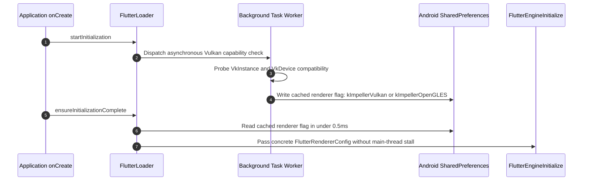

To configure raster-thread graphics state and resources, [`FlutterOpenGLRendererConfig`](https://github.com/flutter/flutter/blob/4762dec4fc9072cd9269814ef36364f35a9a66dc/engine/src/flutter/shell/platform/embedder/embedder.h#L693) and [`FlutterVulkanRendererConfig`](https://github.com/flutter/flutter/blob/4762dec4fc9072cd9269814ef36364f35a9a66dc/engine/src/flutter/shell/platform/embedder/embedder.h#L695) in [`embedder.h`](https://github.com/flutter/flutter/blob/4762dec4fc9072cd9269814ef36364f35a9a66dc/engine/src/flutter/shell/platform/embedder/embedder.h) provide context setup callbacks:

```c
typedef struct {
  size_t struct_size;
  // Callback invoked on the raster thread to initialize OpenGL graphics state.
  VoidCallback setup_callback;
} FlutterOpenGLRendererConfig;

typedef struct {
  size_t struct_size;
  // Callback invoked on the raster thread to initialize Vulkan graphics state.
  VoidCallback setup_callback;
} FlutterVulkanRendererConfig;
```

[`embedder.h`](https://github.com/flutter/flutter/blob/4762dec4fc9072cd9269814ef36364f35a9a66dc/engine/src/flutter/shell/platform/embedder/embedder.h) also receives an API to construct a render target directly from a Vulkan backing store to match Impeller Vulkan swapchain requirements. Window surface attachments ([`ANativeWindow`](https://developer.android.com/ndk/reference/group/a-native-window)) and swapchains are created and destroyed dynamically across Android [`Activity`](https://developer.android.com/reference/android/app/Activity) lifecycle events via [`FlutterEngineNotifyCreated`](https://github.com/flutter/flutter/blob/4762dec4fc9072cd9269814ef36364f35a9a66dc/engine/src/flutter/shell/platform/embedder/embedder.h) and [`FlutterEngineNotifyDestroyed`](https://github.com/flutter/flutter/blob/4762dec4fc9072cd9269814ef36364f35a9a66dc/engine/src/flutter/shell/platform/embedder/embedder.h) (see Renderer Availability and Lifecycle Signals) without destroying the underlying GPU context.

> [!NOTE] Backend Simplification: Dropping Skia
> If legacy Skia support is dropped in favor of an Impeller-only architecture on Android, all legacy Skia context setup, EGL display and context fallback handling, and Ganesh header dependencies are eliminated. Graphics surface initialization narrows cleanly to Impeller Vulkan with an Impeller OpenGL ES fallback.

### Replacing Internal `AndroidExternalViewEmbedder` with `FlutterCompositor` (Preserving Hybrid Composition)

Android supports four platform view composition modes:

1. **Hybrid Composition (HC)**: Places the native Android [`View`](https://developer.android.com/reference/android/view/View) directly in the view hierarchy (`createForPlatformViewLayer`) and composites Flutter UI layers above the platform view into Android overlay surfaces (`FlutterImageView` / `PlatformViewWrapper` via `createOverlaySurface` and `onDisplayOverlaySurface`).
2. **Hybrid Composition++ (HCPP)**: Uses NDK [`SurfaceControl.Transaction`](https://developer.android.com/reference/android/view/SurfaceControl.Transaction) and GPU acquire/release sync fences on Android 14+ (API level 34+) (`createPlatformViewHcpp`).
3. **Texture Layer Hybrid Composition (TLHC)**: Attaches the Android `View` to the view hierarchy (`PlatformViewWrapper`) while redirecting its draw output into an offscreen [`SurfaceTexture`](https://developer.android.com/reference/android/graphics/SurfaceTexture) or [`SurfaceProducer`](https://github.com/flutter/flutter/blob/4762dec4fc9072cd9269814ef36364f35a9a66dc/engine/src/flutter/shell/platform/android/io/flutter/view/TextureRegistry.java#L21) render target registered as a Flutter external texture (`createForTextureLayer` / `configureForTextureLayerComposition`).
4. **Virtual Display (VD)**: Hosts the Android `View` inside an offscreen [`VirtualDisplay`](https://developer.android.com/reference/android/hardware/display/VirtualDisplay) (`VirtualDisplayController`) backed by a `TextureRegistry` render target (`SurfaceProducer` or `SurfaceTexture`) and composites its output as a Flutter external texture (`createForTextureLayer` / `configureForVirtualDisplay`).

**All four platform view composition modes are preserved; retiring Hybrid Composition (HC) or Virtual Display (VD) is not an option.** Standard Hybrid Composition and Virtual Display remain required across Android devices, API levels, and embedded view hierarchies (such as views containing `SurfaceView` or `TextureView` children where `PlatformViewsController` falls back from TLHC to Virtual Display). What this migration eliminates is **only the internal C++ `flutter::ExternalViewEmbedder` subclass (`shell/platform/android/external_view_embedder/AndroidExternalViewEmbedder`) and its direct dependencies on `//flutter/flow` (`embedded_views.h`) and `fml::RasterThreadMerger`**, rather than any platform view composition mode.

In the legacy architecture, [`AndroidExternalViewEmbedder`](https://github.com/flutter/flutter/blob/4762dec4fc9072cd9269814ef36364f35a9a66dc/engine/src/flutter/shell/platform/android/external_view_embedder/external_view_embedder.h) subclassed `flutter::ExternalViewEmbedder` directly and used [`fml::RasterThreadMerger`](https://github.com/flutter/flutter/blob/4762dec4fc9072cd9269814ef36364f35a9a66dc/engine/src/flutter/fml/raster_thread_merger.h#L31) in [`PostPrerollAction`](https://github.com/flutter/flutter/blob/4762dec4fc9072cd9269814ef36364f35a9a66dc/engine/src/flutter/shell/platform/android/external_view_embedder/external_view_embedder.cc#L188-L213) to dynamically lease and merge the raster thread onto the platform thread during HC frames:

```cpp
// Existing internal ExternalViewEmbedder subclass in shell/platform/android/external_view_embedder/external_view_embedder.cc
PostPrerollResult AndroidExternalViewEmbedder::PostPrerollAction(
    const fml::RefPtr<fml::RasterThreadMerger>& raster_thread_merger) {
  if (!FrameHasPlatformLayers()) {
    return PostPrerollResult::kSuccess;
  }
  if (!raster_thread_merger->IsMerged()) {
    CancelFrame();
    raster_thread_merger->MergeWithLease(kDefaultMergedLeaseDuration);
    return PostPrerollResult::kSkipAndRetryFrame;
  }
  raster_thread_merger->ExtendLeaseTo(kDefaultMergedLeaseDuration);
  if (previous_frame_view_count_ == 0) {
    return PostPrerollResult::kResubmitFrame;
  }
  return PostPrerollResult::kSuccess;
}
```

#### How All Four Platform View Modes Work in the C-API Architecture

At the C-API boundary (`embedder.h`), the four composition modes partition into two external-texture modes and two compositor-layer modes:

- **Texture Layer Hybrid Composition (TLHC) and Virtual Display (VD) via External Textures**: Both [`configureForTextureLayerComposition`](https://github.com/flutter/flutter/blob/4762dec4fc9072cd9269814ef36364f35a9a66dc/engine/src/flutter/shell/platform/android/io/flutter/plugin/platform/PlatformViewsController.java#L652) and [`configureForVirtualDisplay`](https://github.com/flutter/flutter/blob/4762dec4fc9072cd9269814ef36364f35a9a66dc/engine/src/flutter/shell/platform/android/io/flutter/plugin/platform/PlatformViewsController.java#L596) allocate a `PlatformViewRenderTarget` from `TextureRegistry` (`SurfaceProducer` / `AHardwareBuffer` or `SurfaceTexture`) in Java and return its texture ID to the Dart framework `Texture` widget. At the native engine boundary, both TLHC and VD operate strictly through the C-API external texture callbacks (`FlutterEngineRegisterExternalTexture`, `FlutterEngineMarkExternalTextureFrameAvailable`, `FlutterVulkanExternalTextureFrameCallback`, `FlutterHardwareBufferExternalTextureFrameCallback`, and `FlutterOpenGLTexture`) without creating `FlutterPlatformView` layers.
- **Hybrid Composition (HC) and Hybrid Composition++ (HCPP) via `FlutterCompositor`**: The engine's internal [`EmbedderExternalViewEmbedder`](https://github.com/flutter/flutter/blob/4762dec4fc9072cd9269814ef36364f35a9a66dc/engine/src/flutter/shell/platform/embedder/embedder_external_view_embedder.h) implements `flutter::ExternalViewEmbedder` behind the public [`FlutterCompositor`](https://github.com/flutter/flutter/blob/4762dec4fc9072cd9269814ef36364f35a9a66dc/engine/src/flutter/shell/platform/embedder/embedder.h#L2117) interface (`create_backing_store_callback`, `collect_backing_store_callback`, and `present_layers_callback` / `present_view_callback`). `AndroidCompositor` and `AndroidPlatformViewsController` drive both HC and HCPP over `FlutterCompositor` without including internal `//flutter/flow` or `fml::RasterThreadMerger` headers:

1. **Backing Store Allocation (`create_backing_store_callback`)**: For the primary Flutter layer (`platform_views_count == 0`), `AndroidCompositor::CreateBackingStore` returns the main surface framebuffer (`GetFBO()`). When a Hybrid Composition platform view splits the scene and Flutter renders UI layers above the platform view, subsequent `CreateBackingStore` calls within the same frame allocate offscreen framebuffers (`AcquireOffscreenFBO`).
2. **Layer and Overlay Presentation (`present_layers_callback` / `present_view_callback`)**: `AndroidCompositor::PresentLayers` begins the platform view frame (`OnBeginFrame`), iterates through the ordered `FlutterLayer` array, and dispatches each layer by type:
   - The base `kFlutterLayerContentTypeBackingStore` is presented to the primary `ANativeWindow`.
   - Each `kFlutterLayerContentTypePlatformView` layer forwards the view identifier, physical bounds (`offset`, `size`), and serialized `FlutterPlatformViewMutation` stack to `AndroidPlatformViewsController::OnDisplayPlatformView` (`PlatformViewsController.onDisplayPlatformView` in Java).
   - Any `kFlutterLayerContentTypeBackingStore` layer positioned above a platform view acquires an Android overlay surface (`createOverlaySurface` / `GetOverlayWindow`), blits and swaps the offscreen FBO into that overlay window (`BlitAndSwapOverlaySurface`), and updates the overlay geometry (`onDisplayOverlaySurface` / `showOverlaySurface`), followed by `OnEndFrame`.
3. **Removing `external_view_embedder/`**: Because `AndroidCompositor` and `AndroidPlatformViewsController` handle HC overlay blitting and HCPP `SurfaceControl` transactions through `FlutterCompositor` (while TLHC and VD operate through the C-API external texture pipeline) and capture per-frame layer and mutator state by value across threads, `shell/platform/android/external_view_embedder/` (`AndroidExternalViewEmbedder` and `AndroidExternalViewEmbedder2`) is deleted in Phase 4 without removing or degrading any of the four platform view modes. No `fml::RasterThreadMerger` handles or internal flow types are exposed in `embedder.h`.

#### Frame Synchronization on API 21–33 Without `fml::RasterThreadMerger`

On Android 5.0 through Android 13 (API levels 21–33), NDK [`ASurfaceTransaction_setBuffer`](https://developer.android.com/ndk/reference/group/native-activity#asurfacetransaction_setbuffer) and hardware sync fence handoff (HCPP) are unavailable. Two runtime paths can still prevent a platform view from using Texture Layer Hybrid Composition (TLHC) on these API levels:

1. **Explicit Hybrid Composition (`initExpensiveAndroidView`)**: The plugin requests `createForPlatformViewLayer`, routing directly to [`PlatformViewsController.configureForHybridComposition`](https://github.com/flutter/flutter/blob/4762dec4fc9072cd9269814ef36364f35a9a66dc/engine/src/flutter/shell/platform/android/io/flutter/plugin/platform/PlatformViewsController.java#L583).
2. **Embedded Child `SurfaceView` or `TextureView` (`VIEW_TYPES_REQUIRE_NON_TLHC`)**: When a plugin uses `initAndroidView` (`createForTextureLayer`) and the embedded Android `View` hierarchy contains a `SurfaceView` or `TextureView` child whose out-of-band buffer queue bypasses `ViewParent.onDescendantInvalidated()`, [`PlatformViewsController.createForTextureLayer`](https://github.com/flutter/flutter/blob/4762dec4fc9072cd9269814ef36364f35a9a66dc/engine/src/flutter/shell/platform/android/io/flutter/plugin/platform/PlatformViewsController.java#L229-L246) detects `!supportsTextureLayerMode` and branches by `request.displayMode`:
   - **`TEXTURE_WITH_VIRTUAL_FALLBACK` $\rightarrow$ Virtual Display (VD)**: Calls `configureForVirtualDisplay`, hosting the view and its child `SurfaceView` inside an offscreen `VirtualDisplay` backed by a `TextureRegistry` render target. Frame synchronization is handled entirely on the GPU/raster thread as a standard C-API external texture (`FlutterEngineRegisterExternalTexture`).
   - **`TEXTURE_WITH_HYBRID_FALLBACK` $\rightarrow$ Hybrid Composition (HC)**: Calls `configureForHybridComposition` and returns `NON_TEXTURE_FALLBACK` (`-2`), instructing the Dart framework to composite the view via a `PlatformViewLayer` (`kFlutterLayerContentTypePlatformView`).

When Hybrid Composition is active on API 21–33 without `fml::RasterThreadMerger`, frame synchronization between the Flutter rasterizer and the Android `View` hierarchy is enforced through a three-part lockstep protocol across `AndroidCompositor` and `PlatformViewsController`:

1. **`FlutterImageView` (`ImageReader`) Target Conversion**:
   Rendering the base Flutter layer into a `FlutterSurfaceView` (`SurfaceView`) during HC would present to `SurfaceFlinger` out of band from the Android `ViewRootImpl` UI traversal, causing visual lag against the `FlutterMutatorView`. When the first HC platform view is displayed (`onDisplayPlatformView`), `PlatformViewsController.initializeRootImageViewIfNeeded()` calls `flutterView.convertToImageView()`, switching the engine's primary `ANativeWindow` to an [`ImageReader`](https://developer.android.com/reference/android/media/ImageReader)-backed `FlutterImageView`. Each overlay layer (`PlatformOverlayView`) is likewise backed by its own `ImageReader` `ANativeWindow`.
2. **Raster-Before-Acquire Ordering and Synchronous Platform-Thread Latch**:
   In the legacy architecture, `AndroidExternalViewEmbedder` merged the raster thread onto the platform thread via `fml::RasterThreadMerger` only because it called JNI view hierarchy mutations inline during `SubmitFlutterView`. In `AndroidCompositor::PresentLayers`:
   - On the raster thread, `surface_manager_->Present()` and `surface_manager_->BlitAndSwapOverlaySurface(...)` first complete `eglSwapBuffers` / `vkQueuePresentKHR` into the root `FlutterImageView` and `PlatformOverlayView` `ImageReader` `ANativeWindow` queues for Frame $N$.
   - `AndroidCompositor` packages Frame $N$'s platform view geometry (`offset`, `size`), value-copied `AndroidMutatorsStack`, and overlay rectangles into a single atomic platform-thread frame transaction (`onBeginFrame` $\rightarrow$ `onDisplayPlatformView` $\rightarrow$ `onDisplayOverlaySurface` $\rightarrow$ `onEndFrame`).
   - When `platform_views_count > 0` and HCPP is not active (`!IsHcppEnabled()`), if `PresentLayers` is not already running on the platform thread (`!platform_runner->RunsTasksOnCurrentThread()`), `PresentLayers` synchronizes on a frame-completion latch (`fml::AutoResetWaitableEvent`) until the platform thread finishes `onEndFrame()` (with a teardown guard to prevent ANRs if the surface detaches concurrently). Waiting on this latch prevents the raster thread from queuing Frame $N+1$ into the `ImageReader` before the platform thread has consumed Frame $N$, guaranteeing that `ImageReader.acquireLatestImage()` pairs Frame $N$'s rasterized pixels 1:1 with Frame $N$'s `FlutterMutatorView` scroll offset and mutator matrix.
3. **Atomic `ImageReader` Gate in `PlatformViewsController.onEndFrame()`**:
   During the platform-thread commit in [`PlatformViewsController.onEndFrame()`](https://github.com/flutter/flutter/blob/4762dec4fc9072cd9269814ef36364f35a9a66dc/engine/src/flutter/shell/platform/android/io/flutter/plugin/platform/PlatformViewsController.java#L1321-L1391), `flutterView.acquireLatestImageViewFrame()` and `overlayView.acquireLatestImage()` pull the newly queued GPU buffers and invalidate the `FlutterImageView` instances. `finishFrame()` checks `isFrameRenderedUsingImageReaders` (verifying that the converted root `FlutterImageView` and every active `PlatformOverlayView` acquired a valid image) before setting `parentView.setVisibility(View.VISIBLE)`. Consequently, the base `FlutterImageView`, the `FlutterMutatorView` (wrapping the native `View`), and all `PlatformOverlayView` layers are drawn together in a single `ViewRootImpl.performTraversals()` pass on the Android UI thread. When the last HC view is disposed (`currentFrameUsedPlatformViewIds.isEmpty()`), `onEndFrame()` invokes `flutterView.revertImageView()` to return to direct `SurfaceView` presentation.

### External Textures (Zero-Copy Vulkan and OpenGL ES)

Android provides two distinct mechanisms for external textures:

- [`SurfaceProducer`](https://github.com/flutter/flutter/blob/4762dec4fc9072cd9269814ef36364f35a9a66dc/engine/src/flutter/shell/platform/android/io/flutter/view/TextureRegistry.java#L21): A zero-copy pipeline that imports [`AHardwareBuffer`](https://developer.android.com/ndk/reference/group/a-hardware-buffer) handles directly into Vulkan ([`VkImage`](https://registry.khronos.org/vulkan/specs/1.3-extensions/man/html/VkImage.html)) or EGL ([`EGLImage`](https://registry.khronos.org/EGL/sdk/docs/man/html/eglCreateImage.xhtml)).
- [`SurfaceTexture`](https://developer.android.com/reference/android/graphics/SurfaceTexture): A legacy OpenGL ES path where native frames render into a texture ID updated with [`SurfaceTexture.updateTexImage()`](https://developer.android.com/reference/android/graphics/SurfaceTexture#updateTexImage()).

The public Embedder API previously lacked a way to deliver Vulkan-backed external images without depending on the internal [`flutter::Texture`](https://github.com/flutter/flutter/blob/4762dec4fc9072cd9269814ef36364f35a9a66dc/engine/src/flutter/common/graphics/texture.h#L27) class. The design closes this with a pull-based frame callback on the renderer config rather than a push-based registration entry point. The embedder claims a texture ID through the existing [`FlutterEngineRegisterExternalTexture`](https://github.com/flutter/flutter/blob/4762dec4fc9072cd9269814ef36364f35a9a66dc/engine/src/flutter/shell/platform/embedder/embedder.h#L3227) and signals new content with [`FlutterEngineMarkExternalTextureFrameAvailable`](https://github.com/flutter/flutter/blob/4762dec4fc9072cd9269814ef36364f35a9a66dc/engine/src/flutter/shell/platform/embedder/embedder.h#L3250); the engine calls back to collect the backing image for the frame it is about to compose:

```c
/// Specifies the backing type of a Vulkan external texture.
typedef enum {
  kFlutterVulkanExternalTextureTypeVkImage,
  kFlutterVulkanExternalTextureTypeAHardwareBuffer,
} FlutterVulkanExternalTextureType;

typedef struct {
  size_t struct_size;
  size_t width;
  size_t height;
  /// VkFormat. May be 0 for an AHardwareBuffer, in which case the engine
  /// queries the format from the buffer itself.
  uint32_t format;
  FlutterVulkanExternalTextureType type;
  union {
    FlutterVulkanImageHandle vk_image;
    FlutterAHardwareBufferHandle hardware_buffer;
  };
  /// VkImageLayout of the image.
  uint32_t image_layout;
  /// NULL for standard sampling; non-NULL for YCbCr camera and video buffers.
  const FlutterVulkanYcbcrConversionInfo* ycbcr_conversion_info;
  void* user_data;
  VoidCallback destruction_callback;
} FlutterVulkanExternalTexture;

/// Invoked on an engine-managed thread to obtain the texture for a frame.
typedef bool (*FlutterVulkanExternalTextureFrameCallback)(
    void* user_data,
    int64_t texture_identifier,
    size_t width,
    size_t height,
    FlutterVulkanExternalTexture* texture_out);
```

`FlutterVulkanRendererConfig` carries this callback as `external_texture_frame_callback`. A parallel [`FlutterHardwareBufferExternalTextureFrameCallback`](#external-textures-zero-copy-vulkan-and-opengl-es) sits on both [`FlutterVulkanRendererConfig`](https://github.com/flutter/flutter/blob/4762dec4fc9072cd9269814ef36364f35a9a66dc/engine/src/flutter/shell/platform/embedder/embedder.h#L695) and [`FlutterOpenGLRendererConfig`](https://github.com/flutter/flutter/blob/4762dec4fc9072cd9269814ef36364f35a9a66dc/engine/src/flutter/shell/platform/embedder/embedder.h#L693), so an [`AHardwareBuffer`](https://developer.android.com/ndk/reference/group/a-hardware-buffer) reaches either backend without an Android-specific engine entry point.

The discriminated union is what makes this workable on Android. [`SurfaceProducer`](https://github.com/flutter/flutter/blob/4762dec4fc9072cd9269814ef36364f35a9a66dc/engine/src/flutter/shell/platform/android/io/flutter/view/TextureRegistry.java#L21) hands out [`AHardwareBuffer`](https://developer.android.com/ndk/reference/group/a-hardware-buffer) handles rather than [`VkImage`](https://registry.khronos.org/vulkan/specs/1.3-extensions/man/html/VkImage.html) handles, and `ycbcr_conversion_info` carries the external format identifier and component swizzle that camera and video decoder buffers require. Vendor buffers with an external format cannot be sampled correctly without it.

For legacy [`SurfaceTexture`](https://developer.android.com/reference/android/graphics/SurfaceTexture) instances, the existing [`FlutterEngineRegisterExternalTexture`](https://github.com/flutter/flutter/blob/4762dec4fc9072cd9269814ef36364f35a9a66dc/engine/src/flutter/shell/platform/embedder/embedder.h#L3227) API with `kFlutterExternalTextureTypeOpenGL` is used. However, the existing [`FlutterOpenGLTexture`](https://github.com/flutter/flutter/blob/4762dec4fc9072cd9269814ef36364f35a9a66dc/engine/src/flutter/shell/platform/embedder/embedder.h#L1121) struct only specifies `target`, `name`, `format`, `width`, and `height`; it lacks a UV coordinate transformation matrix. On Android, [`SurfaceTexture.getTransformMatrix()`](https://developer.android.com/reference/android/graphics/SurfaceTexture#getTransformMatrix(float[])) provides a 4x4 matrix accounting for camera sensor rotation, video decoder padding, and coordinate inversion. In the existing architecture, [`SurfaceTextureExternalTexture::Update()`](https://github.com/flutter/flutter/blob/4762dec4fc9072cd9269814ef36364f35a9a66dc/engine/src/flutter/shell/platform/android/surface_texture_external_texture.cc#L134-L143) queries this matrix through [`PlatformViewAndroidJNIImpl::SurfaceTextureGetTransformMatrix`](https://github.com/flutter/flutter/blob/4762dec4fc9072cd9269814ef36364f35a9a66dc/engine/src/flutter/shell/platform/android/platform_view_android_jni_impl.cc#L1626-L1645) and returns an [`SkM44`](https://github.com/flutter/flutter/blob/4762dec4fc9072cd9269814ef36364f35a9a66dc/engine/src/flutter/third_party/skia/include/core/SkM44.h) matrix directly:

```cpp
// Existing UV transformation querying in shell/platform/android/surface_texture_external_texture.cc
void SurfaceTextureExternalTexture::Update() {
  jni_facade_->SurfaceTextureUpdateTexImage(
      fml::jni::ScopedJavaLocalRef<jobject>(surface_texture_));
  transform_ = jni_facade_->SurfaceTextureGetTransformMatrix(
      fml::jni::ScopedJavaLocalRef<jobject>(surface_texture_));
}

const SkM44& SurfaceTextureExternalTexture::GetCurrentUVTransformation() const {
  return transform_;
}
```

Without this matrix, external video and camera frames render inverted or distorted.

To resolve this gap, [`embedder.h`](https://github.com/flutter/flutter/blob/4762dec4fc9072cd9269814ef36364f35a9a66dc/engine/src/flutter/shell/platform/embedder/embedder.h) introduces [`FlutterOpenGLTexture2`](#external-textures-zero-copy-vulkan-and-opengl-es):

```c
typedef struct {
  size_t struct_size;
  uint32_t target;
  uint32_t name;
  uint32_t format;
  void* user_data;
  VoidCallback destruction_callback;
  uint32_t width;
  uint32_t height;
  FlutterTransformation uv_transform;
} FlutterOpenGLTexture2;
```

Under OpenGL ES, platform view compositing also faces constraints: because [`SurfaceControl`](https://developer.android.com/reference/android/view/SurfaceControl) transaction sync fences depend on Vulkan hardware synchronization, OpenGL platform views must use Texture Layer Hybrid Composition (TLHC) or legacy Hybrid Composition rather than HCPP.

> [!NOTE] External Texture Simplification: Dropping Skia and Legacy OpenGL Textures
> Retiring legacy Skia and legacy OpenGL `SurfaceTexture` pathways in favor of Impeller Vulkan allows the embedder to eliminate legacy UV coordinate transform matrix conversions (`FlutterOpenGLTexture2`) and standardize directly on zero-copy [`AHardwareBuffer`](https://developer.android.com/ndk/reference/group/a-hardware-buffer) imports through [`FlutterVulkanExternalTexture`](#external-textures-zero-copy-vulkan-and-opengl-es).

### Platform View Mutator Stack Serialization

Platform views embedded within Flutter require spatial transformations, opacity adjustments, and geometric clips across Android composition modes: HCPP, legacy HC, and TLHC.

Internally, these operations are managed by [`flutter::MutatorsStack`](https://github.com/flutter/flutter/blob/4762dec4fc9072cd9269814ef36364f35a9a66dc/engine/src/flutter/flow/embedded_views.h#L211) in [`flow/embedded_views.h`](https://github.com/flutter/flutter/blob/4762dec4fc9072cd9269814ef36364f35a9a66dc/engine/src/flutter/flow/embedded_views.h). Because `flow` and `SkPath` headers cannot cross the C-API boundary, mutators must be serialized into an ABI-stable array of C structs:

```c
typedef enum {
  kFlutterPlatformViewMutationTypeOpacity,
  kFlutterPlatformViewMutationTypeClipRect,
  kFlutterPlatformViewMutationTypeClipRoundedRect,
  kFlutterPlatformViewMutationTypeTransformation,
  kFlutterPlatformViewMutationTypeClipRoundSuperellipse,
  kFlutterPlatformViewMutationTypeClipPath,
} FlutterPlatformViewMutationType;

typedef struct {
  FlutterPlatformViewMutationType type;
  union {
    double opacity;
    FlutterRect clip_rect;
    FlutterRoundedRect clip_rounded_rect;
    FlutterTransformation transformation;
    FlutterRoundSuperellipse clip_round_superellipse;
    FlutterPath clip_path;
  };
} FlutterPlatformViewMutation;
```

Arbitrary clips need a path representation that does not drag [`SkPath`](https://github.com/flutter/flutter/blob/4762dec4fc9072cd9269814ef36364f35a9a66dc/engine/src/flutter/third_party/skia/include/core/SkPath.h) across the boundary. In [`embedder.h`](https://github.com/flutter/flutter/blob/4762dec4fc9072cd9269814ef36364f35a9a66dc/engine/src/flutter/shell/platform/embedder/embedder.h), [`FlutterPath`](https://github.com/flutter/flutter/blob/4762dec4fc9072cd9269814ef36364f35a9a66dc/engine/src/flutter/shell/platform/embedder/embedder.h#L757) is a flat segment array with an explicit fill rule:

```c
typedef enum {
  kFlutterPathFillTypeNonZero,
  kFlutterPathFillTypeEvenOdd,
} FlutterPathFillType;

typedef enum {
  kFlutterPathVerbMove,
  kFlutterPathVerbLine,
  kFlutterPathVerbQuad,
  kFlutterPathVerbConic,
  kFlutterPathVerbCubic,
  kFlutterPathVerbClose,
} FlutterPathVerb;

typedef struct {
  FlutterPathVerb verb;
  /// Interpretation depends on verb; at most three points are used.
  FlutterPoint points[3];
  /// Weight for the rational quadratic when verb is kFlutterPathVerbConic.
  double conic_weight;
} FlutterPathSegment;

typedef struct {
  size_t struct_size;
  FlutterPathFillType fill_type;
  size_t segments_count;
  /// Valid only for the duration of the frame presentation callback.
  const FlutterPathSegment* segments;
} FlutterPath;
```

Mutations ride on [`FlutterPlatformView`](https://github.com/flutter/flutter/blob/4762dec4fc9072cd9269814ef36364f35a9a66dc/engine/src/flutter/shell/platform/embedder/embedder.h#L1525), which the engine hands to the embedder inside a [`FlutterLayer`](https://github.com/flutter/flutter/blob/4762dec4fc9072cd9269814ef36364f35a9a66dc/engine/src/flutter/shell/platform/embedder/embedder.h#L663) through the compositor's [`present_layers_callback`](https://github.com/flutter/flutter/blob/4762dec4fc9072cd9269814ef36364f35a9a66dc/engine/src/flutter/shell/platform/embedder/embedder.h#L1494):

```c
typedef struct {
  size_t struct_size;
  FlutterPlatformViewIdentifier identifier;
  size_t mutations_count;
  /// Applied in order. The first entry is a transformation mutation when a
  /// device pixel ratio or root surface transformation is in effect, so that
  /// subsequent mutations are already in the correct coordinate space.
  const FlutterPlatformViewMutation** mutations;
} FlutterPlatformView;
```

The array is an array of pointers rather than an array of values. Indexing strides by pointer width instead of `sizeof(FlutterPlatformViewMutation)`, so a future mutation type that widens the union does not shift the stride out from under an already-compiled embedder. This is the same technique [`FlutterSemanticsUpdate2`](https://github.com/flutter/flutter/blob/4762dec4fc9072cd9269814ef36364f35a9a66dc/engine/src/flutter/shell/platform/embedder/embedder.h#L1868-L1881) uses.

> [!NOTE] Mutator Simplification: Dropping Complex Path Clipping
> If legacy Hybrid Composition under Skia is dropped, or if platform view clipping is restricted to standard geometric bounds, `kFlutterPlatformViewMutationTypeClipPath` and the whole `FlutterPath` family become dead weight. Mutations would then convey only affine transformations, bounding rectangles, and corner radii, all of which map directly to Android `SurfaceControl` or `View` properties.

### Accessibility and Semantics Parity (`FlutterSemanticsNode2` In-Place Extension)

Android's [`AccessibilityBridge`](https://github.com/flutter/flutter/blob/4762dec4fc9072cd9269814ef36364f35a9a66dc/engine/src/flutter/shell/platform/android/io/flutter/view/AccessibilityBridge.java#L80) requires semantics metadata that was absent in the original [`FlutterSemanticsNode`](https://github.com/flutter/flutter/blob/4762dec4fc9072cd9269814ef36364f35a9a66dc/engine/src/flutter/shell/platform/embedder/embedder.h#L1599) struct, including `max_value_length`, `current_value_length`, `link_url`, `locale`, `min_value`, `max_value`, `identifier`, `traversal_parent`, and `hit_test_transform`.

#### In-Place Extension of `FlutterSemanticsNode2`

The legacy [`FlutterSemanticsUpdate`](https://github.com/flutter/flutter/blob/4762dec4fc9072cd9269814ef36364f35a9a66dc/engine/src/flutter/shell/platform/embedder/embedder.h#L1855) (v1) stored nodes in a flat array of structs by value (`FlutterSemanticsNode* nodes`). In C, indexing `nodes[i]` strides by `sizeof(FlutterSemanticsNode)`, so adding members changed the struct size and broke older binaries.

[`FlutterSemanticsUpdate2`](https://github.com/flutter/flutter/blob/4762dec4fc9072cd9269814ef36364f35a9a66dc/engine/src/flutter/shell/platform/embedder/embedder.h#L1868-L1881) resolved this by replacing the flat array with an array of pointers:

```c
typedef struct {
  size_t struct_size;
  size_t node_count;
  FlutterSemanticsNode2** nodes;                  // Array of pointers
  size_t custom_action_count;
  FlutterSemanticsCustomAction2** custom_actions; // Array of pointers
  FlutterViewId view_id;
} FlutterSemanticsUpdate2;
```

Because `nodes` is an array of pointers, pointer striding is fixed (`sizeof(FlutterSemanticsNode2*)`). Each [`FlutterSemanticsNode2`](https://github.com/flutter/flutter/blob/4762dec4fc9072cd9269814ef36364f35a9a66dc/engine/src/flutter/shell/platform/embedder/embedder.h#L1730-L1783) begins with `size_t struct_size`. This design allows `FlutterSemanticsNode2` to be extended in place:

1. **Precedent**: The engine team has already appended members directly to [`FlutterSemanticsNode2`](https://github.com/flutter/flutter/blob/4762dec4fc9072cd9269814ef36364f35a9a66dc/engine/src/flutter/shell/platform/embedder/embedder.h#L1730-L1783) without introducing a v3 struct (for example, adding `heading_level` in engine commit `59d8010db51`, and adding `identifier` in engine commit `f01fa5950c0`).
2. **Missing Android Accessibility Members**: The remaining fields required by Android's `AccessibilityBridge` are appended to the end of `FlutterSemanticsNode2`:

   ```c
   // Appended to FlutterSemanticsNode2 in embedder.h:
   int32_t max_value_length;
   int32_t current_value_length;
   const char* link_url;
   const char* locale;
   double min_value;
   double max_value;
   int32_t traversal_parent;
   FlutterTransformation hit_test_transform;
   ```

3. **Safe Access & Lifecycle**: Semantics batches are delivered from the engine to the embedder via [`FlutterUpdateSemanticsCallback2`](https://github.com/flutter/flutter/blob/4762dec4fc9072cd9269814ef36364f35a9a66dc/engine/src/flutter/shell/platform/embedder/embedder.h#L1895) registered in `FlutterProjectArgs.update_semantics_callback2`. Embedders read fields using `SAFE_ACCESS(node, member, default_value)`. Semantics updates are enabled or disabled via [`FlutterEngineUpdateSemanticsEnabled`](https://github.com/flutter/flutter/blob/4762dec4fc9072cd9269814ef36364f35a9a66dc/engine/src/flutter/shell/platform/embedder/embedder.h#L3352), and accessibility actions triggered by Android OS accessibility services are dispatched back to the engine via [`FlutterEngineSendSemanticsAction`](https://github.com/flutter/flutter/blob/4762dec4fc9072cd9269814ef36364f35a9a66dc/engine/src/flutter/shell/platform/embedder/embedder.h#L3398).

### Dart Deferred Library Loading

Android supports dynamic delivery through Google Play Feature Delivery / split APKs. When Dart code requests a deferred library via `deferred as`, the embedder must download or extract the split APK and load the compiled snapshot into the running isolate.

Currently, this is handled through private calls across JNI in [`LoadDartDeferredLibrary`](https://github.com/flutter/flutter/blob/4762dec4fc9072cd9269814ef36364f35a9a66dc/engine/src/flutter/shell/platform/android/platform_view_android_jni_impl.cc#L701-L735) into [`PlatformViewAndroid::LoadDartDeferredLibrary`](https://github.com/flutter/flutter/blob/4762dec4fc9072cd9269814ef36364f35a9a66dc/engine/src/flutter/shell/platform/android/platform_view_android.cc#L508-L514):

```cpp
// Existing JNI deferred loading invocation in shell/platform/android/platform_view_android_jni_impl.cc
static void LoadDartDeferredLibrary(JNIEnv* env,
                                    jobject obj,
                                    jlong shell_holder,
                                    jint jLoadingUnitId,
                                    jobjectArray jSearchPaths) {
  // ... resolve symbols data_mapping and instructions_mapping via dlopen ...
  ANDROID_SHELL_HOLDER->GetPlatformView()->LoadDartDeferredLibrary(
      loading_unit_id, std::move(data_mapping),
      std::move(instructions_mapping));
}
```

[`embedder.h`](https://github.com/flutter/flutter/blob/4762dec4fc9072cd9269814ef36364f35a9a66dc/engine/src/flutter/shell/platform/embedder/embedder.h) is extended with callbacks and entry points mirroring the Dart SDK deferred loading API:

```c
/// Callback invoked by the engine when Dart requests loading of a deferred
/// library / loading unit.
///
/// This callback runs on the platform task runner thread.
///
/// @param[in]  loading_unit_id  The ID of the loading unit to load.
/// @param[in]  user_data        The user data provided in `FlutterProjectArgs`.
typedef void (*FlutterRequestDartDeferredLibraryCallback)(
    intptr_t loading_unit_id,
    void* user_data);

/// Information passed to `FlutterEngineLoadDartDeferredLibrary`.
typedef struct {
  /// The size of this struct. Must be sizeof(FlutterDartDeferredLibrary).
  size_t struct_size;

  /// The ID of the loading unit being loaded.
  intptr_t loading_unit_id;

  /// The snapshot data buffer containing the Dart deferred library. Must not be null.
  const uint8_t* snapshot_data;

  /// The size of the snapshot data buffer in bytes.
  size_t snapshot_data_size;

  /// The snapshot instructions buffer containing the Dart deferred library.
  const uint8_t* snapshot_instructions;

  /// The size of the snapshot instructions buffer in bytes.
  size_t snapshot_instructions_size;

  /// Optional user data pointer passed to `destruction_callback`.
  void* user_data;

  /// Optional callback invoked when the engine releases its references to
  /// `snapshot_data` and `snapshot_instructions`.
  ///
  /// If null, the embedder must ensure the buffers remain valid until
  /// `FlutterEngineShutdown` returns. If non-null, this callback is invoked
  /// once both snapshot buffers are no longer referenced by the engine (for
  /// example, on isolate shutdown or if loading fails).
  VoidCallback destruction_callback;
} FlutterDartDeferredLibrary;

FLUTTER_EXPORT
FlutterEngineResult FlutterEngineLoadDartDeferredLibrary(
    FLUTTER_API_SYMBOL(FlutterEngine) engine,
    const FlutterDartDeferredLibrary* library);

typedef struct {
  size_t struct_size;
  intptr_t loading_unit_id;
  const char* error_message;
  bool transient;
} FlutterDartDeferredLibraryLoadError;

FLUTTER_EXPORT
FlutterEngineResult FlutterEngineNotifyDartDeferredLibraryLoadError(
    FLUTTER_API_SYMBOL(FlutterEngine) engine,
    const FlutterDartDeferredLibraryLoadError* error);
```

#### Deferred Library Memory Lifetime Management

Because split APK assets on Android are loaded via `AAssetManager` or memory-mapped (`mmap`) from disk, buffer lifetime must be explicitly managed:

1. When Dart requests a library, [`FlutterRequestDartDeferredLibraryCallback`](#dart-deferred-library-loading) runs asynchronously (`void` return type), so the embedder can initiate download or extraction without blocking the engine thread.
2. When loading completes, `FlutterDartDeferredLibrary.destruction_callback` provides the unmap trigger. In the proposed [`embedder.cc`](https://github.com/flutter/flutter/blob/4762dec4fc9072cd9269814ef36364f35a9a66dc/engine/src/flutter/shell/platform/embedder/embedder.cc) implementation, the engine captures this callback in a [`DeferredLibraryLifetime`](#deferred-library-memory-lifetime-management) handle held by [`fml::NonOwnedMapping`](https://github.com/flutter/flutter/blob/4762dec4fc9072cd9269814ef36364f35a9a66dc/engine/src/flutter/fml/mapping.h#L115). When the Dart VM finishes loading and drops its references to both data and instruction buffers, the destructor triggers `destruction_callback(user_data)`, which permits the Android embedder to safely `munmap()` or close the underlying [`AAsset`](https://developer.android.com/ndk/reference/group/asset).

### Custom Asset and Kernel Resolution (APK / In-Memory Mapping)

Desktop embedders load assets from loose files in a filesystem directory passed to [`FlutterProjectArgs.assets_path`](https://github.com/flutter/flutter/blob/4762dec4fc9072cd9269814ef36364f35a9a66dc/engine/src/flutter/shell/platform/embedder/embedder.h#L2519). On Android, assets are packaged inside APK or AAB archives and accessed through the NDK [`AAssetManager`](https://developer.android.com/ndk/reference/group/asset) via [`APKAssetProvider`](https://github.com/flutter/flutter/blob/4762dec4fc9072cd9269814ef36364f35a9a66dc/engine/src/flutter/shell/platform/android/apk_asset_provider.h#L26), which previously subclassed the internal engine [`AssetResolver`](https://github.com/flutter/flutter/blob/4762dec4fc9072cd9269814ef36364f35a9a66dc/engine/src/flutter/assets/asset_resolver.h#L23):

```cpp
// Existing internal AssetResolver inheritance in shell/platform/android/apk_asset_provider.h
class APKAssetProvider final : public AssetResolver {
 public:
  explicit APKAssetProvider(JNIEnv* env,
                            jobject assetManager,
                            std::string directory);
  std::unique_ptr<APKAssetProvider> Clone() const;
};
```

Passing file paths would require extracting all assets to disk during startup, which causes latency and disk consumption.

[`embedder.h`](https://github.com/flutter/flutter/blob/4762dec4fc9072cd9269814ef36364f35a9a66dc/engine/src/flutter/shell/platform/embedder/embedder.h) receives a custom asset resolver callback interface that maps assets into memory directly from the APK archive:

```c
typedef struct {
  size_t struct_size;
  const uint8_t* mapping;
  size_t size;
  void* user_data;
  VoidCallback release_callback;
} FlutterAssetMapping;

typedef bool (*FlutterAssetResolverGetAsMappingCallback)(
    void* user_data,
    const char* asset_name,
    FlutterAssetMapping* mapping_out);

typedef struct {
  size_t struct_size;
  void* user_data;
  FlutterAssetResolverGetAsMappingCallback get_as_mapping_callback;
  // Indicates if the resolver remains valid after the underlying Android
  // AAssetManager instance changes or is recreated.
  bool is_valid_after_asset_manager_change;
  VoidCallback release_callback;
} FlutterCustomAssetResolver;

typedef struct {
  size_t struct_size;
  FlutterCustomAssetResolver resolver;
} FlutterAssetResolverRegistrationInfo;

FLUTTER_EXPORT
FlutterEngineResult FlutterEngineRegisterAssetResolver(
    FLUTTER_API_SYMBOL(FlutterEngine) engine,
    const FlutterAssetResolverRegistrationInfo* info);

FLUTTER_EXPORT
FlutterEngineResult FlutterEngineUpdateAssetResolverByType(
    FLUTTER_API_SYMBOL(FlutterEngine) engine,
    const FlutterAssetResolverRegistrationInfo* info);
```

A `FlutterCustomAssetResolver` passes into `FlutterProjectArgs.custom_asset_resolver` (or registers dynamically via `FlutterEngineRegisterAssetResolver`) so that the engine streams assets directly from the APK. During hot restart or dynamic feature installation, the engine calls [`UpdateResolverByType`](https://github.com/flutter/flutter/blob/4762dec4fc9072cd9269814ef36364f35a9a66dc/engine/src/flutter/assets/asset_manager.h#L67) via `FlutterEngineUpdateAssetResolverByType` to reload asset manifests and updated Dart bytecode bundles without restarting the native engine instance.

### Multi-Engine Spawning and Add-to-App (`FlutterEngineSpawn`)

Android Add-to-App architectures rely on [`FlutterEngineGroup`](https://github.com/flutter/flutter/blob/4762dec4fc9072cd9269814ef36364f35a9a66dc/engine/src/flutter/shell/platform/android/io/flutter/embedding/engine/FlutterEngineGroup.java#L41) to spawn lightweight engines that share the Dart VM, isolate group, and shared cache. In the existing architecture, [`AndroidShellHolder::Spawn`](https://github.com/flutter/flutter/blob/4762dec4fc9072cd9269814ef36364f35a9a66dc/engine/src/flutter/shell/platform/android/android_shell_holder.cc#L240-L285) reaches directly into [`shell_->Spawn(...)`](https://github.com/flutter/flutter/blob/4762dec4fc9072cd9269814ef36364f35a9a66dc/engine/src/flutter/shell/common/shell.h#L248):

```cpp
// Existing spawning in shell/platform/android/android_shell_holder.cc
std::unique_ptr<flutter::Shell> shell =
    shell_->Spawn(std::move(config.value()), initial_route,
                  on_create_platform_view, on_create_rasterizer);

return std::unique_ptr<AndroidShellHolder>(new AndroidShellHolder(
    GetSettings(), jni_facade, thread_host_, std::move(shell),
    apk_asset_provider_->Clone(), weak_platform_view,
    android_context->RenderingApi()));
```

The public C-API lacked a spawn API, which prevented multi-engine groups from operating without internal [`Shell`](https://github.com/flutter/flutter/blob/4762dec4fc9072cd9269814ef36364f35a9a66dc/engine/src/flutter/shell/common/shell.h) methods. [`embedder.h`](https://github.com/flutter/flutter/blob/4762dec4fc9072cd9269814ef36364f35a9a66dc/engine/src/flutter/shell/platform/embedder/embedder.h) receives [`FlutterEngineSpawn`](#multi-engine-spawning-and-add-to-app-flutterenginespawn):

```c
typedef struct {
  size_t struct_size;
  const char* entrypoint;
  const char* library_uri;
  const char* initial_route;
  const char* const* entrypoint_argv;
  int entrypoint_argc;
  void* user_data;
  const FlutterProjectArgs* project_args;
  const FlutterRendererConfig* renderer_config;
} FlutterEngineSpawnConfig;

FLUTTER_EXPORT
FlutterEngineResult FlutterEngineSpawn(
    FLUTTER_API_SYMBOL(FlutterEngine) parent_engine,
    const FlutterEngineSpawnConfig* config,
    FLUTTER_API_SYMBOL(FlutterEngine)* spawned_engine_out);
```

The [`FlutterEngineSpawnConfig`](#multi-engine-spawning-and-add-to-app-flutterenginespawn) struct uses the info struct pattern (`struct_size`) to maintain forward ABI compatibility. The `initial_route` parameter matches [`Shell::Spawn`](https://github.com/flutter/flutter/blob/4762dec4fc9072cd9269814ef36364f35a9a66dc/engine/src/flutter/shell/common/shell.h#L204) and [`AndroidShellHolder::Spawn`](https://github.com/flutter/flutter/blob/4762dec4fc9072cd9269814ef36364f35a9a66dc/engine/src/flutter/shell/platform/android/android_shell_holder.cc#L240) so that spawned isolates mount distinct route hierarchies immediately upon launch.

Spawned shells share the parent engine's [`AndroidContext`](https://github.com/flutter/flutter/blob/4762dec4fc9072cd9269814ef36364f35a9a66dc/engine/src/flutter/shell/platform/android/android_context.h) / Impeller device context (Vulkan instance, physical device, logical device, queue handles, pipeline cache, and texture pools) in addition to sharing the Dart VM and root isolate group. This sharing avoids driver re-initialization and eliminates pipeline compilation spikes when creating secondary Flutter views in Add-to-App configurations.

#### Relationship to Single-Isolate Multiview (`FlutterEngineAddView`)

`FlutterEngineSpawn` and single-isolate multiview ([`FlutterEngineAddView`](https://github.com/flutter/flutter/blob/4762dec4fc9072cd9269814ef36364f35a9a66dc/engine/src/flutter/shell/platform/embedder/embedder.h#L3048) / [`FlutterEngineRemoveView`](https://github.com/flutter/flutter/blob/4762dec4fc9072cd9269814ef36364f35a9a66dc/engine/src/flutter/shell/platform/embedder/embedder.h#L3062)) address distinct concurrency and isolation trade-offs on Android:

1. **Multi-Isolate Engine Groups (`FlutterEngineSpawn` / `FlutterEngineGroup`)**: Each spawned `FlutterEngine` runs an independent Dart root isolate within the shared Dart VM isolate group and `AndroidContext`. A long-running computation or frame drop in one view cannot stall the UI thread of another view, while native memory overhead remains low (~180 KB per additional isolate).
2. **Single-Isolate Multiview (`FlutterEngineAddView` / `FlutterEngineRemoveView`)**: A single `FlutterEngine` and single Dart isolate drive multiple `FlutterView` targets simultaneously, allowing widgets in distinct native windows or surfaces to read and mutate the same Dart object graph directly without cross-isolate message serialization.

Migrating the Android embedder onto `embedder.h` and `FlutterCompositor` unlocks both patterns: `FlutterEngineSpawn` supports `FlutterEngineGroup`, while per-view `FlutterCompositor` callbacks (`FlutterPresentViewInfo.view_id` and `FlutterBackingStoreConfig.view_id`) provide the foundation for single-isolate multiview and multi-window rendering.

### Renderer Availability, Multi-Window Lifecycle, and `FlutterViewId` Keying

Android window surfaces are created and destroyed dynamically by the operating system during [`Activity`](https://developer.android.com/reference/android/app/Activity) transitions, configuration changes, or backgrounding. The embedder must coordinate surface availability and GPU context lifecycle without calling protected methods on [`PlatformView`](https://github.com/flutter/flutter/blob/4762dec4fc9072cd9269814ef36364f35a9a66dc/engine/src/flutter/shell/common/platform_view.h#L51).

#### Orthogonality of Configuration and Availability

A central design principle of the C-API architecture is that renderer configuration and surface availability are orthogonal concerns:

1. Static graphics configuration (such as the Vulkan device, queue handles, or EGL context) persists inside [`FlutterRendererConfig`](https://github.com/flutter/flutter/blob/4762dec4fc9072cd9269814ef36364f35a9a66dc/engine/src/flutter/shell/platform/embedder/embedder.h#L1055) throughout the engine's lifetime.
2. Presentation targets ([`ANativeWindow`](https://developer.android.com/ndk/reference/group/a-native-window)) attach and detach across [`Activity`](https://developer.android.com/reference/android/app/Activity) lifecycle events.
3. GPU execution permission toggles between foreground and background states to satisfy OS process management policies.

Attempting to recreate the entire `FlutterRendererConfig` during window lifecycle changes introduces severe driver overhead and destroys pipeline caches. Instead, [`embedder.h`](https://github.com/flutter/flutter/blob/4762dec4fc9072cd9269814ef36364f35a9a66dc/engine/src/flutter/shell/platform/embedder/embedder.h) decouples static configuration from dynamic surface availability:

```c
/// GPU availability states for FlutterEngineSetGpuAvailability.
typedef enum {
  /// GPU operations permitted. Rasterizer executes normally.
  kFlutterGpuAvailabilityAvailable = 0,
  /// Intermediate backgrounding state: synchronously flushes pending command
  /// queues, drains resource deletions on the IO task runner, and marks the
  /// GPU unavailable before process suspension.
  kFlutterGpuAvailabilityFlushAndMakeUnavailable = 1,
  /// Blocks raster thread from submitting commands to the GPU driver.
  kFlutterGpuAvailabilityUnavailable = 2,
} FlutterGpuAvailability;

FLUTTER_EXPORT
FlutterEngineResult FlutterEngineNotifyCreated(
    FLUTTER_API_SYMBOL(FlutterEngine) engine);

FLUTTER_EXPORT
FlutterEngineResult FlutterEngineNotifyDestroyed(
    FLUTTER_API_SYMBOL(FlutterEngine) engine);

FLUTTER_EXPORT
FlutterEngineResult FlutterEngineSetGpuAvailability(
    FLUTTER_API_SYMBOL(FlutterEngine) engine,
    FlutterGpuAvailability availability);
```

> [!IMPORTANT] [`FlutterEngineSetGpuAvailability`](#renderer-availability-multi-window-lifecycle-and-flutterviewid-keying) is proposed, not existing API
> `FlutterEngineNotifyCreated` and `FlutterEngineNotifyDestroyed` are already in `embedder.h`. `FlutterEngineSetGpuAvailability` is not. It is proposed here as a thin exposure of [`Shell::SetGpuAvailability`](https://github.com/flutter/flutter/blob/4762dec4fc9072cd9269814ef36364f35a9a66dc/engine/src/flutter/shell/common/shell.h#L404), which the engine already implements and which the iOS embedder already drives. The proposal adds no new engine behavior; it gives the C-API access to behavior that exists.

#### Implicit Single-View vs. Explicit Multi-View Surface Lifecycle

In `embedder.h`, `FlutterEngineNotifyCreated` and `FlutterEngineNotifyDestroyed` manage the surface lifecycle of the implicit default view (`kFlutterImplicitViewId = 0`). When an Android application attaches secondary `FlutterView` instances to the same `FlutterEngine` (such as foldable dual-screen postures, secondary [`android.app.Presentation`](https://developer.android.com/reference/android/app/Presentation) external displays, or multi-surface Add-to-App hosts), the embedder registers and removes secondary views via [`FlutterEngineAddView`](https://github.com/flutter/flutter/blob/4762dec4fc9072cd9269814ef36364f35a9a66dc/engine/src/flutter/shell/platform/embedder/embedder.h#L3048) and [`FlutterEngineRemoveView`](https://github.com/flutter/flutter/blob/4762dec4fc9072cd9269814ef36364f35a9a66dc/engine/src/flutter/shell/platform/embedder/embedder.h#L3062):

- `FlutterCompositor.present_view_callback` receives a [`FlutterPresentViewInfo`](https://github.com/flutter/flutter/blob/4762dec4fc9072cd9269814ef36364f35a9a66dc/engine/src/flutter/shell/platform/embedder/embedder.h#L1498) struct carrying the target `FlutterViewId view_id`, and `FlutterCompositor.create_backing_store_callback` receives `FlutterBackingStoreConfig.view_id`.
- To support multi-view and multi-window rendering without cross-view state corruption, `FlutterEmbedderNative` and `AndroidSurfaceControl` key native window handles (`ANativeWindow*`) and `ASurfaceControl*` layer trees by `FlutterViewId` rather than storing a single engine-global surface pointer.

#### Lifecycle Mapping and Synchronous Destruction Contract

These entry points map to Android [`SurfaceHolder.Callback`](https://developer.android.com/reference/android/view/SurfaceHolder.Callback) and [`Activity`](https://developer.android.com/reference/android/app/Activity) lifecycle events:

- [`surfaceCreated`](https://developer.android.com/reference/android/view/SurfaceHolder.Callback#surfaceCreated(android.view.SurfaceHolder)): The embedder binds the native window ([`ANativeWindow`](https://developer.android.com/ndk/reference/group/a-native-window)) for the target `FlutterViewId` and calls `FlutterEngineNotifyCreated` (for the implicit view) or `FlutterEngineAddView` (for secondary views) to allocate swapchains and resume rendering.
- [`surfaceChanged`](https://developer.android.com/reference/android/view/SurfaceHolder.Callback#surfaceChanged(android.view.SurfaceHolder,%20int,%20int,%20int)): The embedder transmits physical dimension and scale changes to the engine via `FlutterEngineSendWindowMetricsEvent` with the target `view_id`.
- [`surfaceDestroyed`](https://developer.android.com/reference/android/view/SurfaceHolder.Callback#surfaceDestroyed(android.view.SurfaceHolder)): **Hard Synchronous Contract**. The embedder calls `FlutterEngineNotifyDestroyed` (or `FlutterEngineRemoveView`). The engine flushes pending rasterization workloads, tears down on-screen swapchains, drains pending resource deletions on the IO thread, and releases native window references synchronously before [`surfaceDestroyed()`](https://developer.android.com/reference/android/view/SurfaceHolder.Callback#surfaceDestroyed(android.view.SurfaceHolder)) returns to the Android OS. This prevents `SIGSEGV` or `EGL_BAD_NATIVE_WINDOW` errors caused by subsequent rasterization attempts on invalidated window handles.
- [`Activity`](https://developer.android.com/reference/android/app/Activity) [`onStop`](https://developer.android.com/reference/android/app/Activity#onStop()) / [`onStart`](https://developer.android.com/reference/android/app/Activity#onStart()): When an application is backgrounded, the OS may reclaim volatile GPU allocations. The embedder invokes `FlutterEngineSetGpuAvailability(engine, kFlutterGpuAvailabilityFlushAndMakeUnavailable)` followed by `kFlutterGpuAvailabilityUnavailable` to drain command buffers and suspend raster tasks without terminating the engine or tearing down isolate groups. When the [`Activity`](https://developer.android.com/reference/android/app/Activity) returns to the foreground, `FlutterEngineSetGpuAvailability(engine, kFlutterGpuAvailabilityAvailable)` restores raster scheduling.

#### Cross-Platform Alignment with iOS

This lifecycle mechanism establishes direct parity with the iOS engine backgrounding contract in [`shell/platform/darwin/ios/framework/Source/FlutterEngine.mm`](https://github.com/flutter/flutter/blob/4762dec4fc9072cd9269814ef36364f35a9a66dc/engine/src/flutter/shell/platform/darwin/ios/framework/Source/FlutterEngine.mm#L857) and [`Shell::SetGpuAvailability`](https://github.com/flutter/flutter/blob/4762dec4fc9072cd9269814ef36364f35a9a66dc/engine/src/flutter/shell/common/shell.h#L64):

- On iOS, submitting GPU commands while in the background triggers fatal OS process termination (Jetsam `0x8badf00d`). iOS calls `SetGpuAvailability(kFlushAndMakeUnavailable)` upon backgrounding to flush pending work and prevent crashes.
- On Android, attempting GPU operations after window detachment risks driver timeouts (`VK_ERROR_DEVICE_LOST`) or memory corruption when the OS evicts application GPU memory.
- `FlutterEngineSetGpuAvailability` provides a unified, cross-platform C-API abstraction that satisfies both Android and iOS operational requirements.

### Hybrid Composition++ (HCPP), SurfaceControl Compositing, and Per-View Frame State

Starting with Android 14 (API level 34), Flutter supports Hybrid Composition++ (HCPP) under the Impeller Vulkan backend ([`shell/platform/android/external_view_embedder/external_view_embedder_2.h`](https://github.com/flutter/flutter/blob/4762dec4fc9072cd9269814ef36364f35a9a66dc/engine/src/flutter/shell/platform/android/external_view_embedder/external_view_embedder_2.h)).

Unlike legacy Hybrid Composition (see Dynamic Raster Thread Merging), which merges the raster thread into the platform thread to avoid synchronization deadlocks, HCPP delegates layer compositing directly to Android's OS window compositor ([`SurfaceFlinger`](https://source.android.com/docs/core/graphics/surfaceflinger-windowmanager)) using [`SurfaceControl`](https://developer.android.com/reference/android/view/SurfaceControl) transactions:

- Rasterization and Android view updates execute on separate threads without leasing or merging overhead.
- The embedder arranges the base Flutter surface, native platform views, and overlay slices into a tree of [`SurfaceControl`](https://developer.android.com/reference/android/view/SurfaceControl) nodes.
- Visual synchronization occurs at the GPU level via hardware sync fences ([`ASyncFence`](https://developer.android.com/ndk/reference/group/sync) or Vulkan binary semaphores) passed through [`SurfaceControl.Transaction`](https://developer.android.com/reference/android/view/SurfaceControl.Transaction) commits, synchronizing buffer availability without CPU blocking.
- **Per-`FlutterViewId` Value-Captured Frame State**: In a multiview or multi-window environment, the raster thread renders View A (`FlutterPresentViewInfo.view_id = 0`) and immediately begins rasterizing View B (`view_id = 1`) while the platform thread is still applying View A's platform view layout mutations. Storing per-frame composition state (such as `composition_order_`, `picture_bounds_`, or `views_to_recomposite_`) as mutable fields on a shared controller causes cross-thread data races between consecutive views. `AndroidPlatformViewsController` eliminates this hazard by keying active platform view hierarchies by `FlutterViewId` and capturing each view's ordered `FlutterLayer` slice and `FlutterPlatformViewMutation` parameters by value inside the `present_view_callback` closure before dispatching to the platform thread.

To support HCPP through [`embedder.h`](https://github.com/flutter/flutter/blob/4762dec4fc9072cd9269814ef36364f35a9a66dc/engine/src/flutter/shell/platform/embedder/embedder.h), the public C-API provides multi-layer compositing primitives through [`FlutterCompositor`](https://github.com/flutter/flutter/blob/4762dec4fc9072cd9269814ef36364f35a9a66dc/engine/src/flutter/shell/platform/embedder/embedder.h#L2322):

1. **Compositor Backing Stores**: The embedder registers a `FlutterCompositor` configuration where `create_backing_store_callback` allocates [`AHardwareBuffer`](https://developer.android.com/ndk/reference/group/a-hardware-buffer)-backed Vulkan swapchains managed by an embedder-owned surface pool (`AndroidSurfaceControl`).
2. **Layer Slicing and Dispatch**: During frame presentation, `present_view_callback` (or `present_layers_callback`) delivers an ordered list of `FlutterLayer` items scoped to `FlutterPresentViewInfo.view_id`:
   - `kFlutterLayerContentTypeBackingStore`: Rendered Flutter graphics slices (base surface or overlay surfaces).
   - `kFlutterLayerContentTypePlatformView`: Embedded native Android [`View`](https://developer.android.com/reference/android/view/View) nodes, accompanied by [`FlutterPlatformViewIdentifier`](https://github.com/flutter/flutter/blob/4762dec4fc9072cd9269814ef36364f35a9a66dc/engine/src/flutter/shell/platform/embedder/embedder.h#L1883) and serialized [`FlutterPlatformViewMutation`](https://github.com/flutter/flutter/blob/4762dec4fc9072cd9269814ef36364f35a9a66dc/engine/src/flutter/shell/platform/embedder/embedder.h#L2071) arrays (see Platform View Mutator Stack Serialization).
3. **Fence Transfer and Atomic Commit**: In [`embedder.h`](https://github.com/flutter/flutter/blob/4762dec4fc9072cd9269814ef36364f35a9a66dc/engine/src/flutter/shell/platform/embedder/embedder.h), extensions are added through [`FlutterBackingStorePresentInfo`](https://github.com/flutter/flutter/blob/4762dec4fc9072cd9269814ef36364f35a9a66dc/engine/src/flutter/shell/platform/embedder/embedder.h#L2190-L2198) instead of [`FlutterLayer`](https://github.com/flutter/flutter/blob/4762dec4fc9072cd9269814ef36364f35a9a66dc/engine/src/flutter/shell/platform/embedder/embedder.h#L663). `FlutterBackingStorePresentInfo` is extended in place with a synchronization fence file descriptor:

```c
typedef struct {
  /// The size of this struct. Must be sizeof(FlutterBackingStorePresentInfo).
  size_t struct_size;

  /// The area of the backing store that contains Flutter contents.
  FlutterRegion* paint_region;

  /// File descriptor representing a sync_fence / ASyncFence.
  /// When presenting on Android API 34+ via SurfaceControl.Transaction,
  /// the engine passes this fence to the embedder.
  ///
  /// The embedder takes ownership of this file descriptor and must close it
  /// (for example, by passing it to SurfaceControl.Transaction.setBuffer or
  /// calling close()). A value of -1 indicates no fence.
  int synchronization_fence_fd;
} FlutterBackingStorePresentInfo;
```

#### Synchronization Fence Lifecycle and Ownership

1. **GPU Fence Export**: When Impeller submits render passes for a backing store, it exports the GPU completion semaphore or fence into a POSIX `sync_fence` file descriptor using the [`VK_KHR_external_fence_fd`](https://registry.khronos.org/vulkan/specs/1.3-extensions/man/html/VK_KHR_external_fence_fd.html) extension (`vkGetFenceFdKHR`).
2. **Transfer to Embedder**: The engine populates `FlutterBackingStorePresentInfo.synchronization_fence_fd` and delivers the layers to `present_view_callback`. Ownership of the file descriptor transfers to the embedder.
3. **Buffer Attachment**: In HCPP mode, `AndroidPlatformViewsController` and `AndroidSurfaceControl` translate the ordered `FlutterLayer` sequence directly into atomic [`SurfaceControl.Transaction`](https://developer.android.com/reference/android/view/SurfaceControl.Transaction) operations (`setLayer`, `setCrop`, `setMatrix`). The embedder attaches the backing store `AHardwareBuffer` and fence file descriptor to the layer via [`setBuffer(SurfaceControl, HardwareBuffer, SyncFence, Consumer)`](https://developer.android.com/reference/android/view/SurfaceControl.Transaction#setBuffer(android.view.SurfaceControl,%20android.hardware.HardwareBuffer,%20android.hardware.SyncFence,%20java.util.function.Consumer)). Passing the fence to Android's transaction wraps or closes the descriptor; if unused or on error, the embedder must close it with `::close(fd)`.
4. **SurfaceFlinger Wait & Buffer Release**: Android's window compositor ([`SurfaceFlinger`](https://source.android.com/docs/core/graphics/surfaceflinger-windowmanager)) waits on the acquire fence on the GPU before compositing. Once compositing completes, SurfaceFlinger signals the transaction's release fence callback, which enables the embedder to recycle the backing store back to its surface pool.

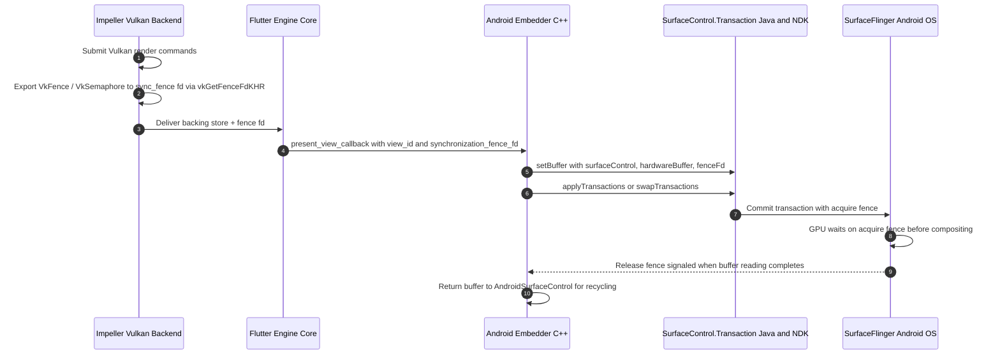

### Task Runner Configuration, Thread Priorities, and Threading Modes

The Android embedder requires custom task runners to drive engine tasks on Android OS message loops. In [`FlutterProjectArgs`](https://github.com/flutter/flutter/blob/4762dec4fc9072cd9269814ef36364f35a9a66dc/engine/src/flutter/shell/platform/embedder/embedder.h#L2480), `custom_task_runners` cannot be `nullptr`. The embedder supplies task runner delegates driving Android's main thread [`ALooper`](https://developer.android.com/ndk/reference/group/looper) / [`Looper`](https://developer.android.com/reference/android/os/Looper) (`platform_task_runner`) alongside dedicated worker task runners (`ui_task_runner`, `render_task_runner`, and `thread_priority_setter`).

Thread priority configuration on Android requires system-level tuning. In the existing architecture, [`AndroidPlatformThreadConfigSetter`](https://github.com/flutter/flutter/blob/4762dec4fc9072cd9269814ef36364f35a9a66dc/engine/src/flutter/shell/platform/android/android_shell_holder.cc#L35) (located in [`android_shell_holder.cc`](https://github.com/flutter/flutter/blob/4762dec4fc9072cd9269814ef36364f35a9a66dc/engine/src/flutter/shell/platform/android/android_shell_holder.cc#L35-L75)) uses `setpriority()` system calls to set Linux thread scheduling priorities:

```cpp
// Existing thread priority configuration in shell/platform/android/android_shell_holder.cc
static void AndroidPlatformThreadConfigSetter(
    const fml::Thread::ThreadConfig& config) {
  fml::Thread::SetCurrentThreadName(config);
  switch (config.priority) {
    case fml::Thread::ThreadPriority::kBackground: {
      fml::RequestAffinity(fml::CpuAffinity::kEfficiency);
      if (::setpriority(PRIO_PROCESS, 0, 10) != 0) {
        FML_LOG(ERROR) << "Failed to set IO task runner priority";
      }
      break;
    }
    case fml::Thread::ThreadPriority::kDisplay: {
      fml::RequestAffinity(fml::CpuAffinity::kNotEfficiency);
      if (::setpriority(PRIO_PROCESS, 0, -1) != 0) {
        FML_LOG(ERROR) << "Failed to set UI task runner priority";
      }
      break;
    }
    case fml::Thread::ThreadPriority::kRaster: {
      fml::RequestAffinity(fml::CpuAffinity::kNotEfficiency);
      if (::setpriority(PRIO_PROCESS, 0, -5) != 0) {
        if (::setpriority(PRIO_PROCESS, 0, -2) != 0) {
          FML_LOG(ERROR) << "Failed to set raster task runner priority";
        }
      }
      break;
    }
    default:
      fml::RequestAffinity(fml::CpuAffinity::kNotPerformance);
      if (::setpriority(PRIO_PROCESS, 0, 0) != 0) {
        FML_LOG(ERROR) << "Failed to set priority";
      }
  }
}
```

The C-API embedder wires [`thread_priority_setter`](https://github.com/flutter/flutter/blob/4762dec4fc9072cd9269814ef36364f35a9a66dc/engine/src/flutter/shell/platform/embedder/embedder.h#L1961) in [`FlutterCustomTaskRunners`](https://github.com/flutter/flutter/blob/4762dec4fc9072cd9269814ef36364f35a9a66dc/engine/src/flutter/shell/platform/embedder/embedder.h#L1961) to execute `setpriority()`. This reconciles the priority discrepancy between Android's embedder (which configures the IO task runner to `kNormal` priority, Linux nice value 0) and the engine-managed default (`kBackground`, Linux nice value 10).

Internal consumers relying on the `kMergeAfterLaunch` threading model are supported without adding public fields to [`embedder.h`](https://github.com/flutter/flutter/blob/4762dec4fc9072cd9269814ef36364f35a9a66dc/engine/src/flutter/shell/platform/embedder/embedder.h). The embedder passes the engine switch `--merged-platform-ui-thread=mergeAfterLaunch` via `FlutterProjectArgs.command_line_argv`. In Java, [`FlutterLoader.ensureInitializationComplete`](https://github.com/flutter/flutter/blob/4762dec4fc9072cd9269814ef36364f35a9a66dc/engine/src/flutter/shell/platform/android/io/flutter/embedding/engine/loader/FlutterLoader.java#L162) synthesizes this command-line argument dynamically from application manifest metadata and runtime configuration.

### Process-Scoped Utilities, Image Decoding, and Diagnostics C-APIs

Several Android JNI entry points in `FlutterMain` and `FlutterJNI` interact with engine utilities outside the scope of a single frame or require decoding and diagnostic primitives that previously pulled `//flutter/lib/ui`, `//flutter/txt`, `//flutter/runtime`, and `//flutter/skia` headers into `shell/platform/android/`. To sever those dependencies completely, `embedder.h` exposes five focused C-API groups:

1. **Process-Scoped Callback Cache (`//flutter/lib/ui/plugins/callback_cache.h` Severance)**: Background plugins that execute Dart entrypoints without an active `FlutterView` (such as background alarm or geofencing isolates) resolve Dart function handles via [`FlutterCallbackCache`](https://github.com/flutter/flutter/blob/4762dec4fc9072cd9269814ef36364f35a9a66dc/engine/src/flutter/lib/ui/plugins/callback_cache.h). `embedder.h` exposes process-scoped C entry points (`FlutterEngineSetCallbackCachePath`, `FlutterEngineLoadCallbackCache`, `FlutterEngineGetCallbackInformation`, and `FlutterEngineGetCallbackHandle`) along with `FlutterCallbackInformation` (`name`, `class_name`, `library_path`) so `FlutterEmbedderNative` and `FlutterMain` can query and persist callback handles without including `//flutter/lib/ui`.
2. **Hardware-Accelerated Image Decoding (`//flutter/lib/ui/painting/image_generator.h` and `//flutter/skia` Severance)**: Android API 28+ supports hardware-accelerated image decoding via `ImageDecoder`. To register platform image decoders without subclassing internal C++ `flutter::ImageGenerator` or `SkImageGenerator` types, `embedder.h` adds `FlutterEngineRegisterImageGenerator` (`FlutterImageGeneratorRegistrationInfo`, `FlutterImageGeneratorFactoryCallback`, `FlutterImageGeneratorGetInfoCallback`, and `FlutterImageGeneratorDecodeCallback`) backed by an internal `EmbedderImageLRU` cache inside `shell/platform/embedder/`.
3. **Font Manager Prefetching (`//flutter/txt` Severance)**: During `FlutterMain.init`, Android warms up the default system font manager on a background worker. `FlutterEnginePrefetchDefaultFontManager()` exposes this one-time initialization in `embedder.h` so `flutter_main.cc` no longer includes `flutter/txt/src/txt/platform.h`.
4. **VM Service URI Discovery (`//flutter/runtime/dart_service_isolate.h` Severance)**: Tooling and integration tests discover the Dart VM Service observatory URL via `FlutterJNI.getVMServiceUri`. `FlutterEngineRegisterVMServiceUriCallback` and `FlutterEngineDeregisterVMServiceUriCallback` deliver the URI string asynchronously via a `FlutterVMServiceUriCallback` handle, removing the last `//flutter/runtime` header from `shell/platform/android/`.
5. **Synchronous Rasterizer Screenshots**: `FlutterEngineScreenshot` and `FlutterEngineFreeScreenshot` capture uncompressed RGBA pixel buffers (`FlutterEngineScreenshotData`) from the active rasterizer to service `FlutterJNI.takeScreenshot` without reaching into `flutter::Rasterizer::Screenshot`.

### Platform Channel Messaging, Background Handlers, and Task Queues

In the existing Android architecture, [`PlatformMessageHandlerAndroid::DoesHandlePlatformMessageOnPlatformThread`](https://github.com/flutter/flutter/blob/4762dec4fc9072cd9269814ef36364f35a9a66dc/engine/src/flutter/shell/platform/android/platform_message_handler_android.h#L23-L25) returns `false` to permit message dispatch from arbitrary threads:

```cpp
// Existing Android message dispatch in shell/platform/android/platform_message_handler_android.h
class PlatformMessageHandlerAndroid : public PlatformMessageHandler {
 public:
  bool DoesHandlePlatformMessageOnPlatformThread() const override {
    return false;
  }
  void HandlePlatformMessage(std::unique_ptr<PlatformMessage> message) override;
};
```

In [`platform_message_handler_android.cc`](https://github.com/flutter/flutter/blob/4762dec4fc9072cd9269814ef36364f35a9a66dc/engine/src/flutter/shell/platform/android/platform_message_handler_android.cc), [`HandlePlatformMessage`](https://github.com/flutter/flutter/blob/4762dec4fc9072cd9269814ef36364f35a9a66dc/engine/src/flutter/shell/platform/android/platform_message_handler_android.h) dispatches the message directly across JNI without posting to the platform thread first:

```cpp
// Existing Android message dispatch in shell/platform/android/platform_message_handler_android.cc
void PlatformMessageHandlerAndroid::HandlePlatformMessage(
    std::unique_ptr<flutter::PlatformMessage> message) {
  // Called from any thread.
  int response_id = next_response_id_.fetch_add(1);
  if (auto response = message->response()) {
    std::lock_guard lock(pending_responses_mutex_);
    pending_responses_[response_id] = response;
  }
  jni_facade_->FlutterViewHandlePlatformMessage(std::move(message),
                                                response_id);
}
```

In contrast, desktop embedders using [`embedder.h`](https://github.com/flutter/flutter/blob/4762dec4fc9072cd9269814ef36364f35a9a66dc/engine/src/flutter/shell/platform/embedder/embedder.h) return `true` (enforcing platform-thread handling in [`PlatformViewEmbedder`](https://github.com/flutter/flutter/blob/4762dec4fc9072cd9269814ef36364f35a9a66dc/engine/src/flutter/shell/platform/embedder/platform_view_embedder.cc#L34-L36)):

```cpp
// Desktop embedder behavior in shell/platform/embedder/platform_view_embedder.cc
virtual bool DoesHandlePlatformMessageOnPlatformThread() const {
  return true;
}
```

Forcing mobile platforms to conform to desktop's `true` model would introduce severe performance and architectural regressions.

#### Architectural Rationale for Off-Platform-Thread Dispatch

Returning `false` provides two critical architectural capabilities on mobile platforms:

1. **Zero Main-Thread Contention for Background Channels**: Flutter plugins handling high-bandwidth or compute-heavy workloads (such as camera stream ingestion, local database operations via SQLite, network responses, and cryptography) register background task queues via `BinaryMessenger.makeBackgroundTaskQueue()`. Because message dispatch does not force an intermediate hop to the platform thread, this traffic bypasses Android's main [`Looper`](https://developer.android.com/reference/android/os/Looper) entirely. The platform main thread remains dedicated to view layout, input processing, and frame presentation.
2. **Elimination of Latency and Head-of-Line Blocking**: Forcing a hop from the engine UI thread through the platform thread before dispatching to a background worker pool introduces an extra event loop dispatch cycle and thread context switch. If the Android main thread is blocked performing expensive view inflation or layout measurement passes, background channel execution stalls behind that work, which negates the advantage of offloading work to background workers.

#### C-ABI Specification

To reconcile this discrepancy without breaking existing desktop embedders, [`embedder.h`](https://github.com/flutter/flutter/blob/4762dec4fc9072cd9269814ef36364f35a9a66dc/engine/src/flutter/shell/platform/embedder/embedder.h) introduces an explicit configuration field and an extended callback:

```c
/// Callback invoked when the engine delivers a platform message from Dart.
/// When does_handle_platform_messages_on_platform_thread is false, this
/// callback may be invoked from any thread (typically the engine UI thread).
/// Embedders are responsible for dispatching to the appropriate task runner
/// or background worker pool.
typedef void (*FlutterPlatformMessageCallback2)(
    const FlutterPlatformMessage* message,
    void* user_data);
```

In [`FlutterProjectArgs`](https://github.com/flutter/flutter/blob/4762dec4fc9072cd9269814ef36364f35a9a66dc/engine/src/flutter/shell/platform/embedder/embedder.h#L2480):

```c
  /// When true (or zero-initialized default for legacy embedders), the engine
  /// routes all incoming platform messages to the platform task runner before
  /// invoking platform_message_callback.
  ///
  /// When false, the engine invokes platform_message_callback2 (or
  /// platform_message_callback) directly on the originating thread
  /// (typically the UI task runner) so the embedder can route
  /// directly to background worker queues without platform thread hopping.
  bool does_handle_platform_messages_on_platform_thread;
```

#### Android and iOS Cross-Platform Parity

This configuration field satisfies both mobile embedder targets:

- **Zero-Initialization Safety**: Existing desktop embedders (Linux, macOS, Windows) zero-initialize `FlutterProjectArgs`, which defaults the field to `true` and preserves their single-threaded platform message assumptions.
- **Mobile Embedder Parity**: Both Android and iOS explicitly set `does_handle_platform_messages_on_platform_thread = false`. On iOS, `PlatformMessageHandlerIos::DoesHandlePlatformMessageOnPlatformThread()` returns `false` to dispatch directly to custom task queues or background GCD dispatch queues. On Android, incoming messages delivered to [`FlutterPlatformMessageCallback2`](#platform-channel-messaging-background-handlers-and-task-queues) on the UI thread inspect registered channel handlers in [`DartMessenger`](https://github.com/flutter/flutter/blob/4762dec4fc9072cd9269814ef36364f35a9a66dc/engine/src/flutter/shell/platform/android/io/flutter/embedding/engine/dart/DartMessenger.java#L32):
  - If registered with a `BinaryMessenger.TaskQueue`, the task is dispatched directly to that queue's background executor pool.
  - If registered on the default queue, the task posts to the Android platform [`Looper`](https://developer.android.com/reference/android/os/Looper).
  - Responses submitted via [`FlutterEngineSendPlatformMessageResponse`](https://github.com/flutter/flutter/blob/4762dec4fc9072cd9269814ef36364f35a9a66dc/engine/src/flutter/shell/platform/embedder/embedder.h#L3133) execute safely from any thread without main-thread hops.

For empty platform messages, the C-API guarantees that a message where `message_size == 0` and `message == nullptr` is delivered to the framework as an empty byte buffer without triggering null-pointer dereferences or serialization assertions.

### Pointer Input Events, Viewport Metrics, and System Configuration

#### Pointer Input Events

Input events processed in [`AndroidTouchProcessor.java`](https://github.com/flutter/flutter/blob/4762dec4fc9072cd9269814ef36364f35a9a66dc/engine/src/flutter/shell/platform/android/io/flutter/embedding/android/AndroidTouchProcessor.java#L434) provide axis and device metadata. The C-API embedder populates [`FlutterPointerEvent`](https://github.com/flutter/flutter/blob/4762dec4fc9072cd9269814ef36364f35a9a66dc/engine/src/flutter/shell/platform/embedder/embedder.h#L1377) with:

- Device kind: `kFlutterPointerDeviceKindTouch`, `kFlutterPointerDeviceKindMouse`, `kFlutterPointerDeviceKindStylus`, or `kFlutterPointerDeviceKindTrackpad`.
- Axis values: `tilt`, `orientation`, `pressure`, and secondary scroll axes.
- Button states: `kFlutterPointerButtonMousePrimary`, `kFlutterPointerButtonMouseSecondary`, and stylus button bitmasks.

#### Viewport Metrics, Edge-to-Edge Insets, and Foldables

Android delivers window configuration metrics through [`FlutterJNI.nativeSetViewportMetrics`](https://github.com/flutter/flutter/blob/4762dec4fc9072cd9269814ef36364f35a9a66dc/engine/src/flutter/shell/platform/android/platform_view_android_jni_impl.cc#L334-L433):

- Physical padding (status bar, navigation bar, display cutouts)
- Physical view insets (software IME keyboard)
- System gesture insets (Android 10+ edge back gestures)
- Physical touch slop threshold for scroll disambiguation
- Physical display corner radii
- Display features (hinge bounds, display feature types, and device posture state)

[`FlutterWindowMetricsEvent`](https://github.com/flutter/flutter/blob/4762dec4fc9072cd9269814ef36364f35a9a66dc/engine/src/flutter/shell/platform/embedder/embedder.h#L1062-L1110) in `embedder.h` historically provided only `width`, `height`, and `pixel_ratio`.

Rather than creating a separate struct, `FlutterWindowMetricsEvent` is extended directly in place:

1. `FlutterWindowMetricsEvent` contains a `struct_size` field and is passed by pointer (`const FlutterWindowMetricsEvent* event`).
2. This follows the existing precedent in [`embedder.h`](https://github.com/flutter/flutter/blob/4762dec4fc9072cd9269814ef36364f35a9a66dc/engine/src/flutter/shell/platform/embedder/embedder.h), which appended window constraint fields directly to `FlutterWindowMetricsEvent`.
3. Engine implementations use `SAFE_ACCESS(event, member, default_value)` to read new fields, which guarantees that existing desktop embedders passing the baseline struct size continue to work without modification.

```c
typedef struct {
  double left;
  double top;
  double right;
  double bottom;
} FlutterRectInsets;

typedef enum {
  kFlutterDisplayFeatureTypeUnknown = 0,
  kFlutterDisplayFeatureTypeFold = 1,
  kFlutterDisplayFeatureTypeHinge = 2,
  kFlutterDisplayFeatureTypeCutout = 3,
} FlutterDisplayFeatureType;

typedef enum {
  kFlutterDisplayFeatureStateUnknown = 0,
  kFlutterDisplayFeatureStatePostureFlat = 1,
  kFlutterDisplayFeatureStatePostureHalfOpened = 2,
} FlutterDisplayFeatureState;

typedef struct {
  size_t struct_size;
  FlutterRect bounds;
  FlutterDisplayFeatureType type;
  FlutterDisplayFeatureState state;
} FlutterDisplayFeature;
```

The following fields are appended to [`FlutterWindowMetricsEvent`](https://github.com/flutter/flutter/blob/4762dec4fc9072cd9269814ef36364f35a9a66dc/engine/src/flutter/shell/platform/embedder/embedder.h#L1062-L1110):

```c
  /// Physical window padding (for example, status bar, navigation bar, cutouts).
  FlutterRectInsets physical_padding;

  /// System gesture insets (for example, Android 10+ edge back gestures).
  FlutterRectInsets physical_system_gesture_insets;

  /// Physical touch slop threshold for scroll disambiguation.
  double physical_touch_slop;

  /// Display corner radii in physical pixels.
  double display_corner_radius_top_left;
  double display_corner_radius_top_right;
  double display_corner_radius_bottom_right;
  double display_corner_radius_bottom_left;

  /// Number of display features in the `display_features` array.
  size_t display_features_count;

  /// Array of physical display features (foldable hinges, cutouts).
  const FlutterDisplayFeature* display_features;
```

#### System Channels: Locale and Non-Linear Font Scaling

Features that communicate standard framework and platform configuration use platform message channels rather than custom additions to `embedder.h`:

1. **Locale Configuration**: The embedder uses the standard `flutter/localization` platform message channel ([`LocalizationChannel.java`](https://github.com/flutter/flutter/blob/4762dec4fc9072cd9269814ef36364f35a9a66dc/engine/src/flutter/shell/platform/android/io/flutter/embedding/engine/systemchannels/LocalizationChannel.java#L61-L97)). In the engine ([`embedder.cc:3423-3480`](https://github.com/flutter/flutter/blob/4762dec4fc9072cd9269814ef36364f35a9a66dc/engine/src/flutter/shell/platform/embedder/embedder.cc#L3423-L3480)), [`FlutterEngineUpdateLocales`](https://github.com/flutter/flutter/blob/4762dec4fc9072cd9269814ef36364f35a9a66dc/engine/src/flutter/shell/platform/embedder/embedder.h#L3552) serializes locale data into a JSON message on this channel. No new C-API entry point is added for locale settings.

2. **Android 14+ Non-Linear Font Scaling**: Android 14 (API level 34+) uses non-linear font scaling curves so that large typography scales at lower ratios than body text, which prevents UI clipping. In the legacy architecture, this was serviced through a synchronous JNI query ([`PlatformDispatcher`](https://api.flutter.dev/flutter/dart-ui/PlatformDispatcher-class.html).`_getScaledFontSize` -> [`PlatformView::GetScaledFontSize`](https://github.com/flutter/flutter/blob/4762dec4fc9072cd9269814ef36364f35a9a66dc/engine/src/flutter/shell/common/platform_view.h)), which does not exist in `PlatformViewEmbedder` and triggers `FML_UNREACHABLE()`.

   To support non-linear scaling without synchronous engine queries or new C-APIs, the existing `flutter/settings` channel ([`SettingsChannel.java`](https://github.com/flutter/flutter/blob/4762dec4fc9072cd9269814ef36364f35a9a66dc/engine/src/flutter/shell/platform/android/io/flutter/embedding/engine/systemchannels/SettingsChannel.java)) is extended:

   - During startup and configuration changes, the embedder extracts curve sample points from Android's [`FontScaleConverter`](https://github.com/flutter/flutter/blob/4762dec4fc9072cd9269814ef36364f35a9a66dc/engine/src/flutter/shell/platform/android/io/flutter/view/FontScaleConverter.java) and includes them in the `flutter/settings` message payload:

     ```json
     {
       "textScaleFactor": 1.15,
       "platformBrightness": "light",
       "alwaysUse24HourFormat": false,
       "fontScaleCurves": [
         {"unscaled": 8.0, "scaled": 9.2},
         {"unscaled": 14.0, "scaled": 15.4},
         {"unscaled": 20.0, "scaled": 21.0}
       ]
     }
     ```

   - Dart's [`PlatformDispatcher`](https://api.flutter.dev/flutter/dart-ui/PlatformDispatcher-class.html) caches these sample points and interpolates scaled font sizes locally in Dart. This avoids synchronous JNI calls during text layout and resolves the `FML_UNREACHABLE()` abort under `embedder.h`.

## Target Architecture and Design Principles

The target architecture establishes a strict C-ABI boundary between the Android embedder and the engine core, replacing the legacy `AndroidShellHolder` and `PlatformViewAndroid` hierarchy with `FlutterEmbedderNative` and modular, single-responsibility C-API components.

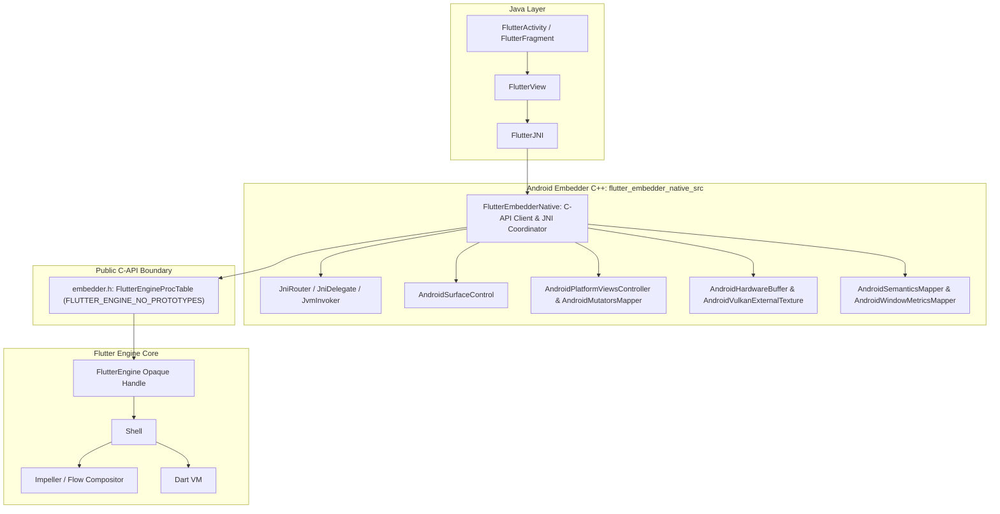

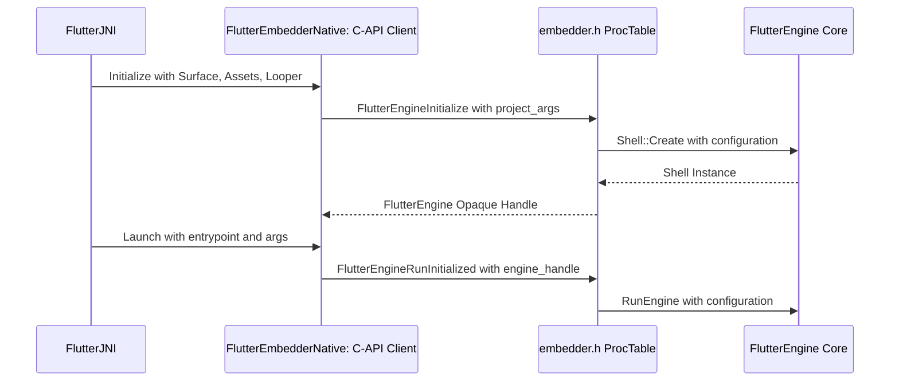

### Pure Embedder API Client (`FLUTTER_ENGINE_NO_PROTOTYPES`)

In the target architecture:

- `FlutterEmbedderNative` holds only an opaque [`FLUTTER_API_SYMBOL(FlutterEngine)`](https://github.com/flutter/flutter/blob/4762dec4fc9072cd9269814ef36364f35a9a66dc/engine/src/flutter/shell/platform/embedder/embedder.h#L1523) handle and dispatches all engine calls through an initialized `FlutterEngineProcTable` (`FlutterEngineGetProcAddresses`).
- The `:flutter_embedder_native_src` GN source set compiles with `defines = [ "FLUTTER_ENGINE_NO_PROTOTYPES" ]`. This enforces at compile time that all C-API symbols are invoked through the function pointer table rather than direct static symbol linkage.
- Event dispatch (touch, window metrics, platform messages, accessibility actions) calls public functions: [`FlutterEngineSendPointerEvent`](https://github.com/flutter/flutter/blob/4762dec4fc9072cd9269814ef36364f35a9a66dc/engine/src/flutter/shell/platform/embedder/embedder.h#L3082), [`FlutterEngineSendWindowMetricsEvent`](https://github.com/flutter/flutter/blob/4762dec4fc9072cd9269814ef36364f35a9a66dc/engine/src/flutter/shell/platform/embedder/embedder.h#L3077), [`FlutterEngineSendPlatformMessage`](https://github.com/flutter/flutter/blob/4762dec4fc9072cd9269814ef36364f35a9a66dc/engine/src/flutter/shell/platform/embedder/embedder.h#L3114), and [`FlutterEngineSendSemanticsAction`](https://github.com/flutter/flutter/blob/4762dec4fc9072cd9269814ef36364f35a9a66dc/engine/src/flutter/shell/platform/embedder/embedder.h#L3398).
- Engine initialization delegates thread creation to the engine via [`FlutterEngineInitialize`](https://github.com/flutter/flutter/blob/4762dec4fc9072cd9269814ef36364f35a9a66dc/engine/src/flutter/shell/platform/embedder/embedder.h#L2970) and [`FlutterEngineRunInitialized`](https://github.com/flutter/flutter/blob/4762dec4fc9072cd9269814ef36364f35a9a66dc/engine/src/flutter/shell/platform/embedder/embedder.h#L3006).

### Decomposition and Elimination of [`AndroidShellHolder`](https://github.com/flutter/flutter/blob/4762dec4fc9072cd9269814ef36364f35a9a66dc/engine/src/flutter/shell/platform/android/android_shell_holder.h#L38) and [`PlatformViewAndroid`](https://github.com/flutter/flutter/blob/4762dec4fc9072cd9269814ef36364f35a9a66dc/engine/src/flutter/shell/platform/android/platform_view_android.h#L43)

In the legacy architecture, the native Android embedding is split across three tightly coupled classes that reach directly into 9 internal engine subsystems (98 internal headers):

1. [`PlatformViewAndroidJNIImpl`](https://github.com/flutter/flutter/blob/4762dec4fc9072cd9269814ef36364f35a9a66dc/engine/src/flutter/shell/platform/android/platform_view_android_jni_impl.cc): A monolithic JNI binding file that directly casts `jlong` handles to `AndroidShellHolder*` and calls internal C++ methods across `Shell` and `PlatformViewAndroid`.
2. [`AndroidShellHolder`](https://github.com/flutter/flutter/blob/4762dec4fc9072cd9269814ef36364f35a9a66dc/engine/src/flutter/shell/platform/android/android_shell_holder.h#L38): The legacy C++ orchestrator instantiated by [`FlutterJNI`](https://github.com/flutter/flutter/blob/4762dec4fc9072cd9269814ef36364f35a9a66dc/engine/src/flutter/shell/platform/android/io/flutter/embedding/engine/FlutterJNI.java#L108). It allocates `fml::ThreadHost`, instantiates [`flutter::Shell`](https://github.com/flutter/flutter/blob/4762dec4fc9072cd9269814ef36364f35a9a66dc/engine/src/flutter/shell/common/shell.h#L113), and owns [`PlatformViewAndroid`](https://github.com/flutter/flutter/blob/4762dec4fc9072cd9269814ef36364f35a9a66dc/engine/src/flutter/shell/platform/android/platform_view_android.h#L43).
3. [`PlatformViewAndroid`](https://github.com/flutter/flutter/blob/4762dec4fc9072cd9269814ef36364f35a9a66dc/engine/src/flutter/shell/platform/android/platform_view_android.h#L43): An internal engine class subclassing [`flutter::PlatformView`](https://github.com/flutter/flutter/blob/4762dec4fc9072cd9269814ef36364f35a9a66dc/engine/src/flutter/shell/common/platform_view.h) that centralizes window surfaces, platform view composition, external textures, and semantics.

In the completed target architecture, `AndroidShellHolder`, `PlatformViewAndroid`, and `PlatformViewAndroidJNIImpl` are completely deleted. In their place, `:flutter_embedder_native_src` organizes the Android embedder into a clean coordinator-component architecture:

- `FlutterEmbedderNative` (`flutter_embedder_native.cc` / `flutter_embedder_native.h`): Is the exclusive top-level JNI coordinator (`FlutterEmbedderNative::RegisterJni(env)` in `library_loader.cc`). It owns the opaque [`FLUTTER_API_SYMBOL(FlutterEngine)`](https://github.com/flutter/flutter/blob/4762dec4fc9072cd9269814ef36364f35a9a66dc/engine/src/flutter/shell/platform/embedder/embedder.h#L1523) handle, manages the `FlutterEngineProcTable`, and coordinates the modular subsystem components.
- `JniRouter`, `JniDelegate`, and `JvmInvoker` (`jni_router.h`, `jni_delegate.h`, `jvm_invoker.h`): Decouple outbound C++-to-Java JNI invocations from live Android `JNIEnv*` state through injectable delegate and provider interfaces (`FlutterJniProvider`, `HardwareBufferProvider`, `SurfaceControlProvider`, `SurfaceTransactionProvider`, and `ChoreographerProvider`). This allows the entire C-API embedder (`flutter_embedder_native_unittests`) to be unit-tested on the host machine without an Android JVM or device.
- `AndroidSurfaceControl` (`android_surface_control.cc`): Coordinates native window surfaces ([`ANativeWindow`](https://developer.android.com/ndk/reference/group/a-native-window)) and NDK [`ASurfaceControl`](https://developer.android.com/ndk/reference/group/surface-control) / [`ASurfaceTransaction`](https://developer.android.com/ndk/reference/group/surface-control) pipelines keyed by `FlutterViewId`, enforces synchronous surface destruction contracts before [`surfaceDestroyed()`](https://developer.android.com/reference/android/view/SurfaceHolder.Callback#surfaceDestroyed(android.view.SurfaceHolder)) returns, and suspends GPU command submission during application backgrounding via `FlutterEngineSetGpuAvailability`.
- `AndroidPlatformViewsController` and `AndroidMutatorsMapper` (`android_platform_views_controller.cc`, `android_mutators_mapper.cc`): Manage platform view composition across Hybrid Composition++ (HCPP via `SurfaceControl` on API 34+) and Texture Layer Hybrid Composition (TLHC), deserialize `FlutterPlatformViewMutation` arrays, capture per-`FlutterViewId` frame state by value to prevent cross-thread multi-view races, and attach presentation sync fences (`synchronization_fence_fd`).
- `AndroidHardwareBuffer` and `AndroidVulkanExternalTexture` (`android_hardware_buffer.cc`, `android_vulkan_external_texture.cc`): Manage [`SurfaceTexture`](https://developer.android.com/reference/android/graphics/SurfaceTexture) (OpenGL ES) with 4x4 UV transformation matrices (`FlutterOpenGLTexture2`) and zero-copy [`SurfaceProducer`](https://github.com/flutter/flutter/blob/4762dec4fc9072cd9269814ef36364f35a9a66dc/engine/src/flutter/shell/platform/android/io/flutter/view/TextureRegistry.java#L21) ([`AHardwareBuffer`](https://developer.android.com/ndk/reference/group/a-hardware-buffer) / Vulkan) texture callbacks (`FlutterVulkanExternalTextureFrameCallback` and `FlutterHardwareBufferExternalTextureFrameCallback`).
- `AndroidSemanticsMapper` and `AndroidWindowMetricsMapper` (`android_semantics_mapper.cc`, `android_window_metrics_mapper.cc`): Translate `FlutterSemanticsUpdate2` trees into JNI byte buffers for Java `AccessibilityBridge` and pack viewport metrics, insets, corner radii, and foldable display features into `FlutterWindowMetricsEvent`.
- `AndroidVsyncWaiter` (`android_vsync_waiter.cc`): Bridges Android NDK [`AChoreographer`](https://developer.android.com/ndk/reference/group/choreographer) and Java [`Choreographer`](https://developer.android.com/reference/android/view/Choreographer) frame callbacks to `FlutterProjectArgs.vsync_callback` and forwards frame pacing timestamps via `FlutterEngineOnVsync`.
- `AndroidVMInit` and `AndroidEngineGroup` (`android_vm_init.cc`, `android_engine_group.cc`): Coordinate initial Dart VM argument synthesis, Linux thread priority tuning (`thread_priority_setter`), and multi-engine group spawning via `FlutterEngineSpawn`.
- `APKAssetProvider` (`apk_asset_provider.cc`): Implements `FlutterCustomAssetResolver` to stream kernel blobs and application assets directly from Android APK or AAB archives via NDK [`AAssetManager`](https://developer.android.com/ndk/reference/group/asset) memory mapping without disk extraction.

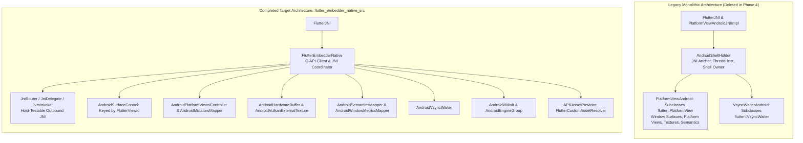

#### Mapping Embedder C-APIs to Target Architecture Components

The extensions to [`embedder.h`](https://github.com/flutter/flutter/blob/4762dec4fc9072cd9269814ef36364f35a9a66dc/engine/src/flutter/shell/platform/embedder/embedder.h) correspond directly to severing private engine headers and uncoupling each internal subsystem into an independent target component:

| Target Component | Eliminated Internal Engine Dependencies | Required Embedder C-API Additions | Architectural Decoupling Benefit |
| :--- | :--- | :--- | :--- |
| **`FlutterEmbedderNative`, `AndroidVMInit`, and `AndroidEngineGroup`** | [`//flutter/shell/common`](https://github.com/flutter/flutter/tree/4762dec4fc9072cd9269814ef36364f35a9a66dc/engine/src/flutter/shell/common) ([`shell.h`](https://github.com/flutter/flutter/blob/4762dec4fc9072cd9269814ef36364f35a9a66dc/engine/src/flutter/shell/common/shell.h), [`run_configuration.h`](https://github.com/flutter/flutter/blob/4762dec4fc9072cd9269814ef36364f35a9a66dc/engine/src/flutter/shell/common/run_configuration.h))<br>[`//flutter/runtime`](https://github.com/flutter/flutter/tree/4762dec4fc9072cd9269814ef36364f35a9a66dc/engine/src/flutter/runtime) ([`dart_vm.h`](https://github.com/flutter/flutter/blob/4762dec4fc9072cd9269814ef36364f35a9a66dc/engine/src/flutter/runtime/dart_vm.h), [`dart_service_isolate.h`](https://github.com/flutter/flutter/blob/4762dec4fc9072cd9269814ef36364f35a9a66dc/engine/src/flutter/runtime/dart_service_isolate.h))<br>[`//flutter/lib/ui`](https://github.com/flutter/flutter/tree/4762dec4fc9072cd9269814ef36364f35a9a66dc/engine/src/flutter/lib/ui) ([`platform_message.h`](https://github.com/flutter/flutter/blob/4762dec4fc9072cd9269814ef36364f35a9a66dc/engine/src/flutter/lib/ui/window/platform_message.h), [`callback_cache.h`](https://github.com/flutter/flutter/blob/4762dec4fc9072cd9269814ef36364f35a9a66dc/engine/src/flutter/lib/ui/plugins/callback_cache.h), [`image_generator.h`](https://github.com/flutter/flutter/blob/4762dec4fc9072cd9269814ef36364f35a9a66dc/engine/src/flutter/lib/ui/painting/image_generator.h))<br>[`//flutter/txt`](https://github.com/flutter/flutter/tree/4762dec4fc9072cd9269814ef36364f35a9a66dc/engine/src/flutter/txt) | - `FlutterEngineInitialize` / `FlutterEngineRunInitialized`<br>- [`FlutterEngineSpawn`](#multi-engine-spawning-and-add-to-app-flutterenginespawn) (`FlutterEngineSpawnConfig`)<br>- `FlutterProjectArgs.does_handle_platform_messages_on_platform_thread`<br>- [`FlutterPlatformMessageCallback2`](#platform-channel-messaging-background-handlers-and-task-queues)<br>- `FlutterEngineLoadDartDeferredLibrary` & `FlutterEngineNotifyDartDeferredLibraryLoadError`<br>- `FlutterEngineRegisterImageGenerator`<br>- `FlutterEngineGetCallbackInformation`, `SetCallbackCachePath`, `LoadCallbackCache`, `GetCallbackHandle`<br>- `FlutterEnginePrefetchDefaultFontManager` & `FlutterEngineRegisterVMServiceUriCallback` | Holds only an opaque handle [`FLUTTER_API_SYMBOL(FlutterEngine)`](https://github.com/flutter/flutter/blob/4762dec4fc9072cd9269814ef36364f35a9a66dc/engine/src/flutter/shell/platform/embedder/embedder.h#L1523) invoked via `FlutterEngineProcTable` (`FLUTTER_ENGINE_NO_PROTOTYPES`). Completely eliminates `AndroidShellHolder` and `PlatformViewAndroid`. |
| **`AndroidSurfaceControl`** | [`//flutter/shell/common`](https://github.com/flutter/flutter/tree/4762dec4fc9072cd9269814ef36364f35a9a66dc/engine/src/flutter/shell/common) ([`platform_view.h`](https://github.com/flutter/flutter/blob/4762dec4fc9072cd9269814ef36364f35a9a66dc/engine/src/flutter/shell/common/platform_view.h), [`rasterizer.h`](https://github.com/flutter/flutter/blob/4762dec4fc9072cd9269814ef36364f35a9a66dc/engine/src/flutter/shell/common/rasterizer.h))<br>[`//flutter/impeller`](https://github.com/flutter/flutter/tree/4762dec4fc9072cd9269814ef36364f35a9a66dc/engine/src/flutter/impeller) (context setup headers)<br>[`//flutter/vulkan`](https://github.com/flutter/flutter/tree/4762dec4fc9072cd9269814ef36364f35a9a66dc/engine/src/flutter/vulkan) ([`vulkan_native_surface_android.h`](https://github.com/flutter/flutter/blob/4762dec4fc9072cd9269814ef36364f35a9a66dc/engine/src/flutter/vulkan/vulkan_native_surface_android.h)) | - [`FlutterEngineNotifyCreated`](https://github.com/flutter/flutter/blob/4762dec4fc9072cd9269814ef36364f35a9a66dc/engine/src/flutter/shell/platform/embedder/embedder.h) & [`FlutterEngineNotifyDestroyed`](https://github.com/flutter/flutter/blob/4762dec4fc9072cd9269814ef36364f35a9a66dc/engine/src/flutter/shell/platform/embedder/embedder.h)<br>- [`FlutterEngineAddView`](https://github.com/flutter/flutter/blob/4762dec4fc9072cd9269814ef36364f35a9a66dc/engine/src/flutter/shell/platform/embedder/embedder.h#L3048) & [`FlutterEngineRemoveView`](https://github.com/flutter/flutter/blob/4762dec4fc9072cd9269814ef36364f35a9a66dc/engine/src/flutter/shell/platform/embedder/embedder.h#L3062)<br>- [`FlutterEngineSetGpuAvailability`](#renderer-availability-multi-window-lifecycle-and-flutterviewid-keying) (`FlutterGpuAvailability`)<br>- `FlutterOpenGLRendererConfig` & `FlutterVulkanRendererConfig` | Replaces protected surface methods on `PlatformViewAndroid`. Keys native surfaces (`ANativeWindow*`, `ASurfaceControl*`) by `FlutterViewId` for multi-window support and coordinates GPU suspension during backgrounding. |
| **`AndroidPlatformViewsController` and `AndroidMutatorsMapper`** | [`//flutter/flow`](https://github.com/flutter/flutter/tree/4762dec4fc9072cd9269814ef36364f35a9a66dc/engine/src/flutter/flow) ([`embedded_views.h`](https://github.com/flutter/flutter/blob/4762dec4fc9072cd9269814ef36364f35a9a66dc/engine/src/flutter/flow/embedded_views.h), [`surface.h`](https://github.com/flutter/flutter/blob/4762dec4fc9072cd9269814ef36364f35a9a66dc/engine/src/flutter/flow/surface.h))<br>[`//flutter/fml`](https://github.com/flutter/flutter/tree/4762dec4fc9072cd9269814ef36364f35a9a66dc/engine/src/flutter/fml) ([`raster_thread_merger.h`](https://github.com/flutter/flutter/blob/4762dec4fc9072cd9269814ef36364f35a9a66dc/engine/src/flutter/fml/raster_thread_merger.h)) | - `FlutterCompositor` (`create_backing_store_callback`, `present_view_callback`)<br>- `FlutterPlatformView` (`mutations`)<br>- `FlutterPlatformViewMutation` and `FlutterPath`<br>- `FlutterBackingStorePresentInfo.synchronization_fence_fd` | Unifies platform view composition behind `FlutterCompositor` without subclassing `flutter::ExternalViewEmbedder`. Captures per-`FlutterViewId` frame state by value and eliminates `external_view_embedder/` and `fml::RasterThreadMerger`. |
| **`AndroidHardwareBuffer` and `AndroidVulkanExternalTexture`** | [`//flutter/common/graphics`](https://github.com/flutter/flutter/tree/4762dec4fc9072cd9269814ef36364f35a9a66dc/engine/src/flutter/common/graphics) ([`texture.h`](https://github.com/flutter/flutter/blob/4762dec4fc9072cd9269814ef36364f35a9a66dc/engine/src/flutter/common/graphics/texture.h), [`gl_context_switch.h`](https://github.com/flutter/flutter/blob/4762dec4fc9072cd9269814ef36364f35a9a66dc/engine/src/flutter/common/graphics/gl_context_switch.h)) | - [`FlutterVulkanExternalTexture`](#external-textures-zero-copy-vulkan-and-opengl-es) and [`FlutterVulkanExternalTextureFrameCallback`](#external-textures-zero-copy-vulkan-and-opengl-es)<br>- [`FlutterHardwareBufferExternalTextureFrameCallback`](#external-textures-zero-copy-vulkan-and-opengl-es)<br>- [`FlutterOpenGLTexture2`](#external-textures-zero-copy-vulkan-and-opengl-es) (`uv_transform`)<br>- [`FlutterEngineMarkExternalTextureFrameAvailable`](https://github.com/flutter/flutter/blob/4762dec4fc9072cd9269814ef36364f35a9a66dc/engine/src/flutter/shell/platform/embedder/embedder.h#L3250) | Eliminates subclassing of internal C++ `flutter::Texture`. Supports zero-copy `AHardwareBuffer` Vulkan texture import and delivers 4x4 UV transformation matrices for `SurfaceTexture` camera and video streams. |
| **`AndroidSemanticsMapper` and `AndroidWindowMetricsMapper`** | [`//flutter/flow`](https://github.com/flutter/flutter/tree/4762dec4fc9072cd9269814ef36364f35a9a66dc/engine/src/flutter/flow) ([`flow/semantics/semantics_node.h`](https://github.com/flutter/flutter/blob/4762dec4fc9072cd9269814ef36364f35a9a66dc/engine/src/flutter/flow/semantics/semantics_node.h))<br>[`//flutter/lib/ui/window/viewport_metrics.h`](https://github.com/flutter/flutter/blob/4762dec4fc9072cd9269814ef36364f35a9a66dc/engine/src/flutter/lib/ui/window/viewport_metrics.h) | - [`FlutterSemanticsNode2`](https://github.com/flutter/flutter/blob/4762dec4fc9072cd9269814ef36364f35a9a66dc/engine/src/flutter/shell/platform/embedder/embedder.h#L1730-L1783) in-place extension<br>- `FlutterWindowMetricsEvent` in-place extension (`FlutterDisplayFeature`, `FlutterRectInsets`) | Delivers complete accessibility semantics metadata to Java `AccessibilityBridge` and foldable/edge-to-edge metrics to the engine without coupling to internal Flow or `lib/ui` headers. |
| **`APKAssetProvider`** | [`//flutter/assets`](https://github.com/flutter/flutter/tree/4762dec4fc9072cd9269814ef36364f35a9a66dc/engine/src/flutter/assets) ([`asset_resolver.h`](https://github.com/flutter/flutter/blob/4762dec4fc9072cd9269814ef36364f35a9a66dc/engine/src/flutter/assets/asset_resolver.h)) | - `FlutterCustomAssetResolver` & `FlutterAssetResolverRegistrationInfo`<br>- `FlutterAssetMapping`<br>- `FlutterEngineRegisterAssetResolver` & `FlutterEngineUpdateAssetResolverByType` | Decouples APK asset loading from internal `flutter::AssetResolver` C++ virtual tables while preserving zero-copy NDK `AAssetManager` memory mapping. |
| **`AndroidVsyncWaiter`** | [`//flutter/shell/common`](https://github.com/flutter/flutter/tree/4762dec4fc9072cd9269814ef36364f35a9a66dc/engine/src/flutter/shell/common) ([`vsync_waiter.h`](https://github.com/flutter/flutter/blob/4762dec4fc9072cd9269814ef36364f35a9a66dc/engine/src/flutter/shell/common/vsync_waiter.h#L24)) | None (uses existing [`FlutterProjectArgs.vsync_callback`](https://github.com/flutter/flutter/blob/4762dec4fc9072cd9269814ef36364f35a9a66dc/engine/src/flutter/shell/platform/embedder/embedder.h#L2689) and [`FlutterEngineOnVsync`](https://github.com/flutter/flutter/blob/4762dec4fc9072cd9269814ef36364f35a9a66dc/engine/src/flutter/shell/platform/embedder/embedder.h#L3439)) | Replaces internal inheritance from `flutter::VsyncWaiter`. Interacts with Android `AChoreographer` and Java `Choreographer` to forward vsync frame start and target timestamps to `FlutterEngineOnVsync`. |

## Phased Implementation Strategy

To maintain continuous test coverage and avoid architectural traps, the migration executes in four sequential phases:

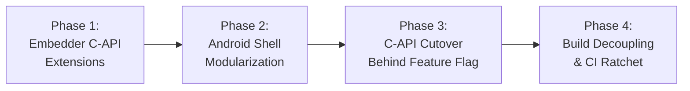

### Phase 1: Embedder C-API Extensions ([`embedder.h`](https://github.com/flutter/flutter/blob/4762dec4fc9072cd9269814ef36364f35a9a66dc/engine/src/flutter/shell/platform/embedder/embedder.h))

All C-API extensions specified in Detailed Design are implemented in [`embedder.h`](https://github.com/flutter/flutter/blob/4762dec4fc9072cd9269814ef36364f35a9a66dc/engine/src/flutter/shell/platform/embedder/embedder.h) and [`embedder.cc`](https://github.com/flutter/flutter/blob/4762dec4fc9072cd9269814ef36364f35a9a66dc/engine/src/flutter/shell/platform/embedder/embedder.cc).

Each new API is validated with automated engine unit tests ([`embedder_unittests`](https://github.com/flutter/flutter/blob/4762dec4fc9072cd9269814ef36364f35a9a66dc/engine/src/flutter/shell/platform/embedder/BUILD.gn#L89)) using mock platform delegates. No Android-specific files are modified in Phase 1.

Phase 1 must be fully merged and green across CI trees before Phase 2 begins.

### Phase 2: Android Shell Modularization and GN Target Partitioning

Phase 2 reorganizes the Android embedder C++ codebase in-place to establish clean component boundaries before enabling C-API cutover in Phase 3. In the existing architecture, [`AndroidShellHolder`](https://github.com/flutter/flutter/blob/4762dec4fc9072cd9269814ef36364f35a9a66dc/engine/src/flutter/shell/platform/android/android_shell_holder.h#L38) and [`PlatformViewAndroid`](https://github.com/flutter/flutter/blob/4762dec4fc9072cd9269814ef36364f35a9a66dc/engine/src/flutter/shell/platform/android/platform_view_android.h#L43) are monolithic entities that conflate engine execution, platform message delivery, surface lifecycle management, external texture tracking, and platform view composition.

Phase 2 accomplishes two mandatory structural goals:

1. It establishes a hard compile-time firewall in GN (`:flutter_embedder_native_src`) that isolates new C-API code from legacy internal engine headers and enforces `FLUTTER_ENGINE_NO_PROTOTYPES`.
2. It decomposes the monolithic `PlatformViewAndroid` into focused modular components (`FlutterEmbedderNative`, `JniRouter`, `AndroidSurfaceControl`, `AndroidPlatformViewsController`, `AndroidMutatorsMapper`, `AndroidHardwareBuffer`, `AndroidVulkanExternalTexture`, `AndroidSemanticsMapper`, `AndroidWindowMetricsMapper`, `AndroidVsyncWaiter`, `AndroidVMInit`, `AndroidEngineGroup`, and `APKAssetProvider`) and decouples them from internal engine classes.

#### Compile-Time Firewall via GN Target Partitioning

To guarantee that new modular components cannot inadvertently include private engine headers (such as `//flutter/flow`, `//flutter/runtime`, `//flutter/skia`, or `//flutter/impeller`), [`shell/platform/android/BUILD.gn`](https://github.com/flutter/flutter/blob/4762dec4fc9072cd9269814ef36364f35a9a66dc/engine/src/flutter/shell/platform/android/BUILD.gn) isolates the new C-API implementation inside `source_set("flutter_embedder_native_src")`:

```gn
# GN Target Partitioning in shell/platform/android/BUILD.gn:

# 1. Modular C-API Source Set (Compile-Time Firewall)
source_set("flutter_embedder_native_src") {
  visibility = [ ":*" ]
  check_includes = true
  defines = [ "FLUTTER_ENGINE_NO_PROTOTYPES" ]

  sources = [
    "android_engine_group.cc",
    "android_engine_group.h",
    "android_hardware_buffer.cc",
    "android_hardware_buffer.h",
    "android_mutators_mapper.cc",
    "android_mutators_mapper.h",
    "android_platform_views_controller.cc",
    "android_platform_views_controller.h",
    "android_semantics_mapper.cc",
    "android_semantics_mapper.h",
    "android_surface_control.cc",
    "android_surface_control.h",
    "android_vm_init.cc",
    "android_vm_init.h",
    "android_vsync_waiter.cc",
    "android_vsync_waiter.h",
    "android_vulkan_external_texture.cc",
    "android_vulkan_external_texture.h",
    "android_window_metrics_mapper.cc",
    "android_window_metrics_mapper.h",
    "apk_asset_provider.cc",
    "apk_asset_provider.h",
    "flutter_embedder_native.cc",
    "flutter_embedder_native.h",
    "jni_delegate.h",
    "jni_router.cc",
    "jni_router.h",
    "jvm_invoker.cc",
    "jvm_invoker.h",
  ]

  # Strict dependencies: ONLY public embedder headers and foundational utilities
  deps = [
    "//flutter/assets",
    "//flutter/common",
    "//flutter/fml",
    "//flutter/shell/platform/embedder:embedder_headers",
  ]
}

# 2. Outer Shell Source Set (Reduced to 3 files in Phase 4 once legacy classes are purged)
source_set("flutter_shell_native_src") {
  visibility = [ ":*" ]

  sources = [
    "flutter_main.cc",
    "flutter_main.h",
    "library_loader.cc",
  ]

  public_deps = [
    ":flutter_embedder_native_src",
    "//flutter/fml",
    "//flutter/shell/platform/embedder:embedder_as_internal_library",
  ]
}
```

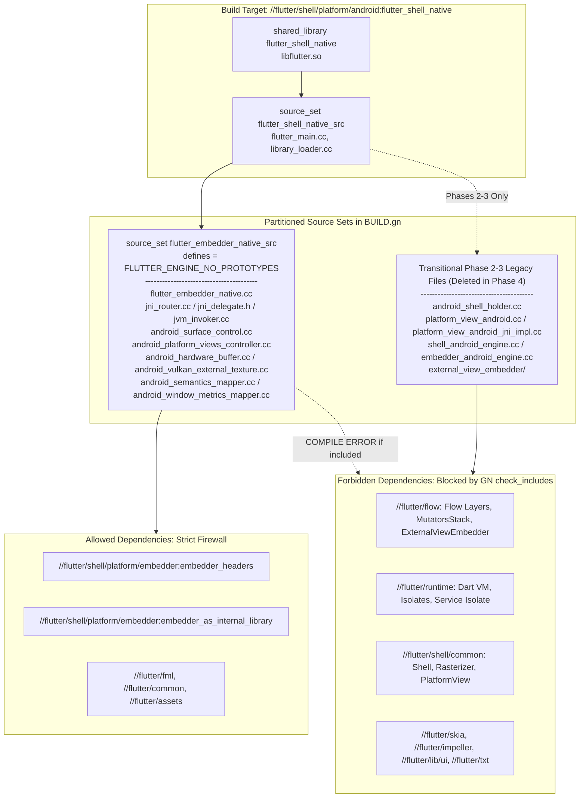

GN enforces `check_includes = true` and `defines = [ "FLUTTER_ENGINE_NO_PROTOTYPES" ]` on `flutter_embedder_native_src`. If any file in `flutter_embedder_native_src` attempts to include a private engine header (such as [`platform_view.h`](https://github.com/flutter/flutter/blob/4762dec4fc9072cd9269814ef36364f35a9a66dc/engine/src/flutter/shell/common/platform_view.h), [`shell.h`](https://github.com/flutter/flutter/blob/4762dec4fc9072cd9269814ef36364f35a9a66dc/engine/src/flutter/shell/common/shell.h), or [`embedded_views.h`](https://github.com/flutter/flutter/blob/4762dec4fc9072cd9269814ef36364f35a9a66dc/engine/src/flutter/flow/embedded_views.h)) or call an `embedder.h` function outside `FlutterEngineProcTable`, the build fails immediately.

#### Elimination and Decomposition of `AndroidShellHolder` and `PlatformViewAndroid`

In the legacy architecture, [`PlatformViewAndroid`](https://github.com/flutter/flutter/blob/4762dec4fc9072cd9269814ef36364f35a9a66dc/engine/src/flutter/shell/platform/android/platform_view_android.h#L43) directly [subclasses the internal engine class `flutter::PlatformView`](https://github.com/flutter/flutter/blob/4762dec4fc9072cd9269814ef36364f35a9a66dc/engine/src/flutter/shell/platform/android/platform_view_android.cc#L151-L160). This inheritance models Android as an internal engine subsystem rather than an external client embedder. Both `AndroidShellHolder` and `PlatformViewAndroid` are eliminated by decomposing their responsibilities across `FlutterEmbedderNative` and the modular components in `:flutter_embedder_native_src`.

In contrast, external embedders communicating via [`embedder.h`](https://github.com/flutter/flutter/blob/4762dec4fc9072cd9269814ef36364f35a9a66dc/engine/src/flutter/shell/platform/embedder/embedder.h) never subclass `flutter::PlatformView`. Instead, the embedder library ([`//flutter/shell/platform/embedder:embedder_as_internal_library`](https://github.com/flutter/flutter/blob/4762dec4fc9072cd9269814ef36364f35a9a66dc/engine/src/flutter/shell/platform/embedder/BUILD.gn#L206)) internally instantiates a generic [`flutter::PlatformViewEmbedder`](https://github.com/flutter/flutter/blob/4762dec4fc9072cd9269814ef36364f35a9a66dc/engine/src/flutter/shell/platform/embedder/platform_view_embedder.h) to satisfy the [`flutter::Shell`](https://github.com/flutter/flutter/blob/4762dec4fc9072cd9269814ef36364f35a9a66dc/engine/src/flutter/shell/common/shell.h#L113) class contract.

#### Lifecycle and Deletion of Legacy Classes (`AndroidShellHolder` and `PlatformViewAndroid`)

`AndroidShellHolder` and `PlatformViewAndroid` progress across four migration stages culminating in their complete removal:

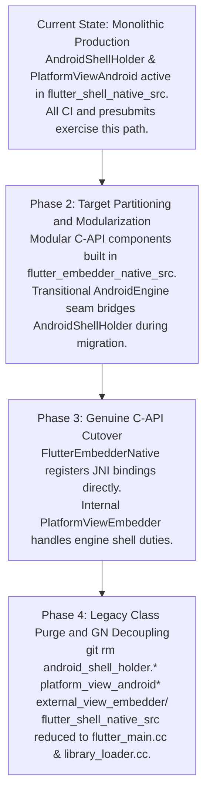

1. **Pre-Migration**: `AndroidShellHolder` and `PlatformViewAndroid` handle 100% of production traffic and link to 98 internal engine headers.
2. **Phase 2 (Partitioning & Strangler-Fig Seam)**: Modular components are constructed inside `flutter_embedder_native_src` with `check_includes = true` and `FLUTTER_ENGINE_NO_PROTOTYPES`. During incremental slice development, a transitional polymorphic delegate interface (`AndroidEngine`, implemented by `ShellAndroidEngine` and `EmbedderAndroidEngine`) allows individual subsystems to be migrated and tested against `AndroidShellHolder` without breaking existing `flutter_shell_native_unittests`.
3. **Phase 3 (C-API Cutover)**: `FlutterEmbedderNative` assumes direct ownership of the `FlutterJNI` native bindings (`FlutterEmbedderNative::RegisterJni(env)`) and drives the engine exclusively through `FlutterEngineProcTable`. Inside the core engine, the embedder runtime uses [`PlatformViewEmbedder`](https://github.com/flutter/flutter/blob/4762dec4fc9072cd9269814ef36364f35a9a66dc/engine/src/flutter/shell/platform/embedder/platform_view_embedder.h) and `EmbedderExternalViewEmbedder` to fulfill the shell's internal requirements.
4. **Phase 4 (Legacy Class Purge & Build Decoupling)**: Once `FlutterEmbedderNative` and `flutter_embedder_native_unittests` reach full parity, `AndroidShellHolder`, `PlatformViewAndroid`, `PlatformViewAndroidJNIImpl`, `AndroidEngine`, `ShellAndroidEngine`, `EmbedderAndroidEngine`, and `external_view_embedder/` are permanently deleted from the repository (`legacy-class-purge`). `:flutter_shell_native_src` is reduced to just three files (`flutter_main.cc`, `flutter_main.h`, and `library_loader.cc`), and the Android embedder retains zero subclassing of internal engine classes.

### Phase 3: Genuine C-API Cutover (`FlutterEmbedderNative`)

In Phase 3, `FlutterEmbedderNative` initializes [`FlutterEngine`](https://github.com/flutter/flutter/blob/4762dec4fc9072cd9269814ef36364f35a9a66dc/engine/src/flutter/shell/platform/embedder/embedder.h#L398) via [`FlutterEngineInitialize`](https://github.com/flutter/flutter/blob/4762dec4fc9072cd9269814ef36364f35a9a66dc/engine/src/flutter/shell/platform/embedder/embedder.h#L2970) and [`FlutterEngineRunInitialized`](https://github.com/flutter/flutter/blob/4762dec4fc9072cd9269814ef36364f35a9a66dc/engine/src/flutter/shell/platform/embedder/embedder.h#L3006) through `FlutterEngineProcTable`.

Event dispatch routes directly to public C-API entry points:

- Touch events: [`FlutterEngineSendPointerEvent`](https://github.com/flutter/flutter/blob/4762dec4fc9072cd9269814ef36364f35a9a66dc/engine/src/flutter/shell/platform/embedder/embedder.h#L3082)
- Viewport metrics: [`FlutterEngineSendWindowMetricsEvent`](https://github.com/flutter/flutter/blob/4762dec4fc9072cd9269814ef36364f35a9a66dc/engine/src/flutter/shell/platform/embedder/embedder.h#L3077)
- Platform messages: [`FlutterEngineSendPlatformMessage`](https://github.com/flutter/flutter/blob/4762dec4fc9072cd9269814ef36364f35a9a66dc/engine/src/flutter/shell/platform/embedder/embedder.h#L3114)
- Semantics actions: [`FlutterEngineSendSemanticsAction`](https://github.com/flutter/flutter/blob/4762dec4fc9072cd9269814ef36364f35a9a66dc/engine/src/flutter/shell/platform/embedder/embedder.h#L3398)
- Texture registrations: [`FlutterEngineRegisterExternalTexture`](https://github.com/flutter/flutter/blob/4762dec4fc9072cd9269814ef36364f35a9a66dc/engine/src/flutter/shell/platform/embedder/embedder.h#L3227)
- Compositor and multi-surface presentation: [`FlutterCompositor`](https://github.com/flutter/flutter/blob/4762dec4fc9072cd9269814ef36364f35a9a66dc/engine/src/flutter/shell/platform/embedder/embedder.h#L2322) layer presentation (`present_view_callback`) coordinating [`SurfaceControl.Transaction`](https://developer.android.com/reference/android/view/SurfaceControl.Transaction) commits via `AndroidSurfaceControl` and `AndroidPlatformViewsController`.

#### Transitional Polymorphic Delegation via `AndroidEngine` (Phases 2–3)

During Phases 2 and 3, before `AndroidShellHolder` is deleted in Phase 4, incremental subsystem migration is bridged using the transitional `AndroidEngine` seam:

1. **`ShellAndroidEngine` (Legacy Path)**:
   - Directs lifecycle and events to internal engine components: [`flutter::Shell`](https://github.com/flutter/flutter/blob/4762dec4fc9072cd9269814ef36364f35a9a66dc/engine/src/flutter/shell/common/shell.h#L137), [`PlatformViewAndroid`](https://github.com/flutter/flutter/blob/4762dec4fc9072cd9269814ef36364f35a9a66dc/engine/src/flutter/shell/platform/android/platform_view_android.h#L43), and [`fml::ThreadHost`](https://github.com/flutter/flutter/blob/4762dec4fc9072cd9269814ef36364f35a9a66dc/engine/src/flutter/shell/common/thread_host.h#L27).
   - Retains private engine dependencies (`//flutter/flow`, `//flutter/runtime`, `//flutter/impeller`) until Phase 4 deletion.

2. **`EmbedderAndroidEngine` / `FlutterEmbedderNative` (C-API Target Path)**:
   - Encapsulates the opaque `FlutterEngine` handle and `FlutterEngineProcTable`.
   - Forwards all operations strictly through the public C-API in [`embedder.h`](https://github.com/flutter/flutter/blob/4762dec4fc9072cd9269814ef36364f35a9a66dc/engine/src/flutter/shell/platform/embedder/embedder.h).
   - Once `FlutterEmbedderNative` registers JNI directly in `library_loader.cc`, both `AndroidShellHolder` and the transitional `AndroidEngine` classes become dead code and are removed in Phase 4.

### Phase 4: Build Decoupling and Legacy Class Purge

Once `FlutterEmbedderNative` passes all functional and performance tests, [`BUILD.gn`](https://github.com/flutter/flutter/blob/4762dec4fc9072cd9269814ef36364f35a9a66dc/engine/src/flutter/shell/platform/android/BUILD.gn) and `shell/platform/android/` are permanently decoupled:

- Delete `AndroidShellHolder`, `PlatformViewAndroid`, `PlatformViewAndroidJNIImpl`, `AndroidEngine`, `EmbedderAndroidEngine`, `ShellAndroidEngine`, `VsyncWaiterAndroid`, `PlatformMessageHandlerAndroid`, `SurfaceTextureExternalTexture`, `ImageExternalTexture`, and the `external_view_embedder/` directory.
- Reduce `:flutter_shell_native_src` to `flutter_main.cc`, `flutter_main.h`, and `library_loader.cc` (which calls `FlutterEmbedderNative::RegisterJni(env)`).
- Remove dependencies on [`//flutter/runtime`](https://github.com/flutter/flutter/tree/4762dec4fc9072cd9269814ef36364f35a9a66dc/engine/src/flutter/runtime), [`//flutter/flow`](https://github.com/flutter/flutter/tree/4762dec4fc9072cd9269814ef36364f35a9a66dc/engine/src/flutter/flow), [`//flutter/skia`](https://github.com/flutter/flutter/tree/4762dec4fc9072cd9269814ef36364f35a9a66dc/engine/src/flutter/skia), [`//flutter/impeller`](https://github.com/flutter/flutter/tree/4762dec4fc9072cd9269814ef36364f35a9a66dc/engine/src/flutter/impeller), [`//flutter/lib/ui`](https://github.com/flutter/flutter/tree/4762dec4fc9072cd9269814ef36364f35a9a66dc/engine/src/flutter/lib/ui), [`//flutter/txt`](https://github.com/flutter/flutter/tree/4762dec4fc9072cd9269814ef36364f35a9a66dc/engine/src/flutter/txt), and [`//flutter/shell/common`](https://github.com/flutter/flutter/tree/4762dec4fc9072cd9269814ef36364f35a9a66dc/engine/src/flutter/shell/common).
- Restrict dependencies strictly to:
  - [`//flutter/shell/platform/embedder:embedder_headers`](https://github.com/flutter/flutter/blob/4762dec4fc9072cd9269814ef36364f35a9a66dc/engine/src/flutter/shell/platform/embedder/BUILD.gn#L210) and [`//flutter/shell/platform/embedder:embedder_as_internal_library`](https://github.com/flutter/flutter/blob/4762dec4fc9072cd9269814ef36364f35a9a66dc/engine/src/flutter/shell/platform/embedder/BUILD.gn#L206) (with `defines = [ "FLUTTER_ENGINE_NO_PROTOTYPES" ]`)
  - [`//flutter/fml`](https://github.com/flutter/flutter/tree/4762dec4fc9072cd9269814ef36364f35a9a66dc/engine/src/flutter/fml)
  - [`//flutter/common`](https://github.com/flutter/flutter/tree/4762dec4fc9072cd9269814ef36364f35a9a66dc/engine/src/flutter/common)
  - [`//flutter/assets`](https://github.com/flutter/flutter/tree/4762dec4fc9072cd9269814ef36364f35a9a66dc/engine/src/flutter/assets)
- Lock the CI ratchet tool to zero allowed internal headers.

### The Dependency Ratchet Mechanism

In a large codebase with active development, multi-quarter refactoring efforts face persistent regression risks: developers resolving defects or introducing features may inadvertently add new `#include` directives referencing private engine headers, or introduce `// nogncheck` annotations to bypass visibility boundaries.

To enforce that dependency reduction is strictly monotonic throughout the migration, an automated ratchet system operates across three distinct layers:

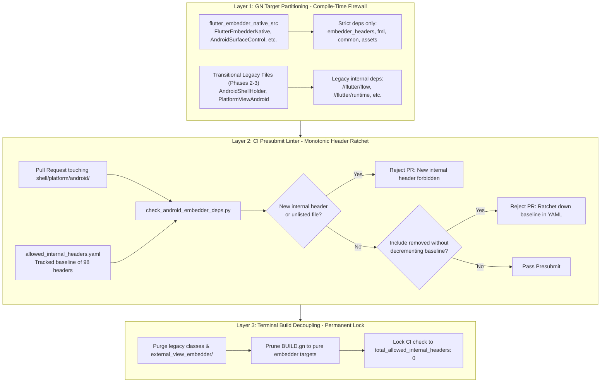

#### Layer 1: GN Target Partitioning (Compile-Time Firewall)

In Phase 2, the Android native source set in [`shell/platform/android/BUILD.gn`](https://github.com/flutter/flutter/blob/4762dec4fc9072cd9269814ef36364f35a9a66dc/engine/src/flutter/shell/platform/android/BUILD.gn) isolates all C-API code in `flutter_embedder_native_src` (`FlutterEmbedderNative`, `JniRouter`, `AndroidSurfaceControl`, `AndroidPlatformViewsController`, `AndroidMutatorsMapper`, `AndroidHardwareBuffer`, `AndroidVulkanExternalTexture`, `AndroidSemanticsMapper`, `AndroidWindowMetricsMapper`, `AndroidVsyncWaiter`, `AndroidVMInit`, `AndroidEngineGroup`, and `APKAssetProvider`). This target sets `defines = [ "FLUTTER_ENGINE_NO_PROTOTYPES" ]` and declares dependencies strictly on [`//flutter/shell/platform/embedder:embedder_headers`](https://github.com/flutter/flutter/blob/4762dec4fc9072cd9269814ef36364f35a9a66dc/engine/src/flutter/shell/platform/embedder/BUILD.gn#L210), [`//flutter/fml`](https://github.com/flutter/flutter/tree/4762dec4fc9072cd9269814ef36364f35a9a66dc/engine/src/flutter/fml), [`//flutter/common`](https://github.com/flutter/flutter/tree/4762dec4fc9072cd9269814ef36364f35a9a66dc/engine/src/flutter/common), and [`//flutter/assets`](https://github.com/flutter/flutter/tree/4762dec4fc9072cd9269814ef36364f35a9a66dc/engine/src/flutter/assets). Because GN evaluates `check_includes = true` during builds, any attempt to include headers from undeclared targets (such as [`//flutter/flow`](https://github.com/flutter/flutter/tree/4762dec4fc9072cd9269814ef36364f35a9a66dc/engine/src/flutter/flow) or [`//flutter/runtime`](https://github.com/flutter/flutter/tree/4762dec4fc9072cd9269814ef36364f35a9a66dc/engine/src/flutter/runtime)) causes a compilation error immediately.

#### Layer 2: Monotonic Header Inclusion Ratchet ([`check_android_embedder_deps.py`](#the-dependency-ratchet-mechanism))

To prevent the quarantined legacy files from accumulating additional internal includes during Phase 2 and Phase 3, an automated presubmit linter enforces a monotonic reduction policy.

The linter references a version-controlled baseline configuration file located at [`shell/platform/android/allowed_internal_headers.yaml`](https://github.com/flutter/flutter/tree/4762dec4fc9072cd9269814ef36364f35a9a66dc/engine/src/flutter/shell/platform/android):

```yaml
version: 1
total_allowed_internal_headers: 98
subsystems:
  impeller:
    count: 29
    allowed_headers:
      - "flutter/impeller/renderer/backend/vulkan/context_vk.h"
      - "flutter/impeller/renderer/backend/gles/context_gles.h"
      - "flutter/impeller/toolkit/android/hardware_buffer.h"
  flow:
    count: 2
    allowed_headers:
      - "flutter/flow/embedded_views.h"
      - "flutter/flow/surface.h"
  engine_core:
    count: 11
    allowed_headers:
      - "flutter/shell/common/shell.h"
      - "flutter/shell/common/thread_host.h"
      - "flutter/shell/common/platform_view.h"
```

The presubmit linter enforces four deterministic rules on incoming pull requests:

1. *Zero new files*: Only source files explicitly registered in [`allowed_internal_headers.yaml`](#the-dependency-ratchet-mechanism) may contain internal engine includes. Any inclusion in an unlisted file fails presubmit.
2. *Zero new headers*: New `#include "flutter/..."` directives not in the allowlist fail presubmit, requiring the API to be routed through [`embedder.h`](https://github.com/flutter/flutter/blob/4762dec4fc9072cd9269814ef36364f35a9a66dc/engine/src/flutter/shell/platform/embedder/embedder.h).
3. *Monotonic decrement*: When an incremental refactoring removes an internal header, the pull request must remove it from `allowed_internal_headers.yaml` and decrement `total_allowed_internal_headers`. Once merged, the ratchet locks the lower count permanently.
4. *No escape hatches*: The linter parses [`shell/platform/android/BUILD.gn`](https://github.com/flutter/flutter/blob/4762dec4fc9072cd9269814ef36364f35a9a66dc/engine/src/flutter/shell/platform/android/BUILD.gn) and rejects modifications introducing `// nogncheck` or widening GN target visibility.

#### Layer 3: Terminal Build Decoupling (Permanent Lock)

Following Phase 3 cutover validation:

1. All legacy classes (`AndroidShellHolder`, `PlatformViewAndroid`, `PlatformViewAndroidJNIImpl`, `external_view_embedder/`) are deleted from the repository.
2. The allowlist configuration is locked permanently:

   ```yaml
   total_allowed_internal_headers: 0
   subsystems: {}
   ```

3. All internal GN dependencies ([`//flutter/runtime`](https://github.com/flutter/flutter/tree/4762dec4fc9072cd9269814ef36364f35a9a66dc/engine/src/flutter/runtime), [`//flutter/flow`](https://github.com/flutter/flutter/tree/4762dec4fc9072cd9269814ef36364f35a9a66dc/engine/src/flutter/flow), [`//flutter/lib/ui`](https://github.com/flutter/flutter/tree/4762dec4fc9072cd9269814ef36364f35a9a66dc/engine/src/flutter/lib/ui), [`//flutter/impeller`](https://github.com/flutter/flutter/tree/4762dec4fc9072cd9269814ef36364f35a9a66dc/engine/src/flutter/impeller), [`//flutter/skia`](https://github.com/flutter/flutter/tree/4762dec4fc9072cd9269814ef36364f35a9a66dc/engine/src/flutter/skia), [`//flutter/txt`](https://github.com/flutter/flutter/tree/4762dec4fc9072cd9269814ef36364f35a9a66dc/engine/src/flutter/txt), [`//flutter/shell/common`](https://github.com/flutter/flutter/tree/4762dec4fc9072cd9269814ef36364f35a9a66dc/engine/src/flutter/shell/common)) are pruned from [`shell/platform/android/BUILD.gn`](https://github.com/flutter/flutter/blob/4762dec4fc9072cd9269814ef36364f35a9a66dc/engine/src/flutter/shell/platform/android/BUILD.gn).
4. Any future pull request including an internal header will fail both `gn check` at compile time and the presubmit ratchet script, which permanently prevents architectural regressions.

## Verification and Testing Plan

Because Android is Flutter's largest mobile deployment target, verification must confirm that behavioral correctness, performance benchmarks, and accessibility support match the existing embedder.

### Engine Unit Tests (`flutter_embedder_native_unittests`)

- Host-executable C++ unit tests (`flutter_embedder_native_unittests`) for `FlutterEmbedderNative` and each modularized component (`AndroidSurfaceControl`, `AndroidPlatformViewsController`, `AndroidMutatorsMapper`, `AndroidHardwareBuffer`, `AndroidVulkanExternalTexture`, `AndroidSemanticsMapper`, `AndroidWindowMetricsMapper`, `AndroidVsyncWaiter`, `AndroidVMInit`, and `AndroidEngineGroup`) using mock `FlutterEngineProcTable` entries and injectable `JniDelegate` / `JvmInvoker` provider interfaces without requiring a live Android JVM or device.
- Unit tests validating the serialization and deserialization of [`FlutterPlatformViewMutation`](https://github.com/flutter/flutter/blob/4762dec4fc9072cd9269814ef36364f35a9a66dc/engine/src/flutter/shell/platform/embedder/embedder.h#L2071) structs and per-`FlutterViewId` frame state capture.

### Android Integration Tests

- [`flutter_shell_native_unittests`](https://github.com/flutter/flutter/blob/4762dec4fc9072cd9269814ef36364f35a9a66dc/engine/src/flutter/shell/platform/android/BUILD.gn#L48) and `flutter_embedder_native_unittests` executed across the CI test matrix.
- Platform view lifecycle and composition tests verifying Hybrid Composition++ (HCPP with [`SurfaceControl`](https://developer.android.com/reference/android/view/SurfaceControl) on API 34+), legacy Hybrid Composition (HC), Texture Layer Hybrid Composition (TLHC), and Virtual Displays (VD) under both flag configurations.
- Android embedding integration tests verifying JNI message channels, background isolate callbacks, and deferred library loading.

### DeviceLab Benchmarks

- Frame pacing and rasterization latency benchmarks (comparing legacy vs C-API) to verify that the C-ABI abstraction does not introduce frame drops or scheduling jitter.
- Platform view scrolling benchmarks across HCPP and HC modes to measure GPU sync fence latency, [`SurfaceControl.Transaction`](https://developer.android.com/reference/android/view/SurfaceControl.Transaction) submission timing, and touch response.
- Startup latency benchmarks on low-end and high-end devices to verify that [`FlutterAssetResolver`](#custom-asset-and-kernel-resolution-apk--in-memory-mapping) memory mapping maintains zero-copy asset loading performance.

### Golden and Conformance Tests

- Platform view rendering goldens validating that clipping paths, rounded rectangles, and opacity mutators render identically across both compositor modes (HCPP with [`SurfaceControl`](https://developer.android.com/reference/android/view/SurfaceControl) Vulkan and HC) and external-texture modes (TLHC and VD).
- External texture playback verification across video player and camera plugins.
